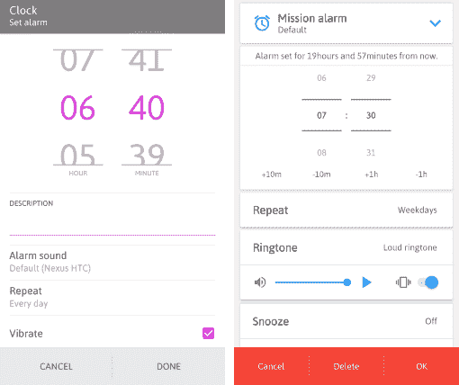

# 不要忘记给用户一个选择💭

> 原文:[https://dev . to/atorn blad/don-t-forget-to-give-the-user-a-choice-1f 68](https://dev.to/atornblad/don-t-forget-to-give-the-user-a-choice-1f68)

本系列的第一部分，描述了我如何以及为什么开始构建两个名为 *[叫妈妈](https://play.google.com/store/apps/details?id=se.atornblad.callmom)* 和 *[叫爸爸](https://play.google.com/store/apps/details?id=se.atornblad.calldad)* 的应用。第二部分介绍了这些应用程序第一版的一些方面。这一部分继续描述如何通过给用户提供选择来控制用户。如果你只是想要摘要和一些链接，去底部的[摘要部分](#summary)。

# [](#dont-forget-to-give-the-user-a-choice)别忘了给用户一个选择💭

要允许用户从他们的电话簿中选择联系人，推荐的方法是使用操作系统注册的联系人选择器。首先创建一个`Intent`并调用`startActivityForResult`。

```
// Select a unique identifier between 1 and 65535
private static final int PICK_CONTACT_REQUEST_ID = 12345;

private void startContactSelection() {
    // This URI is used to identify what contact picker the user has
    // picked (or the OS has defaulted) for this device
    Uri uri = Uri.parse("content://contacts/people");

    // Create an intent to start the picker
    Intent pickContactIntent = new Intent(Intent.ACTION_PICK, uri);

    // Tell the picker to only show contacts with phone numbers
    pickContactIntent.setType(ContactsContract.CommonDataKinds.Phone.CONTENT_TYPE);

    // Start the activity. Use the startActivityForResult method instead of
    // the startActivity one, because we want the result of the action!
    startActivityForResult(pickContactIntent, PICK_CONTACT_REQUEST_ID);
} 
```

<svg width="20px" height="20px" viewBox="0 0 24 24" class="highlight-action crayons-icon highlight-action--fullscreen-on"><title>Enter fullscreen mode</title></svg> <svg width="20px" height="20px" viewBox="0 0 24 24" class="highlight-action crayons-icon highlight-action--fullscreen-off"><title>Exit fullscreen mode</title></svg>

当调用此方法时，最好是通过单击按钮或其他用户交互，联系人选取器打开。这在我测试的所有设备和模拟器上都运行得很好，但后来公开发布应用程序时，这种方法导致了一些手机崩溃。

原来有些设备没有注册任何联系人选择器，所以`startActivityForResult`抛出一个异常。为了解决这个问题，您首先需要检查`Intent`是否真的解析为一个动作。如果没有，您需要为用户提供一些其他方法来选择要拨打的电话号码。

```
private void startContactSelection() {
    Uri uri = Uri.parse("content://contacts/people");
    Intent pickContactIntent = new Intent(Intent.ACTION_PICK, uri);

    // Check which component the URI above is connected to
    PackageManager pm = getPackageManager();
    ComponentName component = pickContactIntent.resolveActivity(pm);
    if (component == null) {
        // This device has no contact picker
        // Show an error message to the user, or solve this
        // in some other way. Maybe let the user enter the
        // phone number to call manually in a text box.
        return;
    }

    pickContactIntent.setType(ContactsContract.CommonDataKinds.Phone.CONTENT_TYPE);
    startActivityForResult(pickContactIntent, PICK_CONTACT_REQUEST_ID);
} 
```

<svg width="20px" height="20px" viewBox="0 0 24 24" class="highlight-action crayons-icon highlight-action--fullscreen-on"><title>Enter fullscreen mode</title></svg> <svg width="20px" height="20px" viewBox="0 0 24 24" class="highlight-action crayons-icon highlight-action--fullscreen-off"><title>Exit fullscreen mode</title></svg>

## [](#getting-the-contact-details)获取联系人详细信息

当用户从列表中选择一个联系人并关闭联系人选择器时，您的`Activity`类的`onActivityResult`方法被调用，您必须重写该方法才能读取用户选择的结果。

```
@Override
protected void onActivityResult(int requestCode, int resultCode, Intent data) {
    // First check if this is a result from the intent we started above
    if (requestCode != PICK_CONTACT_REQUEST_ID) return;

    // Then check if the action was successful (the user clicked OK and not Cancel)
    if (resultCode != RESULT_OK) return;

    // Get the base URI for the selected contact, if any
    Uri contactUri = data.getData();
    if (contactUri == null) return;

    // Read fields from the contact data by querying the contact, using a projection
    // The projection is where you pick what data fields you want to read
    // This projection reads the display name and the phone number
    String[] projection = new String[] {
        ContactsContract.Contacts.DISPLAY_NAME,
        ContactsContract.CommonDataKinds.Phone.NUMBER
    };

    // Query the data using a `ContentResolver`
    Cursor cursor = getContentResolver().query(contarcUti, project, null, null, null);

    // If the cursor if valid and has data, get the data field values out
    if (cursor != null && cursor.moveToFirst()) {
        String displayName = cursor.getString(0);
        String phoneNumber = cursor.getString(1);

        // TODO: Store the contact information in some form of persistant storage, to
        // be able to display the contact name, and to call the phone number later
    }
} 
```

<svg width="20px" height="20px" viewBox="0 0 24 24" class="highlight-action crayons-icon highlight-action--fullscreen-on"><title>Enter fullscreen mode</title></svg> <svg width="20px" height="20px" viewBox="0 0 24 24" class="highlight-action crayons-icon highlight-action--fullscreen-off"><title>Exit fullscreen mode</title></svg>

# [](#creating-a-schedule-editor)创建日程编辑器📅

不是每个人都以同样的频率，或者在一天中的同一时间给父母打电话。我必须实现的一件事是时间表编辑器。我想让它看起来像一些手机上的闹钟设置输入。这样，大多数人会觉得用户界面很熟悉，而我也不必完全重新发明一些更有能力的 UX 人已经解决的东西。

[T2】](https://res.cloudinary.com/practicaldev/image/fetch/s--PB-rBBUz--/c_limit%2Cf_auto%2Cfl_progressive%2Cq_auto%2Cw_880/https://static.atornblad.se/both-alarm-settings-510.png)

*<small>截图，左起:HTC 闹钟，DelightRoom Alarm</small>T3】*

## [](#pick-the-time-of-day)选择一天中的时间

我首先创建了一个新的`Activity`，用户可以在这里选择他们的通话时间表。在布局的顶部，我放置了一个[时间选择器](https://developer.android.com/reference/android/widget/TimePicker)，用于选择一天中的呼叫时间:

```
<?xml version="1.0" encoding="utf-8"?>
<LinearLayout xmlns:android="http://schemas.android.com/apk/res/android"
  android:layout_width="match_parent"
  android:layout_height="match_parent"
  android:orientation="vertical">

    <TimePicker android:id="@+id/time_of_day"
      android:layout_width="match_parent"
      android:layout_height="wrap_content" />

</LinearLayout> 
```

<svg width="20px" height="20px" viewBox="0 0 24 24" class="highlight-action crayons-icon highlight-action--fullscreen-on"><title>Enter fullscreen mode</title></svg> <svg width="20px" height="20px" viewBox="0 0 24 24" class="highlight-action crayons-icon highlight-action--fullscreen-off"><title>Exit fullscreen mode</title></svg>

这使用户能够正确选择一天中的小时和分钟。显示会适应用户的区域设置，因此用户会有一致和熟悉的体验。要从代码中读取用户选择，调用`getHour`和`getMinute`方法:

```
// Get the TimePicker view
TimePicker timeOfDayPicker = findViewById(R.id.time_of_day);

// Read the data selected by the user
int hourOfDay = timeOfDayPicker.getHour();
int minuteOfDay = timeOfDayPicker.getMinute(); 
```

<svg width="20px" height="20px" viewBox="0 0 24 24" class="highlight-action crayons-icon highlight-action--fullscreen-on"><title>Enter fullscreen mode</title></svg> <svg width="20px" height="20px" viewBox="0 0 24 24" class="highlight-action crayons-icon highlight-action--fullscreen-off"><title>Exit fullscreen mode</title></svg>

## [](#pick-a-schedule-frequency)选择一个排班频率

在`TimePicker`视图下面，我放置了一个包含四个`RadioButton`视图的`RadioGroup`，用于选择重复的类型。本例中的所有文本都是硬编码的，但是您应该始终对文本内容使用资源引用。

```
 <TextView android:text="Repeat:"
      android:layout_width="match_parent"
      android:layout_height="wrap_content">

    <RadioGroup android:id="@+id/repeat_selector"
      android:orientation="vertical"
      android:layout_width="wrap_content"
      android:layout_height="wrap_content">

        <RadioButton android:id="@+id/repeat_daily"
          android:layout_width="match_parent"
          android:layout_height="wrap_content"
          android:text="Daily" />

        <RadioButton android:id="@+id/repeat_weekly"
          android:layout_width="match_parent"
          android:layout_height="wrap_content"
          android:text="Weekly" />

        <RadioButton android:id="@+id/repeat_monthly"
          android:layout_width="match_parent"
          android:layout_height="wrap_content"
          android:text="Monthly" />

    </RadioGroup> 
```

<svg width="20px" height="20px" viewBox="0 0 24 24" class="highlight-action crayons-icon highlight-action--fullscreen-on"><title>Enter fullscreen mode</title></svg> <svg width="20px" height="20px" viewBox="0 0 24 24" class="highlight-action crayons-icon highlight-action--fullscreen-off"><title>Exit fullscreen mode</title></svg>

我发现从代码中读取用户选择的最好方法是在`RadioGroup`对象上使用`getCheckedRadioButtonId`方法。这允许您`switch`并根据选择的单选按钮执行不同的任务:

```
// Get the RadioGroup view
RadioGroup repeatSelector = findViewById(R.id.repeat_selector);

// Read the radio button id selected by the user
int checkedId = repeatSelector.getCheckedRadioButtonId();

// Act upon the user's choice
switch (checkedId) {
    case R.id.repeat_daily:
        // Put code here to hide views for picking weekday,
        // or day of month
        break;
    case R.id.repeat_weekly:
        // Put code here to show views for picking weekday
        break;
    case R.id.repeat_monthly:
        // Put code here to show views for picking day of month
        break;
    default:
        // No repetition pattern selected, show an error message
} 
```

<svg width="20px" height="20px" viewBox="0 0 24 24" class="highlight-action crayons-icon highlight-action--fullscreen-on"><title>Enter fullscreen mode</title></svg> <svg width="20px" height="20px" viewBox="0 0 24 24" class="highlight-action crayons-icon highlight-action--fullscreen-off"><title>Exit fullscreen mode</title></svg>

## [](#pick-a-weekday)挑选一个工作日

如果用户选择每周模式，他们必须能够选择一周中的某一天打电话。允许这种选择的一个简单方法是使用一个`NumberPicker`。

```
 <NumberPicker android:id="@+id/day_of_week"
      android:layout_width="match_parent"
      android:layout_height="wrap_content" /> 
```

<svg width="20px" height="20px" viewBox="0 0 24 24" class="highlight-action crayons-icon highlight-action--fullscreen-on"><title>Enter fullscreen mode</title></svg> <svg width="20px" height="20px" viewBox="0 0 24 24" class="highlight-action crayons-icon highlight-action--fullscreen-off"><title>Exit fullscreen mode</title></svg>

在`onCreate`方法中准备`NumberPicker`。一个很好的技巧是使用`Calendar`工作日常量。`SUNDAY`的值是`1`，而`SATURDAY`的值是`7`，所以将最小和最大允许值设置为这些常量。要获得工作日的正确名称，您可以使用`DateFormatSymbols`方法`getShortWeekdays`或`getWeekdays`之一。

```
NumberPicker weekdayPicker = findViewById(R.id.day_of_week);
weekdayPicker.setMinValue(Calendar.SUNDAY);
weekdayPicker.setMaxValue(Calendar.SATURDAY);

// Get full weekday names, like "Sunday", "Monday", ...
String[] weekdayNames = DateFormatSymbols.getInstance().getWeekdays();

// The NumberPicker needs the first string to be at index 0, but
// because SUNDAY is defined as 1, the values in the weekdayNames
// array actually start at index 1\. So we have to copy indices 1..7
// into a new array at indices 0..6
// The final argument value of 8 is the index directly after the
// last index to copy, which might look confusing.
String[] displayNames = Arrays.copyOfRange(weekdayNames, 1, 8);

// Tell the NumberPicker to use these strings instead of the
// numeric values 1 to 7
weekdayPicker.setDisplayedValues(displayNames);
weekdayPicker.setWrapSelectorWheel(true); 
```

<svg width="20px" height="20px" viewBox="0 0 24 24" class="highlight-action crayons-icon highlight-action--fullscreen-on"><title>Enter fullscreen mode</title></svg> <svg width="20px" height="20px" viewBox="0 0 24 24" class="highlight-action crayons-icon highlight-action--fullscreen-off"><title>Exit fullscreen mode</title></svg>

## [](#pick-a-day-of-the-month)挑选一个月中的某一天

对于 montly 模式，用户可以从 1 到 31 的`NumberPicker`中选择一个月中的某一天，无需任何特殊的显示文本设置。在布局 xml 文件中:

```
 <NumberPicker android:id="@+id/day_of_month"
      android:layout_width="match_parent"
      android:layout_height="wrap_content" /> 
```

<svg width="20px" height="20px" viewBox="0 0 24 24" class="highlight-action crayons-icon highlight-action--fullscreen-on"><title>Enter fullscreen mode</title></svg> <svg width="20px" height="20px" viewBox="0 0 24 24" class="highlight-action crayons-icon highlight-action--fullscreen-off"><title>Exit fullscreen mode</title></svg>

用`onCreate`方法准备拾取器:

```
NumberPicker monthDayPicker = findViewById(R.id.day_of_month);
monthDayPicker.setMinValue(1);
monthDayPicker.setMaxValue(31);
monthDayPicker.setWrapSelectorWheel(true); 
```

<svg width="20px" height="20px" viewBox="0 0 24 24" class="highlight-action crayons-icon highlight-action--fullscreen-on"><title>Enter fullscreen mode</title></svg> <svg width="20px" height="20px" viewBox="0 0 24 24" class="highlight-action crayons-icon highlight-action--fullscreen-off"><title>Exit fullscreen mode</title></svg>

## [](#calculating-the-correct-time-for-the-next-notification)计算下一次通知的正确时间

日程安排的时间计算可能会很棘手，我已经尽力让规则尽可能简单。首先，有一个名为`notBefore`的参数，用于传入通知不应该显示的时间之前。我已经决定将这个变量设置为最近一次通话后的一个小时。

然后使用重复模式*(每天、每周或每月)*调用相应的算法。目前，这个解决方案只支持`GregorianCalendar`。

```
public class ScheduleModel {
    public final static int DAILY = 1;
    public final static int WEEKLY = 2;
    public final static int MONTHLY = 3;

    // Hour and minute of the day
    private int hour;
    private int minute;

    // Any of DAILY, WEEKLY or MONTHLY
    private int type;

    // Any of the Calendar.SUNDAY .. Calendar.SATURDAY constants
    private int dayOfWeek;

    // Anywhere between 1 and 31
    private int dayOfMonth;

    public ScheduleModel(int hour, int minute, int type, int dayOfWeek, int dayOfMonth) {
        this.hour = hour;
        this.minute = minute;
        this.type = type;
        this.dayOfWeek = dayOfWeek;
        this.dayOfMonth = dayOfMonth;
    }

    public Calendar getNextNotification(Calendar notBefore) {
        // Switch on the type and call the corresponding method
        switch (type) {
            case DAILY:
                return getDailyNext(notBefore);
            case WEEKLY:
                return getWeeklyNext(notBefore);
            case MONTHLY:
                return getMonthlyNext(notBefore);
            default:
                // Unsupported schedule type
                return notBefore;
        }
    }

    private Calendar getDailyNext(Calendar notBefore) {
        // Start at the notBefore date, with the selected time of day
        Calendar next = new GregorianCalendar(
            notBefore.get(Calendar.YEAR),
            notBefore.get(Calendar.MONTH),
            notBefore.get(Calendar.DAY_OF_MONTH),
            hour, minute);
        );

        // If that time is before the earliest allowed time to call,
        // step forward one day
        if (next.before(notBefore)) {
            next.add(Calendar.DAY_OF_YEAR, 1);
        }

        return next;
    }

    private Calendar getWeeklyNext(Calendar notBefore) {
        // Start at the notBefore date, with the selected time of day
        Calendar next = new GregorianCalendar(
            notBefore.get(Calendar.YEAR),
            notBefore.get(Calendar.MONTH),
            notBefore.get(Calendar.DAY_OF_MONTH),
            hour, minute);
        );

        // While that time is before the earliest allowed time to call,
        // or the day isn't the selected weekday, step forward one day
        while (next.get(Calendar.DAY_OF_WEEK) != dayOfWeek || next.before(notBefore)) {
            next.add(Calendar.DAY_OF_YEAR, 1);
        }

        return next;
    }

    private Calendar getMonthlyNext(Calendar notBefore) {
        // Start at the notBefore month, with the selected day of the
        // month and the selected time of day
        Calendar next = new GregorianCalendar(
            notBefore.get(Calendar.YEAR),
            notBefore.get(Calendar.MONTH),
            dayOfMonth,
            hour, minute);
        );

        // If that time is before the earliest allowed time to call,
        // step forward one month
        if (next.before(notBefore)) {
            next.add(Calendar.MONTH, 1);
        }

        return next;
    }
} 
```

<svg width="20px" height="20px" viewBox="0 0 24 24" class="highlight-action crayons-icon highlight-action--fullscreen-on"><title>Enter fullscreen mode</title></svg> <svg width="20px" height="20px" viewBox="0 0 24 24" class="highlight-action crayons-icon highlight-action--fullscreen-off"><title>Exit fullscreen mode</title></svg>

`getNextNotification`方法的结果被传递到报警系统，以设置下一次通知的时间。

```
// First get the last call time and calculate the notBefore value
Calendar notBefore = getLastCallTime();
notBefore.add(Calendar.HOUR_OF_DAY, 1);

// Get the time for the next notification
Calendar next = schedule.getNextNotification(notBefore);

// Set the alarm
myAlarmsInstance.setAlarm(next.getTimeInMillis()); 
```

<svg width="20px" height="20px" viewBox="0 0 24 24" class="highlight-action crayons-icon highlight-action--fullscreen-on"><title>Enter fullscreen mode</title></svg> <svg width="20px" height="20px" viewBox="0 0 24 24" class="highlight-action crayons-icon highlight-action--fullscreen-off"><title>Exit fullscreen mode</title></svg>

# [](#summary)总结🔖

*   使用 [startActivityForResult](https://developer.android.com/training/basics/intents/result) 启动联系人选择器
*   使用 [resolveActivity](https://developer.android.com/reference/android/content/Intent#resolveActivity(android.content.pm.PackageManager)) 检查用户是否真的注册了联系人选取器
*   通过覆盖 [onActivityResult](https://developer.android.com/training/basics/intents/result) 方法读取联系人数据
*   尽可能使用内置的窗口小部件，比如[单选按钮](https://developer.android.com/guide/topics/ui/controls/radiobutton)、[数字选择器](https://developer.android.com/reference/android/widget/NumberPicker)和[时间选择器](https://developer.android.com/reference/android/widget/TimePicker)视图
*   如果你要处理时间和日期，尽量使所有的修改简单可行，使用内置的类，如[日历](https://developer.android.com/reference/java/util/Calendar)或[本地日期时间](https://developer.android.com/reference/java/time/LocalDateTime) *(如果你的目标是版本 26 或更高版本)*

*封面照片由[帕万·特里库塔姆](https://unsplash.com/photos/71CjSSB83Wo)在[Unsplash](https://unsplash.com/)T5 拍摄*