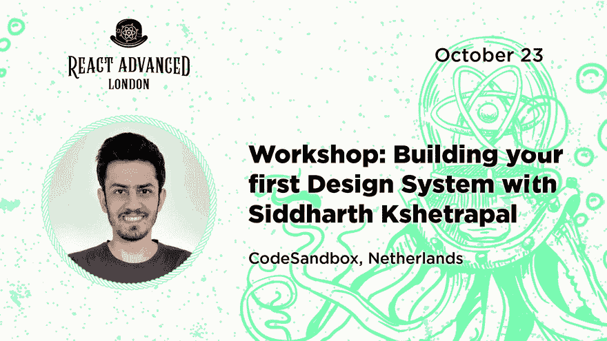

# 西达尔特·克谢特帕尔谈加入 Codesandbox:我对此非常兴奋

> 原文:[https://dev . to/git nation/siddha rth-kshetrapal-on-quiting-indie-development-I-m-not-give-up-at-all-35pj](https://dev.to/gitnation/siddharth-kshetrapal-on-quitting-indie-development-i-m-not-giving-up-on-anything-at-all-35pj)

### 我们采访了最近加入 [Codesandbox](http://codesandbox.io/) 的 [bundlesize](https://github.com/siddharthkp/bundlesize) 的维护者和 [react.games](https://react.games) 的创建者西达尔特·克舍特拉帕尔

西达尔特·克谢特帕尔一直对设计、CSS 和 JavaScript 充满热情。Sid 还在 Auth0 开始了设计系统团队，然而，后来他决定专注于他的副业项目，并成为一名独立开发者。在自己当老板的时候，他在[sid.st/blog](https://sid.st/blog)写博客，创建 [react.games](https://react.games) ，并创办了[tinyreect . email](https://tinyreact.email/)时事通讯。最近，他决定开始新的冒险，并加入了 Codesandbox。10 月 23 日& 25 日，Sid 在伦敦的 [React Advanced](https://reactadvanced.com/) 做了一次演讲，并在一个研讨会上授课。

[T2】](https://res.cloudinary.com/practicaldev/image/fetch/s--B0ry9yuy--/c_limit%2Cf_auto%2Cfl_progressive%2Cq_66%2Cw_880/https://thepracticaldev.s3.amazonaws.com/i/i4aw6z4wqdf0mgumyyz7.gif)

#### 你好，希德，欢迎来到 React Advanced 的访谈节目！请介绍一下你自己。

你好，我是希德。我在 [Codesandbox](http://codesandbox.io) 工作。我刚刚加入他们，我还在想办法:)

#### 你为什么决定攻读物理学学位，而不是计算机科学或数学？

故事时间！多亏了我爸，我很小的时候家里就有了电脑。我花了很多时间用 Powerpoint 制作动画😋。为了让我的动画更有趣，我必须学习如何制作图形。我很幸运地找到了免费的开源工具，可以用来探索我的创造力。对瘸子大喊！

到了上大学的时候，我不认为设计是一个真正的职业选择，而是选择了学习物理(我当时真的很喜欢它)。最终讨厌它的理论部分，并继续在边上设计。图形设计引领了界面设计，我一头扎进了 web 开发的世界，发现了 CSS 和 Javascript，从此一往无前。

#### 请描述一下你在成为独立开发者之前的工作经历。

我和费尔南多一起在 Auth0 成立了设计系统团队。团队最终扩大到 4 人。我们构建了可重用的组件和设计资产，供公司的其他人使用。其中的组件库部分是开源的，你可以在这里探索: [auth0/cosmos](https://auth0-cosmos.now.sh/docs/) 。

[https://www.youtube.com/embed/60tmvBW1kfc](https://www.youtube.com/embed/60tmvBW1kfc)

我在那里的时候一直在做兼职项目。但是，18 个月后，我真的感觉到了把所有时间都集中在自己的项目上的冲动。那时我离开了在 Auth0 的工作。

也就是说，我仍然向我的朋友推荐 Auth0，这是我工作过的最好的地方之一。

[https://www.instagram.com/p/BXV-1U2H4hA/embed/captioned](https://www.instagram.com/p/BXV-1U2H4hA/embed/captioned)