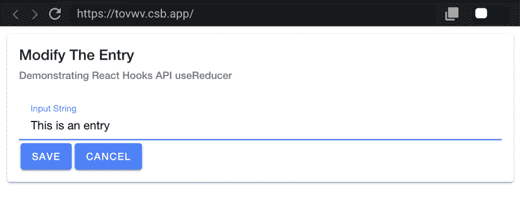
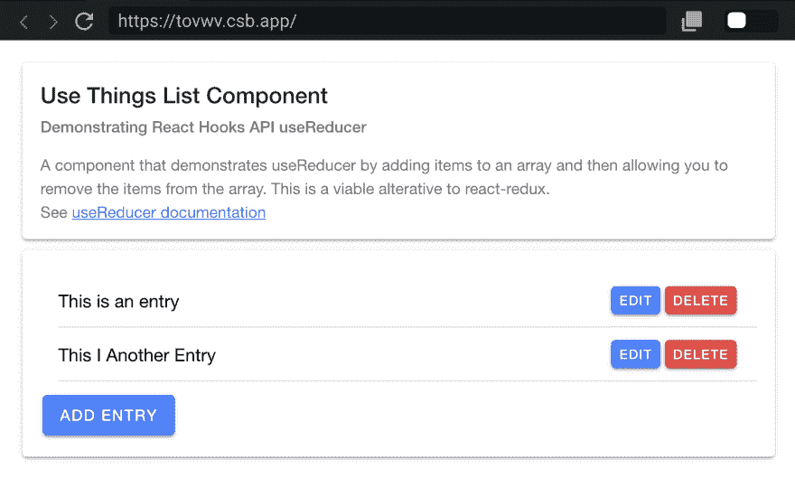

# 反应离子框架和钩子

> 原文：<https://dev.to/ionic/react-ionic-framework-and-hooks-5135>

> 请结帐并订阅我在 YouTube 上的视频内容。请随意留下您想看的内容的评论和建议。
> [YouTube 频道](https://www.youtube.com/channel/UCMCcqbJpyL3LAv3PJeYz2bg)

### 概述

一个简单的应用程序，有一个列表，能够添加，编辑和删除东西。我们将使用`useReducer`钩子来管理数组的状态。

我们将使用`useState`钩子来管理模式对话框的状态，我们使用它来输入我们正在编辑或更新的信息，我们使用`useState`钩子来管理模式对话框中输入字段的状态。

## 让我们从 useReducer API 开始

```
// useThings.js
// --
import React from "react";

const useThings = () => {
  // handle the specific action dispatched
  const reducer = (state, action) => {
    switch (action.type) {
      case "ADD_THING": { }
      case "DELETE_THING": { }
      case "EDIT_THING": { };
      default: {
        return state;
      }
    }
  };

  // here we set things up to use the reducer
  const [state, dispatch] = React.useReducer(reducer, {
    things: []
  });

  // the function returns everything needed to the caller to
  // dispatch specific action and get the updated state changes
  return {
    state,
    dispatch
  };
};

export default useThings; 
```

Enter fullscreen mode Exit fullscreen mode

### 修改状态中的值

**添加一项:**将`action.data`添加到数组末尾，设置状态属性

```
case "ADD_THING": {
  return { ...state, things: [...state.things, action.data] };
} 
```

Enter fullscreen mode Exit fullscreen mode

**删除一个项目:**添加`action.index`切片数组，得到索引指定的项目之前的内容和索引指定的项目之后的所有内容。这又被用来创建新的数组，我们用
设置`state.things`

```
case "DELETE_THING": {
  return {
    ...state,
    things: [
      ...state.things.slice(0, action.index),
      ...state.things.slice(action.index + 1)
    ]
  };
} 
```

Enter fullscreen mode Exit fullscreen mode

**编辑项:**对数组进行`action.index`切片，得到索引指定的项之前的内容和索引指定的项之后的所有内容。接下来，我们使用`action.data`作为新元素来替换之前的元素。这又被用来创建一个新的数组，我们用它来设置`state.things`。

```
case "EDIT_THING": {
  return {
    ...state,
    things: [
      ...state.things.slice(0, action.index),
      action.data,
      ...state.things.slice(action.index + 1)
    ]
  };
} 
```

Enter fullscreen mode Exit fullscreen mode

## 显示一个模态供用户输入

[](https://res.cloudinary.com/practicaldev/image/fetch/s--GJMLlI0Y--/c_limit%2Cf_auto%2Cfl_progressive%2Cq_auto%2Cw_880/https://thepracticaldev.s3.amazonaws.com/i/drmn0kvamdgvedgnuz9c.png)

使用`useState`功能管理显示模态
对话框，用于输入新数据或编辑内容。这个国家有两把钥匙，`isVisible`和`value`。`isVisible`将设置为 true 以显示对话框，设置为 false 以隐藏对话框。当我们实际编辑一个对象时，`value`属性将被设置。我们还将在编辑一个东西时添加一个名为`index`的附加属性，这样我们就可以在状态数组中找到它来更新它。

```
// ThingsList.js
// --
// using the useState functionality to manage displaying the modal
// dialog for inputting data for new things or editing things
const [modalInfo, setModalInfo] = useState({ isVisible: false, value: "" }); 
```

Enter fullscreen mode Exit fullscreen mode

## 使用 useState 管理输入值

```
// ThingEdit.js
// --
const [inputValue, setInputValue] = useState(); 
```

Enter fullscreen mode Exit fullscreen mode

我们如何在组件的`render`方法中使用它；当 input 元素中有输入事件时，我们用用户输入的值更新状态

```
<IonInput
  value={inputValue}
  onInput={e => setInputValue(e.target.value)} /> 
```

Enter fullscreen mode Exit fullscreen mode

因此，当用户完成模态时，他们将点击两个按钮中的一个来调用`handleClick`方法

```
<IonButton onClick={() => handleClick(true)}>Save</IonButton>
<IonButton onClick={() => handleClick(null)}>Cancel</IonButton> 
```

Enter fullscreen mode Exit fullscreen mode

如果用一个`true`值调用`handleClick`，那么我们需要从保存在我们状态中的输入表单中返回该值，如果传递给`handleClick`的值为空，那么我们只需要退出函数，不返回任何数据

```
// ThingEdit.js
// --
const handleClick = _save => {
  handleFormSubmit({ isVisible: false, value: _save && inputValue });
}; 
```

Enter fullscreen mode Exit fullscreen mode

回到`ThingsList`组件，我们需要处理来自`ThingEdit`组件的调用，以处理从 modal 接收的数据。

从 modal/form 获取响应，以便我们可以更新或创建新项目。如果`_formResponse.value`为空，则忽略，因为用户选择了取消按钮。

如果有一个`_formResponse.value` & `modalInfo.index`有值，那么
编辑该项；`modalInfo.index`变量告诉我们要更新数组中的哪一项；如果没有`modalInfo.index`那么用`_formResponse.value`创建一个新的东西

```
// ThingsList.js
// --
const handleFormSubmit = _formResponse => {
  if (_formResponse.value) {
    modalInfo.index != null
      ? editEntry(modalInfo.index, _formResponse.value)
      : addNewEntry(_formResponse.value);
  }
  // reset the modalInfo state
  setModalInfo({ ...modalInfo, isVisible: false, value: "" });
}; 
```

Enter fullscreen mode Exit fullscreen mode

## 显示事物的列表

[](https://res.cloudinary.com/practicaldev/image/fetch/s--kmdGCea2--/c_limit%2Cf_auto%2Cfl_progressive%2Cq_auto%2Cw_880/https://thepracticaldev.s3.amazonaws.com/i/5rup1puza36vxrzzxts2.png) 
渲染列表中的东西来自组件自定义钩子，`useThings`，我们在帖子开始时提到过。

```
// get the function from my custom hook to mange the list
// of things
let { state, dispatch } = useThings(); 
```

Enter fullscreen mode Exit fullscreen mode

这使我们能够访问状态对象，并且状态对象包含`state.things`。我们使用`Array.map()`函数
遍历值数组

```
<IonList>
  {state.things.map((_thing, _index) => (
    <IonItem key={_index}>
      <IonLabel className="ion-text-wrap">{_thing}</IonLabel>
      <IonButton onClick={() => modalInfoWithEntry(_thing, _index)}>
        Edit
      </IonButton>
      <IonButton color="danger" onClick={() => deleteEntry(_index)}>
        Delete
      </IonButton>
    </IonItem>
  ))}
</IonList> 
```

Enter fullscreen mode Exit fullscreen mode

我们用`dispatch`
调用 reducer 方法的所有基础函数都是包装器

```
// ThingsList.js
//- 

/**
 * add entry to the list using `dispatch` from custom hook
 */
const addNewEntry = _data => {
  dispatch({ type: "ADD_THING", data: _data });
};

/**
 * remove entry from the list using `dispatch` and index in the array
 * to call custom hook
 * @param {*} _index
 */
const deleteEntry = _index => {
  dispatch({ type: "DELETE_THING", index: _index });
};

/**
 * update an existing entry in the list based on data
 * and the index of the entry
 * @param {*} _index
 * @param {*} _data
 */
const editEntry = (_index, _data) => {
  let payload = { index: _index, data: _data };
  dispatch({ type: "EDIT_THING", ...payload });
}; 
```

Enter fullscreen mode Exit fullscreen mode

## 把一切都包起来

这个项目的所有代码都可以在下面列出的 CodeSandbox.io 网站上找到。

使用`useState`和`useReducer`的 React 钩子允许你的整个应用程序只是功能组件，它们的状态可以用钩子 api 来管理。

这里有一个很棒的视频链接，给你一些为什么你想在你的应用中尝试钩子的原因。
[https://www.youtube.com/embed/eX_L39UvZes](https://www.youtube.com/embed/eX_L39UvZes)

[https://codesandbox.io/embed/tovwv](https://codesandbox.io/embed/tovwv)