# 在 Heroku 部署 React NextJS GraphQL 应用程序

> 原文:[https://dev . to/nabe NDU 82/deploying-react-nextjs-graph QL-app-in-heroku-10e 3](https://dev.to/nabendu82/deploying-react-nextjs-graphql-app-in-heroku-10e3)

既然我们已经完成了餐馆账单应用程序，是时候将它部署到 web 上了。你可以找到我之前的一篇文章，关于 React NextJS GraphQL 中内置的同一个[完整的生产级餐厅计费应用](https://dev.to/nabendu82/complete-production-grade-restaurant-billing-app-built-in-react-nextjs-graphql-p10)

大多数应用程序只有前端可以部署，或者前端和后端都可以部署。但是我们的应用程序有三个部分，所以我们需要 3 个部署。

**Prisma 服务器** — MySQL 数据库
**Yoga 服务器** —变异和查询解析器
**React App** — Next.js app

为此，我们将使用 heroku，因为我们可以在那里部署所有三个。我们将从 Prisma 开始

## [](#prisma-server)Prisma 服务器

首先进入 Prisma dashboard，然后进入**服务器**。然后点击**添加服务器。**

[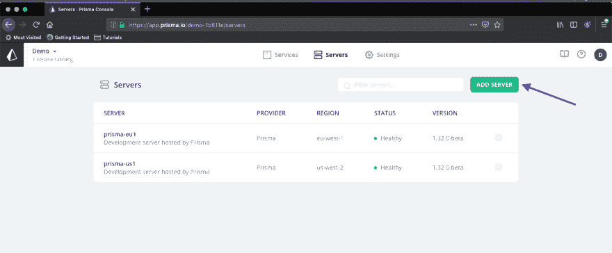 ](https://res.cloudinary.com/practicaldev/image/fetch/s--LlVS9DIl--/c_limit%2Cf_auto%2Cfl_progressive%2Cq_auto%2Cw_880/https://cdn-images-1.medium.com/max/2880/1%2Ar_9DWZzHEG6Y_05AXWTz1g.png) *添加服务器*

在此之后，在此屏幕中给出服务器的名称和描述。

[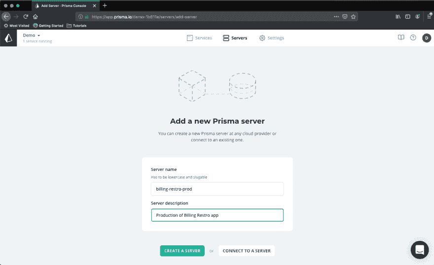 ](https://res.cloudinary.com/practicaldev/image/fetch/s--JpQlrkGZ--/c_limit%2Cf_auto%2Cfl_progressive%2Cq_auto%2Cw_880/https://cdn-images-1.medium.com/max/2874/1%2AuAHJpTyKMIycaNm-aFqp4g.png) *新棱镜服务器*

然后在该屏幕中点击**创建一个新的数据库**。

[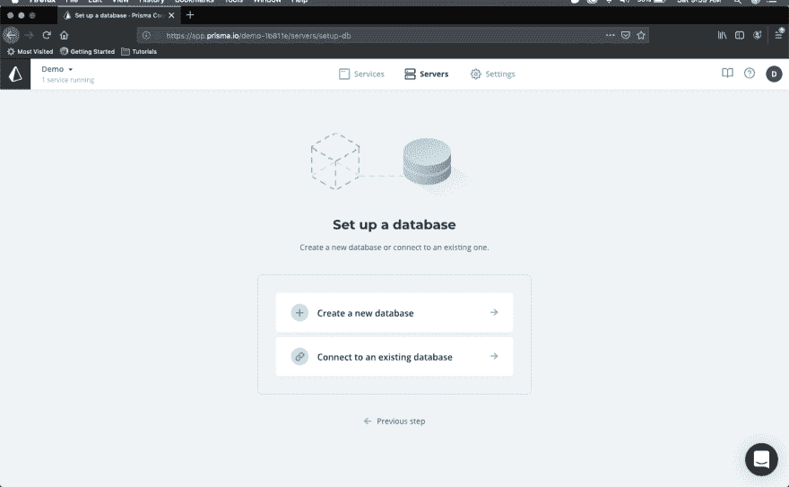 ](https://res.cloudinary.com/practicaldev/image/fetch/s--gI_MqtDt--/c_limit%2Cf_auto%2Cfl_progressive%2Cq_auto%2Cw_880/https://cdn-images-1.medium.com/max/2880/1%2AYUeB9eWPAY1ou--6ReXWlA.png) *建立数据库*

然后在**选择数据库提供商**中，我们选择 Heroku

[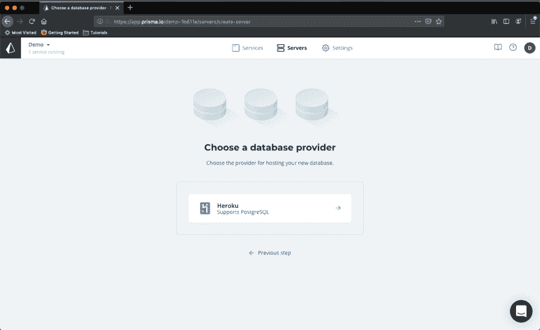 ](https://res.cloudinary.com/practicaldev/image/fetch/s--v8_6EdQK--/c_limit%2Cf_auto%2Cfl_progressive%2Cq_auto%2Cw_880/https://cdn-images-1.medium.com/max/2880/1%2A1uD_o8Nlhg58M-rrwlBmkg.png) *选择数据库提供商*

然后点击**连接到 Heroku**

[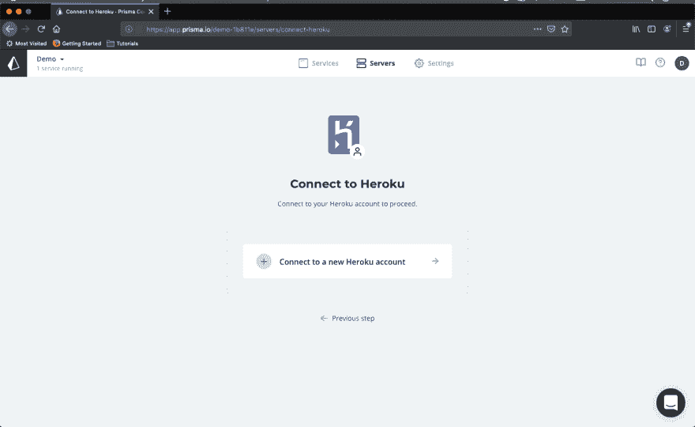 ](https://res.cloudinary.com/practicaldev/image/fetch/s--36bJAnrB--/c_limit%2Cf_auto%2Cfl_progressive%2Cq_auto%2Cw_880/https://cdn-images-1.medium.com/max/2880/1%2AvwWoXZDaKPV6G-aLsS3-1w.png) *接 Heroku*

然后输入你的 Heroku 证书。

[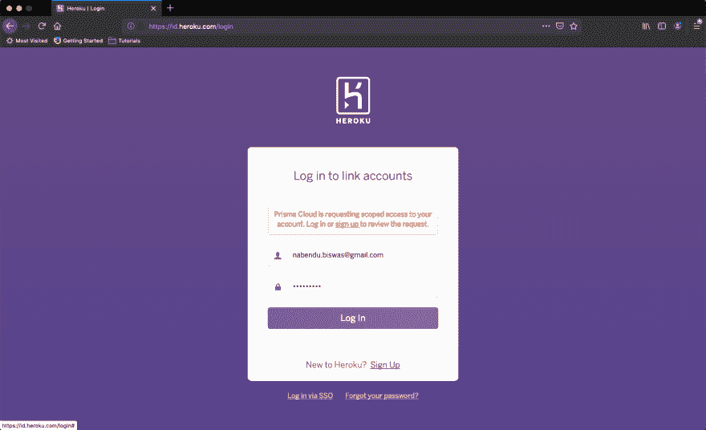 ](https://res.cloudinary.com/practicaldev/image/fetch/s--FL68Whn5--/c_limit%2Cf_auto%2Cfl_progressive%2Cq_auto%2Cw_880/https://cdn-images-1.medium.com/max/2880/1%2AER1CvtkIQ82QZFTh_vG41w.png) *链接英雄账号*

然后选择**爱好开发**并点击**创建数据库。**

[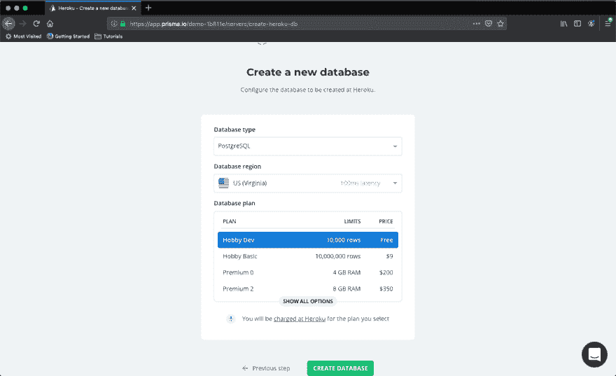 ](https://res.cloudinary.com/practicaldev/image/fetch/s--3njnOn-g--/c_limit%2Cf_auto%2Cfl_progressive%2Cq_auto%2Cw_880/https://cdn-images-1.medium.com/max/2880/1%2AsN06yrr-cpdygYpnujIjaw.png) *新建数据库*

然后我们将得到成功创建的新数据库。现在点击**建立一个服务器**

[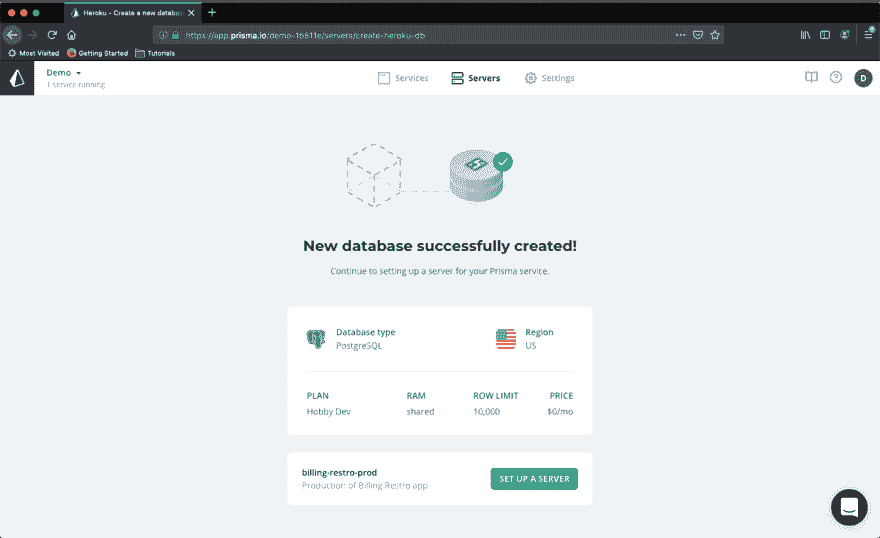 ](https://res.cloudinary.com/practicaldev/image/fetch/s--LVI4EKhT--/c_limit%2Cf_auto%2Cfl_progressive%2Cq_auto%2Cw_880/https://cdn-images-1.medium.com/max/2880/1%2AqH2KnwMblZ891cTu70JByw.png) *新数据库成功创建*

然后设置服务器。

[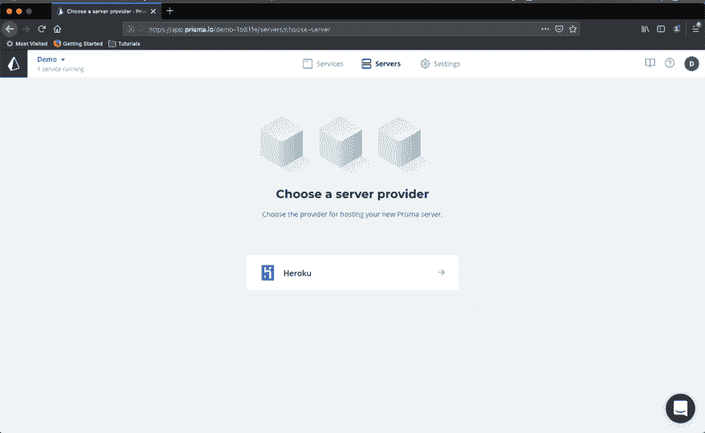 ](https://res.cloudinary.com/practicaldev/image/fetch/s--3p5uuX7Q--/c_limit%2Cf_auto%2Cfl_progressive%2Cq_auto%2Cw_880/https://cdn-images-1.medium.com/max/2880/1%2AkxgsAD0RyEq916fqoXXOiw.png) *设置服务器*

之后再次选择**免费计划**并点击**创建服务器**

[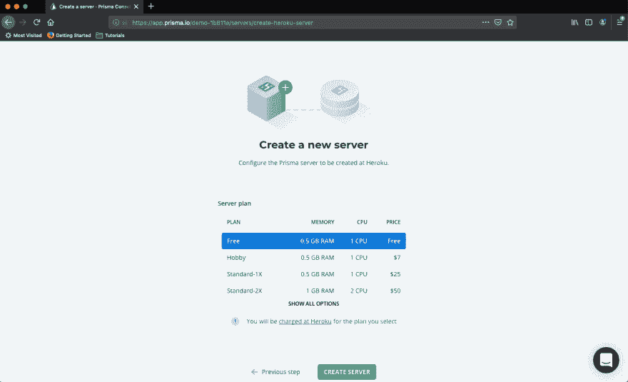 ](https://res.cloudinary.com/practicaldev/image/fetch/s--L2tkjTij--/c_limit%2Cf_auto%2Cfl_progressive%2Cq_auto%2Cw_880/https://cdn-images-1.medium.com/max/2878/1%2AiphSh06_t1rHZudn9w-7ew.png) *创建新的服务器*

然后我们会得到消息 **Prisma server 成功部署**。点击**查看服务器**

[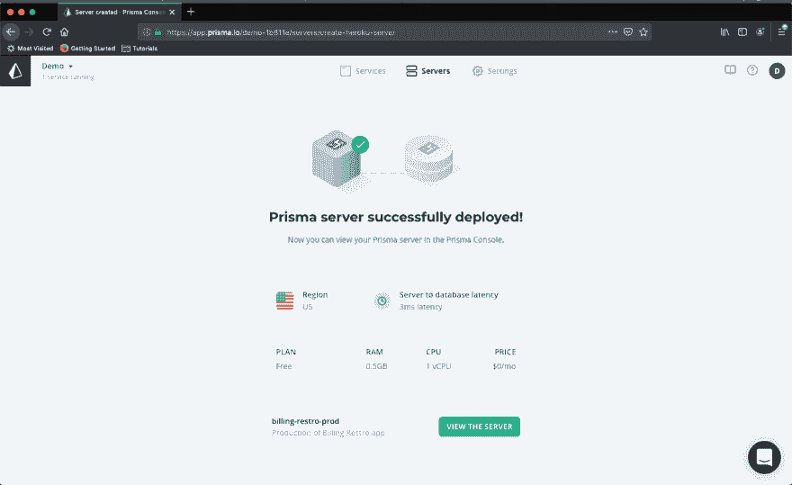 ](https://res.cloudinary.com/practicaldev/image/fetch/s--kMf-_Dh9--/c_limit%2Cf_auto%2Cfl_progressive%2Cq_auto%2Cw_880/https://cdn-images-1.medium.com/max/2880/1%2AqDYpQkZ-LgmYZBwZkv4BWQ.png) *棱镜服务器成功部署*

我们现在将看到我们的服务器成功创建。

[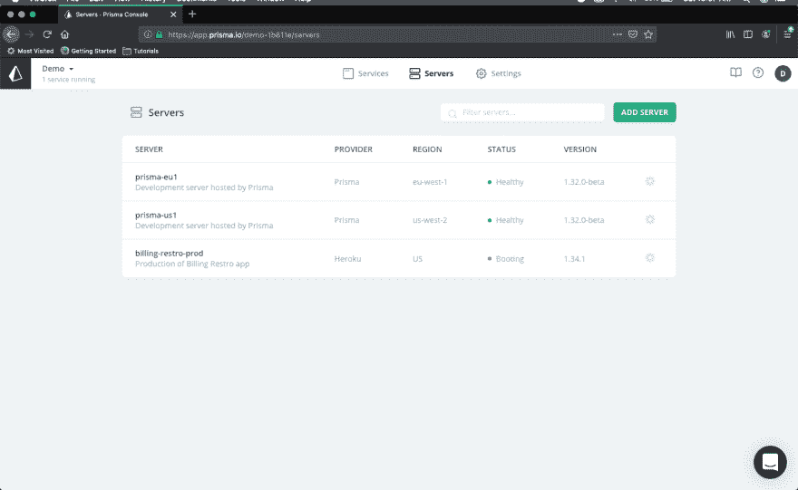 ](https://res.cloudinary.com/practicaldev/image/fetch/s--_isBt05t--/c_limit%2Cf_auto%2Cfl_progressive%2Cq_auto%2Cw_880/https://cdn-images-1.medium.com/max/2880/1%2ATT2cEU0Ye1gLAo-duU1ipQ.png) *新增服务器*

然后，我们将前往我们的终端，为我们的服务器添加服务。运行命令`npm run deploy -- -n`

使用向下箭头键导航到我们新创建的服务器，然后按 enter 键。

[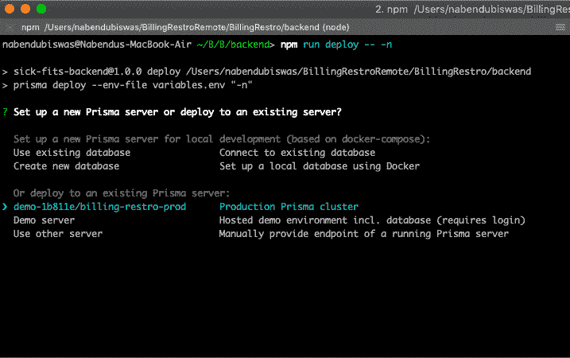 ](https://res.cloudinary.com/practicaldev/image/fetch/s--t4WU35_D--/c_limit%2Cf_auto%2Cfl_progressive%2Cq_auto%2Cw_880/https://cdn-images-1.medium.com/max/2000/1%2AlcTCBis-8nOyhXpyPwEbYw.png) * npm*

为您的服务命名，并将 stage 命名为 **prod** 。

[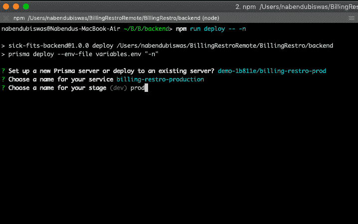](https://res.cloudinary.com/practicaldev/image/fetch/s--Ja336JuY--/c_limit%2Cf_auto%2Cfl_progressive%2Cq_auto%2Cw_880/https://cdn-images-1.medium.com/max/2000/1%2Ay5o9z4DwQ9uAvx7AoyH76w.png)T3】服务名称

接下来，您的服务将被成功创建。

[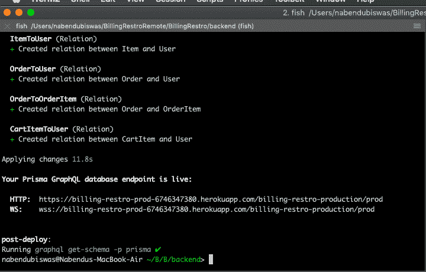 ](https://res.cloudinary.com/practicaldev/image/fetch/s--DZjAw5HN--/c_limit%2Cf_auto%2Cfl_progressive%2Cq_auto%2Cw_880/https://cdn-images-1.medium.com/max/2000/1%2Acj1OfUEqRwW4_BkSg6Briw.png) *成功*

前往 Prisma dashboard，您可以看到新的服务。

[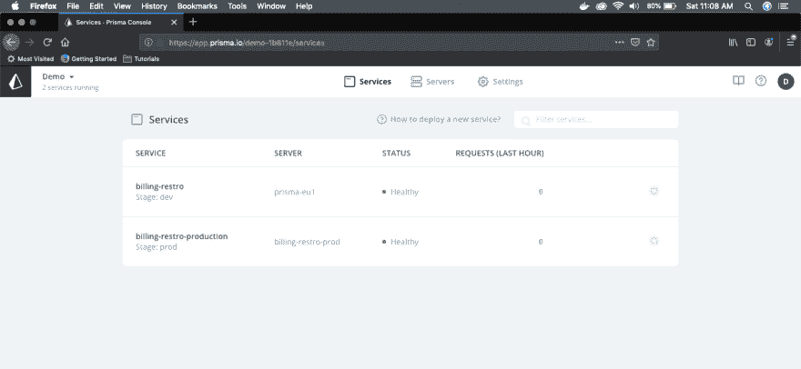](https://res.cloudinary.com/practicaldev/image/fetch/s--IAny1tm9--/c_limit%2Cf_auto%2Cfl_progressive%2Cq_auto%2Cw_880/https://cdn-images-1.medium.com/max/2880/1%2AOtv2KTlyBFt-Fk4Pnzqzdg.png)T3】新创建的服务

如果您检查您的 **prisma.yml** ，您可以看到我们之前的端点被注释并且添加了一个新的 prod 端点。

[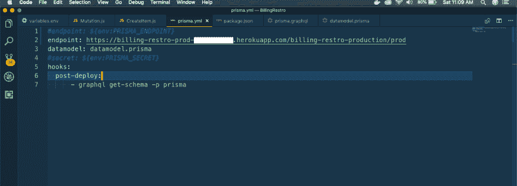](https://res.cloudinary.com/practicaldev/image/fetch/s--zemEI3O3--/c_limit%2Cf_auto%2Cfl_progressive%2Cq_auto%2Cw_880/https://cdn-images-1.medium.com/max/2880/1%2ArKNVGeJ4F7hwcSt7L3mZoQ.png)T3】prisma . yml 更新

我们将取消 **prisma.yml** 中**秘密**的注释，因为这是制作

[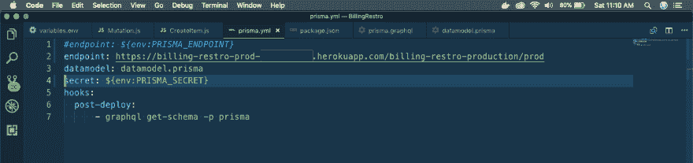 ](https://res.cloudinary.com/practicaldev/image/fetch/s--KQ4d0cDn--/c_limit%2Cf_auto%2Cfl_progressive%2Cq_auto%2Cw_880/https://cdn-images-1.medium.com/max/2880/1%2A53trcD9z0d6LD8no7_6IFw.png) *未注释的秘密*

最后，再次运行 npm 运行部署

[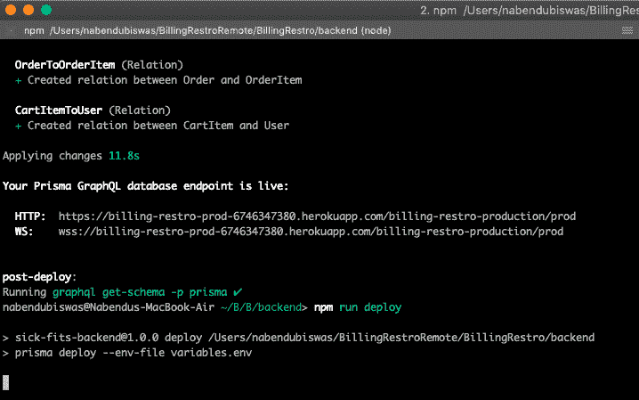 ](https://res.cloudinary.com/practicaldev/image/fetch/s--PEM0p2zr--/c_limit%2Cf_auto%2Cfl_progressive%2Cq_auto%2Cw_880/https://cdn-images-1.medium.com/max/2000/1%2AuLUoHjVsk7E7vdFKaK-q0g.png) *再 NPM*

## [](#yoga-server)Yoga 服务器

现在，是时候将我们的应用程序部署到 Yoga 服务器上了。为此，您需要安装 heroku cli。检查此[链接](https://devcenter.heroku.com/articles/heroku-cli)以获取安装说明。

接下来，前往终点站。你应该在包含你的**后端**和**前端**文件夹的主文件夹中。首先提交所有未提交的代码，方法是-

```
git add -A
git commit -m "Heroku deployment" 
```

[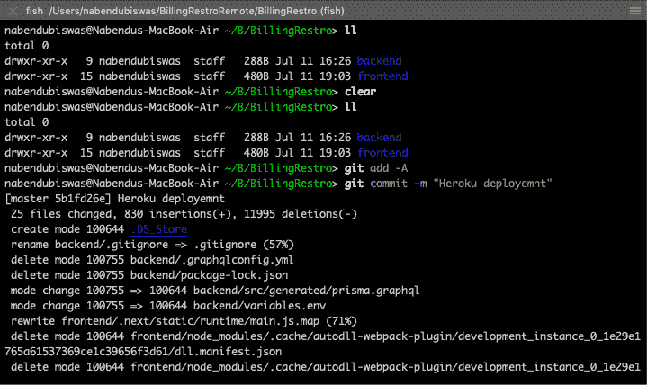 ](https://res.cloudinary.com/practicaldev/image/fetch/s--nUrB3p3X--/c_limit%2Cf_auto%2Cfl_progressive%2Cq_auto%2Cw_880/https://cdn-images-1.medium.com/max/2000/1%2AIC-sETjuug65iuzettSICA.png) *主文件夹*

现在我们通过 heroku 登录 heroku，我们需要按任意键

[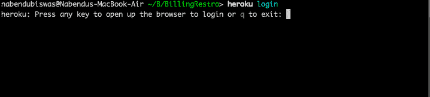 ](https://res.cloudinary.com/practicaldev/image/fetch/s--uAQ3nzPJ--/c_limit%2Cf_auto%2Cfl_progressive%2Cq_auto%2Cw_880/https://cdn-images-1.medium.com/max/2000/1%2AIYnVFLiqhWKexLGMYjGLJg.png) *龙登录*

它将打开您的默认网络浏览器，并显示以下屏幕。

[ ](https://res.cloudinary.com/practicaldev/image/fetch/s--aBzH6_8Y--/c_limit%2Cf_auto%2Cfl_progressive%2Cq_auto%2Cw_880/https://miro.medium.com/max/1440/1%2A_QsdPL3qxd_6BYpg3KdDeA.png) *登录*

一旦你登录，这个屏幕将显示，你需要关闭浏览器。

[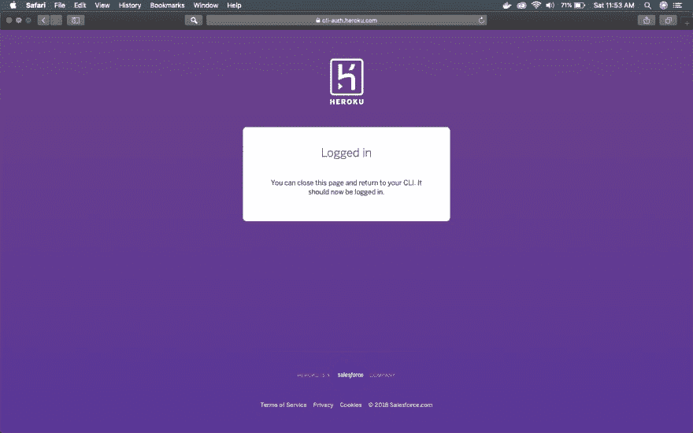](https://res.cloudinary.com/practicaldev/image/fetch/s--TC-P4A3d--/c_limit%2Cf_auto%2Cfl_progressive%2Cq_auto%2Cw_880/https://cdn-images-1.medium.com/max/2880/1%2A0WSHbt7AakOMarE4IJWRSg.png)T3】关闭浏览器

我们现在将在终端中看到成功的登录。

[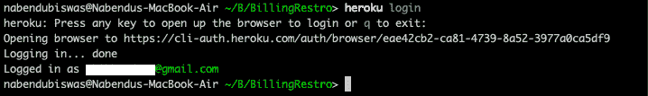 ](https://res.cloudinary.com/practicaldev/image/fetch/s--UO6g6LUm--/c_limit%2Cf_auto%2Cfl_progressive%2Cq_auto%2Cw_880/https://cdn-images-1.medium.com/max/2000/1%2AcQKAEgZPWLvWtjZkEFgi5g.png) *登录*

之后，我们需要通过下面的命令创建一个新的 heroku 应用程序。

```
heroku apps:create billingrestro-yoga-prod 
```

[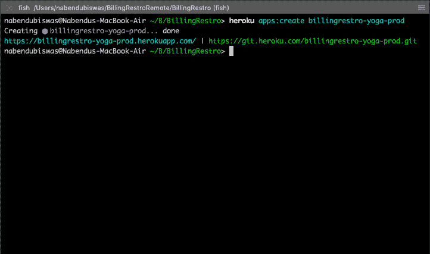 ](https://res.cloudinary.com/practicaldev/image/fetch/s--UxUT4Lwa--/c_limit%2Cf_auto%2Cfl_progressive%2Cq_auto%2Cw_880/https://cdn-images-1.medium.com/max/2000/1%2AVkfI2ioj6hzqt-LDNFzkmw.png) *龙创造*

您现在可以在 heroku 仪表板中看到应用程序创建。

[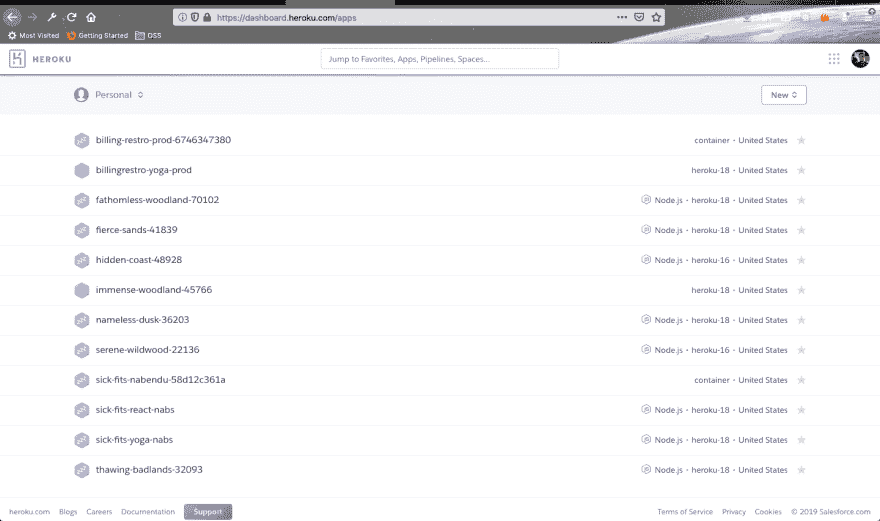 ](https://res.cloudinary.com/practicaldev/image/fetch/s--KuLr6qs_--/c_limit%2Cf_auto%2Cfl_progressive%2Cq_auto%2Cw_880/https://cdn-images-1.medium.com/max/2880/1%2AHWLlcXY3p-r-o8R7qnN3OA.png) *瑜伽 app*

现在我们将在我们的终端获得一个新的分支。做一个 git remote -v

*走远点*

Heroku 只为我们提供了一个端点，但我们需要两个——一个用于后端，另一个用于前端。因此，我们将通过 heroku 提供的端点创建一个新的端点。

```
git remote add heroku-backend [https://git.heroku.com/billingrestro-yoga-prod.git](https://git.heroku.com/billingrestro-yoga-prod.git) 
```

[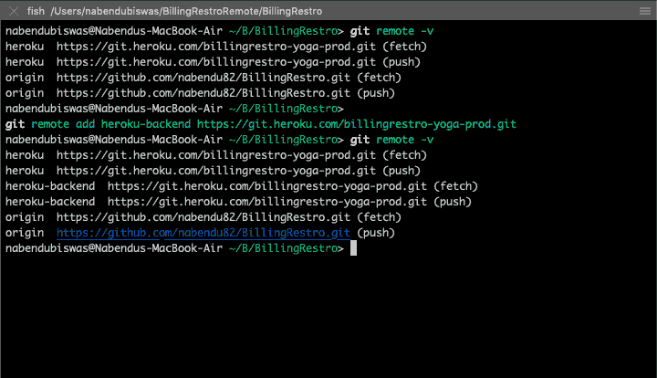 ](https://res.cloudinary.com/practicaldev/image/fetch/s--8CJa4fAk--/c_limit%2Cf_auto%2Cfl_progressive%2Cq_auto%2Cw_880/https://cdn-images-1.medium.com/max/2000/1%2Ar58KFFKUgCTNPI8DiSyHXg.png) *多一个端点*

现在，我们将把我们所有的**后端**代码推送到这个 **heroku 后端**遥控器。

```
git subtree push --prefix backend heroku-backend master 
```

[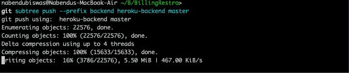 ](https://res.cloudinary.com/practicaldev/image/fetch/s--xZvFXnX7--/c_limit%2Cf_auto%2Cfl_progressive%2Cq_auto%2Cw_880/https://cdn-images-1.medium.com/max/2000/1%2AltqO22pWvZej8Qph7HUOtw.png) *子树*

接下来，我们需要将 **variables.env** 中的秘密内容添加到我们的 yoga 服务器中。在 heroku 打开瑜伽 app，转到**设置**。点击**显示配置变量。**

[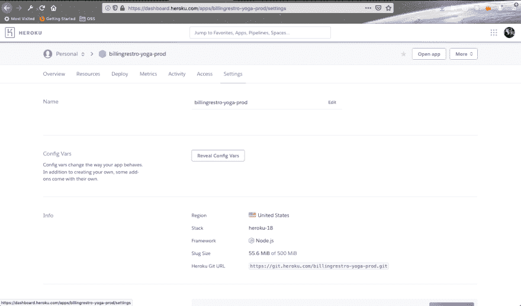](https://res.cloudinary.com/practicaldev/image/fetch/s--QuH7F_AP--/c_limit%2Cf_auto%2Cfl_progressive%2Cq_auto%2Cw_880/https://cdn-images-1.medium.com/max/2878/1%2A3XPMwycQRr0P08-PBoF5EQ.png)T3】heroku app

因此，打开您的 **variables.env** 文件。从这里取出所有东西，除了 PRISMA_ENDPOINT，它必须从 **prisma.yml** 文件中取出

[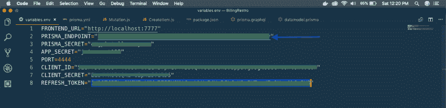](https://res.cloudinary.com/practicaldev/image/fetch/s--e7kBDzwx--/c_limit%2Cf_auto%2Cfl_progressive%2Cq_auto%2Cw_880/https://cdn-images-1.medium.com/max/2880/1%2A5Y_B-T6kTK_epjw_YcmN0Q.png)T3】variables . env

将所有配置变量添加为键值对。

[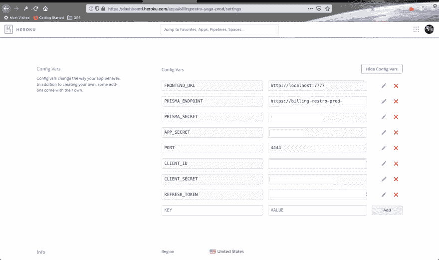 ](https://res.cloudinary.com/practicaldev/image/fetch/s--8ldt3tAV--/c_limit%2Cf_auto%2Cfl_progressive%2Cq_auto%2Cw_880/https://cdn-images-1.medium.com/max/2880/1%2Alnol5LusV_ogwEJcv3eqRw.png) *配置变量*

现在，点击**更多**，然后**重启所有测功器**。

[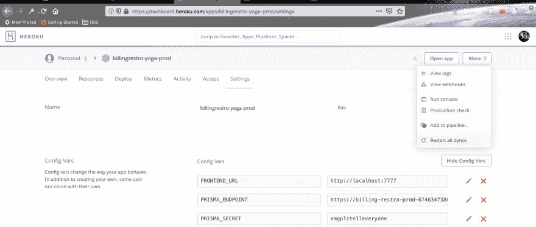T2】](https://res.cloudinary.com/practicaldev/image/fetch/s--2BQ6UeQd--/c_limit%2Cf_auto%2Cfl_progressive%2Cq_auto%2Cw_880/https://cdn-images-1.medium.com/max/2880/1%2A1r71yUPzLOC7i8WbVqrnHA.png)

弹出窗口将要求您再次确认。

[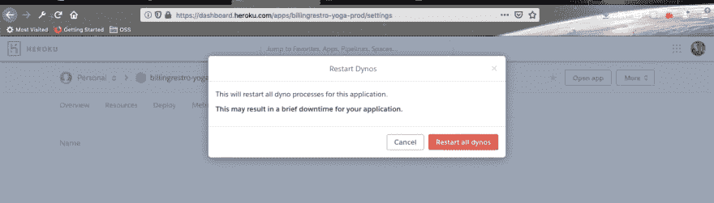T2】](https://res.cloudinary.com/practicaldev/image/fetch/s--3dsb4z7Q--/c_limit%2Cf_auto%2Cfl_progressive%2Cq_auto%2Cw_880/https://cdn-images-1.medium.com/max/2880/1%2AGTbMZghSrJSuMrL4Kz2ahQ.png)

一段时间后，点击右上角的打开应用程序。它将打开 yoga graphQL 游乐场，在那里你可以看到所有面向公众的查询和突变

[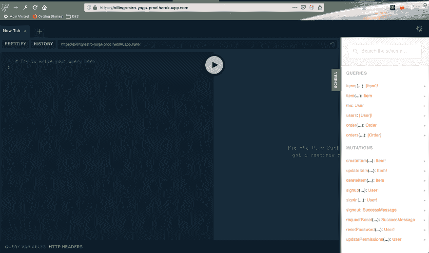 ](https://res.cloudinary.com/practicaldev/image/fetch/s--B7Wg15_r--/c_limit%2Cf_auto%2Cfl_progressive%2Cq_auto%2Cw_880/https://cdn-images-1.medium.com/max/2880/1%2AovW1CbuvopqJso8KraTm2g.png) *瑜伽图 QL*

## [](#react-app)React App

最后，我们将把我们的前端代码也部署到 heroku。首先，我们需要稍微更新一下代码。打开 config.js 文件，为 **prodEndpoint** 添加一行。链接是您在上一部分部署的 yoga 应用程序。

[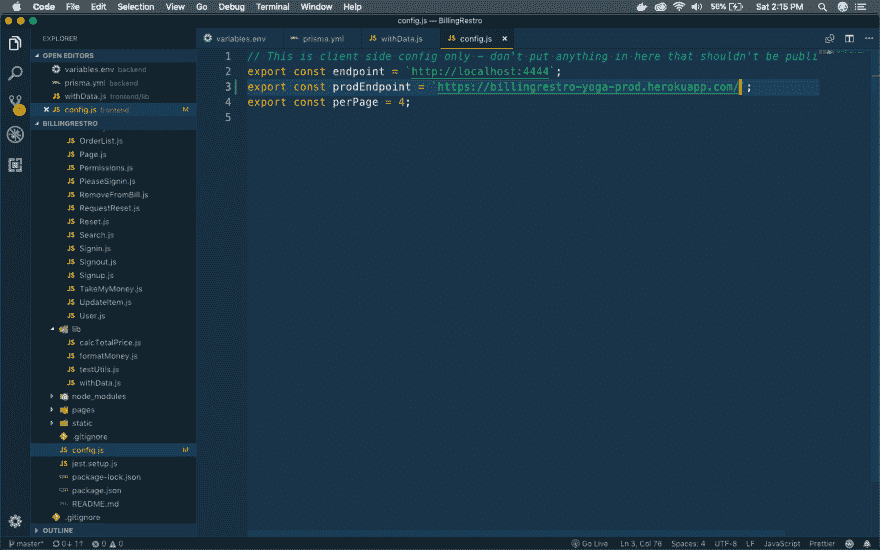](https://res.cloudinary.com/practicaldev/image/fetch/s--7bxS4jH_--/c_limit%2Cf_auto%2Cfl_progressive%2Cq_auto%2Cw_880/https://cdn-images-1.medium.com/max/2880/1%2AGdK2tFMnEcU6WJsHLZkdVA.png)

 *接下来，用 Data.js 文件将这些添加到**中。变化在第 3 行和第 8 行。**

[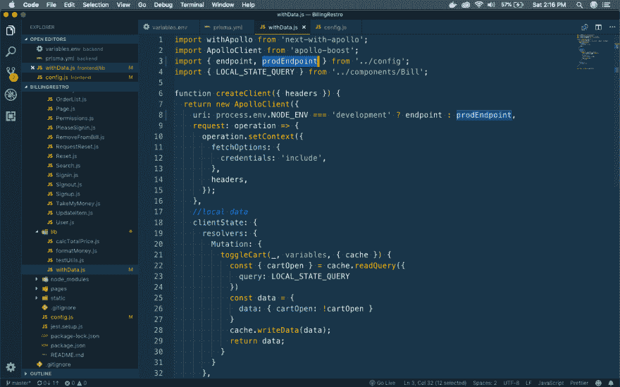](https://res.cloudinary.com/practicaldev/image/fetch/s--jPb93BVS--/c_limit%2Cf_auto%2Cfl_progressive%2Cq_auto%2Cw_880/https://cdn-images-1.medium.com/max/2880/1%2AruWjtsUPJySj5Txgfng_cw.png)T3】with data . js

接下来，我们到终端，通过`heroku apps:create billingrestro-react-prod`创建一个新的 heroku 应用程序

[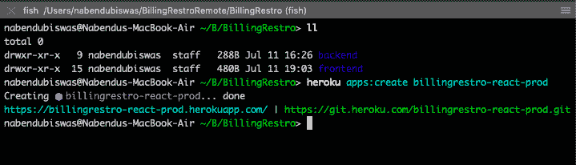T2】](https://res.cloudinary.com/practicaldev/image/fetch/s--FgwVIVLA--/c_limit%2Cf_auto%2Cfl_progressive%2Cq_auto%2Cw_880/https://cdn-images-1.medium.com/max/2000/1%2Ask2deW0Wn1Irvpob47f2_Q.png)

在检查 git remote -v 时，我们将找到新的远程端点

[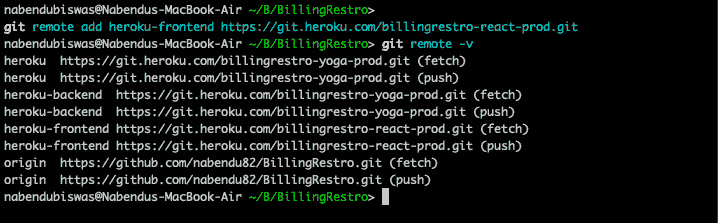T2】](https://res.cloudinary.com/practicaldev/image/fetch/s--oy-OHviQ--/c_limit%2Cf_auto%2Cfl_progressive%2Cq_auto%2Cw_880/https://cdn-images-1.medium.com/max/2000/1%2AB4Ed2dvmM0Fnenhev3z_7Q.png)

在部署之前，我们也需要为我们的前端在 **package.json** 中做一个改变。我们为`heroku-postbuild`添加第 12 行，并在第 9 行添加`add -p $PORT`。

[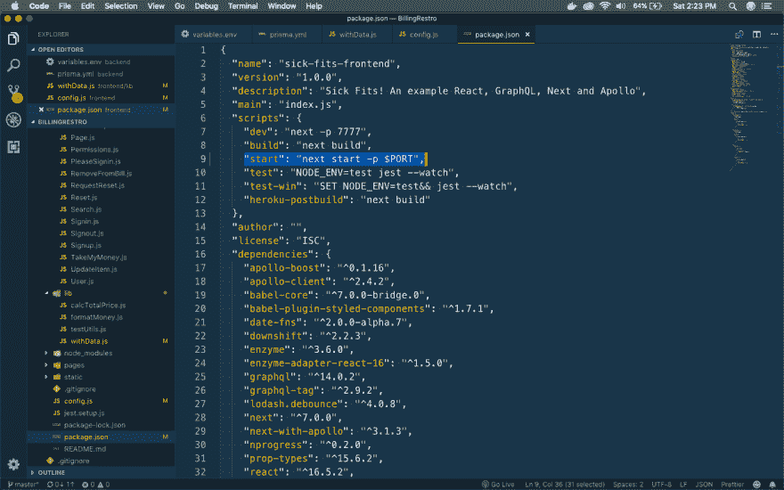](https://res.cloudinary.com/practicaldev/image/fetch/s--5MBagp3w--/c_limit%2Cf_auto%2Cfl_progressive%2Cq_auto%2Cw_880/https://cdn-images-1.medium.com/max/2880/1%2A8RqLGtxiKG0s7istSp8G_g.png)

 *我们将在推送到远程之前添加这些更改

[T2】](https://res.cloudinary.com/practicaldev/image/fetch/s--17k8IFtj--/c_limit%2Cf_auto%2Cfl_progressive%2Cq_auto%2Cw_880/https://cdn-images-1.medium.com/max/2000/1%2AvowzeQYwqK8B9xgUdsRJDg.png)

接下来，我们将通过下面的**子树**命令推送到 **heroku-frontend**

```
git subtree push --prefix frontend heroku-frontend master 
```

[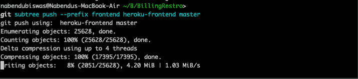T2】](https://res.cloudinary.com/practicaldev/image/fetch/s--5ajtXJUM--/c_limit%2Cf_auto%2Cfl_progressive%2Cq_auto%2Cw_880/https://cdn-images-1.medium.com/max/2000/1%2AwAbNFczHIFz4-FJRmRKO5Q.png)

如果我们检查我们的 heroku 仪表板，我们会发现这个新添加的应用程序。

[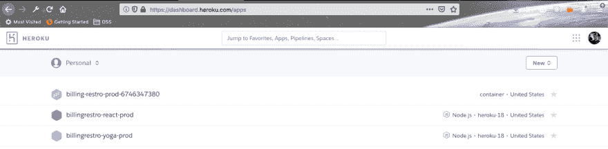 ](https://res.cloudinary.com/practicaldev/image/fetch/s--uzcfKeTY--/c_limit%2Cf_auto%2Cfl_progressive%2Cq_auto%2Cw_880/https://cdn-images-1.medium.com/max/2880/1%2ADoOIGG_xJzBhnaE-CuQJiA.png) *反应 app*

现在，如果我们使用 react 应用程序，就会出现网络错误。如果我们打开控制台，我们会发现这是一个 CORS 错误。

[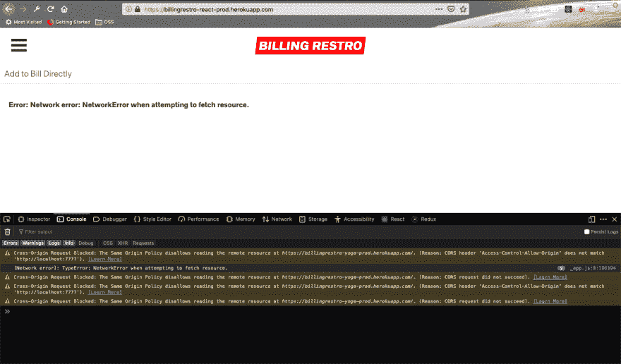 ](https://res.cloudinary.com/practicaldev/image/fetch/s--omGkiFPi--/c_limit%2Cf_auto%2Cfl_progressive%2Cq_auto%2Cw_880/https://cdn-images-1.medium.com/max/2880/1%2AWV6d3qIDlB5j_QUh1s1_VQ.png) * CORS 错误*

发生 CORS 错误是因为在我们的 yoga 配置中，我们指向了本地主机。因此，打开 yoga 应用程序，然后进入设置，然后**显示配置变量**并将 FRONTEND_URL 更改为 react 应用程序。

[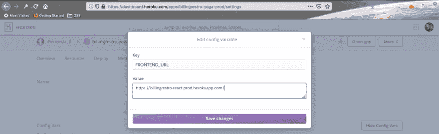 ](https://res.cloudinary.com/practicaldev/image/fetch/s--CCH6VRwV--/c_limit%2Cf_auto%2Cfl_progressive%2Cq_auto%2Cw_880/https://cdn-images-1.medium.com/max/2880/1%2Ak5Rw-T8Oierj2r12vlQ2lQ.png) *反应配置*

然后，像往常一样点击更多和**重启所有的测功器**。

[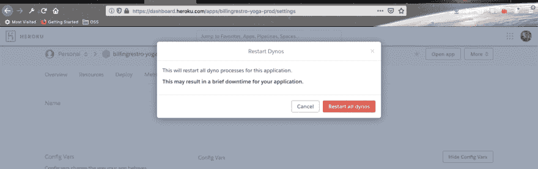 ](https://res.cloudinary.com/practicaldev/image/fetch/s--HOuN3Utj--/c_limit%2Cf_auto%2Cfl_progressive%2Cq_auto%2Cw_880/https://cdn-images-1.medium.com/max/2880/1%2A2oNJUD3GjmGb3U6Z1P5dJg.png) *重启所有动态*

然后，再次到前端网址，你不会得到任何错误。

[ ](https://res.cloudinary.com/practicaldev/image/fetch/s--1_qhnybb--/c_limit%2Cf_auto%2Cfl_progressive%2Cq_auto%2Cw_880/https://cdn-images-1.medium.com/max/2880/1%2A0u1CwXrgGyPPTG1wbNYOlg.png) *没有错误*

但是我们有同样的问题，这是我们在 localhost 中创建时遇到的问题。我们需要一个登录，只有管理员可以为新帐户签名。因此，我们首先通过打开我们的 Yoga playground 创建管理员，然后通过下面的变化创建一个用户。

```
mutation createUser {
  signup(email:"[validemail@gmail.com](mailto:nabendu.biswas@gmail.com)",name: "Admin",password: "valid"){
    email
  }
} 
```

[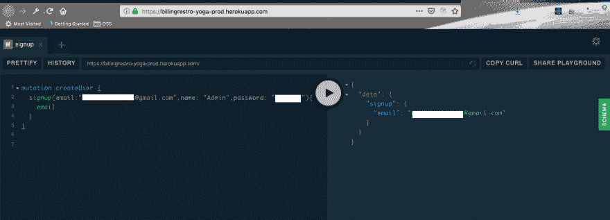 ](https://res.cloudinary.com/practicaldev/image/fetch/s--xgopp6F7--/c_limit%2Cf_auto%2Cfl_progressive%2Cq_auto%2Cw_880/https://cdn-images-1.medium.com/max/2880/1%2AXQXNZWhFcViSzaw2rgOkHQ.png) *有效 gmail id*

接下来，我们转到 Prisma 仪表板并打开我们的服务。在右下方的**权限**中，点击三个点，会打开一个弹出窗口。点击**添加一个项目**，从列表中选择**管理员**。

[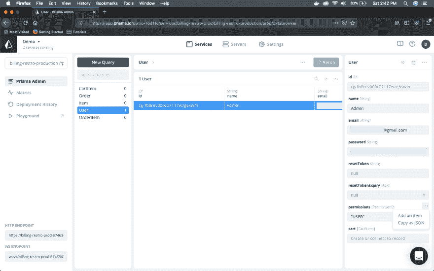 ](https://res.cloudinary.com/practicaldev/image/fetch/s--sNZLGj0B--/c_limit%2Cf_auto%2Cfl_progressive%2Cq_auto%2Cw_880/https://cdn-images-1.medium.com/max/2880/1%2AZFVxpU321d0yaUqNRD81Cg.png) *棱镜仪表盘*

然后一个新的按钮**保存到数据库**将出现在右下角。点击它。

[ ](https://res.cloudinary.com/practicaldev/image/fetch/s--nTH5HfvH--/c_limit%2Cf_auto%2Cfl_progressive%2Cq_auto%2Cw_880/https://cdn-images-1.medium.com/max/2880/1%2AFNbzNfQJgQrxRlKwhFzZPA.png) *保存到数据库*

回到前端网址，以管理员用户身份登录，查看所有选项。

[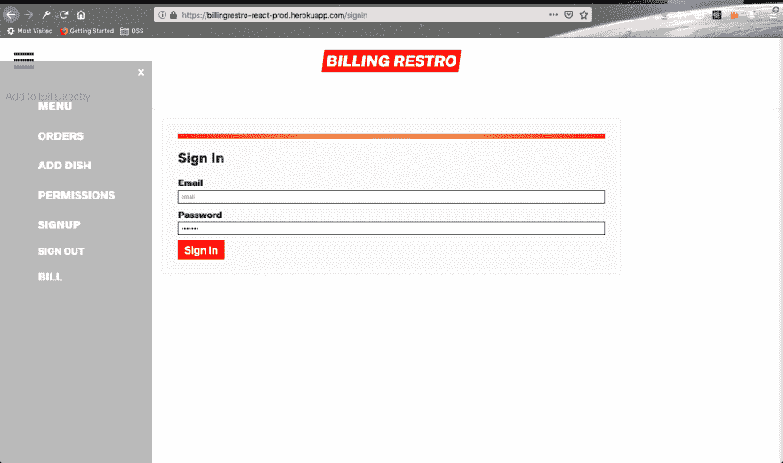 ](https://res.cloudinary.com/practicaldev/image/fetch/s--ySHEyzvb--/c_limit%2Cf_auto%2Cfl_progressive%2Cq_auto%2Cw_880/https://cdn-images-1.medium.com/max/2880/1%2A3fG0ptAOQkfydUDvrrKupQ.png) *管理员用户*

添加一些项目后，网络应用程序看起来如下

[ ](https://res.cloudinary.com/practicaldev/image/fetch/s--8ooRz9jz--/c_limit%2Cf_auto%2Cfl_progressive%2Cq_auto%2Cw_880/https://cdn-images-1.medium.com/max/2880/1%2A_JZ4VCvVfXBRVnsxNhB4Ew.png) *完整 App*

> 你可以访问部署好的网址，在这里玩。使用 normal@gmail.com/正常的[凭证](mailto:normal@gmail.com)

另外，访问该项目的 github，了解所有的特性。如果你喜欢它，请给它一颗星。
[完成量产级餐厅计费 App](https://github.com/nabendu82/BillingRestro)**