# React NextJS GraphQL 中内置的完整生产级餐厅计费应用程序

> 原文:[https://dev . to/nabe NDU 82/complete-production-grade-restaurant-billing-app-built-in-react-nextjs-graph QL-p10](https://dev.to/nabendu82/complete-production-grade-restaurant-billing-app-built-in-react-nextjs-graphql-p10)

我已经完成了印度餐馆账单应用程序的构建，这是从学习韦斯·博斯的[高级反应](https://advancedreact.com/)课程开始的。

我之前也写了四篇关于这个应用的文章，其中包括了我遇到的一些问题和一些设置。

在这篇文章中，我将给出从我的 [github](https://github.com/nabendu82/BillingRestro) 中获取应用程序后在 localhost 上安装的方法。有一个 prisma 设置，交易电子邮件设置，管理员用户生成。

我还会带你浏览应用程序。我的动机是让这款应用成为任何人或小餐馆老板使用的更高级餐馆或一般销售点应用的基础。自由地提出、使用、提出问题(并解决它们)

所以，去你最喜欢的终端，克隆项目。

[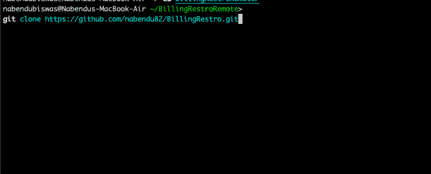 ](https://res.cloudinary.com/practicaldev/image/fetch/s--ymnHMpS9--/c_limit%2Cf_auto%2Cfl_progressive%2Cq_auto%2Cw_880/https://cdn-images-1.medium.com/max/2000/1%2Agyz46PiI1tSdI1yg1dZcmw.png) * git 克隆*

现在，你会看到两个文件夹——**后端**和**前端**。进入每个文件夹，进行 **npm 安装**

[ ](https://res.cloudinary.com/practicaldev/image/fetch/s--yX6QlEfK--/c_limit%2Cf_auto%2Cfl_progressive%2Cq_auto%2Cw_880/https://cdn-images-1.medium.com/max/2000/1%2ASPHh5u1nX9Ov4AXjCghQcw.png) * npm 安装*

现在，是时候建立一个 Prisma 数据库了。所以，去[https://www.prisma.io/](https://www.prisma.io/)注册一个账户。

一旦完成，你可以检查你的 prisma 仪表板。

[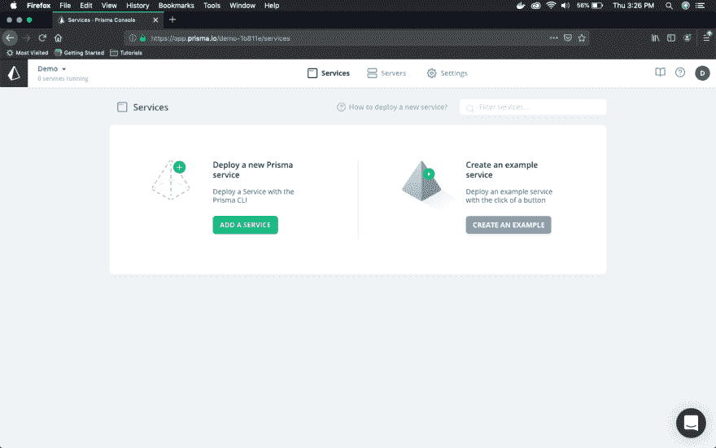 ](https://res.cloudinary.com/practicaldev/image/fetch/s--M9NYuX6w--/c_limit%2Cf_auto%2Cfl_progressive%2Cq_auto%2Cw_880/https://cdn-images-1.medium.com/max/2880/1%2AsQR4FUV8jZZdU8_4bMJtcg.png) *棱镜仪表盘*

我们将通过终端进行一些部署，所以请进入**后端**文件夹，首先由 **npm i -g prisma** 在全球范围内安装 prisma

[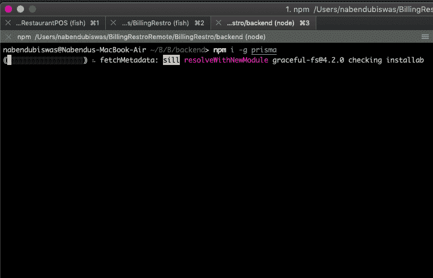 ](https://res.cloudinary.com/practicaldev/image/fetch/s--12wWsEBZ--/c_limit%2Cf_auto%2Cfl_progressive%2Cq_auto%2Cw_880/https://cdn-images-1.medium.com/max/2000/1%2AW4iolzDQiNLV-oWORNhh-Q.png) *棱镜全球*

现在，虽然在后端文件夹只给命令 prisma 登录。

[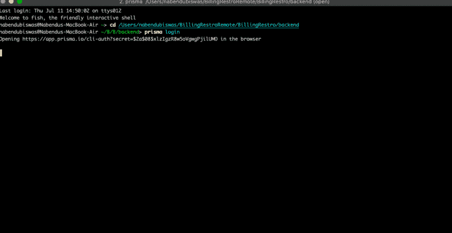 ](https://res.cloudinary.com/practicaldev/image/fetch/s--qmnx1mpN--/c_limit%2Cf_auto%2Cfl_progressive%2Cq_auto%2Cw_880/https://cdn-images-1.medium.com/max/2174/1%2AXSYBfsijP53FOMiEk8GUcQ.png) *棱镜登录*

它将打开您的默认浏览器，您需要在其中输入用于创建 prisma 帐户的凭据。

[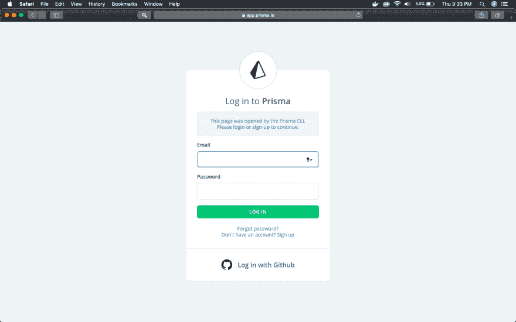 ](https://res.cloudinary.com/practicaldev/image/fetch/s--W7RyBnmZ--/c_limit%2Cf_auto%2Cfl_progressive%2Cq_auto%2Cw_880/https://cdn-images-1.medium.com/max/2880/1%2ARlAzKCNRDnorM-lQ_jb7eQ.png) *输入你的凭证*

然后它会请求**授予**使用权限。

[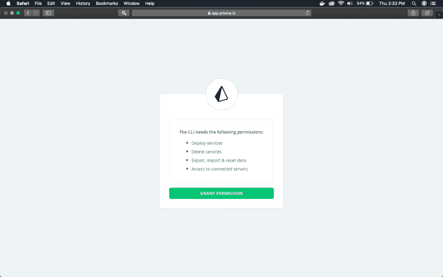 ](https://res.cloudinary.com/practicaldev/image/fetch/s--mlqZ6IjN--/c_limit%2Cf_auto%2Cfl_progressive%2Cq_auto%2Cw_880/https://cdn-images-1.medium.com/max/2880/1%2AoYZI6bL6Li4qWIurEpxBkg.png) *授予权限*

一旦你点击授予许可，它会要求你关闭浏览器。完成后，您就可以在控制台中通过身份验证。

现在，我们需要键入 **prisma init** 在终端中初始化一个新的 prisma 服务。你会得到如下的一些错误。

[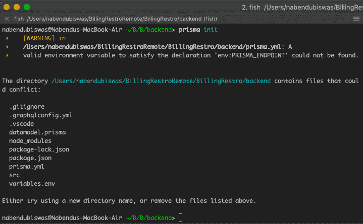 ](https://res.cloudinary.com/practicaldev/image/fetch/s--DHYRd2Ga--/c_limit%2Cf_auto%2Cfl_progressive%2Cq_auto%2Cw_880/https://cdn-images-1.medium.com/max/2000/1%2Al4Mu0-LzjHtgxNRL9li7QA.png) *棱镜初始化错误*

我们得到这些错误，因为我们的项目已经完成，并有一些 prisma 相关的自动生成文件。

你需要继续删除其中一些。删除下面的文件。

```
.graphqlconfig.yml
datamodel.prisma
prisma.yml
variables.env
src/generated/prisma.graphql 
```

再次键入 **prisma init** ，它会让你通过。这里使用鼠标键往下走，进入**演示服务器+ MySQL 数据库**

[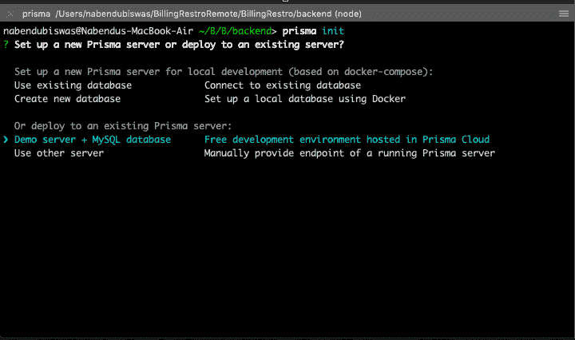 ](https://res.cloudinary.com/practicaldev/image/fetch/s--_VE6jAcC--/c_limit%2Cf_auto%2Cfl_progressive%2Cq_auto%2Cw_880/https://cdn-images-1.medium.com/max/2000/1%2AHWWfkA0AUmqEbb5Q36GSnA.png) *选择演示服务器*

然后在下一个屏幕中选择延迟最小的一个。

[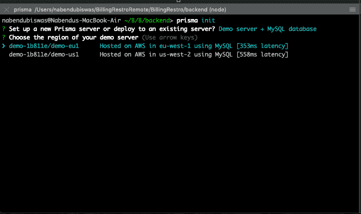 ](https://res.cloudinary.com/practicaldev/image/fetch/s--f5064CqR--/c_limit%2Cf_auto%2Cfl_progressive%2Cq_auto%2Cw_880/https://cdn-images-1.medium.com/max/2000/1%2AFM91hgSfaOmUzLESDfwuGA.png) *选择延迟最小的一个*

之后，为您的服务选择一个名称，并将 stage 命名为 **dev** 。

[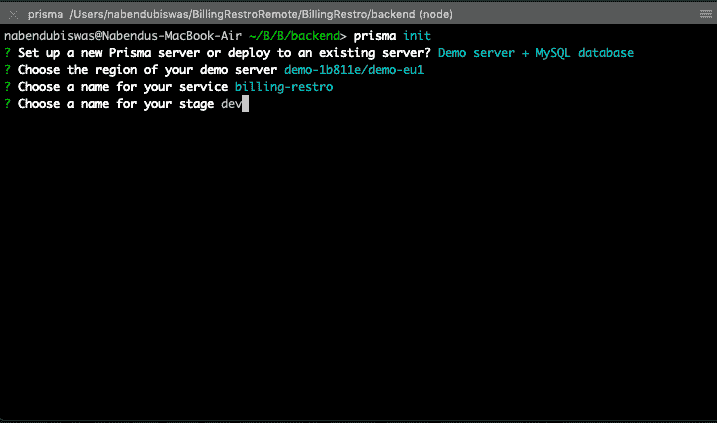 ](https://res.cloudinary.com/practicaldev/image/fetch/s--8ESGlCF5--/c_limit%2Cf_auto%2Cfl_progressive%2Cq_auto%2Cw_880/https://cdn-images-1.medium.com/max/2000/1%2A_oQMmWOLIrtCCHIThJcIgQ.png) *阶段是 dev*

在选择编程语言时给**不生成**

[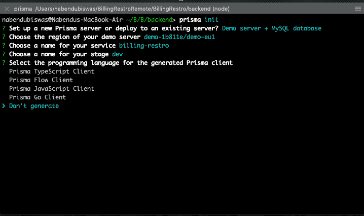 ](https://res.cloudinary.com/practicaldev/image/fetch/s--svCV1dRp--/c_limit%2Cf_auto%2Cfl_progressive%2Cq_auto%2Cw_880/https://cdn-images-1.medium.com/max/2000/1%2AHHJ3MOkfiI_vw9kPqOuflg.png) *不生成*

prisma 为我们创建了两个文件。

[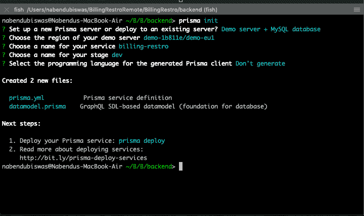 ](https://res.cloudinary.com/practicaldev/image/fetch/s--SjwSiPtv--/c_limit%2Cf_auto%2Cfl_progressive%2Cq_auto%2Cw_880/https://cdn-images-1.medium.com/max/2000/1%2AU7ghgFkN3n4de3M7CHVW-A.png) *两档创建*

现在让我们打开 **prisma.yml** ，我们会注意到 prisma 给了我们一个端点。

[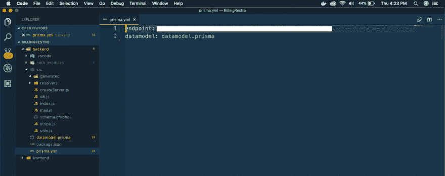 ](https://res.cloudinary.com/practicaldev/image/fetch/s--BWLbtwyk--/c_limit%2Cf_auto%2Cfl_progressive%2Cq_auto%2Cw_880/https://cdn-images-1.medium.com/max/2880/1%2ANr4crcbZOQPSK-QJ1tHPAg.png) *端点*

我们将把这个端点信息以及其他一些敏感信息放入我们的环境文件中。

所以，继续在你的**后端**文件夹中创建一个 **variables.env** 。PRISMA_ENDPOINT 将是我们从 **prisma.yml** 文件中得到的端点。放 PRISMA_SECRET 和 APP_SECRET，随便你选。

[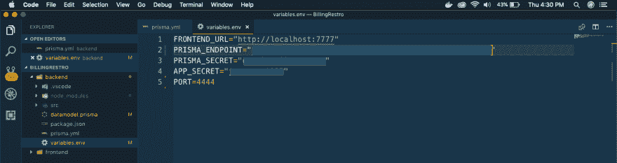](https://res.cloudinary.com/practicaldev/image/fetch/s--2S7K-mJF--/c_limit%2Cf_auto%2Cfl_progressive%2Cq_auto%2Cw_880/https://cdn-images-1.medium.com/max/2880/1%2AQTZ_ACMAkjI-H9U6g9tTNw.png)T3】variables . env

接下来，转到 **prisma.yml** 来使用这些变量。请注意，我们已经注释掉了这个秘密。这样做是因为我们正在开发中，我们不希望数据库每次都问我们密码。

[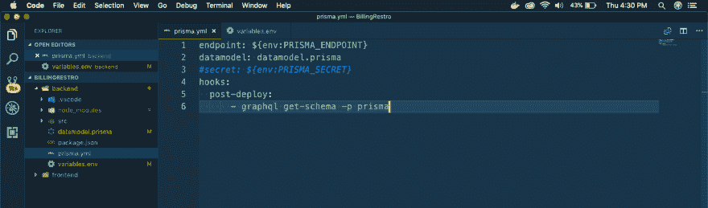](https://res.cloudinary.com/practicaldev/image/fetch/s--hKTUuAg3--/c_limit%2Cf_auto%2Cfl_progressive%2Cq_auto%2Cw_880/https://cdn-images-1.medium.com/max/2880/1%2A2IISv-TMo9OCOiuf4ShMYw.png)T3】prisma . yml

我们需要将我们的 **datamodel.prisma** 更新到最新的代码。为了让 *prisma init* 成功，我们必须删除它。从[这里](https://github.com/nabendu82/BillingRestro/blob/master/backend/datamodel.prisma)获取。

[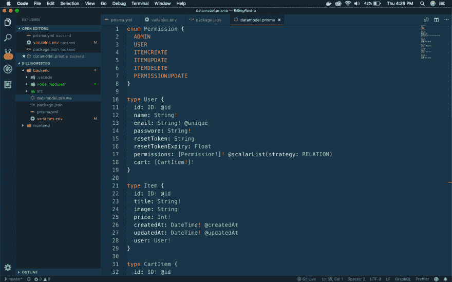](https://res.cloudinary.com/practicaldev/image/fetch/s--cJDUuK5l--/c_limit%2Cf_auto%2Cfl_progressive%2Cq_auto%2Cw_880/https://cdn-images-1.medium.com/max/2880/1%2AYe-DHgIODQwg0sfASkvo6Q.png)***data model . prisma*T6】**

现在在**后端**文件夹中运行 **npm 运行部署**

[](https://res.cloudinary.com/practicaldev/image/fetch/s--J5E6KJbi--/c_limit%2Cf_auto%2Cfl_progressive%2Cq_auto%2Cw_880/https://cdn-images-1.medium.com/max/2000/1%2Ao0vBAxcEJxF9-qHQv0qgHw.png)T3】NPM 运行部署

如果一切顺利，您可以在 prisma 仪表板中看到该服务。

[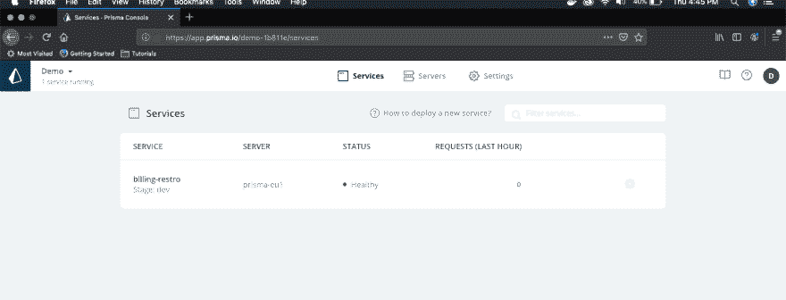 ](https://res.cloudinary.com/practicaldev/image/fetch/s--UcnvbJl3--/c_limit%2Cf_auto%2Cfl_progressive%2Cq_auto%2Cw_880/https://cdn-images-1.medium.com/max/2880/1%2AH_L_cNNlm7ffZ9OGIDmTbQ.png) *我方服务*

单击服务，您将看到我们所有的数据模型项目。

[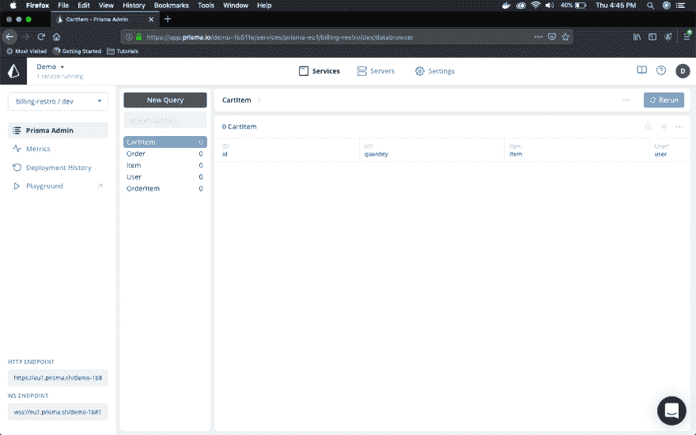 ](https://res.cloudinary.com/practicaldev/image/fetch/s--lowI3KwZ--/c_limit%2Cf_auto%2Cfl_progressive%2Cq_auto%2Cw_880/https://cdn-images-1.medium.com/max/2880/1%2AMhRaoyB4P6ELLzz6l5Fsng.png) *我们所有的车型*

之前，我们运行我们的后端和前端的最后一步是剩余的。Prisma 使用了一个叫做 **prisma.graphql，**的东西，为了让 *prisma init* 成功，我们必须删除它。从[这里](https://github.com/nabendu82/BillingRestro/blob/master/backend/src/generated/prisma.graphql)获取。

添加到**src/generated/prisma . graph QL**

[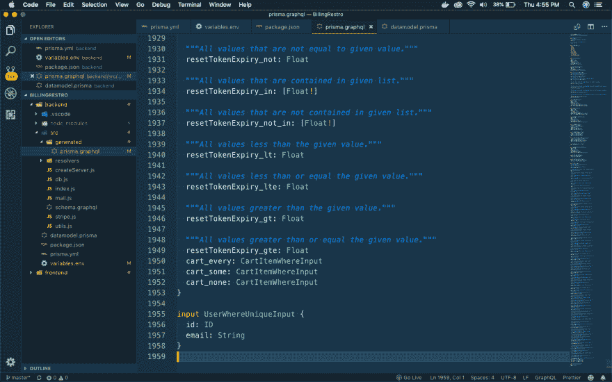](https://res.cloudinary.com/practicaldev/image/fetch/s--dxDRuxux--/c_limit%2Cf_auto%2Cfl_progressive%2Cq_auto%2Cw_880/https://cdn-images-1.medium.com/max/2880/1%2A2koh2UDNx4_MoJ0RGw27_Q.png)T3】prisma . graph QL

现在转到**后端**和**前端**文件夹，运行 **npm 运行开发**

[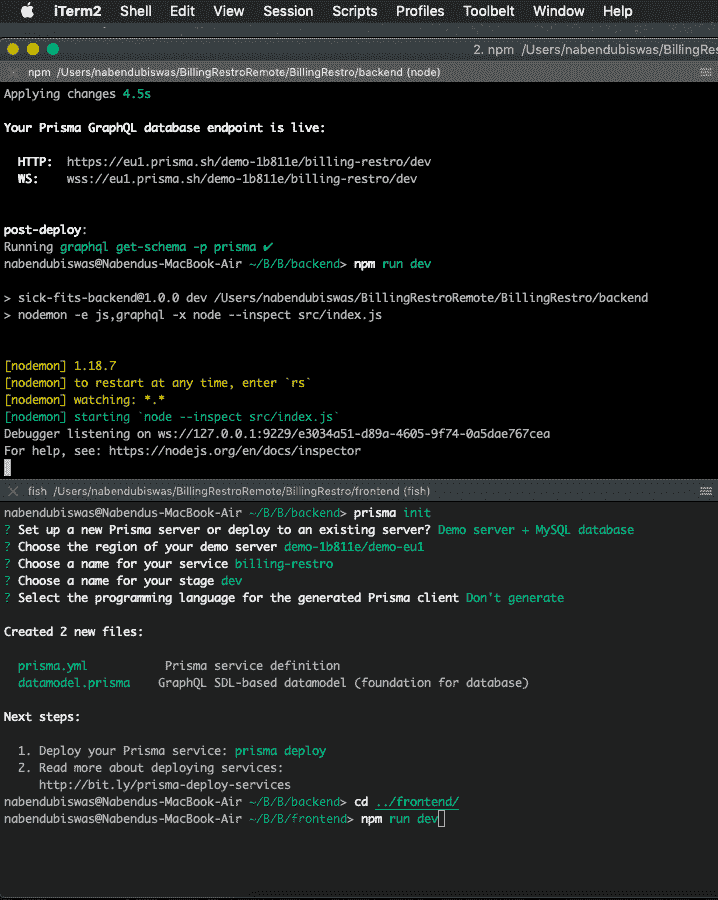 ](https://res.cloudinary.com/practicaldev/image/fetch/s--DM046mFa--/c_limit%2Cf_auto%2Cfl_progressive%2Cq_auto%2Cw_880/https://cdn-images-1.medium.com/max/2000/1%2ACv94EL8JBgMZBg5ntw1xXQ.png) * npm 运行开发*

如果两者都成功，您的应用程序将在 [http://localhost:7777/](http://localhost:7777/) 中启动

[](img/474f6de47aee52c6a1492e51b2154eda.png)](https://res.cloudinary.com/practicaldev/image/fetch/s--b39YxRVM--/c_limit%2Cf_auto%2Cfl_progressive%2Cq_auto%2Cw_880/https://cdn-images-1.medium.com/max/2880/1%2AdhzymaL12rnuwLlsku3smA.png)*[http://localhost:7777/](http://localhost:7777/)T6】*

现在，在应用程序中，管理员用户拥有创建新用户的权限。因此，我们必须首先通过 graphql playground 从后端创建一个管理员用户。

转到 [http://localhost:4444/](http://localhost:4444/) 并给出下面的突变来创建一个管理员用户。

[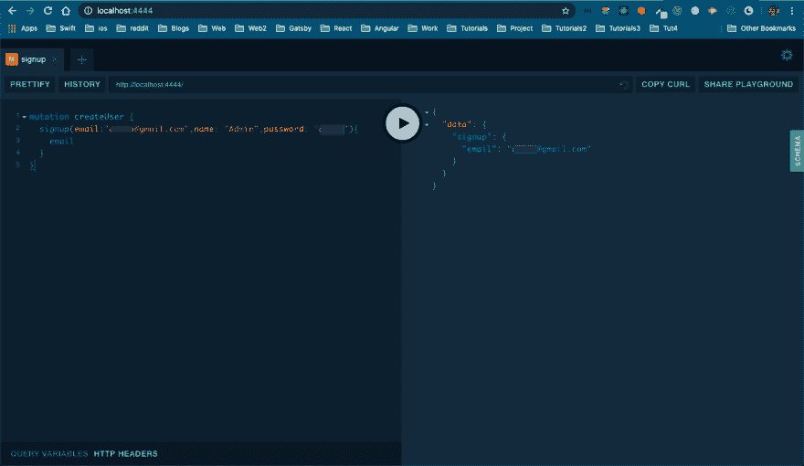 ](https://res.cloudinary.com/practicaldev/image/fetch/s--IFGj8OQx--/c_limit%2Cf_auto%2Cfl_progressive%2Cq_auto%2Cw_880/https://cdn-images-1.medium.com/max/2880/1%2A_xIfrarDAAxi_EASAwpAEQ.png) *变异创建管理员用户*

然后前往 prisma dashboard，为该用户添加一个管理员权限。你需要点击权限旁边的三个点，然后点击**管理**。然后点击按钮**保存到数据库底部的**

[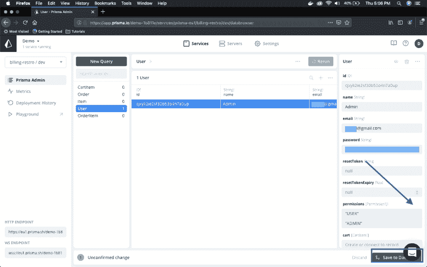 ](https://res.cloudinary.com/practicaldev/image/fetch/s--S4lL_0gN--/c_limit%2Cf_auto%2Cfl_progressive%2Cq_auto%2Cw_880/https://cdn-images-1.medium.com/max/2880/1%2A-HHaQddsUvGWzs1YeGbfrA.png) *添加管理员权限*

现在，通过单击 SIGNIN 以管理员用户身份登录。你会在这里看到许多不同的管理选项。

接下来，我们将创建一个普通用户。点击注册。

[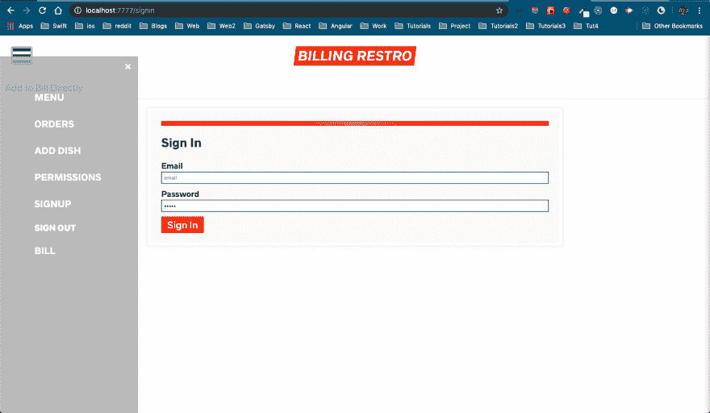 ](https://res.cloudinary.com/practicaldev/image/fetch/s--DNf8lZ4K--/c_limit%2Cf_auto%2Cfl_progressive%2Cq_auto%2Cw_880/https://cdn-images-1.medium.com/max/2880/1%2APNV4xpLjjKZAHpDl7-s6NA.png) *报名*

创建一个真正的 gmail 凭证用户，因为我们也重置密码设施。

[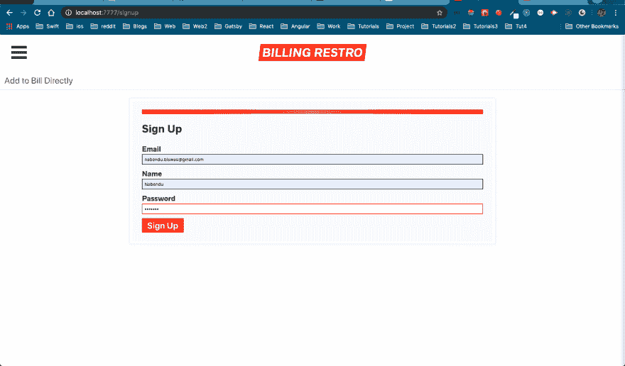 ](https://res.cloudinary.com/practicaldev/image/fetch/s--SU-JaGju--/c_limit%2Cf_auto%2Cfl_progressive%2Cq_auto%2Cw_880/https://cdn-images-1.medium.com/max/2880/1%2A2pe_ngD0VyF8WFykUkeUTA.png) *真实凭据*

接下来，我们将为密码重置进行事务性电子邮件设置。为此，请遵循从我之前的开发到本文[的所有步骤。](https://dev.to/nabendu82/sending-transactional-emails-through-gmail-in-react-nextjs-graphql-app-1ap5)

您将获得三个新值，分别是 **CLIENT_ID** 、 **CLIENT_SECRET** 和 **REFRESH_TOKEN** ，您将把它们添加到 **variables.env** 中

[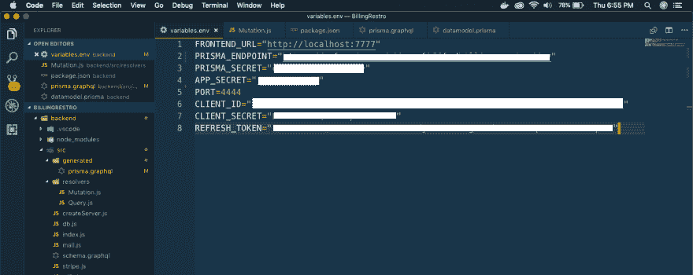 ](https://res.cloudinary.com/practicaldev/image/fetch/s--yBda_oLL--/c_limit%2Cf_auto%2Cfl_progressive%2Cq_auto%2Cw_880/https://cdn-images-1.medium.com/max/2880/1%2AGCBxyfYzTBUpyxKwigHUnA.png) *三个新值*

另外，在 **Mutation.js** 中添加您用来设置交易邮件的 gmail id。

[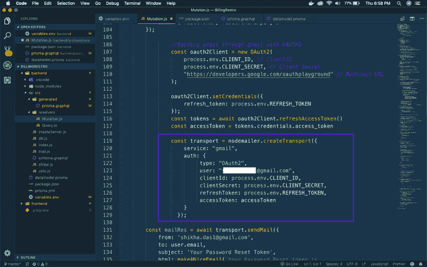 ](https://res.cloudinary.com/practicaldev/image/fetch/s--_bS4s3XA--/c_limit%2Cf_auto%2Cfl_progressive%2Cq_auto%2Cw_880/https://cdn-images-1.medium.com/max/2880/1%2A3wZHUY13A6Y3C2cWCthDLQ.png) *突变. js*

你需要重启**后端**服务器，然后点击重置。

[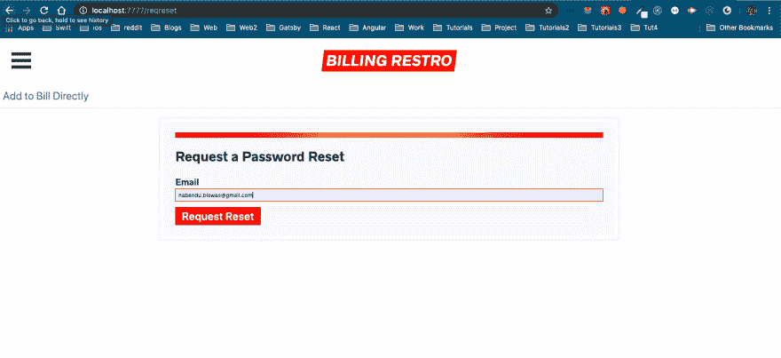 ](https://res.cloudinary.com/practicaldev/image/fetch/s--Yifl9MvU--/c_limit%2Cf_auto%2Cfl_progressive%2Cq_auto%2Cw_880/https://cdn-images-1.medium.com/max/2870/1%2AjvpRU823uLhhlT9QWS4IPw.png) *重置密码*

如果成功了，你会得到消息。

[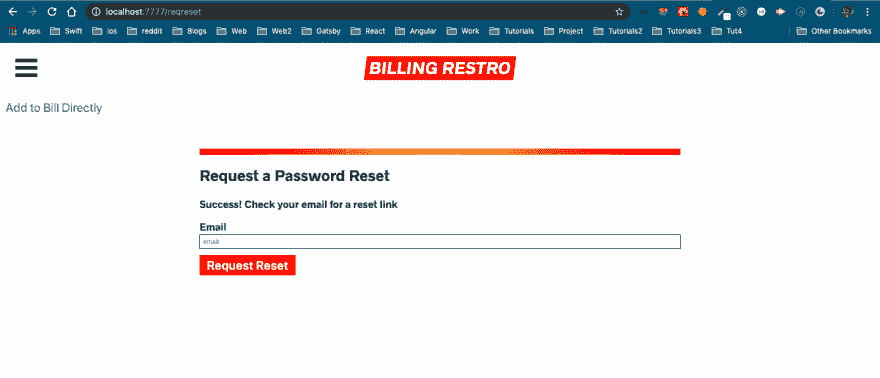 ](https://res.cloudinary.com/practicaldev/image/fetch/s--PA0oFi-G--/c_limit%2Cf_auto%2Cfl_progressive%2Cq_auto%2Cw_880/https://cdn-images-1.medium.com/max/2876/1%2ASaJrKzyzhvbKnyBD3hKQWw.png) *密码重置成功*

您的 gmail 帐户中会收到一封精美的电子邮件，其中包含重置密码的链接。

[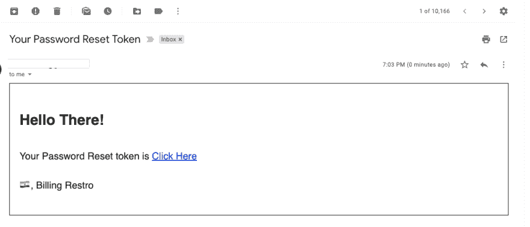 ](https://res.cloudinary.com/practicaldev/image/fetch/s--qzFyAwKH--/c_limit%2Cf_auto%2Cfl_progressive%2Cq_auto%2Cw_880/https://cdn-images-1.medium.com/max/2174/1%2AmH6vhOH-bwivMNmOJ_PpSQ.png) *邮件进行密码重置*

> 您还需要设置一个 cloudinary 帐户来上传和管理图像。按照我之前的开发中的所有说明来写这篇文章。

只需用你在 **CreateItem.js** 中按照上述文章中的步骤得到的用户名来更改用户名

[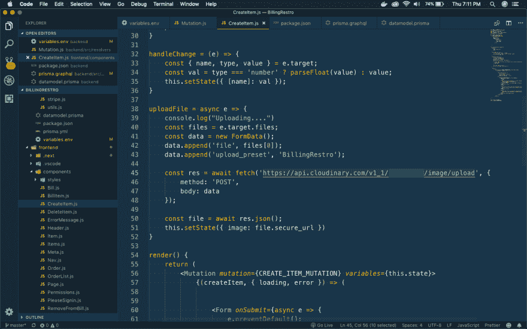 ](https://res.cloudinary.com/practicaldev/image/fetch/s--n7VBTkTt--/c_limit%2Cf_auto%2Cfl_progressive%2Cq_auto%2Cw_880/https://cdn-images-1.medium.com/max/2880/1%2AKFZt5ww0iD0bkIhSqu8yzg.png) *云淡风轻*

是时候测试一些图片上传了。用你的管理员用户登录，点击汉堡菜单中的添加菜肴。您还可以根据权限创建其他类型用户，这些用户只能创建项目，或者删除或编辑项目。

[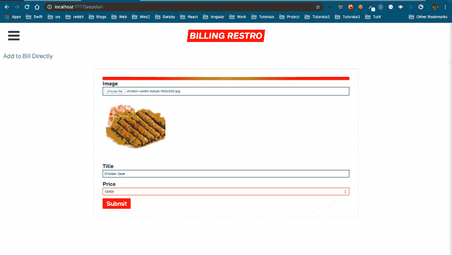 ](https://res.cloudinary.com/practicaldev/image/fetch/s--bdauNfbx--/c_limit%2Cf_auto%2Cfl_progressive%2Cq_auto%2Cw_880/https://cdn-images-1.medium.com/max/2880/1%2ArOs75QBbqeObV6K_9GT7kg.png) *增加一道菜*

点击提交，这道菜就成功添加了。

[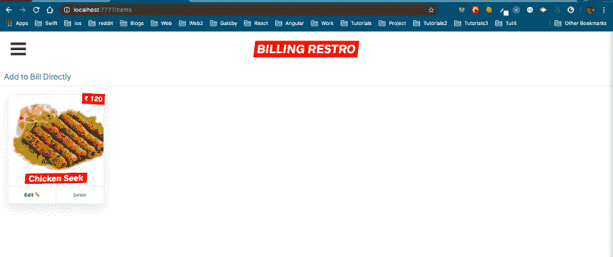 ](https://res.cloudinary.com/practicaldev/image/fetch/s--NfXgXQwW--/c_limit%2Cf_auto%2Cfl_progressive%2Cq_auto%2Cw_880/https://cdn-images-1.medium.com/max/2878/1%2A8Mcu7prGo9gBUBQUye9irw.png) *菜成功添加*

这就完成了设置。继续下去，检查所有的功能，计费，管理权限和其他。所有东西都保存在 Prisma 数据库的云端。

[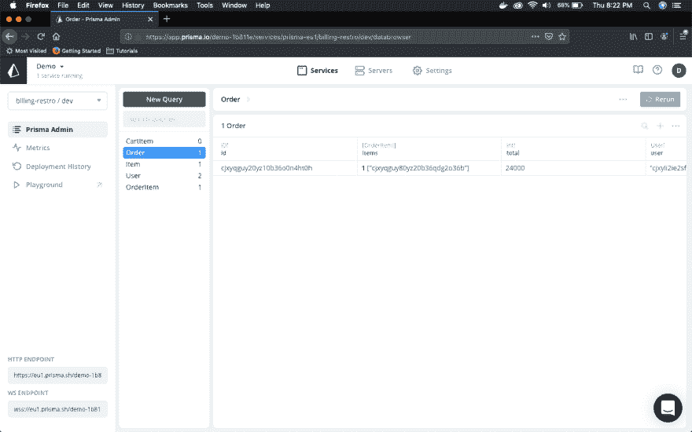 ](https://res.cloudinary.com/practicaldev/image/fetch/s--iRPrhHC9--/c_limit%2Cf_auto%2Cfl_progressive%2Cq_auto%2Cw_880/https://cdn-images-1.medium.com/max/2880/1%2A0-DVvaaqChPpmYa6VSqHPg.png) *云碧数据库*

如果你喜欢这个项目，请给我在我的 GitHub 链接
[billing resto](https://github.com/nabendu82/BillingRestro)星

希望你喜欢这篇文章，并希望使用 heroku 部署这个项目。点击[此处](https://dev.to/nabendu82/deploying-react-nextjs-graphql-app-in-heroku-10e3)查看关于**在 Heroku** 部署 React NextJS GraphQL 应用的文章。

这款开源应用也已经在产品搜索上推出。请投赞成票。

[https://www.producthunt.com/posts/billing-restro](https://www.producthunt.com/posts/billing-restro)