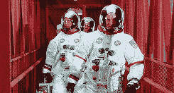
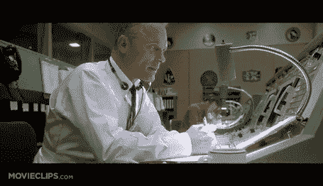
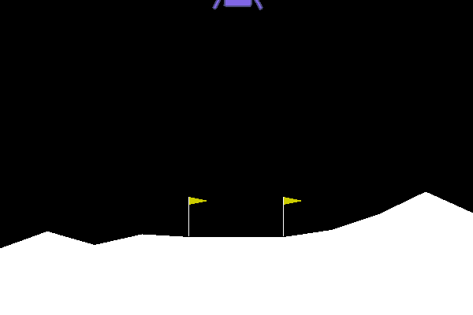
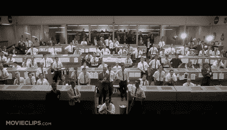

# 🤖➡🌜(教机器人登月)

> 原文：<https://dev.to/charlesdlandau/teach-bots-to-land-on-the-moon-27m9>

[在 Google Colab 中修补这款笔记本](https://colab.research.google.com/github/CharlesDLandau/rlNotebooks/blob/master/botsToTheMoon.ipynb)

[GitHub](https://github.com/CharlesDLandau/rlNotebooks)

在过去的几集里，我们回顾了强化学习的设计原则，介绍了 OpenAI Gym 的强化学习，并训练了一个深度学习模型来导航 OpenAI Gym 环境。为了实现这一点，我们利用了代理-环境关系:

*   代理在环境中采取行动。这些可以是随机的，或者由启发法引导，或者由模型引导，或者由一些组合引导。它接收关于环境的数据，比如环境的图片或字符串，然后采取行动。之后，它从环境中获得奖励，这相当于对所选行为的积极或消极的“强化”。

*   环境跟踪状态、可能的动作、奖励和**奖励函数**，并且可选地将环境渲染到显示器上。它接收来自代理的动作，并且它可以被配置为保存数据(例如，代理在环境中执行的视频。)

#### 更好的药剂

在前几集里，我们还实现了一些简单的强化学习。没有卷积层或策略引擎，网络只能学习简单的策略(如[左转](https://dev.to/charlesdlandau/drive-a-tank-with-python-3caf))。

为了解决这个问题，我们可以使用像 [Tensorflow Agents](https://github.com/tensorflow/agents) 或 [OpenAI Baselines](https://github.com/openai/baselines) 这样的库，它们拥有一些经过战斗考验的最成功代理的实现。我已经和其中的一些库合作过了，我得到了和这篇由 Thomas Simonini 撰写的[优秀文章](https://medium.com/data-from-the-trenches/choosing-a-deep-reinforcement-learning-library-890fb0307092)相同的结论。也就是说，我喜欢[稳定基线](https://github.com/hill-a/stable-baselines)，OpenAI 基线库的一个分支。

#### 做好准备

[](https://res.cloudinary.com/practicaldev/image/fetch/s--xigxxTP_--/c_limit%2Cf_auto%2Cfl_progressive%2Cq_66%2Cw_880/https://thumbs.gfycat.com/GorgeousUnfortunateAndalusianhorse-size_restricted.gif)

设置 Google Colab 的稳定基线及其依赖项，并弄清楚如何让 gif 工作，花了我比我想象中更长的时间。你可以用下面几行代码来做

```
# see: colab.research.google.com/drive/1GLlB53gvZaUyqMYv8GmZQJmshRUzV_tg !apt-get -qq -y install libcusparse8.0 libnvrtc8.0 libnvtoolsext1 > /dev/null
!ln -snf /usr/lib/x86_64-linux-gnu/libnvrtc-builtins.so.8.0 /usr/lib/x86_64-linux-gnu/libnvrtc-builtins.so
!apt-get -qq -y install xvfb freeglut3-dev ffmpeg> /dev/null

!pip install stable-baselines==2.7.0

# box2d fork until SWIG dependency is replaced !pip install box2d-py

# pyglet later versions break gym apparently !pip install pyglet==1.3.2

# Set up display; otherwise rendering will fail for
# classic control type envs, apparently import os
import Box2D
import pyglet
os.system("Xvfb :1 -screen 0 1024x768x24 &")
os.environ['DISPLAY'] = ':1'

# See https://github.com/ipython/ipython/issues/10045#issuecomment-522697219 from IPython.core.interactiveshell import InteractiveShell
InteractiveShell.ast_node_interactivity = "all"
from IPython import display 
```

<svg width="20px" height="20px" viewBox="0 0 24 24" class="highlight-action crayons-icon highlight-action--fullscreen-on"><title>Enter fullscreen mode</title></svg> <svg width="20px" height="20px" viewBox="0 0 24 24" class="highlight-action crayons-icon highlight-action--fullscreen-off"><title>Exit fullscreen mode</title></svg>

有了这个方法，你可以用两行代码实现一个高质量的优势演员评论家(A2C)模型。简单基线很棒，因为它有直观的方法来训练和预测。更好的是，它将我们的环境存储为一个`model.env`成员，因此对于典型的工作流，我们所需要的只是一个`model`实例。

让我们开始训练吧——下面的内容要花相当多的时间来运行:

```
from stable_baselines import A2C
import time
start = time.time()

# Train a multilayer perceptron in the lunar lander. model = A2C('MlpPolicy', "LunarLander-v2").learn(900000)

# Mine finished in about 10 minutes. print(f"Finished in {time.time()-start}s") 
```

<svg width="20px" height="20px" viewBox="0 0 24 24" class="highlight-action crayons-icon highlight-action--fullscreen-on"><title>Enter fullscreen mode</title></svg> <svg width="20px" height="20px" viewBox="0 0 24 24" class="highlight-action crayons-icon highlight-action--fullscreen-off"><title>Exit fullscreen mode</title></svg>

### 一个演员和一个评论家走进一家酒吧。

说到这里，我们来谈谈演员-评论家范式。演员评论家解决的问题只涉及我们的奖励功能。在许多情况下，奖励只发生在“一集”或“游戏”的结尾考虑井字游戏的奖励函数:

*   播放时返回 0
*   如果游戏以平局结束，返回 0
*   如果游戏以代理人失败告终，则返回-1.0
*   如果游戏以代理获胜而结束，则返回 1.0

正如你所看到的，我们的代理每集都采取了几个步骤，而这些步骤从奖励功能中根本得不到任何反馈，这减缓了训练的速度，并且使得很难向我们的代理提供关于具体行动的精细反馈。为了解决这个问题，演员评论家实际上实现了两个模型:

*   一个批评家模型，试图预测给定行为将获得的奖励值，给定对环境的观察。行动-观察对的预测奖励值表有时被称为“Q 表”
*   一个演员模型，从环境中获取观察结果，但不获取奖励。它学习在环境中玩耍的策略，也就是“政策”这个模型不是直接优化环境的回报，而是优化来自批评家模型的*反馈。当我们做预测时，只需要调用演员模型。*

我们可以很容易地想象我们的演员模型在月球着陆器模块中，而评论家坐在指挥中心观察着陆器的行动。

[](https://res.cloudinary.com/practicaldev/image/fetch/s--c-RxG-Ra--/c_limit%2Cf_auto%2Cfl_progressive%2Cq_66%2Cw_880/https://thumbs.gfycat.com/FlawlessWhichAdamsstaghornedbeetle-size_restricted.gif)

每当一个动作被采取时，批评家会查阅动作、角度、速度等等的表格。看看这个动作是否有助于成功着陆，评论家通过无线电向演员反馈这个动作，演员从反馈中学习成为一个更好的飞行员。在数千次着陆的过程中,“批评家”根据坠毁、成功和意外频繁地更新表格。有些日子，演员关着收音机飞行，但它什么也学不到。

### 记录着陆的 GIF

现在你的模型可能已经完成了训练。根据这些文件，下面是我们如何记录模型运行的 gif:

```
import imageio
import numpy as np

# Number of images to capture n_images = 1200

images = []

# init a new episode obs = model.env.reset()
# init the img var with the starting state of the env img = model.env.render(mode='rgb_array')

for i in range(n_images):
  # At each step, append an image to list
  images.append(img)

  # Advance a step and render a new image
  action, _ = model.predict(obs)
  obs, _, _ ,_ = model.env.step(action)
  img = model.env.render(mode='rgb_array')

imageio.mimwrite('./lander.gif',
                [np.array(img) for i, img in enumerate(images) if i%2 == 0],
                fps=29) 
```

<svg width="20px" height="20px" viewBox="0 0 24 24" class="highlight-action crayons-icon highlight-action--fullscreen-on"><title>Enter fullscreen mode</title></svg> <svg width="20px" height="20px" viewBox="0 0 24 24" class="highlight-action crayons-icon highlight-action--fullscreen-off"><title>Exit fullscreen mode</title></svg>

如果你成功了，那么`lander.gif`应该是这样的:

[](https://res.cloudinary.com/practicaldev/image/fetch/s--MFfzzSgq--/c_limit%2Cf_auto%2Cfl_progressive%2Cq_66%2Cw_880/https://serve-md.charlesdlandau.net/img/lander.gif)

在 Jupyter 中显示 gif 有点违反直觉，我是这样做的:

```
from pathlib import Path
gifPath = Path("lander.gif")
# Display GIF in Jupyter, CoLab, IPython with open(gifPath,'rb') as f:
    display.Image(data=f.read(), format='png') 
```

<svg width="20px" height="20px" viewBox="0 0 24 24" class="highlight-action crayons-icon highlight-action--fullscreen-on"><title>Enter fullscreen mode</title></svg> <svg width="20px" height="20px" viewBox="0 0 24 24" class="highlight-action crayons-icon highlight-action--fullscreen-off"><title>Exit fullscreen mode</title></svg>

### 包装完毕...

在这一集里，你:

*   了解演员兼评论家
*   了解简单基线
*   看到了如何在笔记本中设置 giffing 环境
*   登陆月球！

[](https://res.cloudinary.com/practicaldev/image/fetch/s--NjLwgo7R--/c_limit%2Cf_auto%2Cfl_progressive%2Cq_66%2Cw_880/https://thumbs.gfycat.com/PerfumedBelatedBlowfish-size_restricted.gif)

好样的。

在未来的几集里，我们将更仔细地看看 RL 如何为用户、企业和机器人统治者创造价值。敬请关注，感谢阅读。