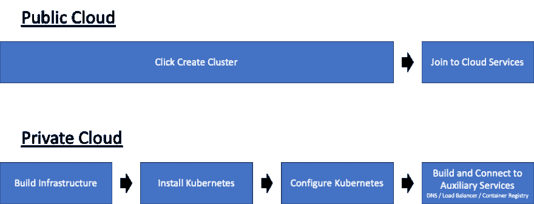
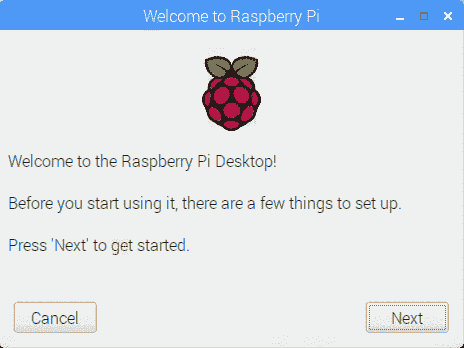
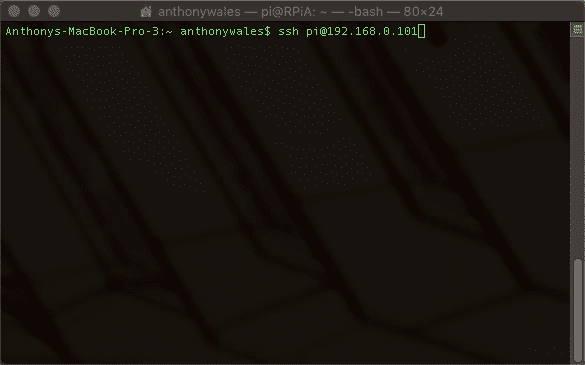
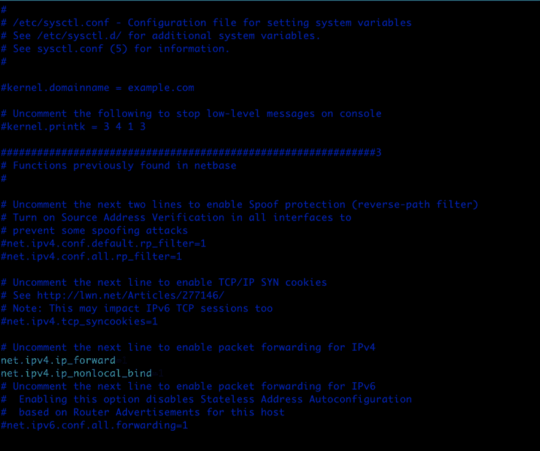
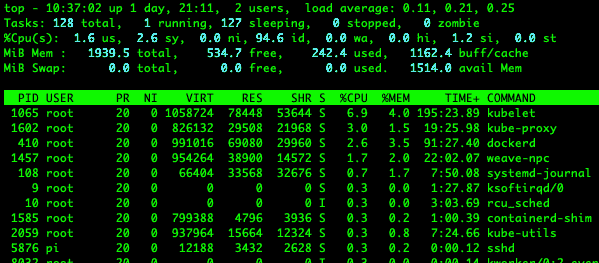
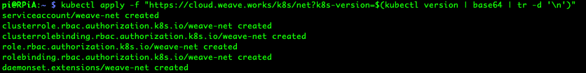
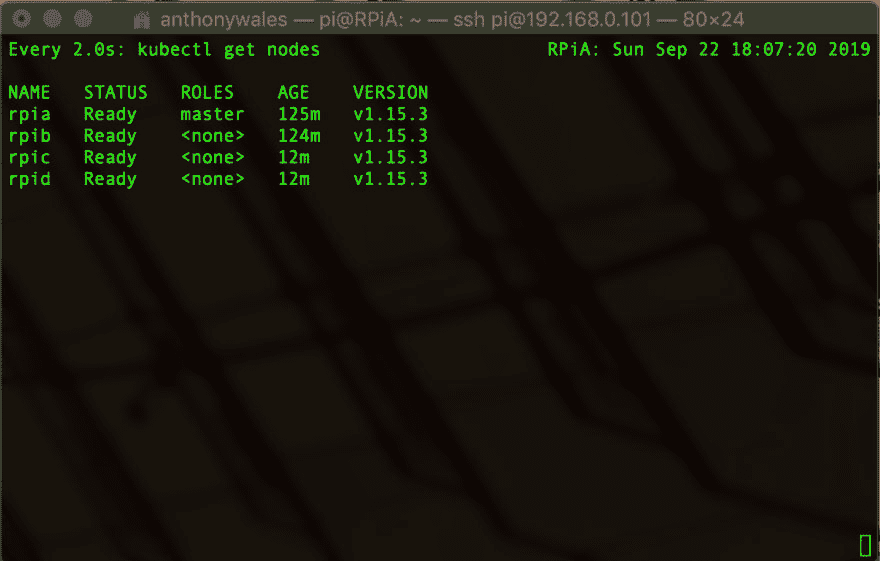
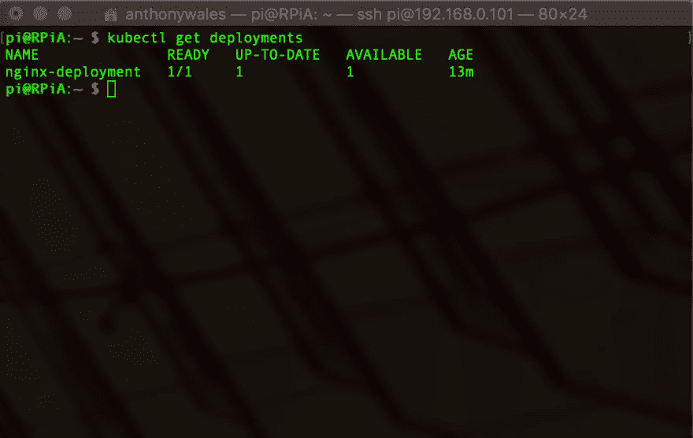
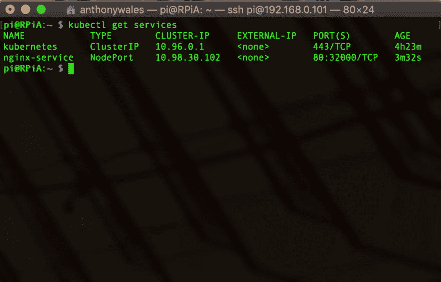
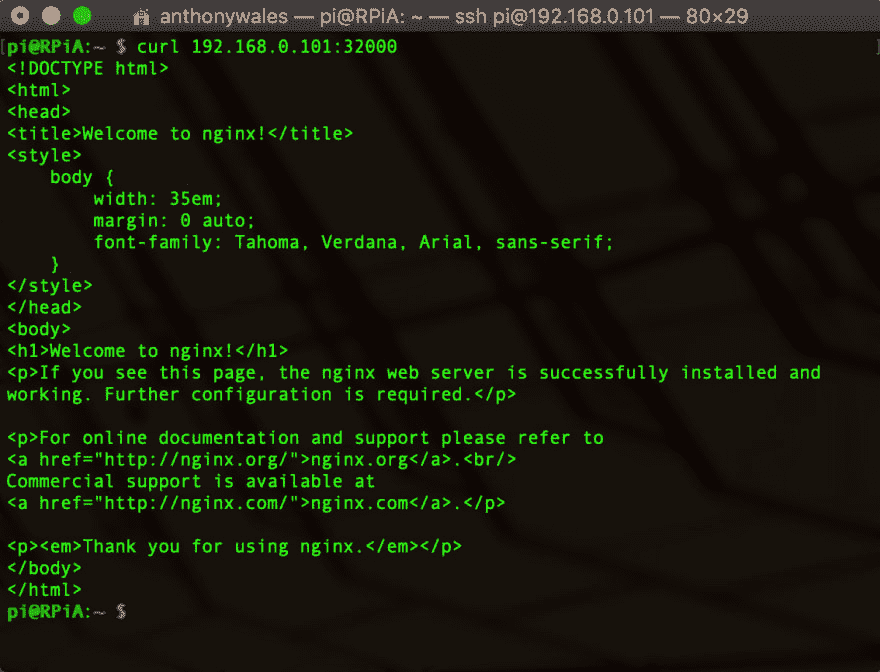

# Kubernetes (K8s)私有云与树莓 Pi 4s

> 原文：<https://dev.to/anton2079/kubernetes-k8s-private-cloud-with-raspberry-pi-4s-k0d>

在公共云提供商上部署 Kubernetes 集群很容易，但是如果您想要一个私有裸机部署呢？本演练将介绍我采取的步骤(以及为什么我们需要这样做)，以便在家中拥有一个私有的 Kubernetes 集群。

Kubernetes 使您能够灵活地将工作负载转移到最适合的地方。我听到的最常见的原因是:延迟、性能(特殊硬件要求)和安全性(监管或数据治理)。这是对混合云故事的补充，在我的职业生涯中，越来越明显的是，我的客户也看到了这一点，以帮助他们解决以下问题:成本、可用性和合规性。与此同时，软件供应商开始接受容器作为标准部署模型，导致最近对容器解决方案的需求增加。

正如您在下面的工作流比较中所看到的，在内部部署时出现错误的可能性更大。公共云提供了自动化并降低了出错风险，因为需要的步骤更少。但是如上所述，当您有独特需求时，私有云会为您提供更多选择。

<figure>

[](https://res.cloudinary.com/practicaldev/image/fetch/s--Crm-Ef9f--/c_limit%2Cf_auto%2Cfl_progressive%2Cq_auto%2Cw_880/https://i.imgur.com/nd7PEe4.png)

<figcaption>Workflow comparison for deploying Kubernetes on or off premises</figcaption>

</figure>

为了帮助人们理解内部 Kubernetes/Container 部署的一些缺陷和挑战，下面是帮助您构建自己的指南。

[](https://res.cloudinary.com/practicaldev/image/fetch/s--MbzZmvzl--/c_limit%2Cf_auto%2Cfl_progressive%2Cq_auto%2Cw_880/https://i.imgur.com/2OheyZE.png)

> “一朵你能触摸到的云！”

#### 你将需要什么

计算:

*   [4 个 Raspberry Pi 4 - 2GB RAM](https://www.raspberrypi.org/products/raspberry-pi-4-model-b/) *【建议使用 2GB+ RAM，因为我们部署的是 K8s 而不是 K3s】*

存储:

*   [4 个 32GB 高速沙盘微型 SD 卡](https://www.sandisk.com.au/home/memory-cards/microsd-cards/extreme-microsd)

网络:

*   [4 个树莓派 POE 帽子](https://www.raspberrypi.org/products/poe-hat/) *【如果不想给树莓派提供 USB 电源可选】*
*   1 个网络交换机*[仅当使用 Raspberry Pi POE HAT 时才需要 POE 功能]*
*   1 台网络路由器
*   5 根以太网电缆
*   1 个键盘、HDMI、鼠标(仅用于初始设置)

其他:

*   DNS 服务器*[如果您希望提供循环基础设施弹性，则为可选]*

# 走过

#### 初始树莓 Pi 配置

<figure>

*   Flash Raspbian
    参考树莓派基金会
    [的 Raspbian 安装指南 https://www . raspberrypi . org/documentation/Installation/installing-images/readme . MD](https://www.raspberrypi.org/documentation/installation/installing-images/README.md)
    简而言之:

    *   从上面的链接下载图片
    *   使用 balenaEtcha 将图像闪存到 micro-SD 卡上
*   在启动屏幕上执行初始设置(这需要连接键盘、显示器和鼠标)

    [](https://res.cloudinary.com/practicaldev/image/fetch/s--eG5ZNoEw--/c_limit%2Cf_auto%2Cfl_progressive%2Cq_66%2Cw_880/https://www.raspberrypi.org/app/uploads/2018/06/piwiz.gif)

<figcaption>Source: RaspberryPi.org</figcaption>

</figure>

*   选择国家、语言、时区
*   为用户“pi”定义新密码
*   如果使用以太网，请连接到 WiFi 或跳过
*   跳过更新软件(这导致我的 Raspberry Pi 挂起，不确定当前是否有 bug。我们稍后将手动执行此活动)。
*   选择稍后重新启动

    *   配置附加设置点击 Raspberry Pi 图标(屏幕左上角) >首选项> Raspberry Pi 配置
*   系统

    *   配置主机名
    *   引导:到 CLI
*   接口

    *   SSH:启用
*   选择稍后重新启动

    *   配置静态网络执行以下操作之一:
*   在 Raspberry Pi 上定义静态 IP:右键单击屏幕右上角的箭头图标，然后选择“无线和有线网络设置”

*   在 DHCP 服务器上定义静态 IP:配置您的 DHCP 服务器在 Raspberry Pi Mac 地址上定义一个静态 IP。

    *   重启并测试 SSH
*   用户名:pi

*   密码:在上面的步骤 2 中定义

*   在终端:`ssh pi@[IP Address]`

[](https://res.cloudinary.com/practicaldev/image/fetch/s--OQW9qOsx--/c_limit%2Cf_auto%2Cfl_progressive%2Cq_66%2Cw_880/https://i.imgur.com/k3aIf01.gif)

*   对所有的覆盆子酱重复上述步骤。

#### Kubernetes 集群准备(通过 SSH)

*   执行更新
    *   apt-get 更新:更新包索引
    *   apt-get 升级:执行升级

```
 sudo apt-get update
  sudo apt-get upgrade
  sudo reboot 
```

*   配置网络。IP4.IP 配置编辑`sudo vi /etc/sysctl.conf`，取消注释`net.ipv4.ip_forward = 1`，增加`net.ipv4.ip_nonlocal_bind=1`。
    *   注意:这是允许流量转发所必需的，例如从容器到/从非集群设备的节点端口。

[](https://res.cloudinary.com/practicaldev/image/fetch/s--9pth9u6f--/c_limit%2Cf_auto%2Cfl_progressive%2Cq_auto%2Cw_880/https://i.imgur.com/VD3DIgQ.png)T3】

```
sudo reboot 
```

*   安装 Docker

```
curl -sSL get.docker.com | sh && sudo usermod pi -aG docker 
```

*   禁用交换
    *   您可以在重启之前/之后使用`top`命令验证这一点，在左上角 MiB Swap 旁边应该是 0.0。

```
sudo systemctl disable dphys-swapfile.service
sudo reboot 
```

<figure>

[](https://res.cloudinary.com/practicaldev/image/fetch/s--GYEzBqh9--/c_limit%2Cf_auto%2Cfl_progressive%2Cq_auto%2Cw_880/https://i.imgur.com/YjJ4Ih4.png)

<figcaption>SSH Session Screen after `top` command</figcaption>

</figure>

*   安装库比涅斯
    *   目前强制使用以前的版本(1.15.3)，遇到了与最新版本(1.16)的兼容性问题。
    *   不应该有任何错误，但是在我安装期间，repos 关闭了，我不得不在几个小时后重试。

```
curl -s https://packages.cloud.google.com/apt/doc/apt-key.gpg | \
sudo apt-key add - && echo "deb http://apt.kubernetes.io/ kubernetes-xenial main" | \
sudo tee /etc/apt/sources.list.d/kubernetes.list && sudo apt-get update -q

sudo apt-get install -qy kubelet=1.15.3-00 kubectl=1.15.3-00 kubeadm=1.15.3-00 
```

*   对所有的覆盆子酱重复上述步骤。

#### Kubernetes 主节点配置

*注意:您只需要对主节点这样做(在这个部署中，我只推荐 1 个主节点)。每个树莓 Pi 都是一个节点。*

*   启动主节点

```
sudo kubeadm init 
```

*   启用到端口 8080 的连接
    *   没有这一点，Kubernetes 服务将无法工作

```
mkdir -p $HOME/.kube
sudo cp -i /etc/kubernetes/admin.conf $HOME/.kube/config
sudo chown $(id -u):$(id -g) $HOME/.kube/config 
```

*   添加容器网络接口(CNI)
    *   我选择了使用 Weaver，但是您也可以让其他人工作，如法兰绒(我已经验证了这个集群)

```
kubectl apply -f "https://cloud.weave.works/k8s/net?k8s-version=$(kubectl version | base64 | tr -d '\n')" 
```

[](https://res.cloudinary.com/practicaldev/image/fetch/s--ZxLMUSpz--/c_limit%2Cf_auto%2Cfl_progressive%2Cq_auto%2Cw_880/https://i.imgur.com/Ch4WCqZ.png)

*   获取加入命令
    *   这将在下一节中用于将工作节点加入集群。它将返回如下内容:`kubeadm join 192.168.0.101:6443 --token X.Y --discovery-token-ca-cert-hash sha256:XYZ`

```
kubeadm token create --print-join-command 
```

#### Kubernetes 工人节点配置

*注意:您只需要为工作节点这样做(在这个部署中，我推荐 3 个工作节点)。*

*   加入集群
    *   使用上一节末尾提供的 join 命令

```
sudo kubeadm join 192.168.0.101:6443 --token X.Y \
--discovery-token-ca-cert-hash sha256:XYZ 
#Example Only 
```

*   验证节点添加成功(主节点上的 SSH)
    *   大约 30 秒后，应处于就绪状态

```
kubectl get nodes 
```

[](https://res.cloudinary.com/practicaldev/image/fetch/s--Jfs1DXSV--/c_limit%2Cf_auto%2Cfl_progressive%2Cq_auto%2Cw_880/https://i.imgur.com/jEB2Nmv.png)

#### 首次部署和服务

*注意:我们将通过 SSH 在主节点上执行部署。下面是部署部署和服务的两种方式；使用 YAML 或单行命令。YAML 允许更简单的复杂操作，而单行命令可以用于简单的操作，但对于这个示例，结果是一样的。*

*   部署 NGINX(选项 A:简单)

```
kubectl create deployment nginx --image=nginx 
```

*   部署 NGINX(选项 B: YAML)
    *   `kubectl apply -f nginx.yaml`

```
#nginx.yaml
apiVersion: apps/v1
kind: Deployment
metadata:
  name: nginx-deployment
spec:
  selector:
    matchLabels:
      app: nginx
  template:
    metadata:
      labels:
        app: nginx
    spec:
      containers:
      - name: nginx
        image: nginx 
```

*   测试 NGINX

```
kubectl get deployments 
```

<figure>

[](https://res.cloudinary.com/practicaldev/image/fetch/s--CvMeRx6x--/c_limit%2Cf_auto%2Cfl_progressive%2Cq_auto%2Cw_880/https://i.imgur.com/nVN129E.png)

<figcaption>List of running deployments</figcaption>

</figure>

*   部署节点端口服务(选项 A:简单)

```
kubectl create service nodeport nginx --tcp=80:80 
```

*   部署节点端口服务(选项 B: YAML)
    *   `kubectl apply -f nginxservice.yaml`

```
#nginxservice.yaml
apiVersion: v1
kind: Service
metadata:
  name: nginx-service
spec:
  type: NodePort
  selector:
    app: nginx
  ports:
    - protocol: TCP
      port: 80
      nodePort: 32000 
```

*   测试节点端口服务

```
kubectl get services 
```

<figure>

[](https://res.cloudinary.com/practicaldev/image/fetch/s--DDRt22Cv--/c_limit%2Cf_auto%2Cfl_progressive%2Cq_auto%2Cw_880/https://i.imgur.com/FvTkpIn.png)

<figcaption>List of running services</figcaption>

</figure>

*   测试 Nginx(从您的笔记本电脑或任何连接到集群的设备)

```
curl [IP address of any node (RPi)]:[Port by the Node Port] 
```

<figure>

[](https://res.cloudinary.com/practicaldev/image/fetch/s--oXDKNhyP--/c_limit%2Cf_auto%2Cfl_progressive%2Cq_auto%2Cw_880/https://i.imgur.com/ejWZeBq.png)

<figcaption>Result of curl request.</figcaption>

</figure>

#### DNS 循环赛

作为负载均衡的一种形式，我选择使用 DNS A 记录 Round Robbin。

*   添加了共享主机名条目，并将其指向所有节点的 IP 地址。
    *   注意:CNI 创建一个 VXLAN 网络，允许所有主机通过定义的节点端口重定向到承载该容器的容器。

#### 吸取一些教训

*   需要沙坑进行测试
    *   如果在部署之前没有适当的测试，更新任何容器组件都可能失败。我在 Kubernetes v1.16 与 Weaver 的不兼容中看到了这一点(因此安装了 v1.15.3)。
*   辅助/支持服务需要额外的努力
    *   公共云提供现成的托管支持服务，如负载平衡、DNS、容器注册、用户身份验证等。
*   需要额外的工作
    *   不仅仅是一键式部署，根据基础架构的不同，可能需要不同的解决方案。