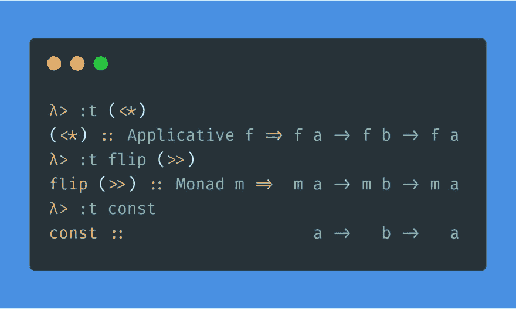

# 提升常数

> 原文：<https://dev.to/gillchristian/lifting-const-1a3l>

昨天我分享了这个要点:

> c . gill[@ gill Christian](https://dev.to/gillchristian)[# 100 days offp](https://twitter.com/hashtag/100DaysOfFP)Day 23
> 
> 关于 Haskell 和 FP，有一点我觉得很有趣，一般来说，简单的模式会随着复杂性的增加而不断重复。
> 
> Applicative 和 Monad 中的序列运算符是“const”的“提升”版本。2019 年 9 月 22 日 21 点 05 分[](https://twitter.com/intent/tweet?in_reply_to=1175878924926095360)[](https://twitter.com/intent/retweet?tweet_id=1175878924926095360)0[](https://twitter.com/intent/like?tweet_id=1175878924926095360)4

今天，我计划根据我的一些假设，对它进行扩展。

> c . gill[@ gill Christian](https://dev.to/gillchristian)[@ RiccardoOdone](https://twitter.com/RiccardoOdone)我在[haskellbook.com](https://t.co/mNExBPnpsF)看到的😏
> 
> 如果你 liftA2 const，签名是一样的，但是我不会表现为(< *)和(> >)虽然，我今天会指出这一点。2019 年 9 月 23 日下午 13:28[](https://twitter.com/intent/tweet?in_reply_to=1176126201234169860)[](https://twitter.com/intent/retweet?tweet_id=1176126201234169860)0[](https://twitter.com/intent/like?tweet_id=1176126201234169860)0

通过在 GHCi 中的试验，我发现我的假设是错误的。

[](https://res.cloudinary.com/practicaldev/image/fetch/s--o621tdYE--/c_limit%2Cf_auto%2Cfl_progressive%2Cq_auto%2Cw_880/https://thepracticaldev.s3.amazonaws.com/i/4xth2mphqqvkptf1eir7.jpg)

所以我做了一些调查，我说的调查是指[在 Hackage 中查找](https://hoogle.haskell.org)函数并检查它们的源代码，以了解原因。

我发现了一些有趣的事情。

让我们再检查一下操作器`(<*)`是如何工作的。

```
(<*) :: Applicative f => f a -> f b -> f a 
```

正如 Haskell 一贯的做法，签名说明了很多问题。看起来它接受两个应用程序并返回第一个。

```
Just 1 <* Just 2 -- Just 1 
```

是的，没错。但是还有更多...

它不仅返回区分第二个的第一个。相反，它“运行”两者并返回第一个。我们怎么知道它“运行”两者呢？因为这种适用的语义(在这种情况下可能)是*尊重* :

```
Nothing <* Just 1  -- Nothing
Just 1  <* Nothing -- Nothing 
```

而这就是与`const`的区别。

```
Just 1  `const` Just 2  -- Just 1
Just 1  `const` Nothing -- Just 1
Nothing `const` Just 1  -- Nothing 
```

当我说`(<*)`是`const`的“提升”版本时，我不是指在 Haskell 意义上的*提升*，我是指在应用程序的上下文中使用的*提升*。我想这就是*抬起*的意思，所以让我们再试一次。我的意思是签名是“相同的”,但是在可应用的上下文中(相同的语义，总是返回第一个参数并区分第二个)。

原来，`(<*)`实际上是`const`的“提升”版本(在 Haskell 意义上)。哦，这正是在`base`的实现。

<figure>

```
class Functor f => Applicative f where
    -- ...

    -- | Sequence actions, discarding the value of the second argument.
    (<*) :: f a -> f b -> f a
    (<*) = liftA2 const 
```

<figcaption>[See source in Hackage](https://hackage.haskell.org/package/base-4.12.0.0/docs/src/GHC.Base.html#%3C%2A)</figcaption>

</figure>

我错在哪里？🤔

我假设如果你*举起* `const`，它仍然会表现得像一个好的常量。

```
constA = liftA2 const

Just 1  `constA` Just 2  -- Just 1
Just 1  `constA` Nothing -- Just 1
Nothing `constA` Just 1  -- Nothing 
```

正如我们已经看到的，事实并非如此。正如我所说的,*尊重*应用程序的语义。

```
constA = liftA2 const

Just 1  `constA` Just 2  -- Just 1
Just 1  `constA` Nothing -- Nothing
Nothing `constA` Just 1  -- Nothing 
```

因为这就是`liftA2`的全部意义。

*未完待续(更深入地了解`liftA2`)。

*P.S .耶我用了一个“举”🏋️图片在一个关于举重的帖子里。抱歉。*