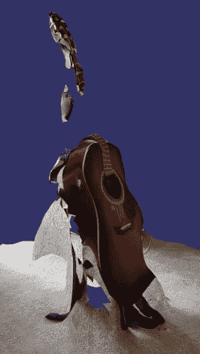
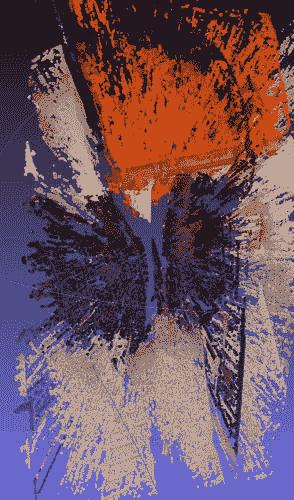
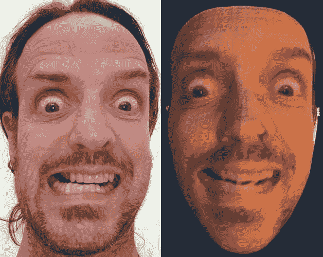
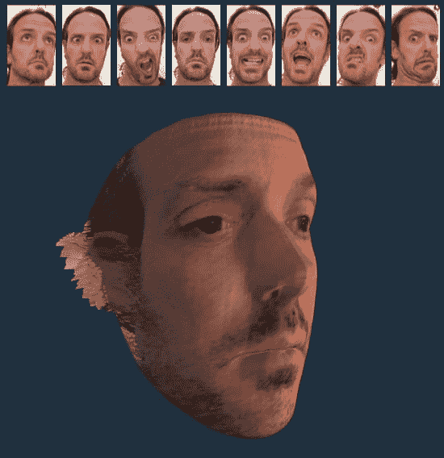

# 面关:三(。js)

> 原文:[https://dev.to/mlennox/face-off-three-js-1olj](https://dev.to/mlennox/face-off-three-js-1olj)

这是来自 https://www.webpusher.ie/2019/09/23/face-off 的传中

我一直对涉及大量照片的[摄影测量](https://en.wikipedia.org/wiki/Photogrammetry)感兴趣，但是最少需要多少张照片呢？事实证明你只需要一张照片。

在本文中，我将快速浏览如何从照片生成 3d 网格，然后使用 [netlify](https://www.netlify.com/) 发布一个基于 [threejs](https://threejs.org/) 的模型查看器来查看最终结果。目前该过程完全是手动的！

## [](#how-to-create-a-3d-mesh)如何创建 3d 网格？

在对移动摄影测量应用进行了一些失败的实验后，我认为很容易捕捉许多照片太难了。

[T2】](https://res.cloudinary.com/practicaldev/image/fetch/s--m9EC0zhQ--/c_limit%2Cf_auto%2Cfl_progressive%2Cq_auto%2Cw_880/https://thepracticaldev.s3.amazonaws.com/i/uk3zzias690uulh7tis4.png)

### [](#opencv)OpenCV

然后我尝试了 OpenCV 立体 SGBM，它使用立体照片，比较差异，使用几何学和一些先进的技术来估计深度图，然后用原始图像着色。

当使用示例照片时，这是非常有希望的，但是尽管在这上面花了很多时间，我发现甚至不可能得到勉强合格的结果。下图显示了放在橙色书上的耳机——这是观看它的最佳角度！

[T2】](https://res.cloudinary.com/practicaldev/image/fetch/s--LIu4dNAJ--/c_limit%2Cf_auto%2Cfl_progressive%2Cq_auto%2Cw_880/https://thepracticaldev.s3.amazonaws.com/i/haa4cc7dg7yi5a2tiv8s.png)

这肯定是我会回来的事情。我当时没有尝试，但是[有一个工具可以帮助调整参数](https://github.com/hitimo/opencv-disparity-map-tuner)。另一个缺点是构建 OpenCV 是一个艰巨的过程。

### [](#machine-learning-to-the-rescue)机器学习来救援了！

我用流行的 PRNet CNN(卷积神经网络)生成了一个金属丝网，马上就成功了！

[T2】](https://res.cloudinary.com/practicaldev/image/fetch/s--l1FyJBeG--/c_limit%2Cf_auto%2Cfl_progressive%2Cq_auto%2Cw_880/https://thepracticaldev.s3.amazonaws.com/i/b7r8hn25k2iz0d89s3ow.png)

这个过程是如何运作的，有一个简单易懂的解释。

### [](#is-this-a-fake)这是假货吗？

更像是深沉的假！

PRNet 被训练生成一个 [UV 贴图](https://en.wikipedia.org/wiki/UV_mapping)，它对 3d 物体的体积和形状进行编码。从这个 UV 贴图中可以生成三个重要的元素

*   稀疏特征点预测-眉毛、眼睛、鼻子、嘴、嘴唇和下巴
*   密集特征点预测
*   完整的三维网格模型，颜色来自输入图像。

### [](#show-me-the-code)给我看看代码！

这不仅仅是一篇学术论文[还有完整的工作示例代码](https://github.com/YadiraF/PRNet)

让它运行起来需要一点工作，我推荐使用我在上一篇文章中的 [Pyenv 配置建议。](https://www.webpusher.ie/2018/09/19/python-dependency-hell-no)

我坚持使用 Python 2.7 的要求，所以我没有研究更高版本的 Python 是否能工作。如果您确实升级了 Python 版本，请注意，截至 2019 年 9 月发布时，TensorFlow 的依赖项将 Python 限制为 3.6 版本。

```
$ pyenv virtualenv 2.7.14 prnet
$ pyenv local prnet 
```

你还需要安装`dlib`。

```
$ pip install --upgrade dlib 
```

我建议在安装项目依赖项
之前，将`pip`和`setuptools`升级到最新版本

```
$ pip install --upgrade pip setuptools 
```

现在您可以安装依赖项

```
$ pip install -r requirements.txt 
```

### [](#generating-the-mesh)生成网格

你需要在一个已知的目录下保存一些图片。一旦你有了，简单地运行:

```
$ python demo.py -i {the directory holding images with faces} -o {output directory for the obj files} 
```

您可能会看到许多警告(我看到过)，这些警告可能会通过升级您的 Python 版本而减少或删除，但我直到项目的后期才会这么做！

在您的输出文件夹中，您应该会看到您提供的每个图像的一个`.obj`文件。注意，每张图片你只能看到一张脸，没有自动支持多张脸的功能。

## [](#viewing-the-output)查看输出

我使用免费的和有能力的 MeshLab 立即打开并查看模型-我嘲笑我愚蠢的脸在我面前旋转！

尽管这不是我的神秘副业项目的目标，我想利用我的网络开发技能把这个放到网上让所有人都看到——每个人都应该嘲笑我愚蠢的旋转脸！

### Threejs 和 Netlify 来救援了！

我使用 Netlify 来发布我的基于盖茨比的博客，所以我知道它将承担部署我的新 3d 怪物画廊的重任。

我不想在捆绑“应用程序”上浪费时间，所以我只写了一个小小的 shell 脚本来将`threejs`库和相关的支持代码从`node_modules`目录复制到`src`文件夹，在那里我可以将它导入到我的 es6 模块中。

我使用的网络构建设置是:

*   存储处:github.com/mlennox/three-dee-mee
*   基本目录:未设置
*   构建命令:sh prepare.sh
*   发布目录:src

完整的工作代码在 github 上，实际的工作演示可以在 https://thirsty-hypatia-f27848.netlify.com/的 T2 找到，看起来是这样的(初始化可能需要几秒钟)

[T2】](https://res.cloudinary.com/practicaldev/image/fetch/s--gmqHWcHZ--/c_limit%2Cf_auto%2Cfl_progressive%2Cq_auto%2Cw_880/https://thepracticaldev.s3.amazonaws.com/i/c06awtku2bwcsa1u17yp.png)

只需点击缩略图行中的 gurning 面容即可加载相关的三维网格，您可以通过点击、拖动和滚动缩放来控制可怕的面容。