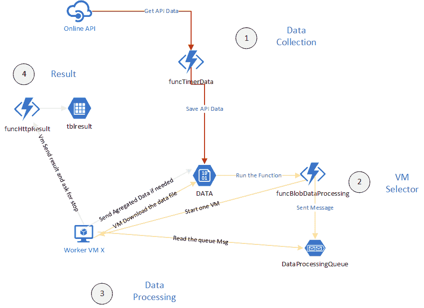

# 使用 PowerShell 核心和 Azure 功能的虚拟机编排

> 原文：<https://dev.to/omiossec/vm-orchestration-using-powershell-core-and-azure-functions-2faa>

想象一下这样一种情况，您需要从外部源下载数据，并对其进行复杂的计算和聚合。你事先不知道你将拥有的数据量和一天中的时间表，更多的计算和聚合过程是单线程的。

在内部，为了处理这种情况，您可能需要放置几台计算机来执行计算和聚合，一台或多台计算机来收集数据，至少一台 orchestrator 计算机来协调所有服务器之间的流。

在 Azure 中，你有几个选择。你可以使用 Azure Batch，你可以使用 Azure Service Fabric，但是你也可以使用 Azure Function 来编排这种流。

看看这个设置:

*   一个 Azure 函数收集数据并将它们发送到 blob 容器

*   用于执行计算的虚拟机池

*   一个 Azure 函数来启动一个 VM，并向它发送一条消息来收集要处理的文件。

*   一个 Azure 函数来收集结果

*   Azure 存储队列，用于在池中的函数和计算机之间进行通信

这种设置的目标之一是避免在没有工作要做时让计算机在线，并构建一个可靠的解决方案。

四个部分是必须的。

**数据收集部分**

收集数据并将它们放入 Azure Storage blob 容器中。

**虚拟机选择器部分**

在存储队列中创建消息，并检查是否有未启动的 VM 来启动它。如果池中的所有虚拟机都已经在工作，只需将消息添加到负载最少的虚拟机中。

**数据处理部分**

在机器启动时，它检查队列中的消息，获取第一条消息，将文件从 blob 容器复制到本地路径，删除队列中的消息，并开始处理数据。

如果它需要另一个动作，它可以将转换后的文件发送到同一个 blob 容器，这样它就可以重新进入循环。

在所有的动作之后，VM 发送一个信号来指示处理数据的过程已经完成，可以停止了。

**结果处理部分**

将结果发送到存储表并停止虚拟机。

[](https://res.cloudinary.com/practicaldev/image/fetch/s--uFZHFAsF--/c_limit%2Cf_auto%2Cfl_progressive%2Cq_auto%2Cw_880/https://thepracticaldev.s3.amazonaws.com/i/lt7niog0hi6unxg7sf63.png)

请注意，这是我制作的概念证明的简化版本。

我们需要什么？

*   一个 Timer Azure 函数，用于收集和标记数据并将文件移动到 blob 容器中， **funcTimerData**

*   一个 Blob Azure 函数，它响应每个新的 Blob，分配一个 VM，启动它，并在队列中放置一条消息，带有动作名、VM 名和文件名。 **funcBlobDataProcessing**

*   一个 HTTP Azure 函数来响应 VM 请求，funcHttpVMStop，它必须停止 VM 并将结果的名称写入一个表中，最后删除原始文件。**功能压力**

对于模块的使用，函数名有一个命名约定是最佳实践的一部分。在某些情况下，同一代码可能需要由多个事件触发。你需要清楚地识别函数(把触发器名放在函数名里)和共享代码执行(用一个模块)。

对于我们需要的存储:

*   用于存储数据文件、数据

*   存储日志的表，tbllog

*   存储虚拟机列表的表

*   存储结果文件列表的表 tblresult

*   funcBlobDataProcessing 和 VM、QueueProcessing 之间的消息队列

我们还需要:

例如，一组名为 vm01 到 vm10 的虚拟机。

虚拟机上的脚本或软件，用于从队列中收集数据、复制文件和使用数据。如果本地文件夹中没有数据，队列中也没有消息，WM 需要请求关闭。

由于我们需要在功能之间共享一些代码，我们需要一个模块，这个模块将存储业务逻辑和 Azure 函数将作为一个接口。

Azure Functions 应用中的模块是自动加载的，可用于所有功能。你只需要在功能应用程序的模块文件夹中添加模块。

让我们从创建存储表、队列和 blob 容器开始。

```
# Get the Storage account name from the Az Functions App  $RessourceGroup  =  "devtoServerless201909"  $FunctionAppName  =  "devtoServerless201909"  $functionapp  =  Get-AzWebApp  -ResourceGroupName  $RessourceGroup  -Name  $FunctionAppName  $FunctionStorageConfigString  =  ($functionapp.SiteConfig.AppSettings  |  where-object  name  -eq  "AzureWebJobsStorage").Value  $FunctionStorageConfigHash  =  ConvertFrom-StringData  -StringData  $FunctionStorageConfigString.Replace(";","`r`n")  # Get the Storage account object  $storageAccountObject  =  Get-AzStorageAccount  -ResourceGroupName  $RessourceGroup  -Name  $FunctionStorageConfigHash.AccountName  # Create Containers, queues and tables  New-AzStorageContainer  -context  $storageAccountObject.Context  -Permission  Off  -name  "data "  New-AzStorageQueue  -context  $storageAccountObject.Context  -name  "queueprocessing"  "tbllog tblvm tblresults".split()  |  New-AzStorageTable  -context  $storageAccountObject.Context 
```

Enter fullscreen mode Exit fullscreen mode

现在让我们从第一个函数 funcTimerData 开始。这是一个定时器功能。该函数只需要一个输出来创建从 API 收集的文件。

```
{  "bindings":  [  {  "name":  "Timer",  "type":  "timerTrigger",  "direction":  "in",  "schedule":  "0 * */10 * * *"  },  {  "type":  "blob",  "name":  "DataOut",  "path":  "data/{rand-guid}.json",  "connection":  "AzureWebJobsStorage",  "direction":  "out"  }  ],  "disabled":  false  } 
```

Enter fullscreen mode Exit fullscreen mode

要将数据写入 blob 容器，我们只需使用 Push-OutputBinding

```
Push-OutputBinding  -Name  DataOut  -Value  $SomeJsonValue 
```

Enter fullscreen mode Exit fullscreen mode

正如您在绑定配置中看到的，该函数将在容器数据中用随机名称创建文件。

第二个功能是更复杂。我们需要在 blob 容器中检索新创建文件的名称，从 tblvm 表中获取 vm 列表，我们还需要查询 VM 状态并启动一个，最后，我们需要在 QueueProcessing 队列中创建一条消息。

function.json 文件是这样的

```
{  "bindings":  [  {  "name":  "Dataforprocessing",  "type":  "blobTrigger",  "direction":  "in",  "path":  "data/{name}",  "connection":  "AzureWebJobsStorage"  },  {  "type":  "table",  "name":  "vmtable",  "tableName":  "tblvm",  "partitionKey":  "vmlist",  "take":  50,  "connection":  "AzureWebJobsStorage",  "direction":  "in"  },  {  "type":  "queue",  "name":  "OutputMessageToVm",  "queueName":  "queueprocessing",  "connection":  "AzureWebJobsStorage",  "direction":  "out"  },  {  "type":  "table",  "name":  "logtable",  "tableName":  "tbllog",  "connection":  "AzureWebJobsStorage",  "direction":  "out"  }  ],  "disabled":  false  } 
```

Enter fullscreen mode Exit fullscreen mode

在函数级别，我们需要文件名，但不需要读取数据。要获得文件名，我们需要使用 TriggerMetadata 参数变量。

为了访问 VM 表，我们需要在参数部分引用表绑定。

我们需要添加触发器绑定的名称作为参数之一。没有该功能会产生错误。

你可以注意到我使用了默认的字节数组。我知道我所期望的类型，这不是一个义务，所以可以使用字符串对象来代替。函数运行时会将内容作为值发送给变量。如果你打算使用二进制数据或混合类型，你需要使用字节数组

```
param([byte[]]  $Dataforprocessing,  $TriggerMetadata,  $vmtable) 
```

Enter fullscreen mode Exit fullscreen mode

获取文件名

```
$DataFileName  =  $TriggerMetadata.Name 
```

Enter fullscreen mode Exit fullscreen mode

表绑定的名称作为函数的参数被引用。vmTable 变量包含一个哈希表数组。

由于我们知道表的表结构，我们可以像这样通过名字得到属性

```
foreach  ($vm  in  $vmtable)  {  $vm.vmName  } 
```

Enter fullscreen mode Exit fullscreen mode

当我们需要与其他 Azure 资源交互时，我们需要一个身份。Azure 函数为托管系统身份提供了一种机制。通过在部署期间或之后激活它，它会在 Azure AD 中创建一种特殊类型的服务主体(托管身份),用作 RBAC 资源中的角色。

对于虚拟机，您可以使用虚拟机贡献者角色(在生产环境中，您需要应用最少的权限，Microsoft。微软计算/虚拟机器/阅读。计算/虚拟机器/重启/操作，微软。compute/virtual machines/deallocate/action)来释放和启动 VM。

要启动 VM，我们可以使用带有–nowait 开关的 start-azvm。

我们还需要为 VM 创建一个消息队列。该消息需要包含所选虚拟机的名称和系统要使用的文件名。

```
$QueueMessage  =  @{"vmName"=$SelectedVM;  "FileName"=$TriggerMetadata.Name  }  |  convertTo-json  Push-OutputBinding  -Name  OutputMessageToVm  -Value  $QueueMessage 
```

Enter fullscreen mode Exit fullscreen mode

现在，我们如何从虚拟机获取消息？所有虚拟机只有一个队列。我们该如何处理这个独特的队列呢？

首先，我们需要使用 Get-AzStorageQueue 创建一个 AzureStorageQueue 对象。

这个对象包含一个名为 CloudQueue 的属性，我们需要用它来访问队列消息。该对象包含几个处理队列消息的方法。

主要的问题是，当你读取队列中的一条消息时，这条消息被从队列中删除，这是 GetMessage 方法的行为。希望有一种方法可以读取消息而不删除它们，GetMessageAsync。此方法将 timespan 对象作为参数。让消息对其他进程不可见需要很长时间。之后，就可以阅读消息了。

通过这种方法，我们可以读取消息并搜索虚拟机名称。

```
$invisibleTimeout  =  [System.TimeSpan]::FromSeconds(2)  while  ($true){  $message  =  $queueObject.CloudQueue.GetMessageAsync($invisibleTimeout,$null,$null)  $qmsgHash  =  $message.Result.AsString  |  ConvertFrom-Json  -ErrorAction  SilentlyContinue  if  ($qmsgHash.Vmname  -eq  "vm02")  {  write-host  $qmsgHash.filename  $queueObject.CloudQueue.DeleteMessageAsync($message.Result.Id,$message.Result.popReceipt)  break  }elseif  ($null  -eq  $message.Result  ){  break  }  } 
```

Enter fullscreen mode Exit fullscreen mode

最后，我们需要实现一个日志系统。我们已经在函数应用程序存储帐户 tbllog 中设置了一个表。

Azure 存储表不像 Oracle、SQL Server 或 MySql 中的关系表。这是一个简单的 NoSql 表。

为了从我们的 Azure 存储表创建一个新行，需要一个散列表。哈希表中必须有 2 个元素，PartitonKey 和 RowKey，以及数据。

```
$LogEntry  =  @{  partitionKey  =  'Vmselector'  rowKey  =  (new-guid).guid  VmName  =  $SelectedVM  FileName  =  $TriggerMetadata.Name  }  Push-OutputBinding  -Name  logtable  -Value  $LogEntry 
```

Enter fullscreen mode Exit fullscreen mode

您可以注意到，在一个函数中可以有多个 Push-OutputBinding。但是如果你在函数中添加了一个 return，函数会在这个点退出，return 之后的东西不会被执行。

funcHttpVMStop 函数是最后一个函数。VM 需要发送一个信号，表明他们已经完成了对文件的处理。文件名将是函数的参数之一。

默认情况下，HTTP 功能对所有人开放。这是一个公共 URI。我们需要注意安全性，毕竟，函数的目的是关闭和释放一个虚拟机。我们需要确保请求是合法的，并且来自我们的系统。

为了实现我们的目标，我们可以测试 HTTP 客户端的 IP 是否是我们的池中的一个虚拟机的 IP。因此，我们需要向函数添加另一个参数，VmName。

我们还可以通过检查虚拟机列表来检查虚拟机名称是否存在于我们的虚拟机池中，我们需要导入虚拟机列表表。

我们需要将 HTTP 动词限制为只允许 GET。

```
{  "bindings":  [  {  "authLevel":  "function",  "type":  "httpTrigger",  "direction":  "in",  "name":  "Request",  "methods":  [  "get"  ]  },  {  "type":  "http",  "direction":  "out",  "name":  "Response"  },  {  "type":  "table",  "name":  "vmtable",  "tableName":  "tblvm",  "partitionKey":  "vmlist",  "take":  50,  "connection":  "AzureWebJobsStorage",  "direction":  "in"  },  {  "type":  "table",  "name":  "restulttable",  "tableName":  "tblresult",  "connection":  "AzureWebJobsStorage",  "direction":  "out"  }  ],  "disabled":  false  } 
```

Enter fullscreen mode Exit fullscreen mode

我们需要导入 system.net 名称空间

```
using  namespace  System.Net 
```

Enter fullscreen mode Exit fullscreen mode

param 节需要引用 Http 和 param 节中的表绑定

```
param($Request,  $vmtable) 
```

Enter fullscreen mode Exit fullscreen mode

现在如何测试虚拟机是否在我们的列表中

```
param($Request,  $vmtable) 
```

Enter fullscreen mode Exit fullscreen mode

现在如何测试虚拟机是否在我们的列表中

```
if  ($Request.query.vmName  -in  $vmtable.vmname)  {  $RessourcePib  =  Get-AzResource  -ResourceId  (Get-AzNetworkInterface  -ResourceId  (get-azvm  -Name  $request.Query.Vmname).NetworkProfile.NetworkInterfaces.id).IpConfigurations.PublicIpAddress.id  $VmSupposedId  =  (Get-AzPublicIpAddress  -Name  $RessourcePib.Name  -ResourceGroupName  $RessourcePib.ResourceGroupName).IpAddress  if  ($request.Headers.client-ip.split(":")[0]  -eq  $VmSupposedId)  {  $status  =  [HttpStatusCode]::OK  $body  =  $Request  }else  {  $status  =  [HttpStatusCode]::InternalServerError  $Body  =  "not valid IP"  }  }  else  {  $status  =  [HttpStatusCode]::InternalServerError  $body  =  "$Body = "not  valid  Vm  name"   
} 
```

Enter fullscreen mode Exit fullscreen mode

注意，我需要使用$request。headers . client-IP . split(":)[0]而不是头的值$request。Headers.client-ip 这是因为 Azure 函数使用客户端 TCP 端口引用客户端 IP 地址。

为了让它工作，我们需要为 http 输出绑定创建一个 HttpResponseContext 对象。这个对象需要有一个 statuscode，HttpStatusCode 对象和一个 body(如果不是 HTTP 200，Ok 代码的话是可选的)。

```
[HttpResponseContext]  $ReturnObject  =  [HttpResponseContext]  @{  StatusCode  =  $status  Body  =  $body  }  Push-OutputBinding  -Name  Response  -Value  $ReturnObject 
```

Enter fullscreen mode Exit fullscreen mode

我们还需要记录结果，VM 发送 HTTP GET 请求，以 VmName 和 FileName 作为参数。

要记录文件名，我们需要使用＄request . query . FileName。我们需要添加动作的日期时间和记录的 VM。

我们需要用 partitionKey、result 和 rowkey 构造一个哈希表。正如我们在第二个函数中所做的那样。

```
$ResultEntry  =  @{  partitionKey  =  'result’  
    rowKey = (new-guid).guid   
    VmName = $SelectedVM 
    FileName = $TriggerMetadata.Name 
    DateTime = get-date -Format FileDateTime 
}   

Push-OutputBinding -Name  restulttable -Value $ResultEntry 
```

Enter fullscreen mode Exit fullscreen mode

这个设置只是说明了在 Azure 中如何编排复杂的工作流。真正的解决方案要复杂得多。但是你可以在这里找到一些我在项目中应用的最佳实践。

其中比较突出的一个总是为函数名建立一个命名约定。另一个主要的建议是，使用模块，因为在项目中跨功能测试和共享更容易。最后，使功能尽可能简单，毫不犹豫地将复杂的操作分解成小功能。

你可以在 Github 上关注我，我在 Azure Function 上做了一个自动化一些任务的模块。