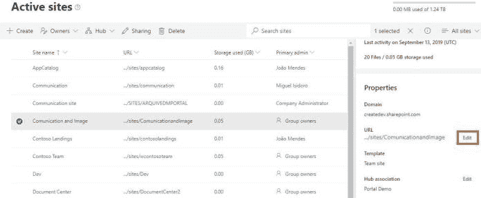

# 如何在 Office 365 中重命名现代 SharePoint 网站 URL

> 原文：<https://dev.to/mlisidoro/how-to-rename-a-modern-sharepoint-site-url-in-office-365-595d>

帖子[如何在 Office 365 中重命名现代 SharePoint 网站 URL](https://blogit.create.pt/miguelisidoro/2019/09/23/how-to-rename-a-modern-sharepoint-site-url-in-office-365/)最先出现在[博客 IT](https://blogit.create.pt) 上。

这篇文章解释了如何在 Office 365 中重命名现代 SharePoint 网站 URL。

## 简介

通过 [UserVoice](https://sharepoint.uservoice.com/forums/329214-sites-and-collaboration/suggestions/13217277-enable-renaming-the-site-collection-urls) 和 [SharePoint Conference 2019](https://dev.to/mlisidoro/what-s-new-for-sharepoint-and-office-365-from-sharepoint-conference-2019-part-2-o5g) ，网站 URL 重命名一直是最受欢迎的请求之一，在该活动的一个我最喜欢的公告中，微软终于宣布了重命名网站 URL 的可能性。

这可以使用 SharePoint 管理中心或 PowerShell 脚本来完成。

## 工作原理

### 使用 SharePoint 管理中心

重命名网站 URL 的最简单方法是使用 SharePoint 管理中心。选择“活动站点”，然后选择要重命名的站点，并单击“编辑”。

 

<figcaption>使用 SharePoint 管理中心重命名网站 URL</figcaption>

将会出现一个弹出窗口，你唯一要做的就是写下新的 URL，并确保新的 URL 没有被使用。

 

<figcaption>为 SharePoint 站点设置新的 URL</figcaption>

要阅读整篇文章，请点击[这里](https://blogit.create.pt/miguelisidoro/2019/09/23/how-to-rename-a-modern-sharepoint-site-url-in-office-365/)。

分享快乐！

帖子[如何在 Office 365 中重命名现代 SharePoint 网站 URL](https://blogit.create.pt/miguelisidoro/2019/09/23/how-to-rename-a-modern-sharepoint-site-url-in-office-365/)最先出现在[博客 IT](https://blogit.create.pt) 上。