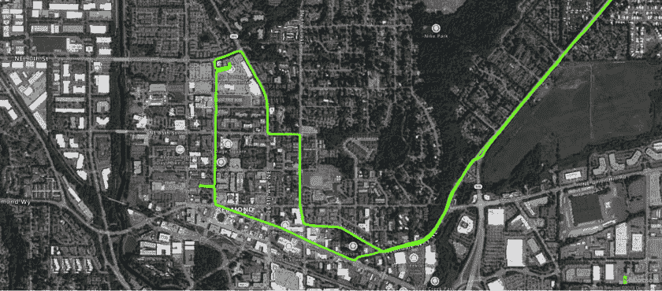
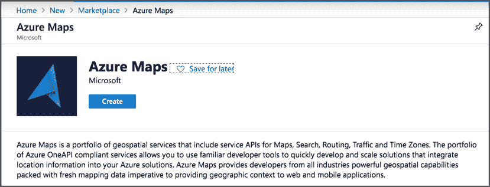
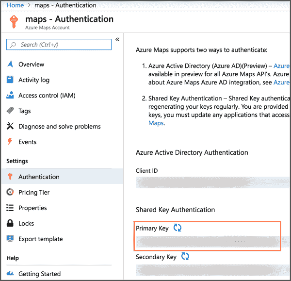
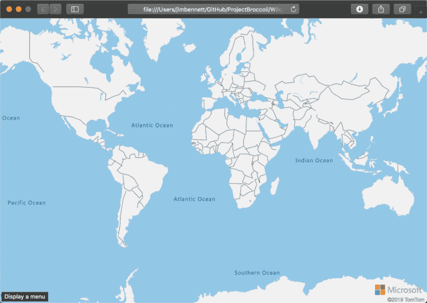
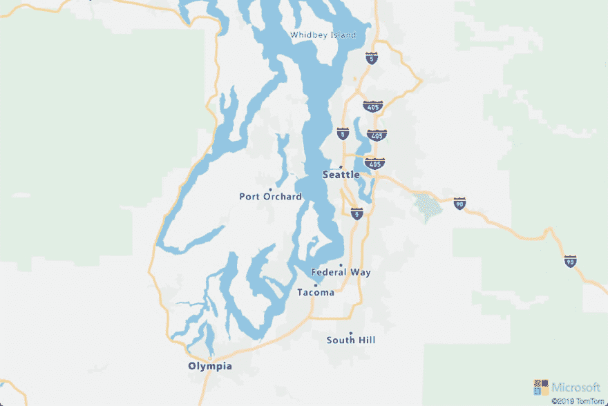
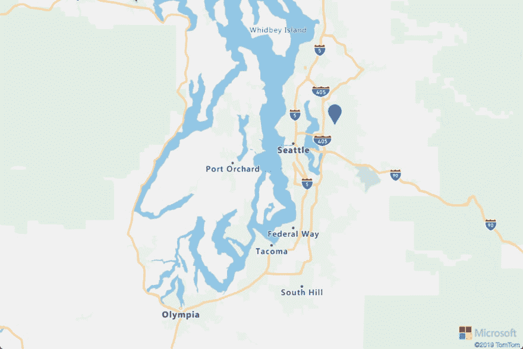
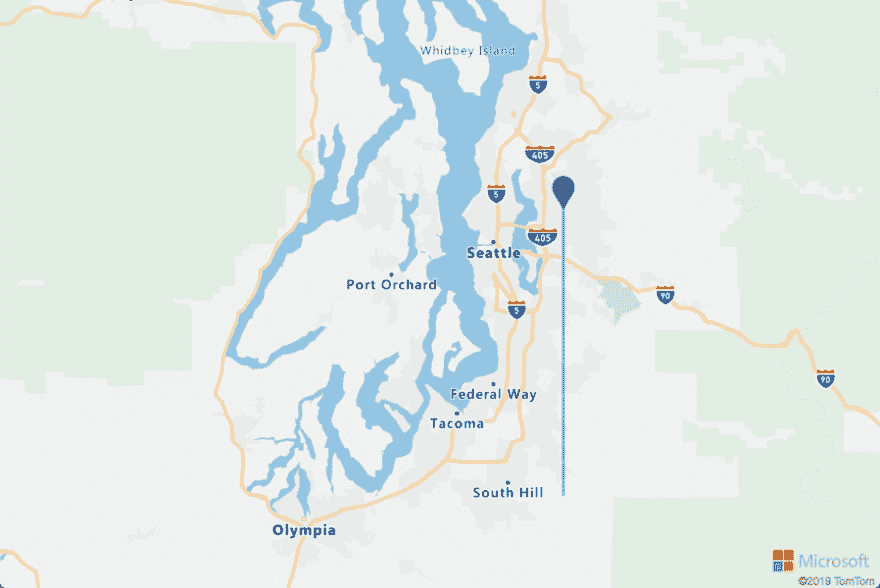
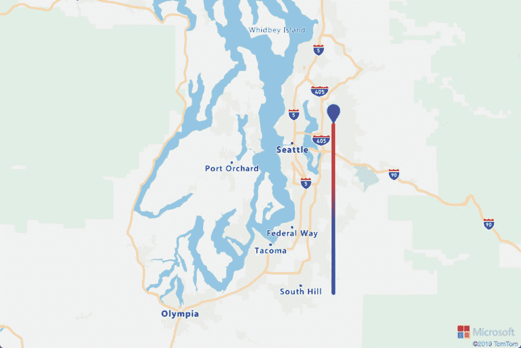

# 使用 Azure Maps 可视化地图上的位置和路径

> 原文:[https://dev . to/azure/visualizing-locations-and-path-on-a-map-with-azure-maps-906](https://dev.to/azure/visualizing-locations-and-paths-on-a-map-with-azure-maps-906)

喜欢/不喜欢这个帖子？想要更多 Azure 内容？在 [Twitter](https://twitter.com/jimbobbennett) 上关注我。

从在网页上显示地图，到检查地理围栏，再到路线和交通数据，Azure Maps 是向您的应用程序添加地理空间功能的绝佳方式。你可以在官方文档中阅读更多关于 Azure 地图的信息。

这篇文章包括:

*   在网页上显示 Azure Maps 控件
*   向地图添加大头针以显示位置
*   向地图添加路径

[T2】](https://res.cloudinary.com/practicaldev/image/fetch/s--EYegeXtv--/c_limit%2Cf_auto%2Cfl_progressive%2Cq_auto%2Cw_880/https://www.jimbobbennett.io/conteimg/2019/09/2019-09-20_16-46-39.png)

## [](#getting-started)入门

*   如果你没有帐户，先注册 Azure:如果你是学生，在 azure.microsoft.com/free/students 注册，获得一年 100 美元的免费积分和免费服务。否则，在 azure.microsoft.com/free[注册，获得 200 美元的信用点数和一年的免费服务。](https://azure.microsoft.com/free/?WT.mc_id=devto-blog-jabenn)
*   登录 Azure 并通过点击[此链接](https://ms.portal.azure.com/?WT.mc_id=devto-blog-jabenn%2F#create/Microsoft.Maps)创建 Azure 地图资源。

[T2】](https://res.cloudinary.com/practicaldev/image/fetch/s--Id9LvsLO--/c_limit%2Cf_auto%2Cfl_progressive%2Cq_auto%2Cw_880/https://www.jimbobbennett.io/conteimg/2019/09/2019-09-06_16-51-33-2.png)

一旦你创建了你的地图资源，进入 Azure 门户中地图刀片的*设置- >认证*选项卡的*共享密钥认证*部分，复制你的**主键**。

[T2】](https://res.cloudinary.com/practicaldev/image/fetch/s--8_Br5q7E--/c_limit%2Cf_auto%2Cfl_progressive%2Cq_auto%2Cw_880/https://www.jimbobbennett.io/conteimg/2019/09/2019-09-09_16-13-17-1.png)

## [](#showing-the-azure-maps-control-in-a-web-page)在网页中显示 Azure Maps 控件

使用你最喜欢的工具创建一个网站——我个人一直在使用 [Flask](https://flask.palletsprojects.com/) ,因为我正在研究 Python。创建一个 HTML 页面。向`<head>`部分添加以下内容，以添加对 Azure Maps 控件的支持:

```
<link rel="stylesheet" 
  href="https://atlas.microsoft.com/sdk/javascript/mapcontrol/2/atlas.min.css"
  type="text/css">
<script src="https://atlas.microsoft.com/sdk/javascript/mapcontrol/2/atlas.min.js">
</script> 
```

<svg width="20px" height="20px" viewBox="0 0 24 24" class="highlight-action crayons-icon highlight-action--fullscreen-on"><title>Enter fullscreen mode</title></svg> <svg width="20px" height="20px" viewBox="0 0 24 24" class="highlight-action crayons-icon highlight-action--fullscreen-off"><title>Exit fullscreen mode</title></svg>

在`<body>`中，添加一个 id 为`myMap`的`div`。

```
<div id="myMap"></div> 
```

<svg width="20px" height="20px" viewBox="0 0 24 24" class="highlight-action crayons-icon highlight-action--fullscreen-on"><title>Enter fullscreen mode</title></svg> <svg width="20px" height="20px" viewBox="0 0 24 24" class="highlight-action crayons-icon highlight-action--fullscreen-off"><title>Exit fullscreen mode</title></svg>

接下来是一个`script`标签，它创建 Azure Maps 控件并将其分配给这个 div:

```
<script type="text/javascript">
  var map = new atlas.Map('myMap', {
    language: 'en-US',
    authOptions: {
      authType: 'subscriptionKey',
      subscriptionKey: '{subscription-key}'
    }
  });
</script> 
```

<svg width="20px" height="20px" viewBox="0 0 24 24" class="highlight-action crayons-icon highlight-action--fullscreen-on"><title>Enter fullscreen mode</title></svg> <svg width="20px" height="20px" viewBox="0 0 24 24" class="highlight-action crayons-icon highlight-action--fullscreen-off"><title>Exit fullscreen mode</title></svg>

您需要用您从 Azure Maps 资源刀片获取的主键替换`{subscription-key}`。

如果您查看此页面，您将在页面顶部看到地图控件。要调整大小，您可以通过在`head` :
中添加一个样式，将地图的大小调整为整个页面的大小

```
<style>
  html, body {
    margin: 0;
  }

  #myMap {
    height: 100vh; 
    width: 100vw;
  }
</style> 
```

<svg width="20px" height="20px" viewBox="0 0 24 24" class="highlight-action crayons-icon highlight-action--fullscreen-on"><title>Enter fullscreen mode</title></svg> <svg width="20px" height="20px" viewBox="0 0 24 24" class="highlight-action crayons-icon highlight-action--fullscreen-off"><title>Exit fullscreen mode</title></svg>

这将给出一个漂亮的，全尺寸的地图显示整个世界。

[T2】](https://res.cloudinary.com/practicaldev/image/fetch/s--sU0XJw3R--/c_limit%2Cf_auto%2Cfl_progressive%2Cq_auto%2Cw_880/https://www.jimbobbennett.io/conteimg/2019/09/2019-09-23_12-33-40.png)

你可以在[入门文档](https://docs.microsoft.com/azure/azure-maps/how-to-use-map-control/?WT.mc_id=devto-blog-jabenn)中阅读更多关于开始使用地图控件的信息。

## [](#zooming-into-a-certain-area)放大某一区域

您可以通过使用一组边界和一些填充来设置相机，从而设置地图显示的区域——本质上是给出必须包含在可见地图中的坐标以及它们周围需要多少空间。map 控件计算出实际位置和缩放比例，以确保边界和填充是可见的，并显示额外的地图，以确保它适合页面。

首先，您的页面需要等到地图控件准备就绪后才能调用任何方法。您可以使用`ready`事件:
来实现这一点

```
map.events.add('ready', function () {
    // add code to be run when the map is ready here
} 
```

<svg width="20px" height="20px" viewBox="0 0 24 24" class="highlight-action crayons-icon highlight-action--fullscreen-on"><title>Enter fullscreen mode</title></svg> <svg width="20px" height="20px" viewBox="0 0 24 24" class="highlight-action crayons-icon highlight-action--fullscreen-off"><title>Exit fullscreen mode</title></svg>

在这个处理程序中，您可以使用`setCamera`方法:
来设置摄像机

```
map.setCamera({
  bounds: [{min_long}, {min_lat}, {max_long}, {max_lat}],
    padding: 50
}); 
```

<svg width="20px" height="20px" viewBox="0 0 24 24" class="highlight-action crayons-icon highlight-action--fullscreen-on"><title>Enter fullscreen mode</title></svg> <svg width="20px" height="20px" viewBox="0 0 24 24" class="highlight-action crayons-icon highlight-action--fullscreen-off"><title>Exit fullscreen mode</title></svg>

使用经度和纬度坐标将`min_long`和`min_lat`设置为您想要确保可见的边界框的一个角。`max_long`和`max_lat`是对角。将`padding`设置为边界周围的最小像素数。

例如，这段代码显示了西雅图周围的区域:

```
map.events.add('ready', function () {
  map.setCamera({
    bounds: [-123, 47, -122, 48],
    padding: 50
  });
} 
```

<svg width="20px" height="20px" viewBox="0 0 24 24" class="highlight-action crayons-icon highlight-action--fullscreen-on"><title>Enter fullscreen mode</title></svg> <svg width="20px" height="20px" viewBox="0 0 24 24" class="highlight-action crayons-icon highlight-action--fullscreen-off"><title>Exit fullscreen mode</title></svg>

[T2】](https://res.cloudinary.com/practicaldev/image/fetch/s--7xhhBOS0--/c_limit%2Cf_auto%2Cfl_progressive%2Cq_auto%2Cw_880/https://www.jimbobbennett.io/conteimg/2019/09/2019-09-23_12-48-30.png)

你可以在[地图类文档](https://docs.microsoft.com/javascript/api/azure-maps-control/atlas.map?WT.mc_id=devto-blog-jabenn&view=azuremaps-maps-typescript-latest#setcamera-cameraoptions---cameraboundsoptions---animationoptions-)中读到更多关于这个方法的内容。

## [](#adding-pins-for-a-location)为一个位置添加管脚

地图可以添加图层，例如图钉和路径，每个图层都显示坐标数据。这些数据被放入一个`DataSource`，它被添加到地图中，然后一个图层被应用到这个数据源。

为了在地图上显示图钉，图钉的坐标作为地图特征添加到数据源，并添加一个引用该数据源的`SymbolLayer`。地图将为数据源中的每个点显示一个大头针。

首先，在 maps `ready`事件处理程序:
中创建数据源

```
var dataSource = new atlas.source.DataSource();
map.sources.add(dataSource); 
```

<svg width="20px" height="20px" viewBox="0 0 24 24" class="highlight-action crayons-icon highlight-action--fullscreen-on"><title>Enter fullscreen mode</title></svg> <svg width="20px" height="20px" viewBox="0 0 24 24" class="highlight-action crayons-icon highlight-action--fullscreen-off"><title>Exit fullscreen mode</title></svg>

然后创建数据要素来包裹点并将其添加到数据源。要素可以包括单点、面或线，在这种情况下是单点。

```
dataSource.add(
  new atlas.data.Feature(
    new atlas.data.Point([{longitude}, {latitude}]))); 
```

<svg width="20px" height="20px" viewBox="0 0 24 24" class="highlight-action crayons-icon highlight-action--fullscreen-on"><title>Enter fullscreen mode</title></svg> <svg width="20px" height="20px" viewBox="0 0 24 24" class="highlight-action crayons-icon highlight-action--fullscreen-off"><title>Exit fullscreen mode</title></svg>

在这段代码中，`{longitude}`需要设置为该点的经度，`{latitude}`设置为纬度。最后添加一个符号层来显示大头针，这个符号层包装了数据源:

```
map.layers.add(new atlas.layer.SymbolLayer(dataSource, null)); 
```

<svg width="20px" height="20px" viewBox="0 0 24 24" class="highlight-action crayons-icon highlight-action--fullscreen-on"><title>Enter fullscreen mode</title></svg> <svg width="20px" height="20px" viewBox="0 0 24 24" class="highlight-action crayons-icon highlight-action--fullscreen-off"><title>Exit fullscreen mode</title></svg>

[T2】](https://res.cloudinary.com/practicaldev/image/fetch/s--UPRB6fnp--/c_limit%2Cf_auto%2Cfl_progressive%2Cq_auto%2Cw_880/https://www.jimbobbennett.io/conteimg/2019/09/2019-09-23_13-39-19.png)

您可以对这些符号图层执行更多操作，包括使用图像自定义符号。你可以在 [Azure Maps 符号层文档](https://docs.microsoft.com/azure/azure-maps/map-add-pin/?WT.mc_id=devto-blog-jabenn)中阅读更多内容并尝试其中的一些。

## [](#showing-a-path-on-the-map)在地图上显示一条路径

除了点之外，地图还可以显示线图层。这是一条连接线上的一系列点，按照声明点的顺序连接。这可用于显示旅程，例如，跟踪一段时间内所走的路线。您从一个数据源开始，但是这次设置了一个标志来显示它包含行信息:

```
var line_datasource = new atlas.source.DataSource(null, {
    lineMetrics: true
});
map.sources.add(line_datasource); 
```

<svg width="20px" height="20px" viewBox="0 0 24 24" class="highlight-action crayons-icon highlight-action--fullscreen-on"><title>Enter fullscreen mode</title></svg> <svg width="20px" height="20px" viewBox="0 0 24 24" class="highlight-action crayons-icon highlight-action--fullscreen-off"><title>Exit fullscreen mode</title></svg>

接下来，一个`LineString`特性被添加到数据源:

```
line_datasource.add(new atlas.data.Feature(new atlas.data.LineString([
  [{point1_longitude}, {point1_latitude}],
  [{point2_longitude}, {point2_latitude}],
]))); 
```

<svg width="20px" height="20px" viewBox="0 0 24 24" class="highlight-action crayons-icon highlight-action--fullscreen-on"><title>Enter fullscreen mode</title></svg> <svg width="20px" height="20px" viewBox="0 0 24 24" class="highlight-action crayons-icon highlight-action--fullscreen-off"><title>Exit fullscreen mode</title></svg>

每个点都被添加到传入到`LineString`的数组中，按照您希望这些点连接的顺序。最后一个线层被添加到地图:

```
map.layers.add(new atlas.layer.LineLayer(line_datasource, null)); 
```

<svg width="20px" height="20px" viewBox="0 0 24 24" class="highlight-action crayons-icon highlight-action--fullscreen-on"><title>Enter fullscreen mode</title></svg> <svg width="20px" height="20px" viewBox="0 0 24 24" class="highlight-action crayons-icon highlight-action--fullscreen-off"><title>Exit fullscreen mode</title></svg>

[T2】](https://res.cloudinary.com/practicaldev/image/fetch/s--RlXNIxDv--/c_limit%2Cf_auto%2Cfl_progressive%2Cq_auto%2Cw_880/https://www.jimbobbennett.io/conteimg/2019/09/2019-09-23_13-57-47.png)

您可以向地图添加多个数据源，并将其用于多个图层。例如，一条线可以有一个数据源，线末端的一个点可以有另一个数据源。

[T2】](https://res.cloudinary.com/practicaldev/image/fetch/s--oVHeWkNO--/c_limit%2Cf_auto%2Cfl_progressive%2Cq_auto%2Cw_880/https://www.jimbobbennett.io/conteimg/2019/09/2019-09-23_13-58-54.png)

通过在创建图层时传递选项，您可以自定义线条，如描边大小或颜色，包括使用颜色渐变来指示线条的起点和终点。例如，要获得从蓝色到红色的渐变，红色显示线条的末端(传递给数据源的数组中的最后一个坐标)，请使用以下内容:

```
map.layers.add(new atlas.layer.LineLayer(line_datasource, null, {
  strokeWidth: 6,
  strokeGradient: [
    'interpolate',
    ['linear'],
    ['line-progress'],
    0, "blue",
    1, "red"
  ]
})); 
```

<svg width="20px" height="20px" viewBox="0 0 24 24" class="highlight-action crayons-icon highlight-action--fullscreen-on"><title>Enter fullscreen mode</title></svg> <svg width="20px" height="20px" viewBox="0 0 24 24" class="highlight-action crayons-icon highlight-action--fullscreen-off"><title>Exit fullscreen mode</title></svg>

[T2】](https://res.cloudinary.com/practicaldev/image/fetch/s--_cYPHL8j--/c_limit%2Cf_auto%2Cfl_progressive%2Cq_auto%2Cw_880/https://www.jimbobbennett.io/conteimg/2019/09/2019-09-23_14-02-22.png)

## [](#summary)总结

在这篇文章中，我们学习了如何添加一个 Azure Maps 控件到一个网页上，放置相机，添加大头针和添加线条。前往官方文档了解更多关于 Azure Maps 的功能。