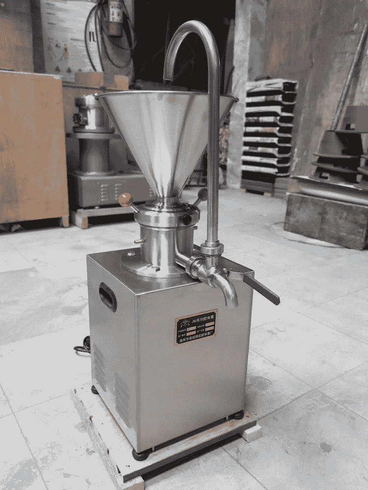

# 编程一个花生酱工厂。

> 原文:[https://dev . to/skydevht/programming-a-peanut-butter-mill-gaj](https://dev.to/skydevht/programming-a-peanut-butter-mill-gaj)

# [](#introduction)简介

我们的微控制器老师给我们的年终项目之一是为一台由 8051 微控制器驱动的花生酱磨机制定技术规范，并编写将在后者上运行的程序(模拟为我们不打算建造实际的磨机)。

# [](#hardware)硬件

虚拟磨机在启动前应进行自检，并允许在铣削过程中进行可选的第二次加工。它应该能够在研磨结束时自动清洁。很像这个，但是集装箱是封闭的，里面还有一个额外的集装箱供选择通行。
[T3】](https://res.cloudinary.com/practicaldev/image/fetch/s--6WB3-vVR--/c_limit%2Cf_auto%2Cfl_progressive%2Cq_auto%2Cw_880/https://thepracticaldev.s3.amazonaws.com/i/g60622upi9wq7d02c7tc.jpg)

# [](#requirements)要求

按下 start 按钮后，程序应该检查第一个容器(装花生的容器)至少有 1/4 是满的，最后一个容器是空的。如果后者不是，它应该打开一个警告灯。当所有这些条件都满足时，研磨过程开始，如果用户选择进行两次研磨，则将花生酱倒入第二个待研磨的容器中，如果用户仅选择一次研磨，则将花生酱倒入最后一个容器中。当第一个容器为空时，第一个电机停止，如果第二个电机正在运行，将在 5 分钟后停止

自清洁过程非常简单。前两个容器装满水，启动两个马达。3 分钟后，它们停止，容器被清空到最后一个容器中。再重复一次，机器复位。

# [](#design)设计

即使我们没有建造真正的工厂，我们也需要设计微控制器的接口。8051 微控制器有 4 个字节大小的 I/O 端口。在这个程序中，我们选择使用 2。

## [](#inputs)输入

我们有三个开关和三个传感器来检测容器中的内容物。其中两个传感器为 2 位宽，因为我们需要 3 种状态:

*   00 ->空
*   01 -> 1/4
*   11 ->满

最终容器的传感器是 1 位，我们只需要检测它是否是空的。这三个开关是

*   S ->打开(如果机器已启动)
*   A ->打开，如果应该开始清洗过程
*   M ->如果请求两次通过，则打开

## [](#outputs)输出

所有 3 个输出都是控制位。他们是

*   Mx ->关闭，如果电机 x 应该运行
*   P ->关闭，向容器中注水。

# [](#implementation)实现

至于实现过程，我们使用了[edsim 51[([https://edsim51.com](https://edsim51.com)]来模拟我们编写的程序。我们没有使用中断，因为它只会使事情变得更复杂。如果它是一台真正的机器，我们必须让它更加异步。当机器空闲时以及使用微控制器中的定时器时，使用了大量的循环。

## [](#setup-and-verification)设置和验证

我们首先将定时器计数器设置为 16 位数字(稍后需要)。然后我们读取端口 2(输入)。我们通过读取其位来检查最终容器是否为空，如果设置了，则点亮警告灯。如果不是，我们检查传感器 1 的第一位(如果第一个容器是 1/4 满或更多，它就打开)和启动开关。我们循环这一部分，直到所有条件都满足。

```
mov tmod, #10h ; set timer 1 to 16bit
verif:
mov p2, #0ffh ; set p2 as input
mov acc, p2; read p2 into the acc
jb 0e4h, ll; jump if first bit of sensor 1 is not set (empty)
anl acc, #41h; isolate s and sensor 1 bits
xrl acc, #41h ; acc will clear if s and sensor 1 first bit is set
jz lm1 ; jump if acc is zero
jmp verif; loop verification
ll:
clr p1.0 ; light warning led
jmp verif ; loop verification 
```

## [](#milling)铣削

铣削非常简单。我们首先启动第一个马达。如果选择了两个通道(M 打开)，我们将等待第二个容器至少装满 1/4。然后，另一个循环直到第一个容器为空。

```
lm1:
clr p1.4 ; launch motor 1
jnb p2.5, f1 ; jump if clapet is not on
jnb p2.2, $; loop until sensor 2 says it's at least 1/4
clr p1.5 ;launch motor 2 if clapet is on
f1:
jb p2.0, $ ; loop until sensor 1 says empty 
```

一旦传感器报告容器是空的，我们停止第一个马达，然后等待 5 秒(为了模拟的目的，我们使用秒而不是分钟)停止第二个马达。然后我们循环，直到 clean 进程被实例化(开关 A 打开)。

```
setb p1.4 ; stop motor 1
mov r0, #10 ; 5 seconds (5 * 20)
call secondsDelay ; delaying
setb p1.5 ; stop motor 2
jnb p2.7, $ ; loop until a is set 
```

## [](#cleaning)清洗

首先，我们打开水泵，检查前两个容器是否装满，然后关闭水泵。然后我们启动两个电机，等待 3 秒钟，然后停止它们。这个过程再重复一次，然后我们停止一切。

```
mov r7, #2;  2 cycle
clean:
clr p1.7 ; open pump
checkEmpty:
mov acc, p2 ; load port 2
anl acc, #0fh ; isolate sensor 1 & 2
xrl acc, #0fh ; clear if all is set
jnz checkEmpty; loop until full
setb p1.7 ; close pump
clr p1.4; start motor 1
clr p1.5 ; start motor 2
mov r0, #10 ; 3 seconds (3 * 20)
call secondsDelay
setb p1.4 ; stop motor 1
setb p1.4 ; stop motor 2
djnz r7, clean
jmp finish 
```

## [小时](#timer)

我们决定强制使用定时器，而不是通过中断。我们通过一个程序实现了它。由于定时器使用 16 位计数器，我们只能将其设置为 65 536 us 的持续时间。我们决定使用 50 毫秒，并循环它以达到预期的持续时间。在调用定时器子程序之前，循环次数在`r0`寄存器(1 字节)中设置。

```
; Setup Timer
fiftyMsDelay:
clr tr1 ; stop timer
; set up a 50 000 seconds delay by loading 65 536 - 50 000 = 15 536 (3CB0)
mov th1, #3ch
mov tl1, #0b0h
setb tr1 ; start timer
jnb tf1, $ ; loop until timer oveflow
clr tf1 ; clear overflow
clr tr1 ; stop timer
ret
secondsDelay:
; save processor state
push psw
loopTimer:
call fiftyMsDelay ; 50 ms
djnz r0, loopTimer ; loop until r0 equal zero
; restore processor state
pop psw
ret 
```

# [](#improvements)改进

我们的代码非常简单，使得铣削过程非常简单。但是在现实世界中，经常会有程序不得不处理的边缘情况。比如马达是实际运行还是暂停铣削过程。

# [](#conclusion)结论

写这个很有压力，但是很愉快，因为我们没有太多写汇编代码的经验。但是我们在实施过程中学到了很多，而且随着时间的推移变得越来越容易。汇编其实很简单，但写起来也很繁琐。下一步可能是将它移植到 Arduino。