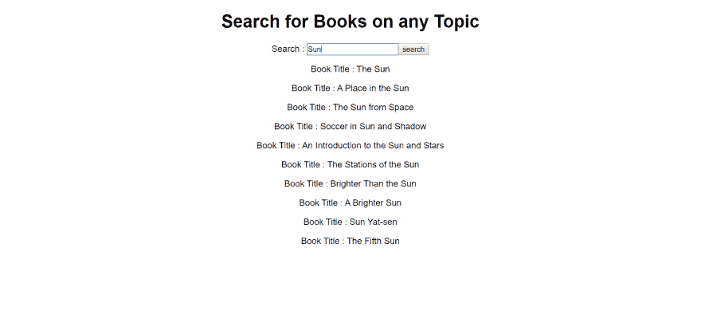

# 用 Async-Await 反应钩子

> 原文:[https://dev . to/vinodchauhan 7/react-hooks-with-async-await-1n9g](https://dev.to/vinodchauhan7/react-hooks-with-async-await-1n9g)

想象一下，你有一个文本框，它可以根据你在上面输入的内容给出谷歌商店的图书列表。如果在特定搜索查询中没有书，则显示“没有找到书”。默认情况下，它将始终显示“搜索书籍”。

场景:
1)无搜索:“搜索书籍”。
2)没有结果:“没有找到书”。
3)找到书籍:‘显示书籍列表’。

在上述场景中，我们希望在 [Google API 的](https://www.googleapis.com/books/v1)上搜索主题后更新我们的结果。这清楚地表明，我们需要使用承诺或“异步等待”来实现结果。但是这里我们想创建一个自定义的钩子，当我们点击搜索按钮并显示结果时，它会搜索书籍。

现在的问题是为什么我们在这种情况下需要钩子。答案很简单，因为我们想让我们的代码在最终使用时更加简洁。它必须不是多余的，即干燥的(不要重复自己)。

```
function App() {
  const [search, setSearch] = React.useState("");
  const [query, setQuery] = React.useState("");
  return (
    <div className="App">
      <h1>Search for Books on any Topic</h1>
      <form
        onSubmit={e => {
          e.preventDefault();
          setQuery(search);
        }}
      >
        <label>Search : </label>
        <input type="text" onChange={e => setSearch(e.target.value)} />
        <input type="submit" value="search" />
      </form> 
      <h1>List Result on {query}</h1>
    </div>
  ); 
```

到目前为止，这是我们在“查询”状态下获取最终搜索值的简单代码。现在我们定制一个异步钩子来搜索 google Api。

```
function useAsyncHook(searchBook) {
  const [result, setResult] = React.useState([]);
  const [loading, setLoading] = React.useState("false");

  React.useEffect(() => {
    async function fetchBookList() {
      try {
        setLoading("true");
        const response = await fetch(
          `https://www.googleapis.com/books/v1/volumes?q=${searchBook}`
        );

        const json = await response.json();
        // console.log(json);
        setResult(
          json.items.map(item => {
            console.log(item.volumeInfo.title);
            return item.volumeInfo.title;
          })
        );
      } catch (error) {
        setLoading("null");
      }
    }

    if (searchBook !== "") {
      fetchBookList();
    }
  }, [searchBook]);

  return [result, loading];
} 
```

> 我们不能将“async”关键字与“useEffect”回调方法一起使用。这将导致竞态条件。

我们从 google api 获取书籍，然后用书名更新我们的“setResult”状态。React.useEffect 方法将仅在我们的“searchBook”发生变化时运行。

```
//Updated App Component
function App() {
  const [search, setSearch] = React.useState("");
  const [query, setQuery] = React.useState("");
  const [result, loading] = useAsyncHook(query);
  return (
    <div className="App">
      <h1>Search for Books on any Topic</h1>
      <form
        onSubmit={e => {
          e.preventDefault();
          setQuery(search);
        }}
      >
        <label>Search : </label>
        <input type="text" onChange={e => setSearch(e.target.value)} />
        <input type="submit" value="search" />
      </form> 
      {loading === "false" ? (
        <h1>Search for Books</h1>
      ) : loading === "null" ? (
        <h1>No Book Found</h1>
      ) : (
        result.map(item => {
          return <p>Book Title : {item}</p>;
        })
      )}
    </div>
  );
} 
```

[T2】](https://res.cloudinary.com/practicaldev/image/fetch/s--Z1ekBzUM--/c_limit%2Cf_auto%2Cfl_progressive%2Cq_auto%2Cw_880/https://thepracticaldev.s3.amazonaws.com/i/3qa5jqhoegk855urnv2h.png)

[https://codesandbox.io/embed/8by2s](https://codesandbox.io/embed/8by2s)

Src : [因为它只有一次生命](http://becauseitsonelife.com/)