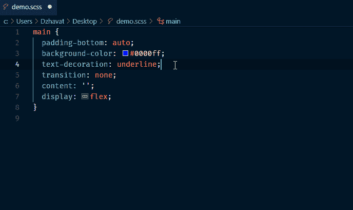

# 在 VS 代码中切换颜色格式的简单方法

> 原文:[https://dev . to/dzhavat/easy-way-to-switch-color-formats-in-vs-code-3 hph](https://dev.to/dzhavat/easy-way-to-switch-color-formats-in-vs-code-3hph)

如果你曾经在 VS 代码中使用过 CSS，你可能见过或者使用过集成的颜色选择器。这是一个小工具，让你预览颜色，调整它们和改变它们的不透明度。我经常使用它，并发现它非常方便。

但是你知道你还可以用它在不同的颜色格式之间快速切换吗？怎么会？点击顶部的颜色线。

[T2】](https://res.cloudinary.com/practicaldev/image/fetch/s--Vp19oeKx--/c_limit%2Cf_auto%2Cfl_progressive%2Cq_66%2Cw_880/https://thepracticaldev.s3.amazonaws.com/i/4d42jrcpkobb8uvr4rdf.gif)

老实说，我正在考虑构建一个扩展来做这件事！直到几天前我在@_clarkio 的一个 [Twitch streams](https://www.twitch.tv/clarkio) 中看到这个功能，我才知道这个功能的存在。在我看来，它相当隐蔽，是那种你要么知道它存在，要么偶然发现它的东西。

既然你已经知道了，我希望你能在工作中使用它😉