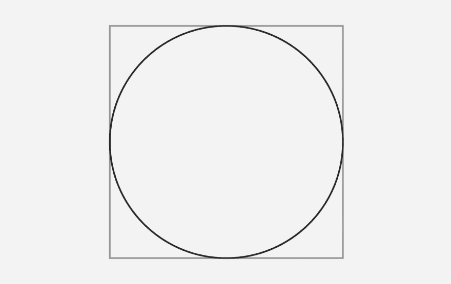
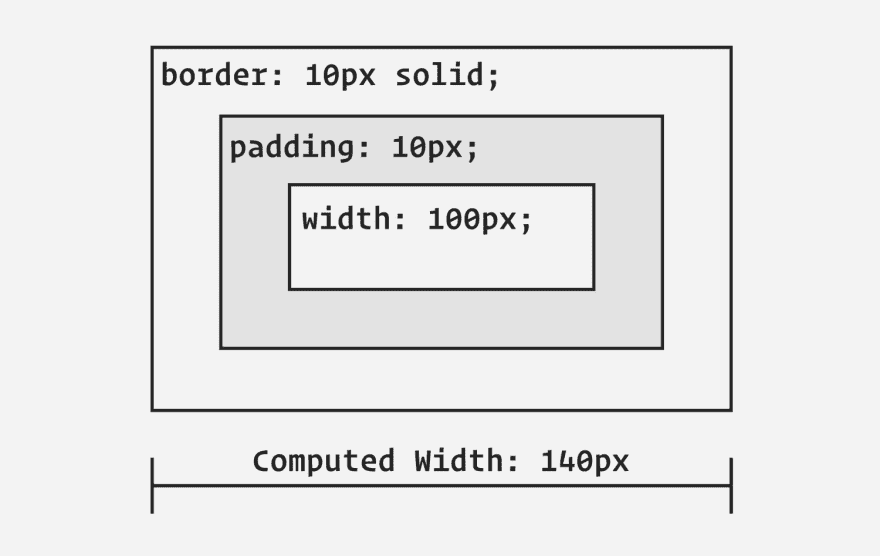
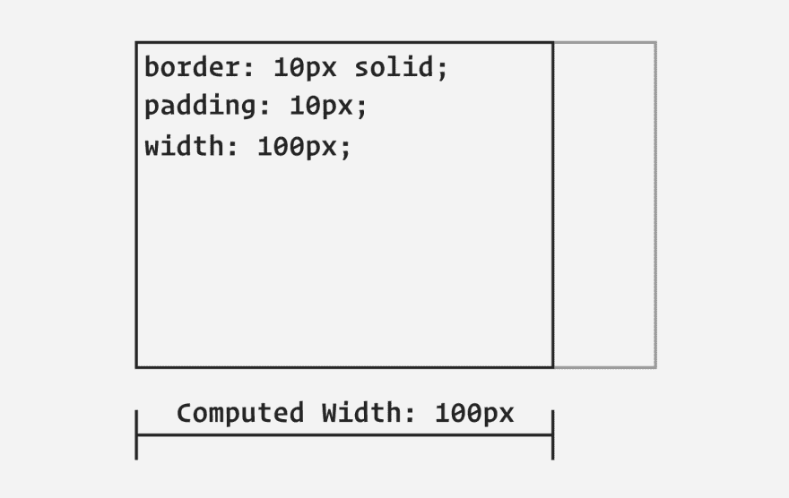

# 一口大小的基础:盒子大小

> 原文：<https://dev.to/hankchizljaw/bite-sized-basics-box-sizing-4al2>

*我最初把这个贴在[https://cssfromscratch.com](https://cssfromscratch.com)T3】*

* * *

如果在编写 CSS 时有一件真正重要的事情需要记住的话，那就是**一切都是一个盒子**。不管它看起来如何，它仍然是一个盒子。

[](https://res.cloudinary.com/practicaldev/image/fetch/s--K4Ego1rq--/c_limit%2Cf_auto%2Cfl_progressive%2Cq_auto%2Cw_880/https://thepracticaldev.s3.amazonaws.com/i/7om8k69evky4olt9qmte.jpg)

以上面的例子为例:它在视觉上是一个圆形，代理为 [border-radius](https://css-tricks.com/almanac/properties/b/border-radius/) ，但就浏览器而言，它仍然是一个盒子。

## 填充和边框

当我们向元素添加填充和边框时，默认情况下，它们的值将被添加到计算的宽度和高度中。这可能会令人困惑——尤其是当你第一次开始的时候。

```
.box {
  width: 100px;
  padding: 10px;
  border: 10px solid;
} 
```

[](https://res.cloudinary.com/practicaldev/image/fetch/s--1CdP2rkC--/c_limit%2Cf_auto%2Cfl_progressive%2Cq_auto%2Cw_880/https://thepracticaldev.s3.amazonaws.com/i/kiupigzfys0brvs6w922.jpg)

这里发生的是你的`.box`的计算宽度实际上被计算为 **140px** 。这就是盒子模型的工作方式，也是预期行为。但是大多数时候，最好不要这样，所以我们添加了这个 CSS 的小片段:

```
.box {
    box-sizing: border-box;
} 
```

这完全改变了浏览器的计算，因为它所做的是说“采用我指定的尺寸，并考虑填充和边框”。结果你得到的是一个 140 像素宽的盒子，现在是 100 像素宽，就像你指定的那样！

[](https://res.cloudinary.com/practicaldev/image/fetch/s--2kdEGKBV--/c_limit%2Cf_auto%2Cfl_progressive%2Cq_auto%2Cw_880/https://thepracticaldev.s3.amazonaws.com/i/1l1l15vaz2wgbii9nuqf.jpg)

`box-sizing`规则通常作为一个全局选择器添加到一个重置或者默认的规范化样式中，所以为了设置一个更完整的例子，这就是我们的盒子 CSS 现在的样子:

```
/* Reset rule */
*, 
*::before, 
*::after {
    box-sizing: border-box;
}

/* Box component */
.box {
  width: 100px;
  padding: 10px;
  border: 10px solid;
} 
```

它现在所做的不是仅仅针对`.box`，而是针对页面上的每个元素和任何[伪元素](https://developer.mozilla.org/en-US/docs/Web/CSS/Pseudo-elements)。

## 包装完毕

你可以在 MDN 上阅读更多关于盒子尺寸的内容，那里有一些非常好的文档。

设置`box-sizing: border-box`就是这样一个救命符——尤其是对于响应式设计。这种情况如此之多，以至于我们甚至在每年的 2 月 1 日举办“国际票房宣传日”。

总之:[在产品搜索上注册更新](https://www.producthunt.com/upcoming/css-from-scratch)，[订阅 RSS 源](https://cssfromscratch.com/feed.xml)或[在 Twitter 上关注@ CSS from scratch](https://twitter.com/cssfromscratch)以保持消息灵通。