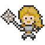
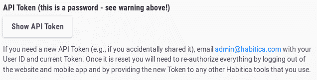
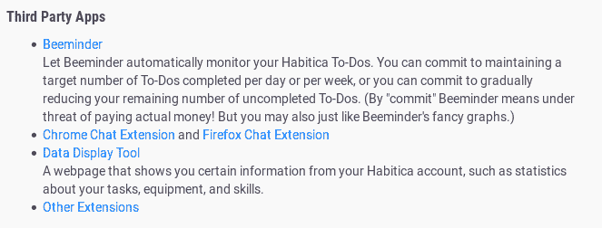
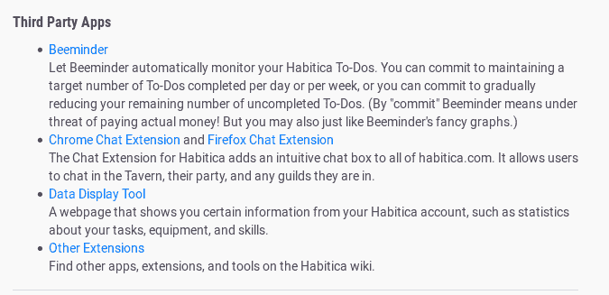
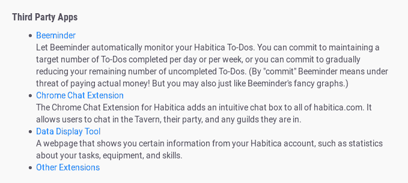
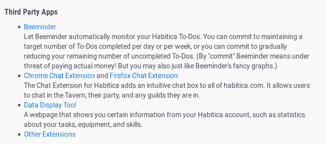

# 我的第一个开源贡献

> 原文：<https://dev.to/heymarkkop/my-first-open-source-contribution-21dh>

如果你在一次科技活动中见过我，你可能已经知道我是一个习惯追踪软件 [Habitica](https://habitica.com/) 的活跃用户，该软件将游戏化应用到你的生活中。它帮助我保持组织性，同时提供演奏 MMORPG 的感觉，这是我非常热爱的事情。

我的[个人资料](https://habitica.com/profile/40387571-91ee-489e-960f-278bf8fd503a)是在 2014 年创建的，但直到 2016 年我才尝试过。我已经和其他一些朋友订了婚，一段时间以来效果很好。我甚至为 [Habitica 的葡萄牙语维基](https://habitica.fandom.com/pt-br/wiki/Usu%C3%A1rio:Kopmark)提供翻译。
几个月前，我回到了 Habitica，现在我是一名前端开发人员，所以贡献一些代码应该不难。

## [HabitRPG](https://github.com/HabitRPG)/[habitica](https://github.com/HabitRPG/habitica)

### 一个习惯跟踪器应用程序，它把你的目标当作一个角色扮演游戏。

我已经拿了[这个好的第一期](https://github.com/HabitRPG/habitica/issues/11042)并在这篇文章中分享了我的进展。在开始之前，我关心的主要困难是设置开发环境和使用 VueJS(这很奇怪，因为我已经学会了 React)

# [ 在设置中添加“火狐聊天扩展”> API 页面 #11042](https://github.com/HabitRPG/habitica/issues/11042) 

[](https://github.com/Alys) **[Alys](https://github.com/Alys)** posted on [<time datetime="2019-03-04T07:32:43Z">Mar 04, 2019</time>](https://github.com/HabitRPG/habitica/issues/11042)

[用户图标>设置> API 页面](https://habitica.com/user/settings/api)包含 Chrome 聊天扩展的链接。还应该有一个 Firefox 聊天扩展的链接，位于[https://addons . Mozilla . org/en-US/Firefox/addon/habitica-Chat-client-v2/](https://addons.mozilla.org/en-US/firefox/addon/habitica-chat-client-v2/)

两个扩展做同样的事情，唯一的区别是它们运行的浏览器。因此，我认为如果两个扩展使用相同的项目符号条目会非常有帮助——这应该清楚地表明，如果只安装其中一个，您不会错过任何东西。要点行可以读作“ [Chrome 聊天扩展](https://chrome.google.com/webstore/detail/habitrpg-chat-client/hidkdfgonpoaiannijofifhjidbnilbb)和 [Firefox 聊天扩展](https://addons.mozilla.org/en-US/firefox/addon/habitica-chat-client-v2/)”，其下的段落可以改为:

“Habitica 的聊天扩展为整个 habitica.com 增加了一个直观的聊天框。它允许用户在酒馆、他们的聚会以及他们所在的任何公会中聊天。”

我会把这个问题作为建议讨论几天，然后如果没有人反对或改变这种方法，我会改变它的帮助。我会把它标为好的第一期，因为它对新投稿人来说是理想的。编辑:在对扩展进行一些更改时，此操作处于暂停状态。

[View on GitHub](https://github.com/HabitRPG/habitica/issues/11042)

## 第一步

在第一部分中，我简单地遵循了这个指南:
[Habitica Wiki——在 Linux 上本地设置 Habitica](https://habitica.fandom.com/wiki/Setting_up_Habitica_Locally_on_Linux)

因为我已经安装了 Git、build-essentials、Node、npm 和 MongoDB，所以我运行了以下命令:

```
sudo npm install -g mocha 
git clone https://github.com/Markkop/habitica.git
cd habitica
git remote add upstream https://github.com/HabitRPG/habitica.git
cp config.json.example config.json
npm install
sudo service mongod start
npm start
npm run client:dev 
```

<svg width="20px" height="20px" viewBox="0 0 24 24" class="highlight-action crayons-icon highlight-action--fullscreen-on"><title>Enter fullscreen mode</title></svg> <svg width="20px" height="20px" viewBox="0 0 24 24" class="highlight-action crayons-icon highlight-action--fullscreen-off"><title>Exit fullscreen mode</title></svg>

[http://localhost:8080/static/home](http://localhost:8080/static/home)
好哇，Habitica 在我自己的机器上运行！
登录页面有点问题，没有文本，但按照指示[清除](http://localhost:8080/static/clear-browser-data)缓存修复了它。
然后我创建了一个用户并登录。

## 开始换东西

按照这个指南，我们创建了一个新的 git 分支
[Habitica Wiki——使用你的本地安装来修改 Habitica 的网站和 API](https://habitica.fandom.com/wiki/Using_Your_Local_Install_to_Modify_Habitica%27s_Website_and_API)

```
git fetch upstream
git checkout -b firefox-extension-link 
```

<svg width="20px" height="20px" viewBox="0 0 24 24" class="highlight-action crayons-icon highlight-action--fullscreen-on"><title>Enter fullscreen mode</title></svg> <svg width="20px" height="20px" viewBox="0 0 24 24" class="highlight-action crayons-icon highlight-action--fullscreen-off"><title>Exit fullscreen mode</title></svg>

主要目标是在设置页面添加一个链接，我们可以在`website/client/components/settings/api.vue`找到。

[](https://res.cloudinary.com/practicaldev/image/fetch/s--RyFY7Pu4--/c_limit%2Cf_auto%2Cfl_progressive%2Cq_auto%2Cw_880/https://i.imgur.com/yZU6wrL.png)

这就是我们想要改变的:

```
li
  a(target='_blank' href='https://chrome.google.com/webstore/detail/habitrpg-chat-client/hidkdfgonpoaiannijofifhjidbnilbb') {{ $t('chromeChatExtension') }}
  br
  | {{ $t('chromeChatExtensionDesc') }} 
```

<svg width="20px" height="20px" viewBox="0 0 24 24" class="highlight-action crayons-icon highlight-action--fullscreen-on"><title>Enter fullscreen mode</title></svg> <svg width="20px" height="20px" viewBox="0 0 24 24" class="highlight-action crayons-icon highlight-action--fullscreen-off"><title>Exit fullscreen mode</title></svg>

但是那是什么 HTML 呢？正如`<template lang="pug">`所暗示的，这是[Pug](https://pugjs.org/api/getting-started.html)T3】预处理器获取这段代码并输出 HTML。同样的还有 [SASS](https://sass-lang.com/) 和 CSS。

酷，所以我们只需要改变这个文本并添加其他链接。
但事实是:所有文本实际上都是变量，因为[国际化](https://www.freecodecamp.org/news/how-to-add-internationalization-to-a-vue-application-d9cfdcabb03b/)。如何访问`$t('chromeChatExtension')`甚至如何拥有一个带两个链接的文本变量？

一个好的解决方法是在铁匠协会寻求帮助，但是在其他地方寻找类似的情况也是可行的。

通过检查这个 api 的网页，我们可以注意到，就在上面有这个 API 令牌警告消息。

[](https://res.cloudinary.com/practicaldev/image/fetch/s--yNz_ppXO--/c_limit%2Cf_auto%2Cfl_progressive%2Cq_auto%2Cw_880/http://i.imgur.com/ojcKAd6.png)

对应于代码
中的这一行

```
p(v-html='$t("APITokenWarning", { hrefTechAssistanceEmail })')` 
```

<svg width="20px" height="20px" viewBox="0 0 24 24" class="highlight-action crayons-icon highlight-action--fullscreen-on"><title>Enter fullscreen mode</title></svg> <svg width="20px" height="20px" viewBox="0 0 24 24" class="highlight-action crayons-icon highlight-action--fullscreen-off"><title>Exit fullscreen mode</title></svg>

并且通过在项目内部搜索`APITokenWarning`，我们可以发现`settings.json`是如何声明这类变量
的

```
"APITokenWarning":  "If you need a new API Token (e.g., if you accidentally shared it), email <%= hrefTechAssistanceEmail %> with your User ID and current Token. Once it is reset you will need to re-authorise everything by logging out of the website and mobile app and by providing the new Token to any other Habitica tools that you use.", 
```

<svg width="20px" height="20px" viewBox="0 0 24 24" class="highlight-action crayons-icon highlight-action--fullscreen-on"><title>Enter fullscreen mode</title></svg> <svg width="20px" height="20px" viewBox="0 0 24 24" class="highlight-action crayons-icon highlight-action--fullscreen-off"><title>Exit fullscreen mode</title></svg>

因此，用`<%= hrefTechAssistanceEmail %>`

另外， **hrefTechAssistanceEmail** 的值可以在下面的
部分找到

```
/// api.vue
...
const TECH_ASSISTANCE_EMAIL = "admin@habitica.com";

export default {
  data() {
    return {
      newWebhook: {
        url: ""
      },
      hrefTechAssistanceEmail: `<a href="mailto:${TECH_ASSISTANCE_EMAIL}">${TECH_ASSISTANCE_EMAIL}</a>`,
      showApiToken: false
    };
  }
}, ... 
```

<svg width="20px" height="20px" viewBox="0 0 24 24" class="highlight-action crayons-icon highlight-action--fullscreen-on"><title>Enter fullscreen mode</title></svg> <svg width="20px" height="20px" viewBox="0 0 24 24" class="highlight-action crayons-icon highlight-action--fullscreen-off"><title>Exit fullscreen mode</title></svg>

经过一番尝试，我们找到了正确的直接使用方法:

```
{{ $t("APITokenWarning", { hrefTechAssistanceEmail: "myemail@lol.com" }) }} 
```

<svg width="20px" height="20px" viewBox="0 0 24 24" class="highlight-action crayons-icon highlight-action--fullscreen-on"><title>Enter fullscreen mode</title></svg> <svg width="20px" height="20px" viewBox="0 0 24 24" class="highlight-action crayons-icon highlight-action--fullscreen-off"><title>Exit fullscreen mode</title></svg>

### 其实...

好吧，酷。我们可以为每个链接创建一些常量，并像上面的例子一样使用它们。然而，如果有一天有人不得不改变这些链接呢？也许直接在`settings.json`文件中改变文本字符串会更容易。

因为这种方法产生的代码更少，所以我们将使用它。

然后，我们将**chromechatexpension**和**chromechatexpension desc**更改为以下内容:

```
"chatExtension":  "<a target='blank' href='https://chrome.google.com/webstore/detail/habitrpg-chat-client/hidkdfgonpoaiannijofifhjidbnilbb'>Chrome Chat Extension</a> and <a target='blank' href='https://addons.mozilla.org/en-US/firefox/addon/habitica-chat-client-v2/'>Firefox Chat Extension</a>",  "chatExtensionDesc":  "The Chat Extension for Habitica adds an intuitive chat box to all of habitica.com. It allows users to chat in the Tavern, their party, and any guilds they are in.", 
```

<svg width="20px" height="20px" viewBox="0 0 24 24" class="highlight-action crayons-icon highlight-action--fullscreen-on"><title>Enter fullscreen mode</title></svg> <svg width="20px" height="20px" viewBox="0 0 24 24" class="highlight-action crayons-icon highlight-action--fullscreen-off"><title>Exit fullscreen mode</title></svg>

我们的扩展列表以
结束

```
ul
  li
    a(target='_blank' href='https://www.beeminder.com/habitica') {{ $t('beeminder') }}
    br
    | {{ $t('beeminderDesc') }}
  li(v-html="$t('chatExtension')")
    br
    | {{ $t('chatExtensionDesc') }}
  li
    a(target='_blank' :href='`https://oldgods.net/habitica/habitrpg_user_data_display.html?uuid=` + user._id') {{ $t('dataTool') }}
    br
    | {{ $t('dataToolDesc') }}
  li(v-html="$t('otherExtensions')")
    | {{ $t('otherDesc') }} 
```

<svg width="20px" height="20px" viewBox="0 0 24 24" class="highlight-action crayons-icon highlight-action--fullscreen-on"><title>Enter fullscreen mode</title></svg> <svg width="20px" height="20px" viewBox="0 0 24 24" class="highlight-action crayons-icon highlight-action--fullscreen-off"><title>Exit fullscreen mode</title></svg>

### 问题

[](https://res.cloudinary.com/practicaldev/image/fetch/s--Bk32h5HN--/c_limit%2Cf_auto%2Cfl_progressive%2Cq_auto%2Cw_880/http://i.imgur.com/G1ujmDd.png)

通过手动检查，我们注意到 **chatExtensionsDesc** 没有显示。事实上， **otherDesc** 文本并没有出现，甚至在现场直播！

经过一些试验，似乎当**标签**被创建**并带有属性**如`li(v-html="$t('otherExtensions')")`时，它们的子标签不会被显示。解决方案是改变子缩进，使它出现在下面。

*(bug 加 Pug+Vue？)*

最终代码是

```
 ul
        li
          a(target='_blank' href='https://www.beeminder.com/habitica') {{ $t('beeminder') }}
          br
          | {{ $t('beeminderDesc') }}
        li(v-html="$t('chatExtension')")
        | {{ $t('chatExtensionDesc') }}
        li
          a(target='_blank' :href='`https://oldgods.net/habitica/habitrpg_user_data_display.html?uuid=` + user._id') {{ $t('dataTool') }}
          br
          | {{ $t('dataToolDesc') }}
        li(v-html="$t('otherExtensions')")
        | {{ $t('otherDesc') }} 
```

<svg width="20px" height="20px" viewBox="0 0 24 24" class="highlight-action crayons-icon highlight-action--fullscreen-on"><title>Enter fullscreen mode</title></svg> <svg width="20px" height="20px" viewBox="0 0 24 24" class="highlight-action crayons-icon highlight-action--fullscreen-off"><title>Exit fullscreen mode</title></svg>

[](https://res.cloudinary.com/practicaldev/image/fetch/s--c1JpKFyH--/c_limit%2Cf_auto%2Cfl_progressive%2Cq_auto%2Cw_880/https://i.imgur.com/IpNohdw.png)

# 结论

在开始这个项目之前，我认为**的主要困难**是设置项目的**环境**，但是指令**非常清楚**，我没有任何问题。
有趣的部分是，我认为在单行文本中添加另一个链接会非常**简单，但由于 Vue-i18n 插件的国际化，面临**几种可能的解决方案**。
起初，最初的方法更有意义，因为`api.vue`将是**主文件**，在那里有人将检查他们是否需要改变一个链接。
然而，通过将它放在`settings.json`中，链接也可以变成**不同的语言**。而且修改代码会简单得多。
在这次机会中，我学到了我第一次**亲自接触**Vue，发现了 **HTML 的预处理程序**如 Pug 的存在，并创建了一个 **Pull 请求**给一个已经在生产的大项目。**

# [ 在设置中添加“火狐聊天扩展”> API 页面 #11375](https://github.com/HabitRPG/habitica/pull/11375) 

[](https://github.com/Markkop) **[Markkop](https://github.com/Markkop)** posted on [<time datetime="2019-09-22T21:34:13Z">Sep 22, 2019</time>](https://github.com/HabitRPG/habitica/pull/11375)

修复#11042

### 变化

我添加了 Firefox 聊天扩展的链接，删除了 Chrome 聊天扩展的描述，并添加了关于聊天扩展的描述

**之前:** [](https://camo.githubusercontent.com/a06edff42d3ad855b8434f7f547c6386977a8ef3/68747470733a2f2f692e696d6775722e636f6d2f795a553677724c2e706e67)

**之后:** [](https://camo.githubusercontent.com/d076d63ee9c1a869d00ce0e79e825447d102c9e5/68747470733a2f2f692e696d6775722e636f6d2f694a6e4574616a2e706e67)

在处理它的时候，我还发现了一个带有 **Pug** 和/或 **Vue** 的 **bug** ，每当使用带有属性如`li(v-html="$t('otherExtensions')")`的 **HTML 标签时，它的子标签都不会被显示，正如你可以注意到的“ **Other Extensions** ”的文本描述是如何不出现的。**

**修复**不是通过修复文本的**缩进**将文本作为子文本。

这是最后的结果:

[](https://camo.githubusercontent.com/bd29fc8de6ed71419d83903b909e39c0e08744ad/68747470733a2f2f692e696d6775722e636f6d2f49704e6f6864772e706e67)

PS:我错改了`settings.json`缩进。有什么问题吗？

* * *

UUID:40387571-91ee-489 e-960 f-278 bf8fd 503 a

[View on GitHub](https://github.com/HabitRPG/habitica/pull/11375)