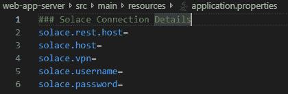
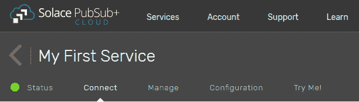
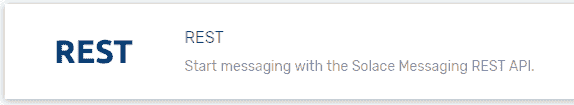
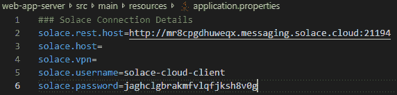
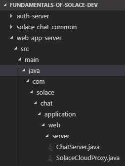
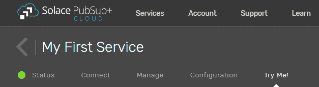
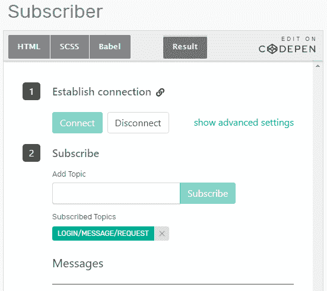
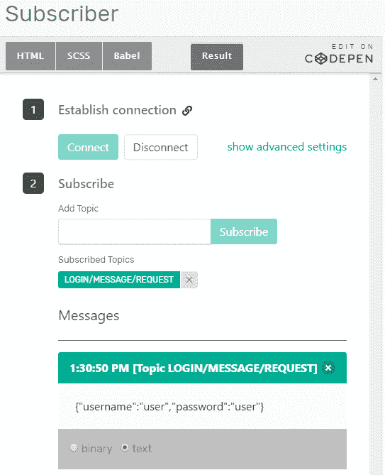

# 如何用 Solace 构建一个简单的聊天应用程序(第 4 部分)

> 原文:[https://dev . to/solace devs/how-to-build-a-simple-chat-app-with solace-part-4-35ei](https://dev.to/solacedevs/how-to-build-a-simple-chat-app-with-solace-part-4-35ei)

[T2】](https://res.cloudinary.com/practicaldev/image/fetch/s--NqbU5CDv--/c_limit%2Cf_auto%2Cfl_progressive%2Cq_auto%2Cw_880/https://solace.com/wp-content/uploads/2019/07/chat-app-blog-featured-image.jpg)

这是我用 Solace PubSub+创建一个简单聊天应用的系列博文的第 4 部分。在第一部分的[中，我解释了如何创建一个简单的聊天应用程序，它可以通过直接主题订阅发送和接收消息。在](https://dev.to/solacedevs/how-to-build-a-simple-chat-app-with-solace-part-1-3c9e)[的第二篇](https://dev.to/solacedevs/how-to-build-a-simple-chat-app-with-solace-part-2-2efh)中，我解释了如何修改示例代码，让应用程序使用队列中的消息，在[的第 3 部分](https://dev.to/solacedevs/how-to-build-a-simple-chat-app-with-solace-part-3-2657)中，我解释了如何添加登录功能，向 Solace PubSub+发送 REST POST 请求。

在本教程中，您将学习如何添加一个简单的认证服务器。服务器将首先从 web 应用程序接收客户机登录请求，然后对用户进行身份验证，最后将 REST POST 响应发送回应用程序，以允许或拒绝登录请求。

具体来说，您将

*   设置连接详细信息
*   创建并发送 REST POST 请求
*   测试 REST POST 请求

**先决条件**

*   将 Git 下载到您的电脑上
*   [安装 Apache Maven](https://maven.apache.org/install.html)
*   [在 Solace PubSub+ Cloud 上注册](https://console.solace.cloud/login)
*   [将样本库](https://github.com/SolaceTraining/fundamentals-of-solace-dev)克隆到您的计算机上

**级别**

*   新手

## [](#set-the-connection-details)**设置连接细节**

连接细节的设置告诉 Web 应用服务器将 REST POST 登录请求发送到哪里，以便 Solace 实例可以接收它。

要设置连接详细信息，请执行以下操作:

1.  在代码编辑器中，检查 developer-exercise-4 分支，或者在命令行中输入`git checkout remotes/origin/developer-exercise-4 -f`
2.  在代码编辑器中，输入`mvn install`在 solace-chat-common 中运行 Maven 安装。
3.  在 src > main > resources 下，打开文件`application.properties`。
4.  [登录](https://console.solace.cloud/login)到 Solace PubSub+ Cloud。
5.  点击**连接**选项卡。
6.  打开休息区。
7.  从 Connection Details 部分复制用户名、密码和 REST 主机信息，并将它们粘贴到 src > main > java > resources 下的 application.properties 文件中。

## [](#create-and-send-the-rest-post-request)**创建并发送剩余帖子请求**

现在已经设置了连接细节，您可以创建 REST POST 请求并将其作为发布/订阅消息发送到 PubSub+实例:

1.  在您的代码编辑器中，在 src > main > java 下，打开文件 SolaceCloudProxy.java。
2.  输入下面的代码创建一个 REST 模板对象(第 63 行)。

```
//Rest Request goes hereRestTemplate restTemplate = new RestTemplate(); 
```

<svg width="20px" height="20px" viewBox="0 0 24 24" class="highlight-action crayons-icon highlight-action--fullscreen-on"><title>Enter fullscreen mode</title></svg> <svg width="20px" height="20px" viewBox="0 0 24 24" class="highlight-action crayons-icon highlight-action--fullscreen-off"><title>Exit fullscreen mode</title></svg>

`RestTemplate`进行 HTTP REST 调用，简化与 HTTP 服务器的交互。

1.  在上面的代码下面输入下面的代码，用用户对象类型创建 HTTP 实体(第 64 行)。

```
HttpEntity&lt;UserObject&gt; request = new HttpEntity&lt;UserObject&gt;(userObject,httpHeaders); 
```

<svg width="20px" height="20px" viewBox="0 0 24 24" class="highlight-action crayons-icon highlight-action--fullscreen-on"><title>Enter fullscreen mode</title></svg> <svg width="20px" height="20px" viewBox="0 0 24 24" class="highlight-action crayons-icon highlight-action--fullscreen-off"><title>Exit fullscreen mode</title></svg>

用户验证类型只包含用户名和密码。安慰-聊天-普通有它的参考。

1.  输入下面的代码，将对象的 POST 添加到 REST 模板中(第 65 行)。

```
restTemplate.postForObject(solaceRESTHost + “/LOGIN/MESSAGE/REQUEST”,request, String.class); 
```

<svg width="20px" height="20px" viewBox="0 0 24 24" class="highlight-action crayons-icon highlight-action--fullscreen-on"><title>Enter fullscreen mode</title></svg> <svg width="20px" height="20px" viewBox="0 0 24 24" class="highlight-action crayons-icon highlight-action--fullscreen-off"><title>Exit fullscreen mode</title></svg>

您在上面“设置连接细节”一节的步骤 7 中定义了`solaceRESTHost`。

`/LOGIN/MESSAGE/REQUEST`是您发送剩余帖子请求的特定主题。

1.  输入以下代码以返回一个响应实体(第 66 行)。

```
return new ResponseEntity(HttpStatus.OK); 
```

<svg width="20px" height="20px" viewBox="0 0 24 24" class="highlight-action crayons-icon highlight-action--fullscreen-on"><title>Enter fullscreen mode</title></svg> <svg width="20px" height="20px" viewBox="0 0 24 24" class="highlight-action crayons-icon highlight-action--fullscreen-off"><title>Exit fullscreen mode</title></svg>

`ResponseEntity`创建 HTTP 响应。

## [](#test-the-rest-request)**测试休息请求**

现在您已经创建并发送了 REST POST 请求，您可以测试该请求是否真正被传递到了 Solace 实例。

1.  在代码编辑器中，输入`mvn spring-boot:run`启动 web 应用程序。
2.  在 Solace PubSub+ Cloud 中，点击**试试我！**选项卡。【T2
3.  在订阅面板中，点击**连接**按钮，输入**登录/消息/请求**为主题，点击**订阅**按钮。
4.  打开新浏览器，输入`localhost:8081`调出网络应用。
5.  输入“用户”作为用户名和密码，点击**提交**按钮。你应该看看试试我！选项卡已收到消息。

恭喜你！您已经成功地添加了一个身份验证服务器，以发布/订阅消息的形式向服务器发送了一个 REST POST 请求，并收到了来自服务器的响应。在下一部分(即将推出)，您将学习如何将 REST POST 请求作为请求/回复消息发送。

**相关**

*   [如何用 Solace 构建一个简单的聊天应用(第三部分)](https://solace.com/blog/build-chat-app-solace-3)
*   [如何用 Solace 构建一个简单的聊天应用(第二部分)](https://solace.com/blog/build-chat-app-solace-2)
*   [如何用 Solace 构建一个简单的聊天应用(第一部分)](https://solace.com/blog/build-chat-app-solace-1)
*   Udemy 课程:[Solace 开发基础](https://www.udemy.com/fundamentals-of-solace-development/)

帖子[如何用 Solace(第四部分)](https://solace.com/blog/build-chat-app-solace-4/)最早出现在 [Solace](https://solace.com) 上。