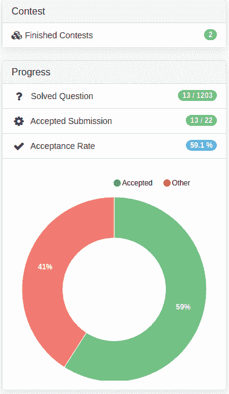
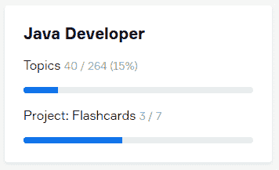
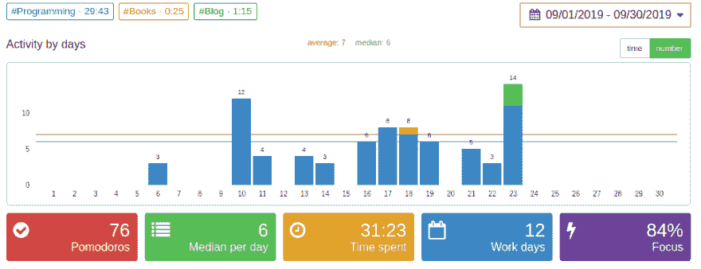

# 第一周- Git 是好的

> 原文：<https://dev.to/ddbull/week-1-git-is-good-3dkb>

自从我在这里写下我的第一篇博客已经一周了，现在是时候报告一下上周做了什么，并为下一篇做准备了。让我们开始吧:

### 待办事项 9 月 17 日至 23 日(第一周)

`NOT done` 1)日常体育锻炼

7 天中只锻炼了 4 天。

每天用 leetcode 解决一个问题

本周解决了 11 个问题。这周我参加了我的第一次竞赛，只按时解决了两个问题，后来在竞赛后我又解决了一个。竞赛非常有趣，我想起了高中的美好时光——我发现我仍然喜欢在有限的时间内解决问题。我还发现 leetcode 在我睡着了、累了、懒得开始学习的时候非常有用——我只是解决了一个简单的问题，然后我的大脑就开始工作了:)

`done` 3)完成第 1 周-课程# 1 JavaScript、HTML 和 CSS 编程基础
4)完成第 1 周-课程#2 Java 编程:用软件解决问题**

本课程需要 BlueJ IDEA 来完成作业。我在安装它时遇到了麻烦，因为 coursera/杜克大学版本的 BlueJ 不支持 java-11-oracle。花了 2-3 个小时试图弄清楚，最后把需要的库导入到我最喜欢的 IntelliJ 想法中。我为自己能够不通过谷歌搜索就做到这一点感到非常自豪。感觉像一个顶级的 DevOps:)

`done` 5)完成 JetBrains Academy 上的咖啡机项目**
`NOT done` 6)完成 JetBrains Academy 上的另一个简单项目**

当前 JetBrains 学院进度:

不幸的是，本周未能完成抽认卡(简易)项目。

### 思想/其他

太多的社交活动，我不能拒绝，幸运的是，即将到来的一周看起来不那么忙。我还花了大约 20 个小时研究美国/加拿大计算机科学项目的研究生/二级学士。我的最终目标是合法移民到美国/加拿大。目前，我认为有两种实现途径:
1)哈萨克斯坦的初级开发人员- >俄国/乌克兰或白俄罗斯的中级/高级开发人员- >美国/加拿大的中级/高级开发人员。同时，尝试从美国顶尖大学获得在线计算机科学硕士学位。

这条路的缺点是，在哈萨克斯坦的初级开发人员每月只能赚 300-400 美元，与我目前的化学工程师工作相比，我的工资会在 6-12 个月内下降 3-4 倍。
2)在美国/加拿大获得 CS 学位- >实习- >工作许可。这条道路看起来比前一条更短，从长远来看有更好的好处(计算机科学硕士)。

这条路最大的坏处就是准备 GRE 和拿巨额国际学生贷款。我可能需要把准备 GRE 的时间投入进去，而不是专注于学习计算机科学。

**去**

本周最大的进步是学习了一些 Git，并在命令行中练习了 Git，在 IDEA 中练习了 GUI 和 VCS

**番茄工作法**

我用番茄工作法来帮助我集中注意力。这也是很好的削减所有废话。你不能用番茄红素来欺骗自己。如果没有它，你可能会认为你在笔记本电脑前花了 10-12 个小时已经做了很多，但专注的时间可能只有 1-2 个小时。

番茄工作狂的统计数据显示我没有有效利用我的时间。然而，我不确定 25 分钟专注+5 分钟休息的方法。当我专注于解决某个问题或试图抓住 bug 时，5 分钟的休息会让我脱离“心流”,有时很难回来赶上潮流。

## 目标

**长期:**以软件工程师的身份合法移民美国/加拿大
**中期:**在 2020 年 3 月 1 日前获得 Oracle Java 程序员 SE I 认证- ****短期:**完成杜克大学 Coursera 专业“Java 编程和软件工程基础”课程-共 5 门课程，*我目前获得了前两门课程的经济资助***

 **### 待办事项 9 月 24 日至 30 日(第 2 周)

**1)日常体育锻炼**
**2)每天在 leetcode**
**上解决 1 个问题 3)完成第 2 周-课程#1 的 JavaScript、HTML 和 CSS 编程基础**
**4)完成第 3 周-课程#1 的 JavaScript、HTML 和 CSS 编程基础**
**5)完成第 4 周-课程#1 的 JavaScript 编程基础、 HTML 和 CSS**
**6)完成第 2 周的课程#2 Java 编程:用软件解决问题**
**7)完成 JetBrains Academy 上的抽认卡项目**
**8)参加 9 月 25 日的外国大学博览会**
**9)平均 8 个番茄 6 天**

在我的上一篇文章中，我已经获得了不到 500 次的浏览，巨大的成功！你认为我的学习计划怎么样？我应该改变它吗？也许我应该补充学习一些核心的 CS 概念，而不仅仅是 java？还是少上课程多练？我希望听到任何反馈！谢谢大家！**