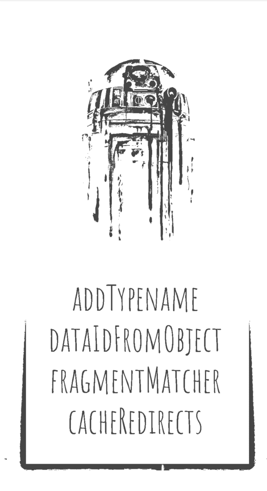
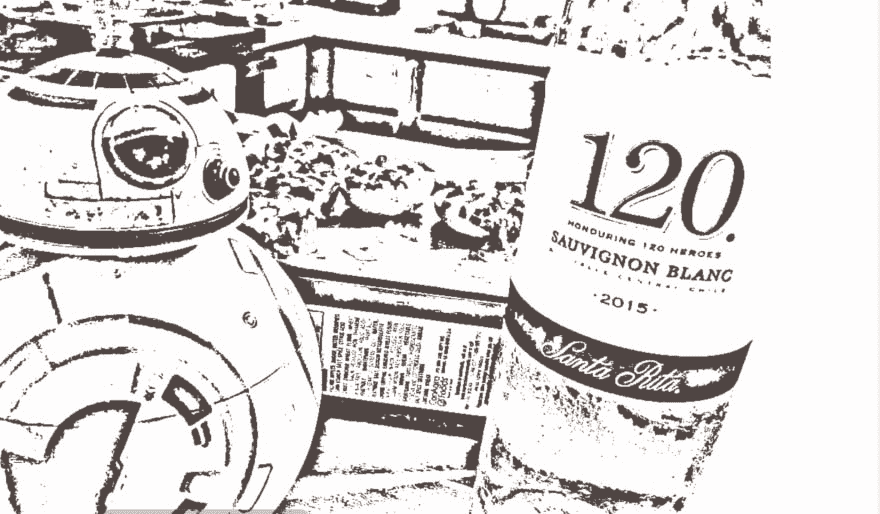
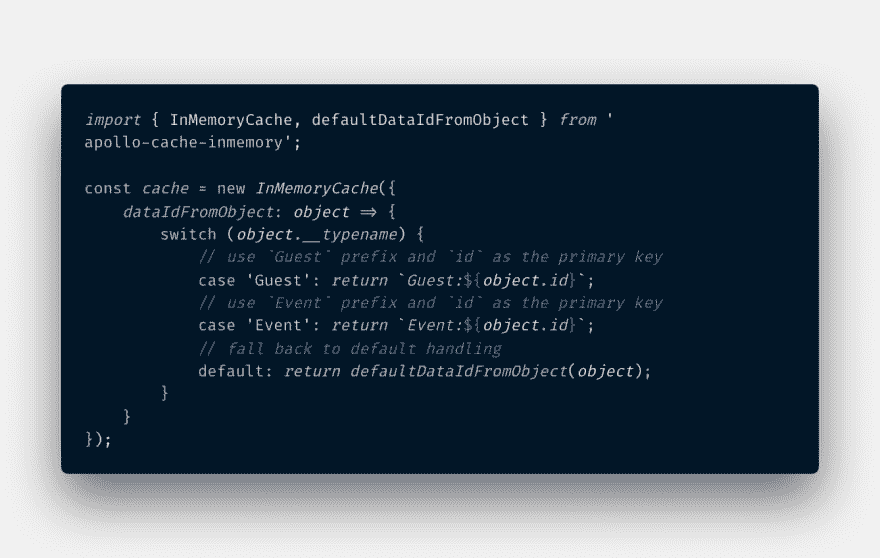

# 如何用 Apollo GraphQL 缓存震撼派对🎉🎈

> 原文：<https://dev.to/akshar07/how-to-rock-the-party-with-apollo-graphql-cache-361l>

你好，我是阿波罗缓存内存又名阿波罗缓存。我是你的 Apollo 客户端中缓存的默认实现。所以让我解释一下我们为什么在这里！

我会在你需要的时候帮助你访问和操作缓存。你进行了变异吗？别担心！我可以帮你更新缓存。哦，顺便说一下，那个 Redux 家伙很酷，但是你可能不需要再用他存储数据了🤷‍♂.请允许我…

嗯...谢谢，阿波罗缓存的介绍，但我想我会从这里开始。

好吧，所以当我第一次尝试阿波罗缓存的时候，我是无法理解的。有这么多不同的用例，我肯定会迷路。给所有的混乱加上`__typename`的东西。所以我决定让阿波罗·凯奇成为我的朋友。事情是这样的:
首先，你要邀请阿波罗缓存参加你的派对:

```
npm install apollo-cache-inmemory --save 
```

现在`Apollo Cache`将开始打破常规。只要介绍给阿波罗客户端(阿波罗客户端对缓存情有独钟)轰！

```
const cache = new InMemoryCache();

const client = new ApolloClient({
  link: new HttpLink(),
  cache
}); 
```

但是我们想让它做更多的事情。所以，让它明白你的聚会规则，这样它就会按照你想要的方式行动。类似`code of conduct`的东西？我们将在其构造函数中提供行为准则。顺便说一下，这完全是可选的。所以我们开始吧！

**行为准则:**

[](https://res.cloudinary.com/practicaldev/image/fetch/s--3JlRZIQZ--/c_limit%2Cf_auto%2Cfl_progressive%2Cq_auto%2Cw_880/https://thepracticaldev.s3.amazonaws.com/i/x0nmwem0g10g3a5iu1jj.jpeg)

**addTypename:** 一个布尔值，指定是否将 __typename 添加到文档中。(默认为真)。稍后将详细介绍。

**dataIdFromObject:** 缓存在将所有数据保存到存储区之前对其进行规范化。这是一个接受数据对象并返回唯一 id 的函数。更多关于它的使用在故事的后面。

**碎片匹配器:**阿波罗缓存默认使用启发式碎片匹配器。如果您计划在联合和接口上使用片段，那么您需要告诉 apollo cache 这是一件奇怪的事情。

**cacheRedirects:** 有时，我们会请求 apollo cache 已经存在于其存储中但位于不同资源键下的数据。通过 cacheRedirects，我们告诉 apollo cache 在哪里寻找已经存在的数据。

* * *

[](https://res.cloudinary.com/practicaldev/image/fetch/s--ii911DZM--/c_limit%2Cf_auto%2Cfl_progressive%2Cq_auto%2Cw_880/https://thepracticaldev.s3.amazonaws.com/i/586qt1720n3ttui2h8g5.jpeg)

阿波罗缓存立即在党内流行。所有的派对客人(你可以把他们想象成组件)都与缓存交互。我们在玩“反应和行动🧐”,缓存中保存了我们可以采取行动的所有事件以及每个团队的分数。让我告诉你，它做得很棒。阿波罗缓存做了三件事来快速存储和检索数据—

1.  将数据分割成单独的对象
2.  为每个对象创建一个唯一的标识符
3.  将数据存储在扁平数据结构中

它使用行为准则点 **addTypename** 和 **dataIdFromObject** 来做到这一点。通常，缓存使用数据中的`id`和`_id`字段以及`__typename`来创建唯一标识符。如果数据中未提供 id，它将关闭`__typename`。 **dataIdFromObject** 函数告诉缓存使用数据中的特定字段作为唯一标识符，以便以后在与 Apollo 缓存的任何交互(查询)中引用。

我知道这很令人困惑。所以，我们再来多讨论一下这个:
但是首先，缓存是如何记住一切的？简单来说，Apollo cache 会记住你与它交互的方式。缓存将此称为**查询路径**。

```
query {
    Events (category = 'happy') { 
        name
    }
} 
```

对于上面的查询，缓存会创建如下查询路径:**root query->Events(category = ' happy ')->name**。它假设对于一个查询路径，必须正好有一个它所指向的资源。因此，下次当任何人询问 cache 相同的查询时，它会立即回答。例如，一位客人向 apollo cache 询问团队的得分和“快乐”类别的事件列表。

```
query {
    Score(team = 'A') {
        points
    }
    Events (category = 'happy') { 
        name
    }
} 
```

缓存已经知道了事件列表，因为有人已经请求了它。所以它立刻回答了。爽快！

缓存尽力记住事情。但有时，查询路径不够清晰。例如，这是另外两位客人提出的问题:

**嘉宾 A** :嘿，阿波罗缓存。你能给我一个属于“跳舞”类别的项目吗？
**嘉宾 B** :缓存，你能给我提供第二类的事件吗？(此处类别由 id 引用)

现在碰巧 id = 2(或第二类)实际上是一个属于“跳舞”类别的事件。缓存如何看待这些请求？

```
// 1st Request
query {
    Event (category = 'dancing') { 
        name
    }
}
// 2nd Request
query {
    Event (id = 2) { 
        name
    }
} 
```

这里，缓存不知道这两个请求指向同一个结果。在正常情况下，缓存将获取该数据，并在其存储中保存两次。此时，缓存能够使用`dataIdFromObject`规则计算出这些请求发生了什么。
如何？在我们的帮助下。因此，在`dataIdFromObject`中，我们为任何需要查询的对象指定了唯一的标识符。这里，我们需要注意不要提供原始 id(SQL 主键)作为唯一标识符，因为 id = 5 可以表示事件或访客。我们需要把这个和`__typename`结合起来。所以像`Event:5`这样的标识符只表示 id = 5 的事件数据，而`Guest:5`只表示 id = 5 的访客数据。

[](https://res.cloudinary.com/practicaldev/image/fetch/s--8ej6L1uP--/c_limit%2Cf_auto%2Cfl_progressive%2Cq_auto%2Cw_880/https://thepracticaldev.s3.amazonaws.com/i/0khsvanfpi2ksrxsvcud.png)

如果跳舞类别中的事件名称从“bachata”更改为“salsa ”,以上两个查询都将获得更新的答案。轻松利落！

[](https://res.cloudinary.com/practicaldev/image/fetch/s--NsAlCnRM--/c_limit%2Cf_auto%2Cfl_progressive%2Cq_auto%2Cw_880/https://thepracticaldev.s3.amazonaws.com/i/aypmmx6sc60vkqsz9nq1.jpeg)

阿波罗缓存还有许多其他的锦囊妙计。我们改天再讨论吧！

*感谢推特用户@DrunkBB8 的原创图片。*