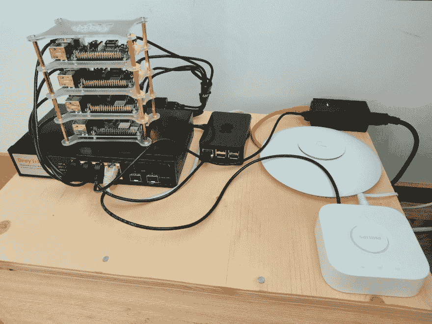
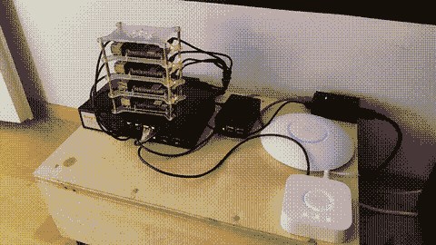
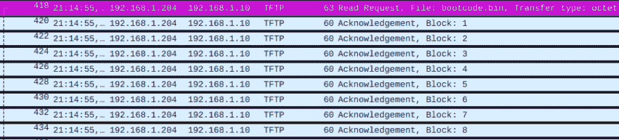

# Raspberry Pi 集群第 1 部分:引导

> 原文:[https://dev . to/weeee/raspberry-pi-cluster-part-1-the-boot-2fe 5](https://dev.to/weeee/raspberry-pi-cluster-part-1-the-boot-2fe5)

## [](#introduction)简介

这是我构建一个用于托管我在家庭网络中使用的一些服务的 Raspberry Pi 集群的旅程的第一部分。

## [](#hardware)硬件

*   4x [树莓 Pi 3 型号 B+](https://www.amazon.de/gp/product/B07BDR5PDW/)
*   6 端口 USB 电源( [Anker PowerPort 6](https://www.amazon.de/gp/product/B00PTLSH9G/) )
*   一束 USB 线( [Anker 电源线微型 USB 线](https://www.amazon.de/gp/product/B016BEVNK4/)
*   一束短以太网电缆
*   运行所需服务器的台式 PC
*   (DHCP 的 Ubiquiti USG)

在不久的将来，台式 PC 将被专用的 NAS 所取代。请关注这篇文章的更新，并尽快提供详细信息。

[T2】](https://res.cloudinary.com/practicaldev/image/fetch/s--scOuI8aS--/c_limit%2Cf_auto%2Cfl_progressive%2Cq_auto%2Cw_880/https://thepracticaldev.s3.amazonaws.com/i/25kmvgppeo33ajp8rgd7.jpg)

## [](#software)软件

*   [拉斯比安拉伸建兴 2019-04-09](https://downloads.raspberrypi.org/raspbiimg/raspbian-2019-04-09/)
*   公共**第三方**码头图片
    *   [pghalliday/tftp](https://hub.docker.com/r/pghalliday/tftp)
    *   [itthenetwork/NFS-server-alpine](https://hub.docker.com/r/itsthenetwork/nfs-server-alpine/)
*   一些助手`bash`脚本和`docker-compose`胶水可以在下面我的回购中找到

## [weeedev](https://github.com/weeeedev)/[树莓-集群-pxe](https://github.com/weeeedev/raspberry-cluster-pxe)

### 通过 TFTP/NFS4 进行 Raspberry Pi 集群网络引导

<article class="markdown-body entry-content container-lg" itemprop="text">

# TFTP/NFS4 上带有 PXE 引导的树莓集群

这个基本的例子演示了如何在没有 SD 卡的情况下通过网络启动一堆 Raspberry Pis。

这是用 Raspberry Pi 3 Model B+和 Raspbian Stretch 编写的。

*注意:*期望现有的 DHCP 服务器能够设置所需的 TFTP 启动选项。

## 先决条件

*   安装了`docker-compose`的运行 Docker 的(Linux) PC
*   拉斯比安拉伸建兴 zip 文件
*   正在使用的 Pis 的序列号

## Docker 设置

使用 TFTP 和 NFS4 服务器为 pi 提供引导/根文件。此处的示例使用 Docker Hub 的公开第三方图像。请将这些问题提交给各自的维护者。

为 TFTP/NFS 设置内容:

```
./setup_docker_content.sh path-to-raspbian-zip hostname serial nfsip tftpip
```

这将从 Raspbian 图像中提取并修改内容到包含的目录`docker-compose.yaml`中。`hostname`这里将是 Pis 主机名，而`nfsip`和`tftpip` …

</article>

[View on GitHub](https://github.com/weeeedev/raspberry-cluster-pxe)

拉斯边拉伸在这里使用，因为我无法从 NFS 得到最新的(2019-07-10)假人老兄启动。以后我会再试一次。

## [](#setup)设置

最终，一旦你知道你需要什么，设置起来就相当简单了。

### [](#pi-setup)Pi 设置

因为我是使用 3B+运行的，所以不需要对 Pi 本身进行设置。默认启用网络引导(参见 <sup id="fnref1">[1](#fn1)</sup> )。

您可能对 Pi 本身唯一感兴趣的是它的序列号，我们将在稍后的 [TFTP 引导](#tftp)部分需要它。有几种方法可以找到它:你可以使用一个普通的 Raspbian SD 卡启动 Pi 并执行`cat /proc/cpuinfo`,或者，如果你可以从 TFTP 启动中捕获网络流量，你也可以从 Pi 发出的 TFTP 请求中找到它。

### [](#extracting-content-from-raspbian-image)从 Raspbian 图像中提取内容

你可以像官方指南 <sup id="fnref1">[1](#fn1)</sup> 一样，从安装的 Raspbian SD 卡中获取所需的文件内容。**或**你可以简单地从拉斯边图像中提取它们。这就是我们要做的。

官方的 Raspbian 镜像分别有两个分区`/boot`和`/`。我们可以直接安装和复制这些文件，而不必将它们写入 SD 卡:

```
LOOP=$(sudo losetup --show -fP ${RASPBIAN_IMG})
mkdir -p {raspbian_root,raspbian_boot}
sudo mount ${LOOP}p1 raspbian_boot/
sudo mount ${LOOP}p2 raspbian_root/ 
```

从这里你可以在 TFTP 和 NFS 的任何地方为他们服务。你可能想对内容做一些修改，我会在 [NFS 章节](#nfs)中介绍。

### [](#tftp)TFTP

加载内核什么的需要 TFTP。这些内容通常保存在 SD 卡上的`/boot/`中。对于 TFTP 启动，你只需要在 TFTP 提供这些文件。你可以在前一章看到如何获取文件。

一旦你有了这些文件，你需要建立一个目录结构，这样 TFTP 的根目录就有了`bootcode.bin`，所有其他的文件都是一个名为**序列号**的目录。Raspbian 引导将首先获取`bootcode.bin`，然后自动尝试从`<serial>/start.elf`获取下一个文件，依此类推。 <sup id="fnref2">[2](#fn2)</sup> 如果在`<serial>/*`中没有找到文件，它将默认返回到从 TFTP 根目录中查找文件，但是因为目的是引导**多个**pi，并且还保留运行不同操作系统版本的可能性，所以最好将它们放在所有 pi 的单独目录中(提示:如果您不想增加文件，您可以始终使用符号链接/绑定挂载这些文件)。

文件需要几个模块:

*   启用首次引导 SSH

```
touch ${RASPBIAN_BOOT_DIR}/ssh 
```

*   设置`cmdline.txt`寻找来自 NFS 的`rootfs`

```
echo "dwc_otg.lpm_enable=0 console=serial0,115200 console=tty1 root=/dev/nfs nfsroot=${NFS_IP}:/${RASPBIAN_HOSTNAME}/,vers=4.1,proto=tcp,port=2049 rw ip=dhcp elevator=deadline rootwait plymouth.ignore-serial-consoles" > ${RASPBIAN_BOOT_DIR}/cmdline.txt 
```

关于`cmdline.txt` mods，有几件事需要注意:

*   使用 NFSv4，而不是其他指南通常使用的 NFSv3
    *   NFS 协议和端口被明确设置，不再需要`portmap`
    *   版本`4.1`是显式设置的，如果你有的话，你也可以简单地将其设置为`4`
    *   NFS 服务器上预期包含根`/`文件系统内容的共享以主机名命名。参见 [NFS](#nfs) 一章了解这方面的注意事项。

### [](#nfs)NFS

我们将使用 NFS 来提供所有文件系统内容，完全取代通常的 SD 卡。与我发现的大多数其他指南相反，将使用 NFSv4 而不是 NFSv3。我不会详细说明 v4 比 v3 做得更好，除了它更新，而且它消除了在服务器端运行`portmap`、`rcpbind`和所有其他无用的垃圾的需要。

NFS 将用于为 Pis 提供**`/boot`和`/`内容。你可以不安装`/boot`，但是这将使得操作系统升级(和首次启动 SSH)更加棘手。如前所示，你可以从 Raspbian 镜像中获取文件，只需`rsync`将它们放到你的 NFS 共享目录下的独立子目录中。**

 **我的 repo <sup id="fnref3">[3](#fn3)</sup> 中的 Docker 示例为 NFS 部分使用了第三方 Docker 映像，它基本上创建了一个包含以下参数的共享:

```
/share *(rw,fsid=0,sync,no_subtree_check,no_auth_nlm,insecure,no_root_squash) 
```

这里重要的是使用`sync`和`rw`。拥有`no_root_squash`将允许由`root`制作的文件仍然归`root`所有(与通常的 NFS 将`root`映射到`nobody`的方式相反)。这一点，再加上`no_auth_nlm`、`insecure`，以及让任何人挂载这个(`*`)使得这个**NFS 设置非常不安全，但是在这一点上，这仅仅意味着概念验证级别的设置。我会在升级到“真正的”NFS 服务器时解决这个问题。**

如前所述，在第一次启动 Pis 之前，建议对文件进行一些修改:

*   设置主机名

```
echo ${RASPBIAN_HOSTNAME} > ${RASPBIAN_ROOT_DIR}/etc/hostname
sed -i "s/raspberrypi/${RASPBIAN_HOSTNAME}/g" ${RASPBIAN_ROOT_DIR}/etc/hosts 
```

*   移除 SD 卡支架

```
sed -i "/mmcblk/d" ${RASPBIAN_ROOT_DIR}/etc/fstab
sed -i "/PARTUUID/d" ${RASPBIAN_ROOT_DIR}/etc/fstab 
```

*   添加`/boot`支架

```
echo "${NFS_IP}:tftp/${RASPBIAN_SERIAL} /boot nfs4 defaults,nofail,noatime 0 2" >> ${RASPBIAN_ROOT_DIR}/etc/fstab 
```

### [](#dhcp)DHCP

为了将所有这些联系在一起，DHCP 需要将我们的 pi 指向 TFTP 服务器进行引导。官方教程 <sup id="fnref1">[1](#fn1)</sup> 展示了如何使用`dnsmasq`来做这件事，但是因为我已经通过 Unifi USG 有了一个工作的 DHCP，我简单地使用它来指向我的 TFTP:

[T2】](https://res.cloudinary.com/practicaldev/image/fetch/s--u5hDgDRl--/c_limit%2Cf_auto%2Cfl_progressive%2Cq_auto%2Cw_880/https://thepracticaldev.s3.amazonaws.com/i/hj4x4swyawn55r82on65.png)

除非您已经有现成的 DHCP 服务器可以做到这一点，否则`dnsmasq`并不是一个坏的选择，并且对于完全封闭的集群也是完美的。

除了将 DHCP 客户端指向 TFTP 服务器之外，我选择为它们设置静态租约，只是为了让我将来在 DNS 名称不起作用的情况下生活得简单一点。

## [](#it-lives)它活了！

所有这些设置完成后，剩下要做的就是用以太网连接给 p is 加电，并观察闪光灯:

[T2】](https://res.cloudinary.com/practicaldev/image/fetch/s--PDzlelG1--/c_limit%2Cf_auto%2Cfl_progressive%2Cq_66%2Cw_880/https://thepracticaldev.s3.amazonaws.com/i/h9bti7ym7oqgysz00ln7.gif)

你可以看到正义与发展党马上开始质疑 TFTP:

[T2】](https://res.cloudinary.com/practicaldev/image/fetch/s--EWuedsYc--/c_limit%2Cf_auto%2Cfl_progressive%2Cq_auto%2Cw_880/https://thepracticaldev.s3.amazonaws.com/i/u2ylp9zdd887vsi4qm8q.png)

加载内核和其他基础之后，他们开始加载 NFS 内容，需要几分钟才能完全启动，之后他们就可以连接了。扔进一些 SSH 密钥，你就可以开始了:

```
❯ for i in {01..04}; do ssh pi@rpi-k8s-${i}.weeee.lan uname -a; done Linux rpi-k8s-01 4.14.98-v7+ #1200 SMP Tue Feb 12 20:27:48 GMT 2019 armv7l GNU/Linux
Linux rpi-k8s-02 4.14.98-v7+ #1200 SMP Tue Feb 12 20:27:48 GMT 2019 armv7l GNU/Linux
Linux rpi-k8s-03 4.14.98-v7+ #1200 SMP Tue Feb 12 20:27:48 GMT 2019 armv7l GNU/Linux
Linux rpi-k8s-04 4.14.98-v7+ #1200 SMP Tue Feb 12 20:27:48 GMT 2019 armv7l GNU/Linux 
```

主机名可能会泄露该群集的用途。接下来，撒上一些库伯内特斯。

## [](#random-notes-and-gotchas)随机笔记和陷阱

*   官方指南 <sup id="fnref2">[2](#fn2)</sup> 提到 DHCP 供应商选项 43 和字符串`Raspberry Pi Boot`是 TFTP 启动的要求。我不需要设置这个。
*   在没有在 DHCP 服务器端设置静态租约的情况下启动，导致 Raspbian 在启动后有两个 IP。不过，这可能是我自己的 DHCP 服务器的问题。

* * *

1.  [https://www . raspberrypi . org/documentation/hardware/raspberrypi/bootmodes/net _ tutorial . MD](https://www.raspberrypi.org/documentation/hardware/raspberrypi/bootmodes/net_tutorial.md)T2】↩

2.  [https://www . raspberrypi . org/documentation/hardware/raspberrypi/boot modes/net . MD](https://www.raspberrypi.org/documentation/hardware/raspberrypi/bootmodes/net.md)T2】↩

3.  [https://github.com/weeeedev/raspberry-cluster-pxe](https://github.com/weeeedev/raspberry-cluster-pxe)T2】↩**