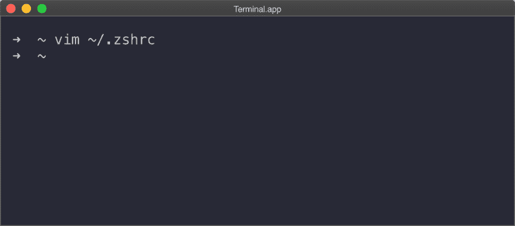
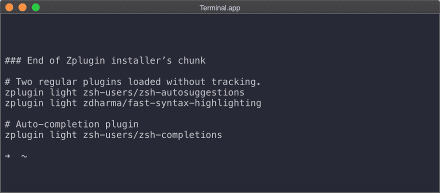

# 开始定制终端

> 原文:[https://dev . to/Carlos white/getting-started-with-customizing-the-terminal-327 p](https://dev.to/carloswhite/getting-started-with-customizing-the-terminal-327p)

本教程将教你终端定制的基本知识。我希望你能跟着来，这样你也可以开始定制你的终端。不过，顺便说一下:这篇文章假设你要么使用 macOS，要么使用 Linux。另外，我假设您已经安装了 Git 和 Vim，并且您正在使用一个包管理器，比如 [Homebrew](https://brew.sh/) 。

## Z 外壳

为了开始对终端进行更改，需要下载并安装一个 *UNIX* shell。更具体地说，我们使用的 UNIX shell 是一个改进的工具包，它允许我们以更具体的方式使用终端。可以把它看作是命令行的改进版本。在这种情况下，我们使用的是 *Zsh* ，也被称为*Z Shell*，这是一个开源的 UNIX shell，已经被成千上万的用户使用，而且碰巧也是开源的。参考[Robby Russel](https://github.com/robbyrussell/oh-my-zsh/wiki/Installing-ZSH)在 GitHub 上撰写的这篇文档，获得关于如何安装 Zsh 的详细指导。

[![[1]installingZSH](img/52300595846a89834f60d1a4ad9929e0.png)T2】](https://res.cloudinary.com/practicaldev/image/fetch/s--C2SMCu6v--/c_limit%2Cf_auto%2Cfl_progressive%2Cq_auto%2Cw_880/https://thepracticaldev.s3.amazonaws.com/i/h39xy5h8bupczxqd4nvk.png)

一旦安装完成，执行 *- version* 命令总是一个好主意。这有助于我们确保安装成功。它应该是这样的:

[![[2]zsh-version@2x](img/027720237c5bab47130f6774cdf74088.png)T2】](https://res.cloudinary.com/practicaldev/image/fetch/s--_RMHWTaY--/c_limit%2Cf_auto%2Cfl_progressive%2Cq_auto%2Cw_880/https://thepracticaldev.s3.amazonaws.com/i/hees2s7p2pcahxl4hw9i.png)

一旦执行了 *- version* ，输出消息应该与此类似:

[![[3]zsh-version@2x](img/437d8702bb0c5cfeafc385c16146900d.png)T2】](https://res.cloudinary.com/practicaldev/image/fetch/s--O1GZ3CJj--/c_limit%2Cf_auto%2Cfl_progressive%2Cq_auto%2Cw_880/https://thepracticaldev.s3.amazonaws.com/i/c8f8tw9dvrknk5jt1ukd.png)

## Oh My Zsh

为了让事情变得更好，我们还安装了一个框架管理器，它将帮助我们管理我们认为未来需要的配置。当 Zsh 允许我们开始调整终端时，哦，我的 Zsh 是神奇发生的地方。它提供了 100 多个插件和主题，对于像我这样的用户来说已经足够了。因为我有朋友喜欢创建自己的插件和主题，所以值得注意的是，Oh My Zsh 是开源的。所以，请放心:如果你碰巧没有在他们的目录中找到你想要的东西，你当然可以自己制作！

我建议使用 *cURL* 安装它:

[![[4]wget@2x](img/bd28bc78d78ae51b7647f17e85172979.png)](https://res.cloudinary.com/practicaldev/image/fetch/s--zDeNmyZI--/c_limit%2Cf_auto%2Cfl_progressive%2Cq_auto%2Cw_880/https://thepracticaldev.s3.amazonaws.com/i/657j69mjvd3arhetb20b.png)*sh-c " $(curl-fsSL[https://raw . githubusercontent . com/robbyrussell/oh-my-zsh/master/tools/install . sh)](https://raw.githubusercontent.com/robbyrussell/oh-my-zsh/master/tools/install.sh))"*

然而，你也可以运行 *Wget* 而不是 cURL:

[![[4]curl@2x](img/8e66b5f0df0f38dabb1592f37a860cd7.png)](https://res.cloudinary.com/practicaldev/image/fetch/s--AHZC-2va--/c_limit%2Cf_auto%2Cfl_progressive%2Cq_auto%2Cw_880/https://thepracticaldev.s3.amazonaws.com/i/tzt7mq78o5q7995gduan.png)*sh-c " $(wget-O-[https://raw . githubusercontent . com/robbyrussell/oh-my-zsh/master/tools/install . sh)](https://raw.githubusercontent.com/robbyrussell/oh-my-zsh/master/tools/install.sh))"*

在这两个安装过程中，您可能会得到如下提示:

[![[5]defaultshell@2x@2x](img/107701408f74eb2a2ac55c7270323dc1.png)T2】](https://res.cloudinary.com/practicaldev/image/fetch/s--c00oNpVF--/c_limit%2Cf_auto%2Cfl_progressive%2Cq_auto%2Cw_880/https://thepracticaldev.s3.amazonaws.com/i/qj7dfwbrwldoenqr4iul.png)

你只需简单的按下 *y* 然后回车。

此时，您想要在正在使用的终端窗口上生效的任何更改都应该在~/上进行。zshrc 文件和**而不是**到 *~/。bash-profile* 。

[![[6]ohMyZsh@2x](img/cfcc603bfe8c0a4b06fc5d5e3c4a2245.png)T2】](https://res.cloudinary.com/practicaldev/image/fetch/s--Wzs20VjA--/c_limit%2Cf_auto%2Cfl_progressive%2Cq_auto%2Cw_880/https://thepracticaldev.s3.amazonaws.com/i/0vi07w2heo5lkr5ejvjk.png)

## 使用 Zplugin 的有用插件

因为这是一个介绍性的帖子，我们将保持事情简单。因此，我们需要安装 [Zplugin](https://github.com/zdharma/zplugin) ，它带来了有用的工具，如命令建议、自动完成和语法高亮。

通过 cURL 执行以下命令:

![[7]zPlugin@2x](img/24cb5d6b5157bab4b0b816ded2246a64.png)*【sh-c " $(curl-fssl】[【https://raw . githubuser content . com/zddharma/zplugin/master/doc/install . sh】](https://raw.githubusercontent.com/zdharma/zplugin/master/doc/install.sh))*

安装完成后，输出消息应该类似于以下内容:

[![[9]zplugininstall@2x](img/ca3c125f7f9d1bf89f89a03bd7b30a17.png)T2】](https://res.cloudinary.com/practicaldev/image/fetch/s--cs2fw4zT--/c_limit%2Cf_auto%2Cfl_progressive%2Cq_auto%2Cw_880/https://thepracticaldev.s3.amazonaws.com/i/uutbodtf7e130c8z85fq.png)

现在，对于下一步，我们将使用 *Vim* 。如果你没有太多使用 Vim 的经验，强烈建议你[在继续之前稍微练习一下](https://www.openvim.com/)。原因是，如果你不知道你在做什么，在使用它的时候把事情弄糟并不难。

打开 *~/。使用 Vim 的 zshrc* :

[T2】](https://res.cloudinary.com/practicaldev/image/fetch/s--Nh2DvyD3--/c_limit%2Cf_auto%2Cfl_progressive%2Cq_auto%2Cw_880/https://thepracticaldev.s3.amazonaws.com/i/6o1dnh6fv2tjf45w0hqy.png)

在文件末尾，找到显示“# # Zplugin 安装程序块的结尾”的行，并添加以下内容:

[T2】](https://res.cloudinary.com/practicaldev/image/fetch/s--5g8YvlLa--/c_limit%2Cf_auto%2Cfl_progressive%2Cq_auto%2Cw_880/https://thepracticaldev.s3.amazonaws.com/i/5crcsul76k3k44r4ace9.png)

由于我们使用的是 Vim，一旦添加了这三行，只需按下 *ESC* 、*和*、 *:wq* 。

搞定了。现在您有了命令建议、自动完成和语法突出显示。

## 安装您的第一个主题

我只是碰巧使用了由 Zeno Rocha 提供的所谓的“Dracula”主题。使用[这个](https://draculatheme.com/)链接查看一下。

在开始安装过程之前，您可能需要完成一个额外的步骤。如果你用的是 macOS 的话。要同意 Xcode 的许可协议，请执行以下操作:

[![[11]xCodeLicense](img/2e00fffbffe457c27629e492daba749c.png)](https://res.cloudinary.com/practicaldev/image/fetch/s--eQs9NeLm--/c_limit%2Cf_auto%2Cfl_progressive%2Cq_auto%2Cw_880/https://thepracticaldev.s3.amazonaws.com/i/rcvdspafhm8szqy9jv4i.png)*sudo xcode build-license*

一旦你同意 Xcode 的许可协议，是时候将 Dracula 主题克隆到 Oh My Zsh 的文件夹中了:

[![[12]gitHubClone@2x](img/e96b37b259369d272be426473de4e493.png)T2】](https://res.cloudinary.com/practicaldev/image/fetch/s--Su3F7ae9--/c_limit%2Cf_auto%2Cfl_progressive%2Cq_auto%2Cw_880/https://thepracticaldev.s3.amazonaws.com/i/jvmtjqv1vru62bswh4ti.png)

现在，我们来编辑一下 *~/。zshrc* 再次使用 Vim，并将其设置为 Dracula:

[![[13]setVim@2x](img/14efe9f116a7ff32fed083a5a2775ceb.png)T2】](https://res.cloudinary.com/practicaldev/image/fetch/s--wVy5RJwv--/c_limit%2Cf_auto%2Cfl_progressive%2Cq_auto%2Cw_880/https://thepracticaldev.s3.amazonaws.com/i/q8vhse6fgv0n5ldgbh5o.png)

## 最后的想法

一旦所有的东西都完全安装好了，我建议重启你的机器，这样我们就可以确保 CPU 被刷新，并且我们在整个教程中所做的更改可以生效。作为一名软件开发人员，我确实花了相当多的时间使用终端。根据我的需求进行裁剪是有意义的——你也应该这样做！