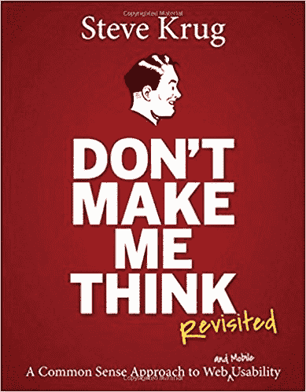
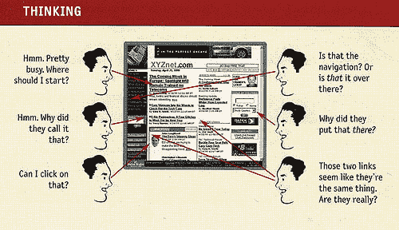
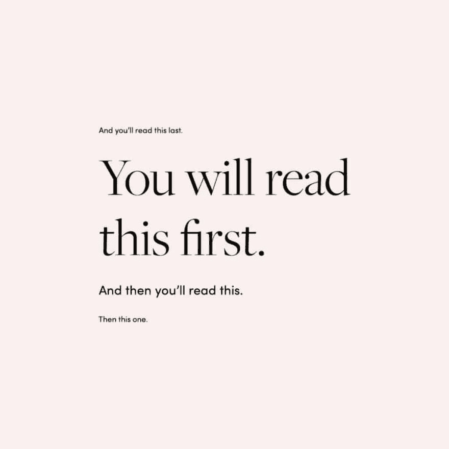
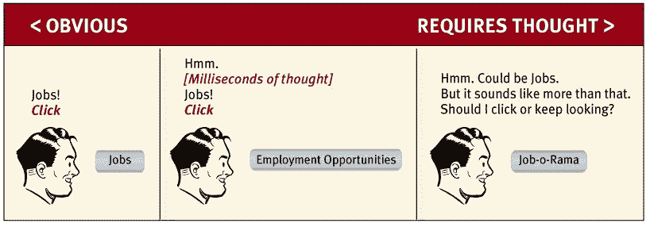

# 不要让我思考！

> 原文:[https://dev.to/harlessmark/don-t-make-me-think-4770](https://dev.to/harlessmark/don-t-make-me-think-4770)

在创建任何网站时，你都应该首先考虑你的用户。他们会带着全新的眼光访问你的网站，从你那里获得一些东西。无论是产品还是服务，信息还是娱乐。你的整个设计过程应该以他们为中心，因为本质上，你想提供他们所寻找的东西。

我是一个非常注重设计的人。我关心东西看起来如何，感觉如何，使用起来有多容易(或愉快)。这很讽刺，因为我有一半时间看起来像狗屎，但这可以通过避免镜子来弥补。你可以想象关闭的屏幕或任何有轻微反光的东西都会给我的日常生活带来问题。

继续前进。我的网络中有几个人向我推荐了几本关于网页设计的书。史蒂夫·克鲁格的一本书[《不要让我思考》](https://www.amazon.com/Dont-Make-Think-Revisited-Usability/dp/0321965515/ref=sr_1_1?keywords=dont+make+me+think&qid=1569250033&sr=8-1)被提及最多。仔细看，它实际上根本不是一本关于网页设计的书，而是一本关于网页可用性的书。有意思。我买了修订版，因为它为移动可用性增加了新的内容。这本书在 2000 年首次出版时并不流行。

声明:自从开始我的编码训练营之旅以来，这本书已经积满了灰尘，所以我只完成了一部分。然而，就像 WebMD 一样，快速的谷歌搜索让我成为了这个领域的专家。

[T2】](https://res.cloudinary.com/practicaldev/image/fetch/s--JjTUv1xE--/c_limit%2Cf_auto%2Cfl_progressive%2Cq_auto%2Cw_880/https://images-na.ssl-images-amazon.cimg/I/51pnouuPO5L._SX387_BO1%2C204%2C203%2C200_.jpg)

这本书的前提是你的网站的用户体验(UX)应该是如此简单，人们不应该在浏览时思考。从设计师的角度来看，我们关注无用的细节，因为这是我们的项目，我们想让它看起来不错，而且会有我们的名字在上面。但是在客户端，他们很可能没有按照你期望的方式使用你的网站。

我什么意思？简而言之，我们总是匆匆忙忙或者不在乎。最长的版本是:

我们不阅读页面，而是浏览页面。

我们真的很擅长扫描。我们并不真的阅读呈现在我们面前的每一个单词。我们一生都在用报纸做这件事，就像用网站一样。

**我们不会做出最优选择，我们会做出第一个合理的选择**

我们不会花时间去权衡网站上的可用选项。我们点击第一个有意义的东西。就像编程一样，选择错误的选项不会有太大的损失。我们总是离重启只差一个“后退按钮”了。

我们不知道它是如何运作的，我们只能蒙混过关。

对我们来说，一个网站或它的任何元素是如何工作的都不重要。我们不在乎，也不会花时间去理解。我们通常会找到有用的东西并坚持下去。

[T2】](https://res.cloudinary.com/practicaldev/image/fetch/s--Fv1tJI4T--/c_limit%2Cf_auto%2Cfl_progressive%2Cq_auto%2Cw_880/http://desource.uvu.edu/dgm/2740/IN/steinja/docs/krug-dont_make_me_think/chimg/File0597.jpg)

史蒂夫·克鲁格在整本书中都在谈论 UX。但是这到底是什么意思呢？Dictionary.com 将其定义为“一个人使用网站或计算机应用程序等产品的整体体验，特别是在使用起来有多容易或令人愉快方面。”很简单，如果你的网站的用户体验很糟糕，人们就会回避它。克鲁格详细讲述了如何让网站变得更简单，或者更令人愉快。他称之为高级常识，我认为这是描述它的最佳词汇组合。以下是他的一些基本原则:

**1。扫描设计**

始终使用普遍接受的约定。当我们看到“停车标志”时，我们知道，我们可以毫不犹豫地理解它的意思。但是，更重要的是，许多其他国家使用同样的红色八角形标志。我们可以通过使用普遍接受的元素，如图标、措辞和网站标题等重要元素的位置，将这种意识形态带到 UX。为扫描而设计你的网站的其他方法是创建视觉层次，并使什么是可点击的显而易见。

[T2】](https://res.cloudinary.com/practicaldev/image/fetch/s--hGLD6tPD--/c_limit%2Cf_auto%2Cfl_progressive%2Cq_auto%2Cw_880/https://z2an0huuix-flywheel.netdna-ssl.com/wp-content/uploads/2019/07/visual_hierarchy-2-1024x1024.jpg)

**2。轻松导航**

简而言之，如果没有人能轻易找到他们想要的东西，他们就会离开。整个网站的导航应该是持久的。如果你不能精确地复制它们，你的布局应该非常相似。每一页都应该有一个清晰的名字来告诉用户他们在哪里。面包屑是一个很好的方法来做到这一点！Krug 指出，用户应该能够在主页上点击 1-3 次就可以到达他们想要的地方。

**3。不要让我思考！**

只是为了把这匹死马敲得更远一点。用户只需*得到它*。他们花在解决问题上的时间越多，他们返回搜索结果寻找更清晰网站的可能性就越大。

[T2】](https://res.cloudinary.com/practicaldev/image/fetch/s--_Q59Hd1S--/c_limit%2Cf_auto%2Cfl_progressive%2Cq_auto%2Cw_880/https://cdn.searchenginejournal.com/wp-content/uploads/2014/06/Screen-Shot-2014-06-04-at-4.30.43-PM.png)

大公司在可用性测试上投入了数百万美元——观看普通的 Joe Schmoe 浏览他们的网站，看看他们的眼睛跟踪哪里，他们点击的链接，以及他们到达他们需要的地方需要多快(或多慢)。作为一个网络开发者，我们没有足够的钱来进行这样的研究，但是我们有朋友，不是吗？对吧，伙计们？