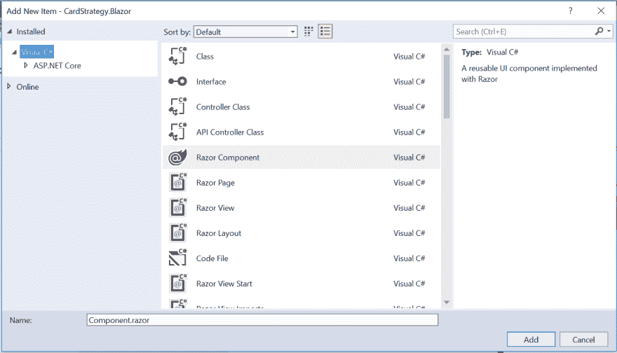

# 使用 Blazor 组件

> 原文：<https://dev.to/pcmichaels/using-blazor-components-2kdk>

假设您正在编写一个 Blazor 应用程序——可能类似于[这个](https://github.com/pcmichaels/BlackJackStrategy)。现在，假设您的主视图中有一大块 HTML。你可能会想:我希望我使用的是 React，那么我就可以把它分离成自己的组件。

你也可以在 Blazor 中这样做。以下是方法。

# Blazor 中的组件

让我们从移动代码开始。第一步是剪切你的 HTML 并粘贴到一个新的 Razor 组件中:

[](https://www.pmichaels.net/wp-content/uploads/2019/08/razor-components.png)

您的新组件的格式，从头开始，将是:

```
 <h3>Component Name</h3>

    @code {

    } 
```

您现有的代码应该放在下面，而不是:

```
<h3>Component Name</h3> 
```

# 因素

@code 部分允许您将各种疯狂的 C#代码放在 type model 后面的代码中——所以您可能不想使用那个，除了传递参数；例如:

```
@code {
    [Parameter]
    private string MyParameter { get; set; }
} 
```

这允许您将字符串传递到组件中；例如(在您的主视图中):

```
<MyComponent MyParameter="test" /> 
```

# 复杂参数

到目前为止一切顺利。但是如果你需要一个复杂类型呢？例如，您可以将一个[视图模型](https://www.pmichaels.net/2019/07/07/using-view-models-in-blazor/)传递到您的组件:

```
[Parameter]
private MyViewModel MyViewModel { get; set; } 
```

您可以将它传递给组件，就像它是一个原始类型一样:

```
<MyComponent MyViewModel="@MyViewModel" /> 
```

这意味着您可以在不做任何更改的情况下提升和移动代码。

# 使用外部名称空间

与标准 C#一样，您可以访问当前名称空间中的任何内容。如果您需要任何不在当前名称空间中的类，您可以在文件的顶部声明它们，就像这样:

```
@using MVVMShirt

<h3>My Component</h3> 
```

# 摘要

Blazor 仍处于起步阶段，但希望将实际代码添加到这些@code 部分会像代码隐藏一样令人不快。