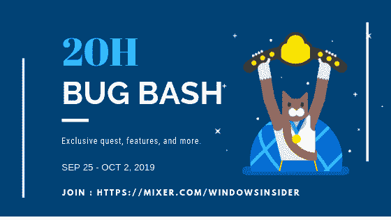

# 微软 Windows 错误大会 2019

> 原文:[https://dev . to/logeshpalani 98/Microsoft-windows-bug-bash-2019-5h8n](https://dev.to/logeshpalani98/microsoft-windows-bug-bash-2019-5h8n)

[T2】](https://1.bp.blogspot.com/-ekgh5zDLvTA/XYjxTUib18I/AAAAAAAAPD4/-ZODJ-0f4Vc7htRdktn3fpVYWcTUHRd6ACLcBGAsYHQ/s1600/Windows%2BInsider%2Bbug%2Bbash.png)

```
 The Bug Bash main goal is to improve the user experience of windows, by pulling issues and suggestions from windows insiders and windows users.  This webcast creates a quest and forums to announce the features and new tasks to report the bug, problem and gives some better ideas to improve the windows. 
```

为什么你应该参加 Bug Bush？

```
 If you facing any problem like a performance or installation problem in your windows, you can directly report to the Windows Engineer Team to fix the problem and improve the window experience. 
```

如何参加 Bug Bash？

*   确保您的 PC 运行快速环中的最新预览版本(版本 18985)。
*   清除任务，以了解任务结束时反馈中心窗口中的新功能。
*   当你点击 windows + F 将进入另一个窗口，在那里你可以提供带有截图的反馈。

链接加入 Bug Bash-[https://mixer.com/WindowsInsider](https://mixer.com/WindowsInsider)