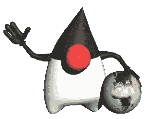
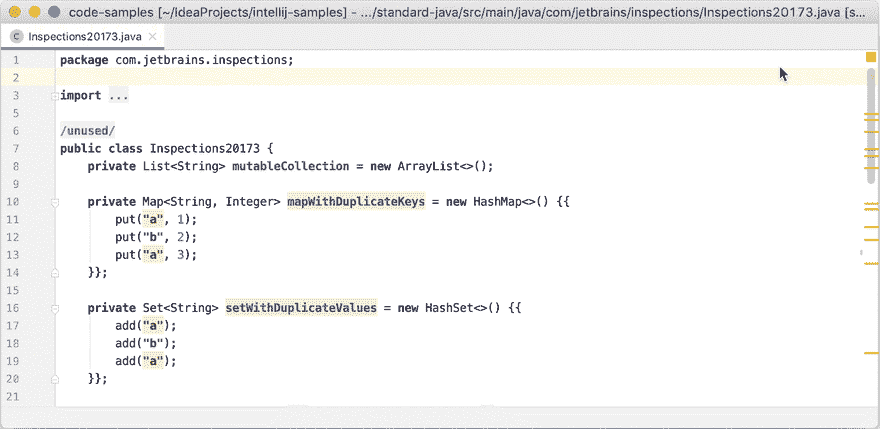

# 您的 Java 代码真的可以投入生产了吗？

> 原文：<https://dev.to/scottshipp/is-your-java-code-really-production-ready-ogp>

你的 Java 真的准备好投入生产了吗？

这里有五个编写 Java 的技巧，可以抵御用户的滥用！

[](https://res.cloudinary.com/practicaldev/image/fetch/s--6-UmkpTC--/c_limit%2Cf_auto%2Cfl_progressive%2Cq_auto%2Cw_880/https://thepracticaldev.s3.amazonaws.com/i/s7m43b5nejlbhdlkzh1m.jpg)

## 写哑代码

我的文章[为什么高级开发人员写愚蠢的代码以及如何从一英里外发现初级开发人员](https://medium.com/hackernoon/why-senior-devs-write-dumb-code-and-how-to-spot-a-junior-from-a-mile-away-27fa263b101a)仍然经常在 Twitter 上分享，尽管它已经发表了将近两年。写愚蠢代码的建议不是我的，是 Java 架构师 Brian Goetz 的，[说](https://www.oracle.com/technetwork/articles/javase/devinsight-1-139780.html#1):

> 通常，在 Java 应用程序中编写快速代码的方法是编写哑代码——简单明了的代码，遵循最明显的面向对象原则。

这是接吻原则的延伸，基本意思是:避免耍小聪明。按照设计意图编写简单的代码。知道并写出[有效的 Java](https://www.pearson.com/us/higher-education/program/Bloch-Effective-Java-3rd-Edition/PGM1763855.html) 。

但是“哑代码”还有另一个好处:编译器知道如何优化它。所以你也获得了性能的提高。

## 从最具防御性的选项开始

你可能听说过一些建议，你应该限制方法或变量的可见性，还有一些关于封装的建议。这听起来有点无聊，科学，让人打哈欠。

[](https://res.cloudinary.com/practicaldev/image/fetch/s--SrTFm2OG--/c_limit%2Cf_auto%2Cfl_progressive%2Cq_auto%2Cw_880/https://thepracticaldev.s3.amazonaws.com/i/zpxthpf66evk0bz24r1e.jpg)

同时，大多数 Java 教程都会提供一些类的例子，在这些类中唯一使用的可访问性修饰符是`public`。IDE 类生成似乎也默认为公共类和方法。如果你在 IDE 中完全生成一个类，你一定会得到这样的结果:

```
public class Contact {
    private String name;
    private String emailAddress;

    public Contact(String name, String emailAddress) {
        this.name = name;
        this.emailAddress = emailAddress;
    }

    public String getName() {
        return name;
    }

    public void setName(String name) {
        this.name = name;
    }

    public String getEmailAddress() {
        return emailAddress;
    }

    public void setEmailAddress(String emailAddress) {
        this.emailAddress = emailAddress;
    }
} 
```

<svg width="20px" height="20px" viewBox="0 0 24 24" class="highlight-action crayons-icon highlight-action--fullscreen-on"><title>Enter fullscreen mode</title></svg> <svg width="20px" height="20px" viewBox="0 0 24 24" class="highlight-action crayons-icon highlight-action--fullscreen-off"><title>Exit fullscreen mode</title></svg>

相反，我建议开发者从最具防御性的选项开始，只有在必要的时候才放松到防御性较低的选项。所以对于上面的例子，让每个成员变量`final`和[避免实现 getters 或 setter](https://dev.to/scottshipp/avoid-getters-and-setters-whenever-possible-c8m)，除非你能证明你需要它们。

此外，对于任何构造函数或方法，默认为 package-private。回顾一下 [Java 访问修饰符](https://docs.oracle.com/javase/tutorial/java/javaOO/accesscontrol.html)可能会有帮助。

因此，在成为其他代码之前，先前的代码成为以下代码:

```
class Contact {
    private final String name;
    private final String emailAddress;

    Contact(String name, String emailAddress) {
        this.name = name;
        this.emailAddress = emailAddress;
    }
} 
```

<svg width="20px" height="20px" viewBox="0 0 24 24" class="highlight-action crayons-icon highlight-action--fullscreen-on"><title>Enter fullscreen mode</title></svg> <svg width="20px" height="20px" viewBox="0 0 24 24" class="highlight-action crayons-icon highlight-action--fullscreen-off"><title>Exit fullscreen mode</title></svg>

像这样编写代码的开发人员正在防御性地考虑范围和不变性，这是一件好事。此外，这引出了我的下一点。

[](https://res.cloudinary.com/practicaldev/image/fetch/s--9HR17e3o--/c_limit%2Cf_auto%2Cfl_progressive%2Cq_auto%2Cw_880/https://thepracticaldev.s3.amazonaws.com/i/qedd8xqzhivh7i0565cx.png)

## 喜欢揭露行为胜过状态

您可能已经注意到，您不能对根据我的“起点”指南编写的`Contact`实例做任何事情。没错。所以你可能想知道从那里你去哪里？我的回答是:[更喜欢揭露行为而不是状态](https://dev.to/scottshipp/encapsulate-state-and-expose-behavior-when-writing-object-oriented-code-ea5)。

这就产生了一个问题，*你想用`Contact`做什么？*一个[数据传输对象](https://en.wikipedia.org/wiki/Data_transfer_object)的目的实际上是把状态带到某个地方，而一个普通对象的目的应该是提供行为，这两者之间有很大的区别。

也许后者很难想象，所以让我提供一个简单的邮件应用程序的例子，我们需要从我们的联系人列表中得到给联系人发电子邮件的能力。在一个简单的邮件应用程序中，我建议将`Contact`作为该行为的来源。

```
public class Contact implements Emailable {
    // ...

    @Override
    public EmailResult sendEmailTo(Contact destination, String body) {
        // ...
    }
} 
```

<svg width="20px" height="20px" viewBox="0 0 24 24" class="highlight-action crayons-icon highlight-action--fullscreen-on"><title>Enter fullscreen mode</title></svg> <svg width="20px" height="20px" viewBox="0 0 24 24" class="highlight-action crayons-icon highlight-action--fullscreen-off"><title>Exit fullscreen mode</title></svg>

随着应用程序的发展，这种方法可能会消失。但是现在这是个好主意。注意，构成`Contact`对象状态的名称和电子邮件地址也在该对象中使用。这以一种整齐的方式将状态和行为组织在一起，并消除了公开共享任何状态的需要。

如果`Contact`的目的是传输数据，那么让它成为一个[不可变的对象](https://docs.oracle.com/javase/tutorial/essential/concurrency/immutable.html),它既是线程安全的，又能防止意外编程错误错误地设置它的值。

[](https://res.cloudinary.com/practicaldev/image/fetch/s--Btbv8TRz--/c_limit%2Cf_auto%2Cfl_progressive%2Cq_auto%2Cw_880/https://thepracticaldev.s3.amazonaws.com/i/x7r7u0d4ovtcjkelr2h7.png)

## 编写综合测试

测试通常是在截止日期压力下被放到砧板上的第一步。这种人类心理的不幸结果是潜在致命的。大型复杂应用程序中的 Java 应该被认为是有问题的，除非得到证明。只有测试才能证明事实并非如此。

> 大型复杂应用程序中的 Java 应该被认为是有问题的，除非得到证明。

了解类似于 [JUnit](https://junit.org/) 的测试框架和类似于 [Mockito](https://site.mockito.org/) 的相关工具。

学习优秀测试实践的两大资源包括杰拉德·梅萨罗什的 [xUnit 测试模式](http://xunitpatterns.com/)和杰夫·朗格的[Java 8 实用单元测试](https://pragprog.com/book/utj2/pragmatic-unit-testing-in-java-8-with-junit)。

## 修复 linter 和 IDE 警告

除了编译器告诉你的，让 IDE 和静态分析工具像 [CheckStyle](https://checkstyle.org/) 告诉你你的代码可以更现代，更安全，更正确。IntelliJ IDEA 有一个很棒的[代码检查](https://www.jetbrains.com/help/idea/code-inspection.html)特性，就像在你构建应用程序的时候有一个 Java 专家在你身边。不要浪费这个建议！

[](https://res.cloudinary.com/practicaldev/image/fetch/s--WthauMwT--/c_limit%2Cf_auto%2Cfl_progressive%2Cq_66%2Cw_880/https://thepracticaldev.s3.amazonaws.com/i/nahkdxtkpo0ysu1foeoa.gif) 
*IntelliJ 代码检查，承蒙 IntelliJ 帮助*

## 制作 Java！

遵循这些提示将会产生生产就绪的 Java！那就是:经得起野外的 Java。Java 是一种伟大的语言，它有一个有用的编译器和一个强大的工具和库生态系统来帮助提高和确保质量。通过遵循最佳实践并利用这些工具，我确信任何应用程序都可以得到改进，作为 Java 开发人员，您可以忙于重要的事情——构建您的应用程序——而不是将所有时间都花在修复可能在早期被发现的 bug 上。祝你好运！