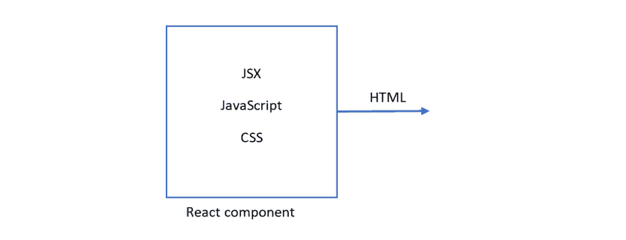
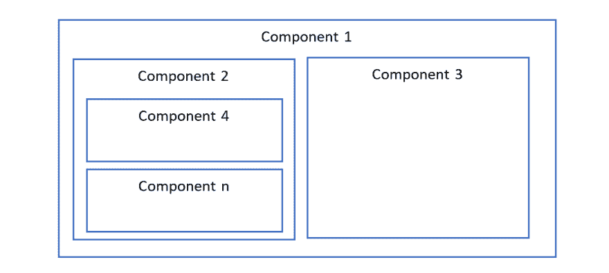

# 无需代码的 React 简介—第 1 部分

> 原文:[https://dev . to/hi _ iam _ Chris/intro-to-react-without-code-part-1-23 h1](https://dev.to/hi_iam_chris/intro-to-react-without-code-part-1-23h1)

### 为什么没有代码

互联网上有许多关于 React 入门的教程，比如 React 中的待办事项列表和 hello world 项目。然而，我发现 React 到底是什么以及它是如何工作的这个概念对许多人来说仍然很困惑。这就是为什么在这篇文章中，我将关注什么是 React 组件，什么是技术。这篇文章不会展示任何代码样本，讨论 React 如何在幕后工作，或者为什么它比其他解决方案更好或更差。这只是一个玩笑。

### 什么是反应

首先，解释一下 React 是什么。我可以详细描述它是一个图书馆，还是 JSX 或其他什么地方，但我不会。就把它想象成一个用来构建 web 应用程序的工具吧。这个工具结合了三种经常一起工作的编程语言:JavaScript、JSX(类似 XML 的语言)和 CSS。

### 语言是用来做什么的？

其次，在深入研究 React 如何工作的细节之前，让我们来看看这三种语言分别用于？

每个 React 组件都做一些工作。这可以是加载数据，做一些计算或其他事情。这项工作由 JavaScript 完成。

为了显示我们的组件，我们需要定义它们的显示结构。是列表还是表格，哪些元素分组在一起，哪些是分开的？为此，我们使用 JSX。JSX 是一种类似 XML 的标记语言，我们用它来定义我们的显示结构。

最后一部分是 CSS。当我们有了结构和逻辑，我们的组件需要看起来很漂亮。这就是 CSS 的用武之地。它用于定义我们的应用程序的外观和感觉。我们可以定义使用什么风格的字体，背景颜色，边框和许多其他我们想要实现的设计决策。

### 反应元件

到目前为止，我已经多次使用了术语“反应组件”。在我继续做任何事情之前，理解什么是组件是很重要的。组件是结合了 JavaScript、JSX 和 CSS 的构建块。一旦所有组件都粘合在一起，组件就为我们的浏览器提供了最终的显示输出。

[T2】](https://res.cloudinary.com/practicaldev/image/fetch/s--PkWCSeRP--/c_limit%2Cf_auto%2Cfl_progressive%2Cq_auto%2Cw_880/https://thepracticaldev.s3.amazonaws.com/i/rnrxh544te6k151t0ecv.PNG)

### 现在它在应用中是如何工作的呢？

有可能在单个组件中创建一个完整的应用程序。但是由于几个不同的原因，这不是最好的选择。大型组件不可重用，它们难以修改，难以测试，更多的功能通常意味着更多的故障点。因此，我们通常将应用程序拆分成许多小组件。

将这种组织方式与现实生活中的例子联系起来，把每个组件想象成一个乐高积木。单块做不了多少。拥有一个大块并没有多大用处，因为它不太灵活。然而，有了许多小积木，我们可以建造许多不同的东西。组件可以与其他组件组合，每个组件可以包含单独的组件。

[T2】](https://res.cloudinary.com/practicaldev/image/fetch/s--xcYfEQOy--/c_limit%2Cf_auto%2Cfl_progressive%2Cq_auto%2Cw_880/https://thepracticaldev.s3.amazonaws.com/i/3xs273zf7022y75s1gga.PNG)

作为拆分组件的另一个例子，我们可以看一辆汽车。汽车有许多功能，可以看作是一个完整的整体。但是当我们更深入地观察它，我们可以看到许多更小的部分，每一个都做着自己的工作。有一个引擎，座位，休息，镜子等等。每一个部分都是具有各自功能的小部分的组合。以轮子为例。它有一个金属轮毂附在车轴上，有一个内胎，一个轮胎和一个轮辋。

我们可以用同样的方式来看一个 React 应用程序。我们构建了许多小部分，当它们组合在一起时，就成为一个完整的应用程序。我已经提到过，每个组件都为我们提供了一个显示在浏览器中的输出结果。如果我们想到我们的脸书网页，它是使用不同的组件构建的。其中一个组件是聊天窗口，另一个是联系人列表，时间轴也是另一个组件，上面的每个帖子也是一个组件。当我们组合所有这些组件的输出时，我们得到了一个完整的 web 应用程序解决方案。

### 总结起来

在 React 中还有许多其他重要的事情需要了解。如何编写组件、生命周期、状态等等。但是我真的希望这篇文章解释了什么是组件，它的目的是什么，以及它们是如何组合在一起的。在下一篇文章中，我将更多地关注数据组件的工作，包括传递的和内部的。