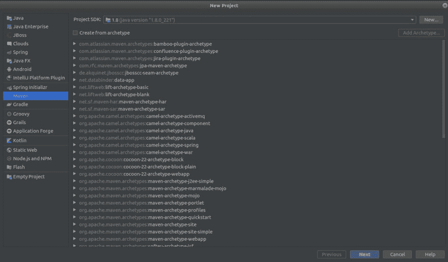
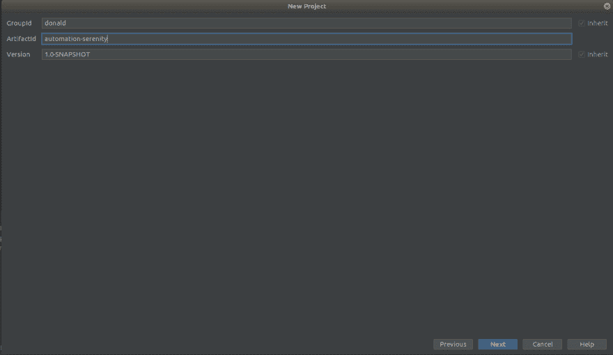
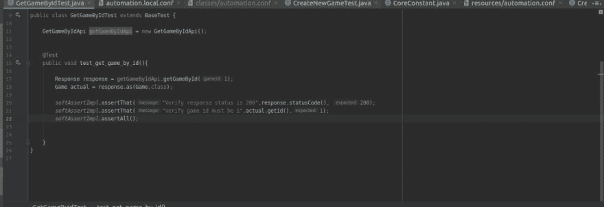

# Serenity 自动化框架——第 1/4 部分——用 API 进行自动化测试

> 原文：<https://dev.to/cuongld2/serenity-automation-framework-part-1-4-automation-test-with-api-2mb5>

当从头开始构建一个自动化框架时，要考虑的主要大事是如何选择一个现有的库/框架来支持我们。(是的，您可以在没有任何现有库/框架支持的情况下创建自动化框架，但是这需要大量的时间和资源)。

因此，我们选择使用的框架应该具有以下特征:

*   支持不同类型的测试(API、UI、移动..)
*   支持并行测试(以减少执行测试的时间)
*   与其他测试管理工具集成(例如 Testrail)..

根据我的经验，Python 的最佳匹配框架是 pytest(我目前的工作就是做这个)，Java 的最佳匹配框架是 Serenity。

在这个系列教程中，我将向您展示如何开始使用 Serenity。

[](https://res.cloudinary.com/practicaldev/image/fetch/s--sXoBq6qY--/c_limit%2Cf_auto%2Cfl_progressive%2Cq_auto%2Cw_880/https://thepracticaldev.s3.amazonaws.com/i/05nscjahw5y7i9ctncd8.png)

你可以在[宁静/修昔底德](http://www.thucydides.info/#/)中找到宁静

它以前的名字是修昔底德，后来改为宁静(我在某个地方听到他们说为了更好的发音)。

简而言之，Serenity 就像一个 Selenium 的包装器，而且还支持处理 API。他们的哲学是关于 BDD 的，他们为屏幕播放引入了新的设计模式(我认为如果我们正确应用的话，可以更好的理解和维护)。

此外，他们的创建者(John Fergurson)表示，使用 Serenity 可以为我们正在测试的功能创建实时文档。(我总是认为很难记录这些特性，因为会有很多变化、更新..所以宁静的哲学在我看来很好)。

简短的介绍就到此为止。在 Serenity 的第一篇博文中，我将展示如何测试 API 的快速示例。

I .创建一些要测试的 API:

关于如何创建 API 的指南，请遵循本教程[用 Spring 和 Tomcat 创建游戏列表 API](https://dev.to/cuongld2/create-simple-rest-api-for-practice-automation-testing-md8)

要运行应用程序，只需运行:“mvn tomcat7:run”

二。使用 Serenity 实现 API 测试:

1.创建新的 maven 项目:

我通常用 IntelliJ 编写 Java 代码(反正我是 Jetbrains 产品的忠实粉丝:))

你可以用 Eclipse、Netbeans 或者任何你喜欢的东西来编码

要在 IntelliJ 中创建新项目:转到文件->新建->项目-> Maven

[](https://res.cloudinary.com/practicaldev/image/fetch/s--eCHHjCVI--/c_limit%2Cf_auto%2Cfl_progressive%2Cq_auto%2Cw_880/https://thepracticaldev.s3.amazonaws.com/i/7s9qrtbhianvrohno9ew.png)

在那之后，你可以用任何你想要的名字来命名你的 groupd-ID，工件 ID。

[](https://res.cloudinary.com/practicaldev/image/fetch/s--fISYZ4yu--/c_limit%2Cf_auto%2Cfl_progressive%2Cq_auto%2Cw_880/https://thepracticaldev.s3.amazonaws.com/i/qe6ya2pk0aqph0mdeebh.png)

命名项目后完成

2.关于 pom 文件:

POM 文件是存储你可能使用的库或插件的信息的地方。

POM 文件将如下所示:

```
 <?xml version="1.0" encoding="UTF-8"?>
<project xmlns="http://maven.apache.org/POM/4.0.0"
         xmlns:xsi="http://www.w3.org/2001/XMLSchema-instance"
         xsi:schemaLocation="http://maven.apache.org/POM/4.0.0 http://maven.apache.org/xsd/maven-4.0.0.xsd">
    <modelVersion>4.0.0</modelVersion> 
    <groupId>donald</groupId>
    <artifactId>serenity-guideline</artifactId>
    <version>1.0-SNAPSHOT</version>
    <build>
        <plugins>
            <plugin>
                <groupId>org.apache.maven.plugins</groupId>
                <artifactId>maven-compiler-plugin</artifactId>
                <configuration>
                    <source>8</source>
                    <target>8</target>
                </configuration>
            </plugin>
        </plugins>
    </build> 
    <properties>
        <serenity.maven.version>2.0.71</serenity.maven.version>
    </properties> 
    <dependencies>
        <!-- https://mvnrepository.com/artifact/net.serenity-bdd/serenity-rest-assured -->
        <dependency>
            <groupId>net.serenity-bdd</groupId>
            <artifactId>serenity-rest-assured</artifactId>
            <version>${serenity.maven.version}</version>
        </dependency>
        <!-- https://mvnrepository.com/artifact/org.assertj/assertj-core -->
        <dependency>
            <groupId>org.assertj</groupId>
            <artifactId>assertj-core</artifactId>
            <version>3.13.2</version>
            <scope>test</scope>
        </dependency>
        <dependency>
            <groupId>org.assertj</groupId>
            <artifactId>assertj-core</artifactId>
            <version>3.13.2</version>
            <scope>compile</scope>
        </dependency>
        <!-- https://mvnrepository.com/artifact/org.json/json -->
        <dependency>
            <groupId>org.json</groupId>
            <artifactId>json</artifactId>
            <version>20190722</version>
        </dependency>
        <!-- https://mvnrepository.com/artifact/uk.co.datumedge/hamcrest-json -->
        <dependency>
            <groupId>uk.co.datumedge</groupId>
            <artifactId>hamcrest-json</artifactId>
            <version>0.2</version>
            <scope>test</scope>
        </dependency>
        <dependency>
            <groupId>uk.co.datumedge</groupId>
            <artifactId>hamcrest-json</artifactId>
            <version>0.2</version>
            <scope>compile</scope>
        </dependency>
        <!-- https://mvnrepository.com/artifact/org.jooq/jool -->
        <dependency>
            <groupId>org.jooq</groupId>
            <artifactId>jool</artifactId>
            <version>0.9.14</version>
        </dependency>
    </dependencies> 

</project> 
```

Enter fullscreen mode Exit fullscreen mode

我们需要声明 serenity restassured libs(因为我们正在测试 API)。

你可以在[这里](http://rest-assured.io/)查看更多关于 restassured 的信息

除了 serenity-restassured 的依赖，我们将使用 other 来设置断言的 util，解析模型对象 json。

提示:在 IntelliJ 中，您可以选择为 maven 项目启用自动导入，这样当您添加新的依赖项时，它会立即应用到项目中，以获得更好的编码体验。

3.测试项目结构:

我们将有主包和测试包

在 main :
java:我们会实现常用的 utils(写软断言，解析对象)和调用 API 函数

调用 API 创建新游戏

```
 import common.CoreConstant;
import io.restassured.response.Response;
import models.features.gamelist.Game;
import common.ApiUtil;
import static net.serenitybdd.rest.SerenityRest.given;

public class CreateNewGameApi {

    public Response createNewGame(Game gameInput) {

        return given().baseUri(CoreConstant.GAMELIST_HOST + CoreConstant.GAMELIST_API)
                .header("Content-Type", "application/json")
                .body(ApiUtil.parseObjectToJSON(gameInput, Game.class))
                .when()
                .post();
    }

} 
```

Enter fullscreen mode Exit fullscreen mode

所有关于 url、api_path 的信息都将存储在 CoreConstant 类中

对于 API 的主体部分输入，我已经创建了 ApiUtil 来处理 object 和 json 之间的解析。
你只需要为游戏道具
创建模型类

```
public class Game {

    private Integer id;
    private String title;
    private String author;

    public Game() {
    }

    public Integer getId() {
        return id;
    }

    public void setId(Integer id) {
        this.id = id;
    }

    public String getTitle() {
        return title;
    }

    public void setTitle(String title) {
        this.title = title;
    }

    public String getAuthor() {
        return author;
    }

    public void setAuthor(String author) {
        this.author = author;
    }
} 
```

Enter fullscreen mode Exit fullscreen mode

我们将使用 typesafe 函数。
它将读取 automation.env.conf 中的信息，这取决于我们正在使用哪个 env

```
 public class CoreConstant {

    private static Config conf;

    static {
        conf = Configs.newBuilder()
                .withResource("automation.conf")
                .withResource("automation." + Env.get().getName() + ".conf")
                .build();
    }

    public static final String GAMELIST_HOST = conf.getString("localhost.url");
    public static final String GAMELIST_API = conf.getString("gamelist.api");

} 
```

Enter fullscreen mode Exit fullscreen mode

资源:我们将为关于 app_url 和 api_url 的配置信息存储 automation.conf 和 automation.local.conf

我们需要区分本地环境和其他环境，如开发、测试、用户验收测试...将来，如果您想为其他 env 实现，您可以创建像 automation.dev.conf 这样的配置文件..

在测试中:
java:我们将使用 jUnit
实现测试

```
 public class CreateNewGameTest extends BaseTest {

    private CreateNewGameApi createNewGame = new CreateNewGameApi();
    private Game gameInput = new Game();

    @Test
    public void test_create_game_success(){
        gameInput.setId(10);
        gameInput.setAuthor("Donald");
        gameInput.setTitle("Serenity Demo");

        Response response = createNewGame.createNewGame(gameInput);
        softAssertImpl.assertThat("Response code must be 200", response.statusCode(), 200);
        softAssertImpl.assertThat("Text response must be like : Game created with id",response.getBody().asString().contains("Game created with id"), true);
        softAssertImpl.assertAll();
        response.prettyPrint();

    }

} 
```

Enter fullscreen mode Exit fullscreen mode

Serenity 也支持使用黄瓜和剧本模式，但因为我们只测试 API，所以我认为没有必要实现它。

使用 Cucumber 和 screenplay 的演示将在第 2 节和第 3 节进行，因为我将使用 GUI 测试进行演示。

4.运行测试

要从 IDE 中运行测试，只需点击运行按钮:
[](https://res.cloudinary.com/practicaldev/image/fetch/s--YHzqmPxP--/c_limit%2Cf_auto%2Cfl_progressive%2Cq_auto%2Cw_880/https://thepracticaldev.s3.amazonaws.com/i/j81yqsik42hmustetoiz.png)

或者你可以从命令行运行:
mvn 测试

照例可以参考 github 里的源代码。
这里是回购[宁静——指引](https://github.com/cuongld2/serenityguideline)

5.练习:
在本教程中，我没有涉及到测试修改游戏物品 API 和删除物品 API。

喜欢就把这两个当做练习。

下一篇教程我将讲述如何使用 Serenity 测试 GUI

喜欢请点赞或评论。这对我意义重大。
平安！！！

注意:如果你觉得这个博客对你有帮助，想表达你的感激之情，请随时访问:

[](https://www.buymeacoffee.com/dOaeSPv)

这将有助于我贡献更多有价值的内容。