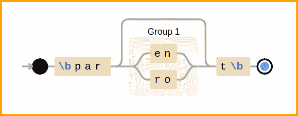

# Python 正则表达式清单和示例

> 原文：<https://dev.to/learnbyexample/python-regular-expression-cheatsheet-and-examples-20bn>

[](https://res.cloudinary.com/practicaldev/image/fetch/s--pFUR4wuS--/c_limit%2Cf_auto%2Cfl_progressive%2Cq_auto%2Cw_880/https://learnbyexample.github.img/books/pyregex_example.png)

*上面的可视化是使用* [debuggex](https://www.debuggex.com) *为模式* `r'\bpar(en|ro)?t\b'`创建的截图

来自 [docs.python: re](https://docs.python.org/3/library/re.html) :

> 正则表达式(或 RE)指定一组与之匹配的字符串；这个模块中的函数允许你检查一个特定的字符串是否匹配一个给定的正则表达式

这篇博文给出了由`re`内置模块(Python 3.8+)实现的正则表达式语法的概述和例子。除非另有说明，否则假定为 ASCII 字符集。本帖节选自我的 [Python re(gex)？](https://github.com/learnbyexample/py_regular_expressions)书。

## 定义正则表达式的元素

| 锚 | 描述 |
| --- | --- |
| `\A` | 将匹配限制在字符串的开头 |
| `\Z` | 将匹配限制在字符串末尾 |
| `^` | 将匹配限制在行首 |
| `$` | 将匹配限制到行尾 |
| `\n` | 换行符用作行分隔符 |
| `re.MULTILINE`或`re.M` | 将输入视为多行字符串的标志 |
| `\b` | 将匹配限制在单词的开头/结尾 |
|  | 单词字符:字母、数字、下划线 |
| `\B` | 在`\b`不匹配的地方匹配 |

`^`、`$`和`\`是上表中的元字符，因为这些字符有特殊的含义。为一个`\`字符添加前缀，以去除特殊含义，并逐字匹配此类字符。例如，`\^`将匹配一个`^`字符，而不是充当主播。

| 特征 | 描述 |
| --- | --- |
| `&#124;` | 多个环组合为条件或 |
|  | 每个备选方案都可以有独立的锚点 |
| `(RE)` | 组模式，也是捕获组 |
|  | `a(b&#124;c)d`与`abd&#124;acd`相同 |
| `(?:RE)` | 非捕获组 |
| `(?P<name>pat)` | 命名捕获组 |
| `.` | 匹配除换行符`\n`之外的任何字符 |
| `[]` | 字符类，匹配多个字符中的一个 |

| 贪婪量词 | 描述 |
| --- | --- |
| `*` | 匹配零次或多次 |
| `+` | 匹配一次或多次 |
| `?` | 匹配零次或一次 |
| `{m,n}` | 匹配`m`到`n`次(含) |
| `{m,}` | 匹配至少 m 次 |
| `{,n}` | 最多匹配`n`次(包括`0`次) |
| `{n}` | 精确匹配 n 次 |
| `pat1.*pat2` | 在`pat1`和`pat2`之间的任意数量的字符 |
| `pat1.*pat2&#124;pat2.*pat1` | 以任意顺序匹配`pat1`和`pat2` |

这里的 Greedy 意味着上述量词将尽可能地匹配，同时也尊重整体 re。给贪婪量词加上一个`?`会使它们**成为非贪婪**，也就是说，尽可能与*最小程度地*匹配。量词可以应用于文字字符、组、反向引用和字符类。

| 字符类 | 描述 |
| --- | --- |
| `[aeiou]` | 匹配任何元音 |
| `[^aeiou]` | `^`反转选择，因此它匹配任何辅音 |
| `[a-f]` | `-`定义了一个范围，所以它匹配任何 abcdef 字符 |
| `\d` | 匹配一个数字，同`[0-9]` |
| `\D` | 匹配非数字，与`[^0-9]`或`[^\d]`相同 |
| `\w` | 匹配单词字符，同`[a-zA-Z0-9_]` |
| `\W` | 匹配非文字字符，同`[^a-zA-Z0-9_]`或`[^\w]` |
| `\s` | 匹配空白字符，与`[\ \t\n\r\f\v]`相同 |
| `\S` | 匹配非空白字符，与`[^\ \t\n\r\f\v]`或`[^\s]`相同 |

| 四处看看 | 描述 |
| --- | --- |
| 四处看看 | 自定义断言，像锚点一样零宽度 |
| `(?!pat)` | 负前瞻断言 |
| `(?<!pat)` | 负回顾断言 |
| `(?=pat)` | 正向前瞻断言 |
| `(?<=pat)` | 正后视断言 |
| `(?!pat1)(?=pat2)` | 可以以任何顺序指定多个断言 |
|  | 因为它们标记匹配的位置而不消耗字符 |
| `((?!pat).)*` | 否定一个分组，类似于否定的字符类 |

| 旗帜 | 描述 |
| --- | --- |
| `re.IGNORECASE`或`re.I` | 忽略大小写的标志 |
| `re.DOTALL`或`re.S` | 允许`.`元字符匹配换行符 |
| `flags=re.S&#124;re.I` | 可以使用`&#124;`运算符组合多个标志 |
| `re.MULTILINE`或`re.M` | 允许`^`和`$`锚线匹配 |
| `re.VERBOSE`或`re.X` | 允许使用文字空格进行对齐 |
|  | 并在`#`字符后添加注释 |
|  | 如果需要，转义空格和`#`作为实际 RE 的一部分 |
| `re.ASCII`或`re.A` | 仅匹配`\b`、`\w`、`\d`、`\s`的 ASCII 字符 |
|  | 和它们的反义词，只适用于 Unicode 模式 |
| `re.LOCALE`或`re.L` | 对字节模式和 8 位区域设置使用区域设置 |
| `(?#comment)` | 添加评论的另一种方式，而不是标记 |
| `(?flags:pat)` | 仅用于此`pat`的内联标志，覆盖`flags`参数 |
|  | 除了`L`代表`re.L`外，`i`代表`re.I`，`s`代表`re.S`等 |
| `(?-flags:pat)` | 仅对该`pat`求反标志 |
| `(?flags-flags:pat)` | 仅对该`pat`应用和否定特定标志 |
| `(?flags)` | 对整个环应用标志，只能在环开始时使用 |
|  | 如果有锚点，应在`(?flags)`后指定 |

| 匹配部分 | 描述 |
| --- | --- |
| `re.Match`对象 | 匹配部分、位置等细节 |
| `m[0]`或`m.group(0)` | `re.Match`对象`m`的整个匹配部分 |
| `m[n]`或`m.group(n)` | 第* n *个捕获组的匹配部分 |
| `m.groups()` | 所有捕获组匹配部分的元组 |
| `m.span()` | 整个匹配部分的开始和结束+1 索引 |
|  | 传递一个数字以获取特定捕获组的跨度 |
|  | 也可以使用`m.start()`和`m.end()` |
| `\N` | 反向引用，给出第* N *个捕获组的匹配部分 |
|  | 适用于搜索和替换部分 |
|  | 可能的值:`\1`、`\2`到`\99`没有提供更多的数字 |
| `\g<N>` | 反向引用，给出第 n 个捕获组的匹配部分 |
|  | 可能值:`\g<0>`、`\g<1>`等(不限于 99) |
|  | `\g<0>`指全部匹配部分 |
| `(?P<name>pat)` | 命名捕获组 |
|  | 在`re.Match`对象中称为`'name'` |
|  | 参考搜索部分中的`(?P=name)` |
|  | 参见更换章节中的`\g<name>` |
| `groupdict` | 应用于`re.Match`对象的方法 |
|  | 将命名的捕获组部分作为`dict` |

> `\0`和`\100`以上被视为八进制值，因此不能用作反向引用。

## re 模块功能

| 功能 | 描述 |
| --- | --- |
| `re.search` | 检查给定模式是否出现在输入字符串中 |
|  | 输出是一个`re.Match`对象，可用于条件表达式 |
|  | 首选 r 字符串来定义 RE |
|  | 使用字节模式进行字节输入 |
|  | Python 还维护了一个小的最近 RE 缓存 |
| `re.fullmatch` | 确保模式匹配整个输入字符串 |
| `re.compile` | 编译一个模式供重用，输出`re.Pattern`对象 |
| `re.sub` | 搜索和替换 |
| `re.sub(r'pat', f, s)` | 将`re.Match`对象作为参数的函数`f` |
| `re.escape` | 自动转义所有元字符 |
| `re.split` | 基于 RE 拆分字符串 |
|  | 由组匹配的文本将是输出的一部分 |
|  | 与组外模式匹配的部分不会输出 |
| `re.findall` | 以列表形式返回所有匹配项 |
|  | 如果使用 1 个捕获组，则仅返回其匹配项 |
|  | 1+，每个元素将是捕获组的元组 |
|  | 与组外模式匹配的部分不会输出 |
| `re.finditer` | 每次匹配都使用带有`re.Match`对象的迭代器 |
| `re.subn` | 给出修改字符串的元组和替换数 |

功能定义如下:

```
re.search(pattern, string, flags=0)
re.fullmatch(pattern, string, flags=0)
re.compile(pattern, flags=0)
re.sub(pattern, repl, string, count=0, flags=0)
re.escape(pattern)
re.split(pattern, string, maxsplit=0, flags=0)
re.findall(pattern, string, flags=0)
re.finditer(pattern, string, flags=0)
re.subn(pattern, repl, string, count=0, flags=0) 
```

Enter fullscreen mode Exit fullscreen mode

## 正则表达式示例

作为一个好的实践，总是使用**原始字符串**来构造 RE，除非需要其他格式。这将避免在 RE 和正常引用字符串之间反斜杠字符特殊含义的冲突。

*   `re.search`的例子

```
>>> sentence = 'This is a sample string'

# need to load the re module before use >>> import re
# check if 'sentence' contains the pattern described by RE argument >>> bool(re.search(r'is', sentence))
True
# ignore case while searching for a match >>> bool(re.search(r'this', sentence, flags=re.I))
True
>>> bool(re.search(r'xyz', sentence))
False

# re.search output can be directly used in conditional expressions >>> if re.search(r'ring', sentence):
...     print('mission success')
... 
mission success

# use raw byte strings if input is of byte data type >>> bool(re.search(rb'is', b'This is a sample string'))
True 
```

Enter fullscreen mode Exit fullscreen mode

*   线锚和线锚的区别

```
# string anchors >>> bool(re.search(r'\Ahi', 'hi hello\ntop spot'))
True
>>> words = ['surrender', 'up', 'newer', 'do', 'ear', 'eel', 'pest']
>>> [w for w in words if re.search(r'er\Z', w)]
['surrender', 'newer']

# line anchors >>> bool(re.search(r'^par$', 'spare\npar\ndare', flags=re.M))
True 
```

Enter fullscreen mode Exit fullscreen mode

*   `re.findall`的例子

```
# whole word par with optional s at start and optional e at end >>> re.findall(r'\bs?pare?\b', 'par spar apparent spare part pare')
['par', 'spar', 'spare', 'pare']

# numbers >= 100 with optional leading zeros >>> re.findall(r'\b0*[1-9]\d{2,}\b', '0501 035 154 12 26 98234')
['0501', '154', '98234']

# if multiple capturing groups are used, each element of output
# will be a tuple of strings of all the capture groups >>> re.findall(r'([^/]+)/([^/,]+),?', '2020/04,1986/Mar')
[('2020', '04'), ('1986', 'Mar')]

# normal capture group will hinder ability to get whole match
# non-capturing group to the rescue >>> re.findall(r'\b\w*(?:st|in)\b', 'cost akin more east run')
['cost', 'akin', 'east']

# useful for debugging purposes as well >>> re.findall(r't.*?a', 'that is quite a fabricated tale')
['tha', 't is quite a', 'ted ta'] 
```

Enter fullscreen mode Exit fullscreen mode

*   `re.split`的例子

```
# split based on one or more digit characters >>> re.split(r'\d+', 'Sample123string42with777numbers')
['Sample', 'string', 'with', 'numbers']

# split based on digit or whitespace characters >>> re.split(r'[\d\s]+', '**1\f2\n3star\t7 77\r**')
['**', 'star', '**']

# to include the matching delimiter strings as well in the output >>> re.split(r'(\d+)', 'Sample123string42with777numbers')
['Sample', '123', 'string', '42', 'with', '777', 'numbers']

# use non-capturing group if capturing is not needed >>> re.split(r'hand(?:y|ful)', '123handed42handy777handful500')
['123handed42', '777', '500'] 
```

Enter fullscreen mode Exit fullscreen mode

*   搜索模式中的反向引用

```
# whole words that have at least one consecutive repeated character >>> words = ['effort', 'flee', 'facade', 'oddball', 'rat', 'tool']

>>> [w for w in words if re.search(r'\b\w*(\w)\1\w*\b', w)]
['effort', 'flee', 'oddball', 'tool'] 
```

Enter fullscreen mode Exit fullscreen mode

*   使用匹配部分

```
>>> re.search(r'b.*d', 'abc ac adc abbbc')
<re.Match object; span=(1, 9), match='bc ac ad'>
# retrieving entire matched portion, note the use of [0] >>> re.search(r'b.*d', 'abc ac adc abbbc')[0]
'bc ac ad'

# capture group example >>> m = re.search(r'a(.*)d(.*a)', 'abc ac adc abbbc')
# to get matched portion of second capture group >>> m[2]
'c a'
# to get a tuple of all the capture groups >>> m.groups()
('bc ac a', 'c a') 
```

Enter fullscreen mode Exit fullscreen mode

*   `re.finditer`的例子

```
# numbers < 350 >>> m_iter = re.finditer(r'[0-9]+', '45 349 651 593 4 204')
>>> [m[0] for m in m_iter if int(m[0]) < 350]
['45', '349', '4', '204']

# start and end+1 index of each matching portion >>> m_iter = re.finditer(r'ab+c', 'abc ac adc abbbc')
>>> for m in m_iter:
...     print(m.span())
... 
(0, 3)
(11, 16) 
```

Enter fullscreen mode Exit fullscreen mode

*   `re.sub`的例子

```
>>> ip_lines = "catapults\nconcatenate\ncat"
>>> print(re.sub(r'^', r'* ', ip_lines, flags=re.M))
* catapults
* concatenate
* cat

# replace 'par' only at start of word >>> re.sub(r'\bpar', r'X', 'par spar apparent spare part')
'X spar apparent spare Xt'

# same as: r'part|parrot|parent' >>> re.sub(r'par(en|ro)?t', r'X', 'par part parrot parent')
'par X X X'

# remove first two columns where : is delimiter >>> re.sub(r'\A([^:]+:){2}', r'', 'foo:123:bar:baz', count=1)
'bar:baz' 
```

Enter fullscreen mode Exit fullscreen mode

*   替换部分中的反向引用

```
# remove consecutive duplicate words separated by space >>> re.sub(r'\b(\w+)( \1)+\b', r'\1', 'aa a a a 42 f_1 f_1 f_13.14')
'aa a 42 f_1 f_13.14'

# add something around the matched strings >>> re.sub(r'\d+', r'(\g<0>0)', '52 apples and 31 mangoes')
'(520) apples and (310) mangoes'

# swap words that are separated by a comma >>> re.sub(r'(\w+),(\w+)', r'\2,\1', 'good,bad 42,24')
'bad,good 24,42' 
```

Enter fullscreen mode Exit fullscreen mode

*   使用`re.sub`替换部分的功能

```
>>> from math import factorial
>>> numbers = '1 2 3 4 5'
>>> def fact_num(n):
...     return str(factorial(int(n[0])))
... 
>>> re.sub(r'\d+', fact_num, numbers)
'1 2 6 24 120'

# using lambda >>> re.sub(r'\d+', lambda m: str(factorial(int(m[0]))), numbers)
'1 2 6 24 120' 
```

Enter fullscreen mode Exit fullscreen mode

*   回看示例

```
# change 'foo' only if it is not followed by a digit character
# note that end of string satisfies the given assertion
# foofoo has 2 matches as the assertion doesn't consume characters >>> re.sub(r'foo(?!\d)', r'baz', 'hey food! foo42 foot5 foofoo')
'hey bazd! foo42 bazt5 bazbaz'

# change whole word only if it is not preceded by : or - >>> re.sub(r'(?<![:-])\b\w+\b', r'X', ':cart <apple -rest ;tea')
':cart <X -rest ;X'

# match digits only if it is preceded by - and followed by ; or : >>> re.findall(r'(?<=-)\d+(?=[:;])', 'fo-5, ba3; x-83, y-20: f12')
['20']

# words containing 'b' and 'e' and 't' in any order >>> words = ['sequoia', 'questionable', 'exhibit', 'equation']
>>> [w for w in words if re.search(r'(?=.*b)(?=.*e).*t', w)]
['questionable', 'exhibit']

# match if 'do' is not there between 'at' and 'par' >>> bool(re.search(r'at((?!do).)*par', 'fox,cat,dog,parrot'))
False
# match if 'go' is not there between 'at' and 'par' >>> bool(re.search(r'at((?!go).)*par', 'fox,cat,dog,parrot'))
True 
```

Enter fullscreen mode Exit fullscreen mode

*   `re.compile`的例子

正则表达式可以使用`re.compile`函数编译，该函数返回一个`re.Pattern`对象。顶层的`re`模块函数都可以作为这个对象的方法。如果需要在多个地方使用 RE 或者在一个循环中多次调用 RE，那么编译正则表达式会有所帮助(速度优势)。默认情况下，Python 维护一个最近使用的 RE 的小列表，因此速度优势不适用于琐碎的用例。

```
>>> pet = re.compile(r'dog')
>>> type(pet)
<class 're.Pattern'>
>>> bool(pet.search('They bought a dog'))
True
>>> bool(pet.search('A cat crossed their path'))
False

>>> pat = re.compile(r'\([^)]*\)')
>>> pat.sub('', 'a+b(addition) - foo() + c%d(#modulo)') 'a+b - foo + c%d'
>>> pat.sub('', 'Hi there(greeting). Nice day(a(b)')
'Hi there. Nice day' 
```

Enter fullscreen mode Exit fullscreen mode

## Python re(gex)？书

访问我的 repo [Python re(gex)？](https://github.com/learnbyexample/py_regular_expressions)详细了解我写的关于 Python 正则表达式的书。这本电子书从一开始就使用大量的例子来解释概念，并逐步介绍更先进的概念。这本书还涵盖了[第三方模块 regex](https://pypi.org/project/regex/) 。本文中的备忘单和示例都是基于这本书的内容。

使用[这个 leanpub 链接](https://leanpub.com/py_regex/c/P7erPYAm1386)获得折扣价。