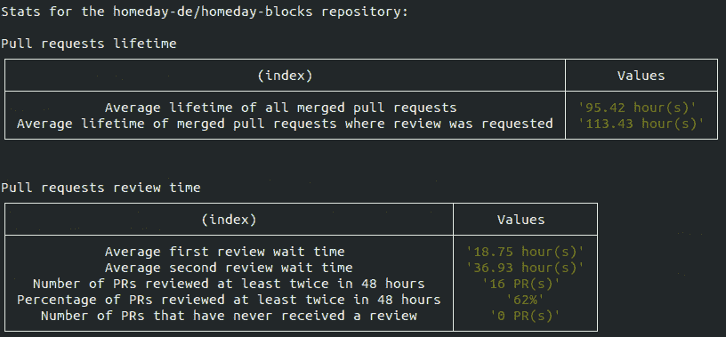
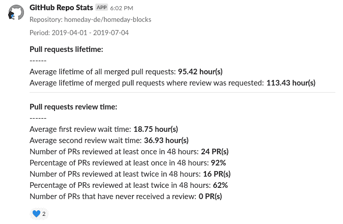
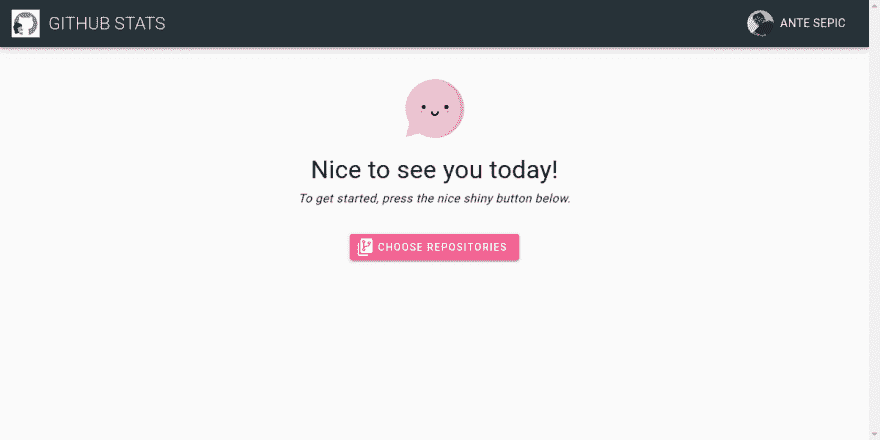
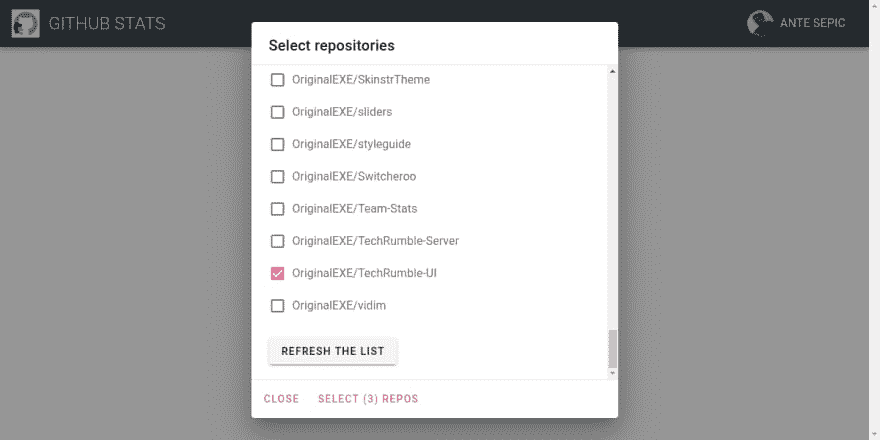
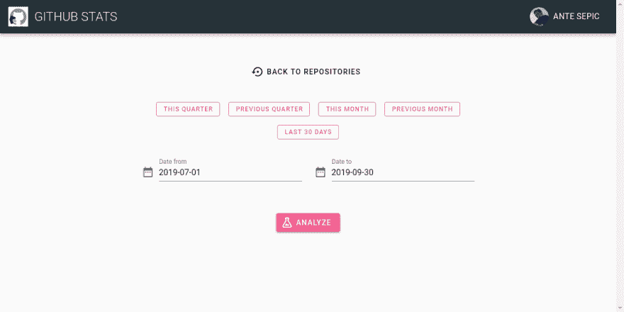
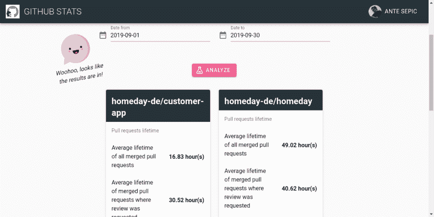

# 深入了解我们的 GitHub 库

> 原文：<https://dev.to/originalexe/gaining-insights-into-our-github-repositories-3ee>

*关于我们如何了解自己并从中获得乐趣*

今年早些时候，我们设定了一个有趣的关键结果(作为 OKRs 的一部分)——两次拉动式请求审查的平均等待时间应该在 48 小时以内。及时的拉动式请求审查的好处对我们来说是显而易见的:

*   不要阻塞你的队友(或者你自己，如果你依赖于拉请求中的一个特性的话)
*   在上下文还新鲜的时候检查代码

我们认为 48 小时是花时间适当地审查代码和快速行动之间的一个很好的平衡。

我们不清楚的是我们将如何衡量它。我们也不知道我们目前的“时间”，但感觉在某些情况下，它比理想时间要长。

### 行动计划

所以我们知道我们想要什么，现在是时候想想如何得到它了。在花了一些时间去寻找之后，我们没能找到一个可以帮助我们的工具。幸运的是，我们知道如何编码！

由于 GraphQL GitHub API 的可用性，获取必要的数据相当简单。后来，只是做一些计算，我们有了我们的第一个统计数据。我用 JavaScript (Node.js)构建了这个工具，第一个版本必须通过命令行运行。

<figure>

<figcaption>First version displayed the results directly in the terminal</figcaption>

</figure>

这非常令人兴奋，我们终于可以测量我们审查拉取请求所花费的时间，以及其他事情。但是输出不是超级友好的。我决定给斯莱克一个机会。他们让这个过程变得简单，你发布一个 JSON 到 webhook，它会自动为你发布到任何频道。我们现在有松弛的统计。

<figure>

<figcaption>Displaying the results in a Slack channel</figcaption>

</figure>

Slack message 看起来比我们之前的终端输出要好得多，但是它占用了相当多的空间。一旦我们对多个存储库进行分析，感觉有点像垃圾邮件。

我们需要一个更好的解决方案。

### 要是我们认识一些前端的人就好了

哦，等等。

在 Homeday，每个季度我们都有一个叫做产品工程周(简称 PEW)的活动。在这段时间里，我们没有会议，产品团队的每个成员都可以从事我们在正常冲刺中不会处理的项目。我决定开发一个 UI，它可以与我们已经有的后端脚本进行通信，并漂亮地显示结果。

我确实决定了一些规则(后来证明很有挑战性):

对于后端，我想使用 AWS Lambdas(我选择了 AWS，因为我们已经为我们的整个基础设施使用了 AWS 生态系统，这很有意义。)

我决定集成 GitHub 认证，这样任何拥有账户的人都可以使用这个工具，而不是仅仅作为一个 Homeday 的应用程序(可能有一个预定义的存储库列表和一个存储在后端某处的 GitHub 令牌)。

### AWS Lambdas

我以前在无服务器世界中已经有过一些冒险经历，但我绝不认为自己对这项技术有经验。我选择[无服务器](https://serverless.com/)是因为它让你更容易开始和开发你的 Lambdas(和许多其他提供商的无服务器功能)，在本地做出改变和它们被反映在 Amazon 服务器上之间有一个相当快速的反馈循环。

它花了一些时间来得到它的权利，但第一个版本进行得相当顺利。我将之前的 Node.js 代码移植到 Lambda 中，并通过无服务器配置文件将其连接到 API 网关，这样我就可以简单地发送一些 GET 请求并返回结果。

### 前端

既然后端已经准备好了，是时候做我首先想要做的事情了——提供一个与分析工具交互的良好界面。我的时间有限，所以我选择了 [Vuetify](https://vuetifyjs.com/en/) 作为我界面的基础。我们最近开源了自己的组件库“ [Homeday Blocks](https://blocks.homeday.dev) ”，但它仍然缺少一些我想在界面中使用的布局组件。这也是一个很好的机会来了解备受赞誉的 Vuetify，并向我们的图书馆学习。

该流程有三个部分:

*   使用 GitHub 帐户进行认证(为此我使用了 [Auth0](https://auth0.com/) ,这使得认证变得相当容易)
*   提供可以分析的存储库列表，并获取日期范围
*   显示结果

下面是一些展示它的图片:

<figure>

<figcaption>Login screen</figcaption>

</figure>

<figure>

<figcaption>Welcome screen</figcaption>

</figure>

<figure>

<figcaption>Selecting repositories</figcaption>

</figure>

<figure>

<figcaption>Selecting the date range</figcaption>

</figure>

<figure>

<figcaption>Displaying the results</figcaption>

</figure>

我在上面添加了一些糖，比如添加按钮来快速选择最常用的日期范围和 [Vue Kawaii](https://vue-kawaii.now.sh/) 来使应用程序更友好一些。在我的世界里，一切都很美好，但后来一切都变了...

### 墨菲醒来

幸运的是，没有火宗攻击我。是 AWS！当我试图在一个更活跃的存储库上运行分析工具时，问题发生了。它一直超时！

哦哦...

> “我会简单地增加λ超时”-一个无辜的孩子

这没有什么区别，我的 Lambda 仍然在 29 秒后超时。三年半后，我发现这是 AWS 对 API 网关触发的任何 Lambda 的硬性限制。Sh*t。

### 绝地归来

它没有帮助，它已经是星期四，我们的座位在星期五结束。在我们的“演示仪式”之前，我还有大约 6 个多小时的工作时间，必须想出一个解决方案。当然，我可以选择一些更简单的库来进行演示，这确实是我的 b 计划。幸运的是，我从来没有使用过它。

我决定采用我称之为“两个兰姆达斯的方法(临时名称)”。

我实现了一个 Lambda，它接受一个请求，生成一个惟一的标识符并回复它。它还启动了第二个 Lambda(从而避免了硬限制),该 Lambda 进行计算并将其作为 JSON 文件存储到 S3 实例中(使用我们发送到前端的唯一标识符作为其名称)。

在前端，收到响应后，代码每 5 秒钟轮询一次 S3 上的预期文件，一旦找到，就显示结果。

这是一个粗糙/肮脏/不管什么方法，但它的工作，对于我们预期的规模，它应该不会崩溃 AWS。

### 总结

该应用程序是活的，踢。你可以在这里试试主机版: [Homeday GitHub Stats](https://github-stats.homeday.dev/)

你也可以在以下链接找到代码(并对其做出贡献):

后端:【https://github.com/homeday-de/homeday-github-stats-backend】

前端:[https://github.com/homeday-de/homeday-github-stats-frontend](https://github.com/homeday-de/homeday-github-stats-frontend)

欢迎所有反馈(尤其是 Lambda shaming)。

最后，如果你想有机会参与这些很酷的项目，Homeday 正在招聘 T1。来柏林参加我们的下一次聚会吧！