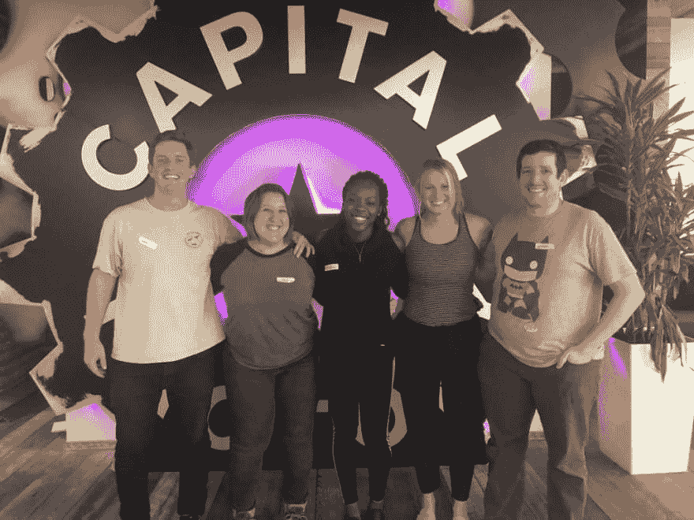
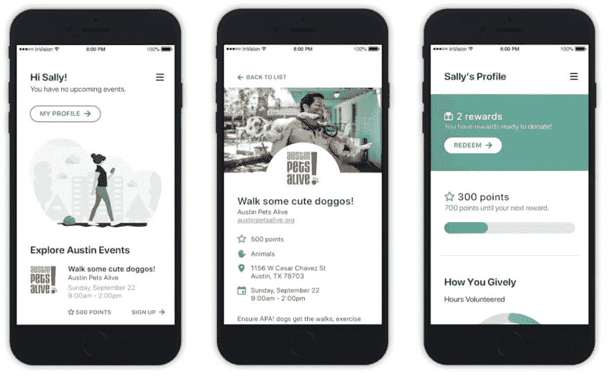

# 我们在第五届年度多样性黑客马拉松上的经历

> 原文:[https://dev . to/alvaromantoro/our-experience-at-fifth-annual-diversity-hackathon-570 p](https://dev.to/alvaromontoro/our-experience-at-the-5th-annual-diversity-hackathon-570p)

这个周末，我和一群同事参加了第五届年度多样性黑客马拉松[女性编码 ATX](https://www.womenwhocode.com/austin) (查看 Twitter 上的标签[# ATXDivHack](https://mobile.twitter.com/search?q=%23ATXDivHack&src=typed_query)了解所有信息)。)

该活动在德克萨斯州奥斯汀的[资本工厂](https://www.capitalfactory.com/)举办，取得了巨大成功。有 160 多名参与者，40 名导师和志愿者...这很有趣。

我们的想法是 **Gively** ，这是一个根据志愿者的志愿服务时间给他们积分的工具。然后，它允许他们使用这些积分向他们选择的慈善机构/非营利组织捐款。

这是我们出色的团队:

[T2】](https://res.cloudinary.com/practicaldev/image/fetch/s--Fa5XGcWa--/c_limit%2Cf_auto%2Cfl_progressive%2Cq_auto%2Cw_880/https://thepracticaldev.s3.amazonaws.com/i/lw682jpos6q1qovma3yg.jpg)

约翰是后端和数据库的总指挥； **Jax** (我们队长)负责设计和 UI/UX，创造了杀手级体验；**玛丽**是负责开发的明星程序员；莎莉从事设计和用户界面/UX 以及演示工作(并且做得非常出色！);并且做了一些开发和造型(只能加入一天)。

下面是我们的一些屏幕看起来怎么样(感谢 [Jax](https://mobile.twitter.com/jaxatto) 的设计):

[T2】](https://res.cloudinary.com/practicaldev/image/fetch/s--OIC7g22g--/c_limit%2Cf_auto%2Cfl_progressive%2Cq_auto%2Cw_880/https://thepracticaldev.s3.amazonaws.com/i/6zlbvts21mt8pjzzqofw.jpg)

不是所有的时间都花在设计/开发我们的项目上。还有更多的事情要做:认识新的人，发现新的项目，以及发现每个人都使用的堆栈(React 和 React Native 显然占主导地位。)

谈论其他团队的项目...有许多有趣的项目，其中大多数都集中在可访问性、社会意识和女性支持上(这是一个多元化的黑客马拉松)。

我最喜欢的一些是:

*   Just Buster :一个 Chrome 扩展，用于识别和删除对我们的工作生活产生负面影响的语言(尤其是女性，不仅限于使用从标题中可以推断出的“Just”)。)

*   **Ninja Now** :一个实时应用程序，用于防止欺凌和解决任何地方发生的骚扰。

液体错误:内部

*   **rePlate** :一个应用程序，它将餐馆与愿意捡起被扔掉的食物的人联系起来，这样食物就不会被浪费。这个团队是唯一一个对他们的栈/项目进行测试的团队，正因为如此，他们应该得到奖励和我们的尊重。

*   奥斯汀经济适用房(Affordable Housing Austin):该计划旨在帮助符合经济适用房资格的人在奥斯汀地区找到价格最优惠的潜在住宅。

*   下一站在哪里:一个基于智能机器学习的志愿者机会搜索系统。不要只是寻找机会，输入一个关于你自己的短语，然后看到匹配出现。

*   G2G(T1):一个帮助寻找附近浴室的应用程序，根据清洁度和可达性对它们进行评级，并给你积分以成为国王(或王后)。

*   **Want It** :一个应用程序，允许朋友和家人在心爱的人不在时标记他们想要的东西。在一位开发人员的母亲去世后受到启发，它可以用于许多其他情况。

液体错误:内部

*   Athenea:一个类似 Reddit 界面的应用程序，通过提供如何获得晋升和/或加薪的建议来帮助女性在工作中取得成功。

*   **第五个**:帮助训练和练习芭蕾动作的应用。它将允许选择一系列的动作，并跟踪它们与教练分享。这个演示真的很有趣...即使在没有芭蕾舞表演的时候。

*   **The Four Loops** :创建了应用 adVocation，以帮助解决员工推荐中的种族/性别差异，从而促进技术招聘的多样性。

...和所有的黑客马拉松一样，还有奖品！获胜者是:

*   🏆最佳 UI/UX 设计: **Just Buster** 。
*   🏆最博学的:**雅典娜**。
*   🏆最佳技术组合:**下一站**。
*   🏆最佳社会影响:**保障房**。

是的，我们的想法很棒，然而我们什么也没赢得(真扫兴！)...但这不仅仅是胜利。我们学习/练习了 React Native，在团队中成长，结识了新朋友，玩得很开心。我们可能没有获奖，但如果你问我，这听起来像是一个值得度过的周末。

* * *

想了解更多关于该活动的信息，请访问奥斯汀妇女编码协会的网站，或者查看她们在 T2 的推特账户。他们组织了许多令人惊叹的活动，并且向所有人开放。