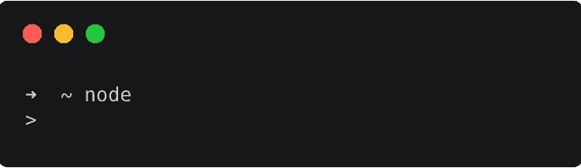
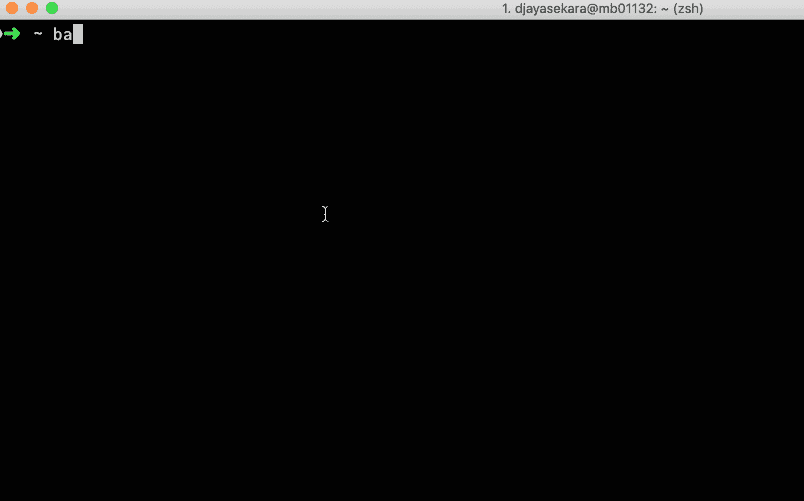
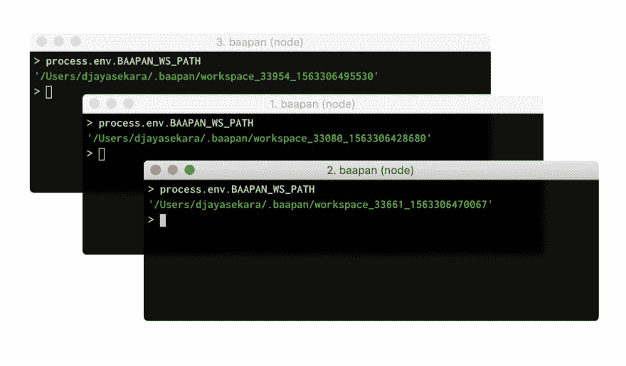

# 巴兰

> 原文：<https://dev.to/deepal/baapan-a-super-cool-npm-playground-on-the-node-repl-48je>

你是 Node.js REPL 的粉丝吗？您在工作时是否广泛使用 REPL 来快速试验小代码片段？如果是这样，Baapan 适合您……

[](https://res.cloudinary.com/practicaldev/image/fetch/s--2ANE1-FN--/c_limit%2Cf_auto%2Cfl_progressive%2Cq_auto%2Cw_880/https://thepracticaldev.s3.amazonaws.com/i/w0e717xqbmk5hj8zpg0k.png)

就我个人而言，我是 NodeJS REPL 的超级粉丝，我每天都在使用它，没有它我无法生活。有大量的替代品和 IDE 扩展可以用来代替 REPL，但没有什么能打败优秀的老 REPL。

过去，我在使用 Node REPL 时非常头疼。我主要使用 REPL 来尝试各种数组操作(映射/减少/过滤等)。)，以及对象操作(从一个巨大的 json 中提取我想要的等等。).有时候我希望他们已经在 REPL 中预装了`lodash`,因为它可以帮助处理复杂的对象数组。此外，有时我想在我的数据上尝试一个 npm 模块。我可以通过使用类似 [RunKit](https://npm.runkit.com) 这样的东西轻松做到这一点。但是我不想在一些第三方网站上粘贴和处理我的数据(潜在的敏感信息)。我希望 Node.js 内置的 REPL 能够动态地获取和`require`任何我想要的 NPM 模块。这就是`baapan`的诞生。

> 从这里开始:[https://npmjs.com/package/baapan](https://npmjs.com/package/baapan)

[](https://res.cloudinary.com/practicaldev/image/fetch/s--zX9MNiam--/c_limit%2Cf_auto%2Cfl_progressive%2Cq_66%2Cw_880/https://thepracticaldev.s3.amazonaws.com/i/arlx1rejgjuknmgz2pdi.gif)

## 为什么是 Baapan

为什么需要`baapan`而不用 RunKit 之类的东西？虽然像 RunKit/CodeSandbox/Repl .这样的在线代码编辑器/平台对于快速试用代码片段很有用，但是在这些编辑器上粘贴敏感/专有数据并不安全，不是吗？因为`baapan`完全在本地节点 REPL 上运行，所以您不再需要担心。它可能不是一个编辑器，但它的节点 REPL 和更多！！

## 它是如何工作的？

正如我前面所说的,`baapan`只不过是一个具有一些扩展功能的节点 REPL。它有一个猴子修补的`require()`拦截`require`呼叫，如果`require` d 模块不能被解析，它立即`npm install`该模块并`require` s 它到 REPL 上。

类似于节点 REPL，您可以根据需要生成任意多的`baapan`实例。每个`baapan`实例都有自己独立的工作空间。所有的模块安装都发生在它的工作区中，不会污染任何其他模块目录。当用户优雅地退出 REPL 时，工作空间被自动移除，这防止了累积充满临时使用的 NPM 模块的陈旧工作空间。

当前 REPL 实例的工作空间路径可以通过`BAAPAN_WS_PATH`环境变量来检索。

```
> process.env.BAAPAN_WS_PATH
'/Users/djayasekara/.baapan/workspace_44023_1562678000424'</span> 
```

<svg width="20px" height="20px" viewBox="0 0 24 24" class="highlight-action crayons-icon highlight-action--fullscreen-on"><title>Enter fullscreen mode</title></svg> <svg width="20px" height="20px" viewBox="0 0 24 24" class="highlight-action crayons-icon highlight-action--fullscreen-off"><title>Exit fullscreen mode</title></svg>

[](https://res.cloudinary.com/practicaldev/image/fetch/s--2hzCsQiB--/c_limit%2Cf_auto%2Cfl_progressive%2Cq_auto%2Cw_880/https://thepracticaldev.s3.amazonaws.com/i/dmbbo89b3he9sp692zik.png)

请随意尝试，并让我知道你的任何反馈。如果你想对`baapan`有所贡献的话，请看一下知识库。✨