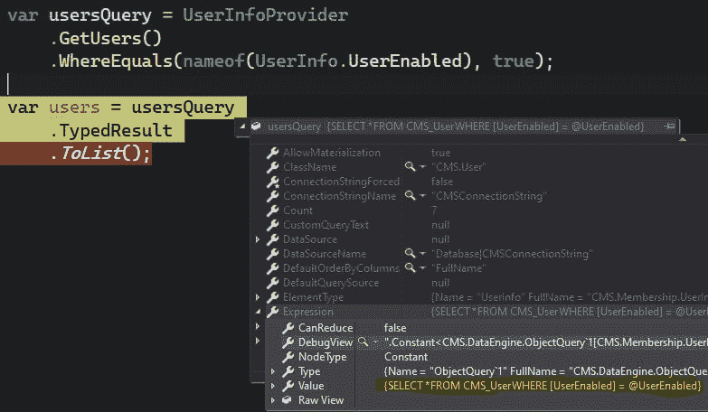
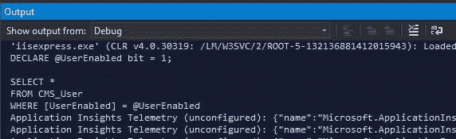

# Kentico 12:设计模式第 14 部分-文档查询和对象查询技巧

> 原文:[https://dev . to/seang Wright/kentico-12-design-patterns-part-14-document query-and-object query-tips-2c7h](https://dev.to/seangwright/kentico-12-design-patterns-part-14-documentquery-and-objectquery-tips-2c7h)

<figure>

[T2】](https://res.cloudinary.com/practicaldev/image/fetch/s--UBPZsRRO--/c_limit%2Cf_auto%2Cfl_progressive%2Cq_auto%2Cw_880/https://thepracticaldev.s3.amazonaws.com/i/oi9ig7vr8woleczeoyb5.jpg)

<figcaption>Photo by [Sam Truong Dan](https://unsplash.com/@sam_truong) on [Unsplash](https://unsplash.com)</figcaption>

</figure>

## [](#kentico-data-access)Kentico 数据访问

如果您从未编写过定制代码来检索和操作 Kentico CMS 存储的数据，那么您可能不熟悉两种类型`DocumentQuery<T>`和`ObjectQuery<T>`🤔。

这两个类，以及大量相关的基类，允许开发人员在他们的 C#代码中编写查询，这些查询最终被评估为一个参数化的 SQL 字符串，并在数据库中执行。

这些类型和方法介于微软复杂且功能丰富的对象关系映射器(ORM)、[实体框架](https://docs.microsoft.com/en-us/ef/ef6/querying/)和来自🧐. stack overflow 的开源极简 ORM [Dapper](https://github.com/StackExchange/Dapper) 之间

Kentico 的[文档](https://docs.kentico.com/k12sp/custom-development/retrieving-database-data-using-objectquery-api)解释了[如何使用这些 API 的基本原理](https://docs.kentico.com/k12sp/custom-development/working-with-pages-in-the-api)，但是对于复杂的用例却很少提及(这是可以理解的)。

文档也没有列出可能帮助您扩展和维护应用程序的所有最佳模式——这是有意的低级和通用模式。

下面，让我们来看看如何充分利用你的`DocumentQuery<T>`和`ObjectQuery<T>`⚡.的一些技巧

## [](#use-raw-nameof-endraw-)使用`nameof()`

与实体框架不同，Kentico 的查询 API 不接受 [Lambda 表达式](https://docs.microsoft.com/en-us/dotnet/csharp/programming-guide/statements-expressions-operators/lambda-expressions)作为参数(尽管它们使用[表达式树](https://docs.microsoft.com/en-us/dotnet/csharp/expression-trees)来生成最终的 SQL 文本)。

相反，它们使用松散类型和基于字符串的参数 API。

例如，要获得所有已启用用户的集合，您可以使用一个`bool`值`true` :

```
var enabledUsers = UserInfoProvider
    .GetUsers()
    .WhereEquals("UserEnabled", true)
    .ToList(); 
```

<svg width="20px" height="20px" viewBox="0 0 24 24" class="highlight-action crayons-icon highlight-action--fullscreen-on"><title>Enter fullscreen mode</title></svg> <svg width="20px" height="20px" viewBox="0 0 24 24" class="highlight-action crayons-icon highlight-action--fullscreen-off"><title>Exit fullscreen mode</title></svg>

或者一个`int`值`1` :

```
var enabledUsers = UserInfoProvider
    .GetUsers()
    .WhereEquals("UserEnabled", 1)
    .ToList(); 
```

<svg width="20px" height="20px" viewBox="0 0 24 24" class="highlight-action crayons-icon highlight-action--fullscreen-on"><title>Enter fullscreen mode</title></svg> <svg width="20px" height="20px" viewBox="0 0 24 24" class="highlight-action crayons-icon highlight-action--fullscreen-off"><title>Exit fullscreen mode</title></svg>

### [](#avoiding-typos)避免错别字

列`UserEnabled`没有类型支持，它直接映射到`UserInfo.UserEnabled`属性，也不要求`"UserEnabled"`是一个有效的列，可以放在结果查询的`WHERE`子句中。

因此，下面的查询不起作用:

```
var enabledUsers = UserInfoProvider
    .GetUsers()
    .WhereEquals("UsersEnabled", true)
    .ToList(); 
```

<svg width="20px" height="20px" viewBox="0 0 24 24" class="highlight-action crayons-icon highlight-action--fullscreen-on"><title>Enter fullscreen mode</title></svg> <svg width="20px" height="20px" viewBox="0 0 24 24" class="highlight-action crayons-icon highlight-action--fullscreen-off"><title>Exit fullscreen mode</title></svg>

你发现印刷错误了吗？...`"UsersEnabled"`应该是`"UserEnabled"`😣。

为了帮助避免这些容易犯的错别字，我们可以利用两件事:

*   Kentico 将表示实体的表中的所有列命名为与该实体的 C#类中的属性完全相同👍。
*   C#让我们使用`nameof()`操作符将一个令牌转换成一个字符串👍。

下面是我对上述查询的推荐方法:

```
var enabledUsers = UserInfoProvider
    .GetUsers()
    .WhereEquals(nameof(UserInfo.UserEnabled), true)
    .ToList(); 
```

<svg width="20px" height="20px" viewBox="0 0 24 24" class="highlight-action crayons-icon highlight-action--fullscreen-on"><title>Enter fullscreen mode</title></svg> <svg width="20px" height="20px" viewBox="0 0 24 24" class="highlight-action crayons-icon highlight-action--fullscreen-off"><title>Exit fullscreen mode</title></svg>

### [](#supporting-refactoring)支持重构

这对查询 Kentico 的内置类型很有帮助，但我发现对查询我们创建的定制模块类和页面类型更有帮助。

让我们假设我们已经创建了一个`UserMembershipProfile` [定制模块类](https://docs.kentico.com/k12sp/custom-development/creating-custom-modules)。

在项目过程中，当我们迭代一个设计时，我们的`UserMembershipProfile`类的列名可能会改变几次。

如果我们在查询中使用`string`列名，那么如果没有健壮的单元和集成测试，就很难捕捉到这些列名的变化😮。

然而，使用`nameof()`给了我们针对那些数据库列名的编译类型检查😉。

> 我们应该使用 Kentico 的列命名约定，即在每个列名前面加上实体名。这有助于在 SQL 中执行`JOIN`时避免列模糊。
> 
> 因此，`UserMembershipProfile`的`ID`列将是`UserMembershipProfileID`，而定制模块类`UserMembershipProfile`也将类似地拥有属性`UserMembershipProfileID`。

* * *

## [](#create-reusable-extensions)创建可重用的扩展

Kentico 为我们提供了大量的扩展方法，可用于查询对象和文档。

在`CMS.DataEngine.WhereConditionBase`中可以找到这样的例子，我们可以看到如下的方法:

```
public TParent Where(string columnName, QueryOperator op, object value);

public TParent WhereEquals(string columnName, object value);

public TParent WhereContains(string columnName, string value);

public TParent WhereNotNull(string columnName); 
```

<svg width="20px" height="20px" viewBox="0 0 24 24" class="highlight-action crayons-icon highlight-action--fullscreen-on"><title>Enter fullscreen mode</title></svg> <svg width="20px" height="20px" viewBox="0 0 24 24" class="highlight-action crayons-icon highlight-action--fullscreen-off"><title>Exit fullscreen mode</title></svg>

这些方法都是通过泛型类型参数`TParent`返回原始查询，这样我们就可以将多个方法链接在一起，而且这些方法都是低级的，对我们的具体应用缺乏任何业务意义。

这是一件好事，因为它允许我们轻松地将这些片段组合在一起。

然而，我们可能希望提供类似于上面的可重用方法，这些方法应用一组标准的`SELECT`或`WHERE`子句，而不破坏我们的查询语法流。

我们可以很容易地在`ObjectQuery<T>`或`DocumentQuery<T>`上使用扩展方法来实现这一点。

下面是一个扩展的例子，它向所提供的查询中添加了一个过滤器，该过滤器只包括已启用且最近登录的`UserInfo`行:

```
public static class UserInfoQueryExtensions
{
    public static ObjectQuery<UserInfo> WhereEnabledAndActive(
        this ObjectQuery<UserInfo> query)
    {
        DateTime thirtyDaysAgo = DateTime.Now.AddDays(-30);

        return query
            .WhereEquals(nameof(UserInfo.UserEnabled), true)
            .And()
            .WhereGreaterThan(nameof(UserInfo.LastLogon), thirtyDaysAgo);
    }
} 
```

<svg width="20px" height="20px" viewBox="0 0 24 24" class="highlight-action crayons-icon highlight-action--fullscreen-on"><title>Enter fullscreen mode</title></svg> <svg width="20px" height="20px" viewBox="0 0 24 24" class="highlight-action crayons-icon highlight-action--fullscreen-off"><title>Exit fullscreen mode</title></svg>

> 使用`.And()`不是必要的- `AND`是隐含的-但是它有助于明确，特别是在更复杂的查询中。
> 
> 此外，我不建议直接使用`DateTime.Now`，因为它不是可单元测试的。相反，为这个扩展方法提供一个接口，比如`IDateTimeProvider`
> 
> <header>
> 
> #  [处理日期时间的策略。现在在单元测试中](https://stackoverflow.com/questions/4594652/strategies-for-dealing-with-datetime-now-in-unit-tests)
> 
> Jan 4 '11 Comments: 1 Answers: 3[5](https://stackoverflow.com/questions/4594652/strategies-for-dealing-with-datetime-now-in-unit-tests) </header>
> 
> 我的业务逻辑在周六或周日不执行某些功能。我希望我的单元测试能够验证这些功能是否被执行，但是测试将会在周六/周日失败。
> 
> 我认为最简单的方法是让单元测试传达一个友好的信息，表明…
> 
> <button class="ltag__stackexchange--btn" type="button">[Open Full Question](https://stackoverflow.com/questions/4594652/strategies-for-dealing-with-datetime-now-in-unit-tests)</button>

我们现在可以如下使用这个扩展:

```
var activeUsers = UserInfoProvider
    .GetUsers()
    .WhereEnabledAndActive()
    .TypedResult
    .ToList(); 
```

<svg width="20px" height="20px" viewBox="0 0 24 24" class="highlight-action crayons-icon highlight-action--fullscreen-on"><title>Enter fullscreen mode</title></svg> <svg width="20px" height="20px" viewBox="0 0 24 24" class="highlight-action crayons-icon highlight-action--fullscreen-off"><title>Exit fullscreen mode</title></svg>

这是在整个应用程序(或库)中整合特定领域的可重用查询逻辑的一种简单方法🤓。

* * *

## [](#trim-your-raw-select-endraw-s-and-then-project)修剪你的`SELECT` s 然后投射！

当编写一个新的查询时，很容易过滤出想要的行，而忘记过滤列。

这里有一个例子`DocumentQuery`来检索一个站点`Sandbox` :
上所有发布的`Article`文档

```
string siteName = "Sandbox";

var articles = ArticleProvider
    .GetArticles()
    .OnSite(siteName)
    .Published(true)
    .TypedResult
    .ToList(); 
```

<svg width="20px" height="20px" viewBox="0 0 24 24" class="highlight-action crayons-icon highlight-action--fullscreen-on"><title>Enter fullscreen mode</title></svg> <svg width="20px" height="20px" viewBox="0 0 24 24" class="highlight-action crayons-icon highlight-action--fullscreen-off"><title>Exit fullscreen mode</title></svg>

如果我们只使用`DocumentName`(来自`CMS_Document`表)、`NodeGUID`(来自`CMS_Tree`表)和`ArticleSummary`(来自连接的`Sandbox_Article`表)，那么我们应该明确这一点，并且只使用`SELECT`那些列:

```
string siteName = "Sandbox";

var articles = ArticleProvider
    .GetArticles()
    .OnSite(siteName)
    .Published(true)
    .Columns(
        nameof(TreeNode.NodeGUID),
        nameof(TreeNode.DocumentName),
        nameof(Article.ArticleSummary)
    )
    .TypedResult
    .ToList(); 
```

<svg width="20px" height="20px" viewBox="0 0 24 24" class="highlight-action crayons-icon highlight-action--fullscreen-on"><title>Enter fullscreen mode</title></svg> <svg width="20px" height="20px" viewBox="0 0 24 24" class="highlight-action crayons-icon highlight-action--fullscreen-off"><title>Exit fullscreen mode</title></svg>

太好了！我们已经精简了我们的查询，使它执行得更快，需要的数据库资源更少🎉🎉。

不幸的是，我们创建了一个有漏洞的抽象😩！

`Article`类型应该表示来自`CMS_Tree`、`CMS_Document`和`Sandbox_Article`表连接的完全水合的对象，但是我们只填充了它的三个属性。

如果我们以`IEnumerable<Article>`的形式从一个方法返回这个数据，我们要么...

1.  ❌对消费者不诚实，消费者认为他们可以使用`Article`上的任何属性。
2.  ❌迫使消费者知道正在执行的查询的确切形式和语法。

这两个选项都不理想，所以我们可以不继续使用`Article`类型，而是将查询结果投射到一个匿名类型(如果它不需要离开方法的范围)，或者一个定制的 C#类:

```
string siteName = "Sandbox";

var articles = ArticleProvider
    .GetArticles()
    .OnSite(siteName)
    .Published(true)
    .Columns(
        nameof(TreeNode.NodeGUID),
        nameof(TreeNode.DocumentName),
        nameof(Article.ArticleSummary)
    )
    .TypedResult
    .Select(a => new { a.NodeGUID, a.DocumentName, a.ArticleSummary })
    .ToList();

foreach(var article in articles)
{
    Debug.WriteLine($"{article.NodeGUID} - {article.DocumentName}");
} 
```

<svg width="20px" height="20px" viewBox="0 0 24 24" class="highlight-action crayons-icon highlight-action--fullscreen-on"><title>Enter fullscreen mode</title></svg> <svg width="20px" height="20px" viewBox="0 0 24 24" class="highlight-action crayons-icon highlight-action--fullscreen-off"><title>Exit fullscreen mode</title></svg>

使用这种方法意味着查询后的代码是针对我们从数据库中检索的确切数据集的强类型代码🤗。

丢失值的属性不会意外地被依赖，消费者也不必知道查询中的内容。

我的经验法则是:

**如果你想用`.Columns()`来修整你的`SELECT`，那就做一个好的开发者，永远做项目！**

它押韵，这就是你知道它是好的😎。

* * *

## [](#debug-your-queries)调试您的查询

我们将经常遇到这样的情况，我们的查询没有返回我们期望的数据，并且很难弄清楚幕后发生了什么😒。

不幸的是，这是使用 ORM 带来的问题之一。C#不是 SQL，SQL 也不是 C#。

> 有一篇关于开发人员在使用 ORM 时经常看到的问题的长而有趣的帖子💯。
> 
> 如果有兴趣，你可以阅读杰夫·阿特伍德对文章的看法或 T2 的原著，只要你能找到一把舒适的椅子。

有几种方法可以“调试”由我们从 Kentico 的库中使用的 API 组合生成的 SQL。

最经典，但也最痛苦😝在我看来，就是从[SQL Server Management Studio(SSMS)](https://docs.microsoft.com/en-us/sql/ssms/download-sql-server-management-studio-ssms?view=sql-server-2017)内部使用 [SQL Profiler](https://docs.microsoft.com/en-us/sql/tools/sql-server-profiler/sql-server-profiler?view=sql-server-2017#sql-server-profiler-1) 。

这就像使用喷灯🔥点燃蜡烛，🕯！

### [](#expressiondebugview)表情。调试视图

幸运的是，C#为我们提供了一种现成的方法来调试生成的 SQL 文本。

由于 Kentico 的查询 API 生成一个被转换成 SQL 的`Expression`,我们可以在调试运行中的应用程序时查看 SQL 文本。

该 SQL 文本可以在`ObjectQuery<T>.Expression.DebugView`或`DocumentQuery<T>.Expression.DebugView`上找到，如下所示:

[T2】](https://res.cloudinary.com/practicaldev/image/fetch/s--NjPlUONi--/c_limit%2Cf_auto%2Cfl_progressive%2Cq_auto%2Cw_880/https://thepracticaldev.s3.amazonaws.com/i/ttfz85cqedw35wh9n60q.jpg)

这是由下面的`ObjectQuery<UserInfo>`代码生成的 SQL:

```
var usersQuery = UserInfoProvider
    .GetUsers()
    .WhereEquals(nameof(UserInfo.UserEnabled), true);

var users = usersQuery
    .TypedResult
    .ToList(); 
```

<svg width="20px" height="20px" viewBox="0 0 24 24" class="highlight-action crayons-icon highlight-action--fullscreen-on"><title>Enter fullscreen mode</title></svg> <svg width="20px" height="20px" viewBox="0 0 24 24" class="highlight-action crayons-icon highlight-action--fullscreen-off"><title>Exit fullscreen mode</title></svg>

我们必须创建一个中间变量`usersQuery`，才能看到`DebugView`。

如果我们只有一个变量，这是调用`.ToList()`的结果，结果将是物化的数据，这不是我们想要的。

```
var users = UserInfoProvider
    .GetUsers()
    .WhereEquals(nameof(UserInfo.UserEnabled), true)
    .TypedResult
    .ToList();

// No `users.Expression` available here! 
```

<svg width="20px" height="20px" viewBox="0 0 24 24" class="highlight-action crayons-icon highlight-action--fullscreen-on"><title>Enter fullscreen mode</title></svg> <svg width="20px" height="20px" viewBox="0 0 24 24" class="highlight-action crayons-icon highlight-action--fullscreen-off"><title>Exit fullscreen mode</title></svg>

这个`DebugView`属性是`internal`，所以只能在我们的代码中通过反射访问[。](https://stackoverflow.com/a/31360768/939634)

但是不要担心，有一个更简单的方法😅！

### [](#objectquerybasegetfullquerytext)ObjectQueryBase.GetFullQueryText

另一种方法是通过 Kentico 在`CMS.DataEngine.ObjectQueryBase<TQuery>`上提供的名为`GetFullQueryText()`的方法。

它返回将要生成的 SQL 的一个`string`😃。

```
public string GetFullQueryText(
    bool expand = false, 
    bool includeParameters = true, 
    DataQuerySettings settings = null); 
```

<svg width="20px" height="20px" viewBox="0 0 24 24" class="highlight-action crayons-icon highlight-action--fullscreen-on"><title>Enter fullscreen mode</title></svg> <svg width="20px" height="20px" viewBox="0 0 24 24" class="highlight-action crayons-icon highlight-action--fullscreen-off"><title>Exit fullscreen mode</title></svg>

虽然这对于获取查询文本来说很好，但是我们可能不希望遍历一堆查询，并使`ObjectQuery<T>`的中间变量与我们想要处理的结果数据集分开😫。

所以，让我们做一个扩展方法来帮助我们调试，让我们的代码更容易阅读和使用！

```
public static class ObjectQueryExtensions
{
    public static ObjectQuery<T> PrintToDebug<T>(this ObjectQuery<T> query)
        where T : BaseInfo
    {
        string queryText = query.GetFullQueryText();

        Debug.WriteLine(queryText);

        return query;
    }
} 
```

<svg width="20px" height="20px" viewBox="0 0 24 24" class="highlight-action crayons-icon highlight-action--fullscreen-on"><title>Enter fullscreen mode</title></svg> <svg width="20px" height="20px" viewBox="0 0 24 24" class="highlight-action crayons-icon highlight-action--fullscreen-off"><title>Exit fullscreen mode</title></svg>

有了这个扩展，我们可以把`.GetFullQueryText()`的以下用法:

```
var usersQuery = UserInfoProvider
    .GetUsers()
    .WhereEquals(nameof(UserInfo.UserEnabled), true);

string queryText = usersQuery.GetFullQueryText();

Debug.WriteLine(queryText);

var users = usersQuery
    .PrintToDebug()
    .TypedResult
    .ToList(); 
```

<svg width="20px" height="20px" viewBox="0 0 24 24" class="highlight-action crayons-icon highlight-action--fullscreen-on"><title>Enter fullscreen mode</title></svg> <svg width="20px" height="20px" viewBox="0 0 24 24" class="highlight-action crayons-icon highlight-action--fullscreen-off"><title>Exit fullscreen mode</title></svg>

变成更容易阅读和维护的东西:

```
var users = UserInfoProvider
    .GetUsers()
    .WhereEquals(nameof(UserInfo.UserEnabled), true)
    .PrintToDebug()
    .TypedResult
    .ToList(); 
```

<svg width="20px" height="20px" viewBox="0 0 24 24" class="highlight-action crayons-icon highlight-action--fullscreen-on"><title>Enter fullscreen mode</title></svg> <svg width="20px" height="20px" viewBox="0 0 24 24" class="highlight-action crayons-icon highlight-action--fullscreen-off"><title>Exit fullscreen mode</title></svg>

假设您正在调试应用程序，这会将完整的 SQL 文本打印到 Visual Studio 的输出窗口中👏。

[T2】](https://res.cloudinary.com/practicaldev/image/fetch/s--wyBzj6zO--/c_limit%2Cf_auto%2Cfl_progressive%2Cq_auto%2Cw_880/https://thepracticaldev.s3.amazonaws.com/i/zs1k1ygvswjvcfsna73o.jpg)

你可以复制并粘贴到 SSMS，Azure 数据工作室，LinqPad 等...尝试并诊断您的查询问题。

### [](#kenticoglimpse)肯帝高。一瞥

对于 Kentico 12 MVC 应用程序(它也兼容门户引擎站点)，Kentico 提供了 [Kentico。惊鸿一瞥](https://www.nuget.org/packages/Kentico.Glimpse) NuGet 包。

这种与 Glimpse 的集成在 [Glimpse](https://github.com/Glimpse/Glimpse) UI 面板中创建了一个“Kentico SQL”选项卡，在应用程序的每个页面响应之后，该选项卡会出现在浏览器的底部。

该 SQL 选项卡包括在页面请求期间运行的所有查询，并应用了所有参数👍。

如果您已经将 Glimpse 集成到您的 Kentico 应用程序中，这是调试查询的一种非常简单的方法。

* * *

## [](#summary)总结

我们介绍了如何使用`nameof()`操作符来确保生成的 SQL 文本中的列名没有输入错误。

它还有助于我们的代码防重构，通过确保我们的查询列与 Kentico 提供或生成的代码中的名称相匹配来提供一些类型支持。

我们研究了如何使用扩展方法来创建可重用的查询代码单元，比普通方法更小，并且几乎与 Kentico 的内置查询方法一样可组合。

在我们尝试优化查询以从数据库中检索`Article`文档时，我们在代码中创造了一个混乱点，因为我们的类型`Article`不再反映我们查询的数据集。

这导致了经验法则- **如果你想用`.Columns()`来修整你的`SELECT`，做一个好的开发者，并且总是做项目！我永远不会厌倦说这句话🤣。**

最后，我们研究了调试查询的各种方法，并确切地了解了正在生成的 SQL 文本。

使用扩展方法和`.GetFullQueryText()`方法为我们提供了一个简单且可重用的调试解决方案。

我希望对 Kentico 的数据访问 API`ObjectQuery<T>`和`DocumentQuery<T>`的分析对您有所帮助。

如果你已经知道了所有这些，那么希望我以后关于 Kentico 的查询 API 的帖子能够比这篇文章更深入地探讨这个问题！

感谢阅读🙏！

* * *

如果您正在寻找更多的 Kentico 内容，请在 DEV:

## # [肯蒂科](https://dev.to/t/kentico) <button name="button" type="button" data-info="{&quot;className&quot;:&quot;Tag&quot;,&quot;style&quot;:&quot;full&quot;,&quot;id&quot;:5339,&quot;name&quot;:&quot;kentico&quot;}" class="crayons-btn follow-action-button whitespace-nowrap c-btn--secondary fs-base " aria-label="Follow tag: kentico" aria-pressed="false">跟随</button>

或者我的 Kentico 博客系列:

*   [Kentico 12:设计模式](https://dev.to/search?q=Kentico%2012%20-%20Design%20Patterns)