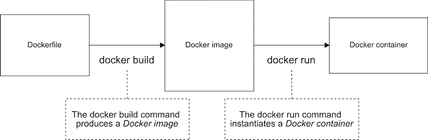
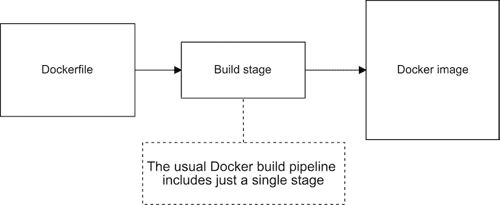
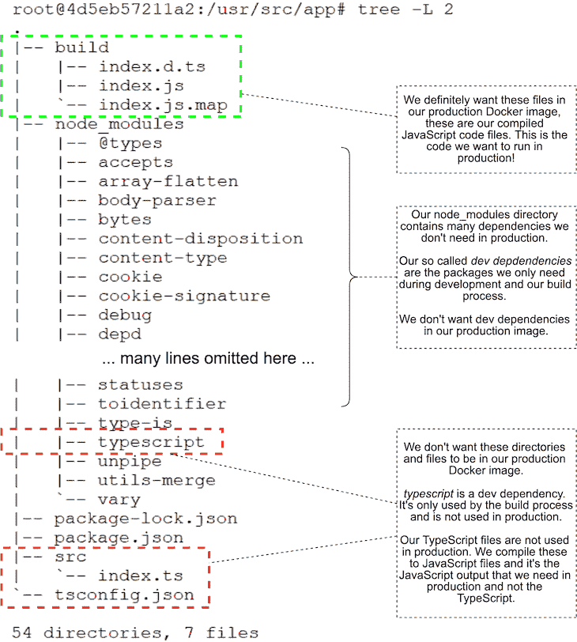
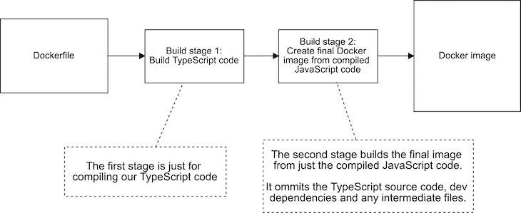
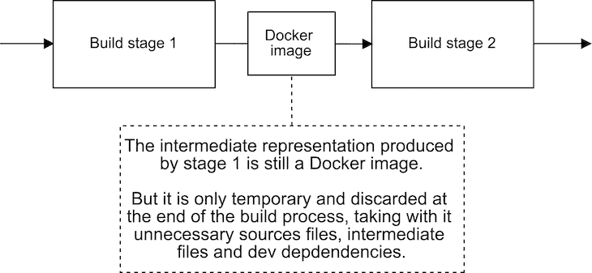
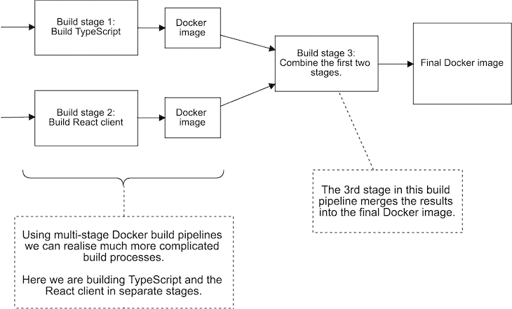

# 用 Docker 制作管道

> 原文：<https://dev.to/bnevilleoneill/crafting-build-pipelines-with-docker-2gkc>

**作者:[阿什利·戴维斯](https://blog.logrocket.com/author/ashleydavis/)** ✏️

每个人都知道 Docker。它是无处不在的应用程序打包和分发工具，似乎从无到有，接管了我们的行业！如果你正在阅读这篇文章，这意味着你已经理解了 Docker 的基础知识，并且现在正在寻求创建一个更复杂的构建管道。

在过去，优化我们的 Docker 图像是一项具有挑战性的工作。在应用程序投入生产之前，各种各样的魔术被用来减小它们的大小。现在情况不同了，因为 Docker 增加了对多阶段构建的支持。

在本文中，我们将探讨如何为 Node.js 应用程序使用多阶段构建。例如，我们将使用 TypeScript 构建过程，但同样的事情也适用于任何构建管道。因此，即使您更喜欢使用 Babel，或者您可能需要构建一个 React 客户端，Docker 多阶段构建也可以为您工作。

这篇文章附带的代码是 GitHub 上的[，在这里可以找到一个多阶段类型脚本构建的 docker 文件示例。](https://github.com/ashleydavis/docker-nodejs-basic-example)

## node . js 的基本单级 docker 文件

让我们从 Node.js 的一个基本 Docker 文件开始，我们可以将正常的 Docker 构建过程可视化，如下面的图 1 所示。

<figure>[](https://res.cloudinary.com/practicaldev/image/fetch/s--uASMCf8f--/c_limit%2Cf_auto%2Cfl_progressive%2Cq_auto%2Cw_880/https://i1.wp.com/blog.logrocket.com/wp-content/uploads/2019/09/normal-build-process-docker.png%3Fresize%3D730%252C240%26ssl%3D1) 

<figcaption id="caption-attachment-6125">图 1:正常的 Docker 构建过程。</figcaption>

</figure>

我们使用`docker build`命令将 Docker 文件转换成 Docker 图像。然后，我们使用`docker run`命令将我们的图像实例化到 Docker 容器中。

下面清单 1 中的 Dockerfile 只是 Node.js 的一个标准的普通 Dockerfile。我们在这里所做的就是复制`package.json`，安装生产依赖项，复制源代码，最后启动应用程序。

这个 docker 文件是针对常规 JavaScript 应用程序的，所以我们还不需要构建过程。我只向您展示这个简单的 docker 文件，以便您可以将它与我即将向您展示的多阶段 docker 文件进行比较。

### 清单 1:node . js 的普通 docker 文件

```
FROM node:10.15.2

WORKDIR /usr/src/app
COPY package*.json ./
RUN npm install --only=production
COPY ./src ./src
EXPOSE 3000
CMD npm start 
```

<svg width="20px" height="20px" viewBox="0 0 24 24" class="highlight-action crayons-icon highlight-action--fullscreen-on"><title>Enter fullscreen mode</title></svg> <svg width="20px" height="20px" viewBox="0 0 24 24" class="highlight-action crayons-icon highlight-action--fullscreen-off"><title>Exit fullscreen mode</title></svg>

清单 1 是一个非常普通的 Docker 文件。事实上，在引入多阶段构建之前，所有的 Docker 文件看起来都很像这样。既然 Docker 支持多阶段构建，我们可以将简单的 Dockerfile 想象成图 2 所示的单阶段构建过程。

<figure>[](https://res.cloudinary.com/practicaldev/image/fetch/s--0NCN5dST--/c_limit%2Cf_auto%2Cfl_progressive%2Cq_auto%2Cw_880/https://i0.wp.com/blog.logrocket.com/wp-content/uploads/2019/09/single-stage-build-pipeline-docker.png%3Fresize%3D730%252C299%26ssl%3D1) 

<figcaption id="caption-attachment-6128">图 2:单阶段构建管道。</figcaption>

</figure>

## 需要多个阶段

在构建我们的映像时，我们已经可以在 docker 文件中运行我们想要的任何命令，那么为什么我们还需要一个多阶段的构建呢？

为了找出原因，让我们升级我们的简单 Dockerfile 来包含一个 TypeScript 构建过程。清单 2 展示了升级后的 Dockerfile。我把更新的线加粗了，这样你就可以很容易地把它们挑出来。

### 清单 2:我们已经升级了简单的 Dockerfile，以包含一个 TypeScript 构建过程

```
FROM node:10.15.2

WORKDIR /usr/src/app
COPY package*.json ./
COPY tsconfig.json ./
RUN npm install
COPY ./src ./src
RUN npm run build
EXPOSE 80
CMD npm start 
```

<svg width="20px" height="20px" viewBox="0 0 24 24" class="highlight-action crayons-icon highlight-action--fullscreen-on"><title>Enter fullscreen mode</title></svg> <svg width="20px" height="20px" viewBox="0 0 24 24" class="highlight-action crayons-icon highlight-action--fullscreen-off"><title>Exit fullscreen mode</title></svg>

我们可以很容易地直接看到这导致的问题。要亲自查看它，您应该从这个映像实例化一个容器，然后打开它并检查它的文件系统。

我这样做了，并使用 Linux tree 命令列出了容器中的所有目录和文件。您可以在图 3 中看到结果。

请注意，我们无意中在产品映像中包含了开发和构建过程的所有碎片。这包括我们的原始 TypeScript 源代码(我们在生产中不使用它)，TypeScript 编译器本身(我们也不在生产中使用它)，加上我们可能已经安装到 Node.js 项目中的任何其他开发依赖项。

<figure>[](https://res.cloudinary.com/practicaldev/image/fetch/s--TKStFYl_--/c_limit%2Cf_auto%2Cfl_progressive%2Cq_auto%2Cw_880/https://i1.wp.com/blog.logrocket.com/wp-content/uploads/2019/09/docker-container-contents.png%3Fresize%3D730%252C812%26ssl%3D1) 

<figcaption id="caption-attachment-6130">图 3:来自开发和构建过程的碎片膨胀了我们的产品 Docker 形象。</figcaption>

</figure>

请记住，这只是一个微不足道的项目，所以我们实际上并没有看到太多的 cruft 留在我们的生产形象。但是您可以想象这对一个有许多源文件、许多开发依赖项和生成临时文件的更复杂的构建过程的真实应用程序来说是多么糟糕！

我们不希望生产中出现这种额外的膨胀。额外的尺寸使我们的集装箱更大。当我们的容器比需要的大时，这意味着我们没有有效利用我们的资源。容器表面积的增加也可能是一个安全问题，在这种情况下，我们通常倾向于最小化应用程序可攻击的表面积。

如果我们可以扔掉我们不想要的文件，只保留我们想要的文件，这不是很好吗？这正是 Docker 多阶段构建可以为我们做的。

## 制作多阶段构建的 Dockerfile 文件

我们将把 Dockerfile 分成两个阶段。图 4 显示了拆分后我们的构建管道的样子。

<figure>[](https://res.cloudinary.com/practicaldev/image/fetch/s--HEwzFTko--/c_limit%2Cf_auto%2Cfl_progressive%2Cq_auto%2Cw_880/https://i2.wp.com/blog.logrocket.com/wp-content/uploads/2019/09/multi-stage-docker-build-pipeline.png%3Fresize%3D730%252C299%26ssl%3D1) 

<figcaption id="caption-attachment-6132">图 4:一个多级 Docker 构建管道来构建 TypeScript。</figcaption>

</figure>

我们新的多阶段构建管道有两个阶段:*构建阶段 1* 是构建我们的类型脚本代码；*构建阶段 2* 创造了我们的生产码头工人形象。在这条流水线的末端产生的最终 Docker 图像只包含它需要的，而忽略了我们不想要的 cruft。

为了创建我们的两阶段构建管道，我们基本上只需在一个文件中创建两个 Docker 文件。清单 3 展示了添加了多个阶段的 docker 文件。第一个`FROM`命令启动第一阶段，第二个`FROM`命令启动第二阶段。

将它与常规的单级 docker 文件进行比较，您会发现它实际上看起来像是两个 docker 文件挤在了一起。

### 清单 3:用于构建类型脚本代码的多阶段 docker 文件

```
# 
# Build stage 1.
# This state builds our TypeScript and produces an intermediate Docker image containing the compiled JavaScript code.
#
FROM node:10.15.2

WORKDIR /usr/src/app
COPY package*.json ./
COPY tsconfig.json ./
RUN npm install
COPY ./src ./src
RUN npm run build

#
# Build stage 2.
# This stage pulls the compiled JavaScript code from the stage 1 intermediate image.
# This stage builds the final Docker image that we'll use in production.
#
FROM node:10.15.2

WORKDIR /usr/src/app
COPY package*.json ./
RUN npm install --only=production
COPY --from=0 /usr/src/app/build ./build
EXPOSE 80
CMD npm start 
```

<svg width="20px" height="20px" viewBox="0 0 24 24" class="highlight-action crayons-icon highlight-action--fullscreen-on"><title>Enter fullscreen mode</title></svg> <svg width="20px" height="20px" viewBox="0 0 24 24" class="highlight-action crayons-icon highlight-action--fullscreen-off"><title>Exit fullscreen mode</title></svg>

为了创建这个多阶段 docker 文件，我简单地将清单 2 分成几个独立的 docker 文件。第一阶段仅包含构建 TypeScript 代码所需的内容。第二阶段仅包含生成最终成品 Docker 映像所需的内容。然后，我将这两个 docker 文件合并成一个文件。

最需要注意的是第二阶段`--from`的使用。在清单 3 中，我用粗体显示了这一行，这样您就可以很容易地识别出来。这是我们用来从第一阶段提取构建文件的语法，我们在这里称之为*阶段 0* 。我们将编译好的 JavaScript 文件从第一阶段拖到第二阶段。

我们可以很容易地检查以确保我们得到了想要的结果。在创建了新的映像并实例化了一个容器之后，我开始检查文件系统的内容。您可以在图 5 中看到，我们已经成功地从生产映像中移除了碎片。

<figure>[](https://res.cloudinary.com/practicaldev/image/fetch/s--iyb-mcpk--/c_limit%2Cf_auto%2Cfl_progressive%2Cq_auto%2Cw_880/https://i1.wp.com/blog.logrocket.com/wp-content/uploads/2019/09/cleaned-docker-container-contents.png%3Fresize%3D730%252C650%26ssl%3D1) 

<figcaption id="caption-attachment-6135">图 5:我们已经将开发的碎片从我们的 Docker 映像中移除。</figcaption>

</figure>

现在，我们的映像中有更少的文件，更小，表面积更小。耶！任务完成。

但是，这具体意味着什么呢？

## 多阶段构建的效果

新的构建管道对我们的生产形象到底有什么影响？

我测量了前后的结果。清单 2 生成的单级图像重 955MB。在转换成清单 3 中的多阶段构建之后，映像现在达到 902MB。这是一个合理的缩减—我们从映像中删除了 53MB！

虽然 53MB 看起来很多，但实际上我们只削减了超过 5%的大小。我知道你现在要说什么:*但是 Ash，我们的形象仍然巨大无比！在这个图像中仍然有太多的膨胀。*

嗯，为了让我们的图像更小，我们现在需要使用`alpine`，或者精简的 Node.js 基础图像。我们可以通过将第二个构建阶段从`node:10.15.2`改为`node:10.15.2-alpine`来实现。

这将我们的生产映像缩减到 73MB，这是一个巨大的胜利！现在，我们从丢弃垃圾中得到的节约更像是高达 60%。好了，我们现在真的有进展了！

这突出了多阶段构建的另一个好处:我们可以为每个构建阶段使用单独的 Docker 基础映像。这意味着您可以通过使用不同的基础映像来自定义每个构建阶段。

假设您有一个阶段依赖于不同映像中的一些工具，或者您创建了一个为您的构建过程定制的特殊 Docker 映像。这给了我们在构建构建管道时很大的灵活性。

## 它是如何工作的？

您可能已经猜到了这一点:每个阶段或构建过程都会产生自己单独的 Docker 映像。您可以在图 6 中看到这是如何工作的。

由一个阶段产生的 Docker 图像可以被后面的阶段使用。一旦产生了最终图像，所有的中间图像都被丢弃；我们拿走我们想要的最终图像，其余的被扔掉。

<figure>[](https://res.cloudinary.com/practicaldev/image/fetch/s--gaw1-UiU--/c_limit%2Cf_auto%2Cfl_progressive%2Cq_auto%2Cw_880/https://i0.wp.com/blog.logrocket.com/wp-content/uploads/2019/09/each-stage-creates-image.png%3Fresize%3D730%252C337%26ssl%3D1) 

<figcaption id="caption-attachment-6137">图 6:多阶段 Docker 构建的每个阶段都会生成一个图像。</figcaption>

</figure>

## 添加更多阶段

没有必要在两个阶段停下来，尽管这通常是所需要的；我们可以根据需要添加任意多个阶段。图 7 示出了一个具体的例子。

这里，我们在第一阶段构建类型脚本代码，在第二阶段构建 React 客户端。此外，还有第三个阶段，根据前两个阶段的结果生成最终图像。

<figure>[](https://res.cloudinary.com/practicaldev/image/fetch/s--e1mPomYW--/c_limit%2Cf_auto%2Cfl_progressive%2Cq_auto%2Cw_880/https://i0.wp.com/blog.logrocket.com/wp-content/uploads/2019/09/more-complicated-build-process.png%3Fresize%3D730%252C441%26ssl%3D1) 

<figcaption id="caption-attachment-6153">图 7:使用 Docker 多阶段构建，我们可以创建更复杂的构建管道。</figcaption>

</figure>

## 亲提示

现在是时候给你留下一些高级技巧供你自己探索了:

1.  您可以命名您的构建阶段！您不必将它们保留为默认的 0、1 等。命名您的构建阶段将使您的 docker 文件更具可读性。
2.  了解您对基础映像的选择。使用正确的基础映像可以在构建您的构建管道时消除很多困惑。
3.  如果构建过程的复杂性失控，构建一个定制的基础映像。
4.  可以从外部图片拉！就像您从早期阶段提取文件一样，您也可以从发布到 Docker 存储库的图像中提取文件。这给了你一个选择，如果它很贵并且不经常改变的话，你可以在早期构建阶段进行预烘焙。

## 结论和资源

Docker 多阶段构建使我们能够创建更复杂的构建管道，而不必求助于魔术。它们帮助我们精简我们的生产 Docker 图像并消除臃肿。它们还允许我们结构化和模块化我们的构建过程，这使得孤立地测试我们的构建过程的部分变得更加容易。

因此，请享受 Docker 多阶段构建的乐趣，不要忘记看看 GitHub 上的[示例代码。](https://github.com/ashleydavis/docker-nodejs-basic-example)

这里还有关于多阶段构建的 Docker 文档。

## 关于作者:

Ashley Davis 是一名经验丰富的软件开发人员和作家。他是类似于 T1 的 CTO，帮助企业使用机器学习来管理他们的数字资产。

Ash 也是 Data-Forge Notebook 的开发者，这是一个笔记本式的应用程序，用于用 JavaScript 和 TypeScript 进行原型开发、探索性编码和数据分析。

Ash 在 2019 年初发表了与 JavaScript 的[数据角力，目前正在撰写新书:与 Docker、Kubernetes 和 Terraform 一起引导微服务。](https://www.manning.com/books/data-wrangling-with-javascript?a_aid=datawranglingwithjavascript&a_bid=acc654f9)

要了解 Ash 的最新工作，请在 Twitter 上关注他，或者关注他的博客，数据辩论者 T2。

* * *

**编者按:**看到这个帖子有问题？你可以在这里找到正确的版本。

## Plug: [LogRocket](https://logrocket.com/signup/) ，一款适用于网络应用的 DVR

[](https://res.cloudinary.com/practicaldev/image/fetch/s--6FG5kvEL--/c_limit%2Cf_auto%2Cfl_progressive%2Cq_auto%2Cw_880/https://i2.wp.com/blog.logrocket.com/wp-content/uploads/2017/03/1d0cd-1s_rmyo6nbrasp-xtvbaxfg.png%3Fresize%3D1200%252C677%26ssl%3D1)

[log rocket](https://logrocket.com/signup/)是一个前端日志工具，让你重放问题，就像它们发生在你自己的浏览器中一样。LogRocket 不需要猜测错误发生的原因，也不需要向用户询问截图和日志转储，而是让您重放会话以快速了解哪里出错了。它可以与任何应用程序完美配合，不管是什么框架，并且有插件可以记录来自 Redux、Vuex 和@ngrx/store 的额外上下文。

除了记录 Redux 动作和状态，LogRocket 还记录控制台日志、JavaScript 错误、stacktraces、带有头+体的网络请求/响应、浏览器元数据、自定义日志。它还使用 DOM 来记录页面上的 HTML 和 CSS，甚至为最复杂的单页面应用程序重新创建像素级完美视频。

[免费试用](https://logrocket.com/signup/)。

* * *

帖子[与码头工人](https://blog.logrocket.com/crafting-build-pipelines-with-docker/)一起制作管道首先出现在[博客](https://blog.logrocket.com)上。