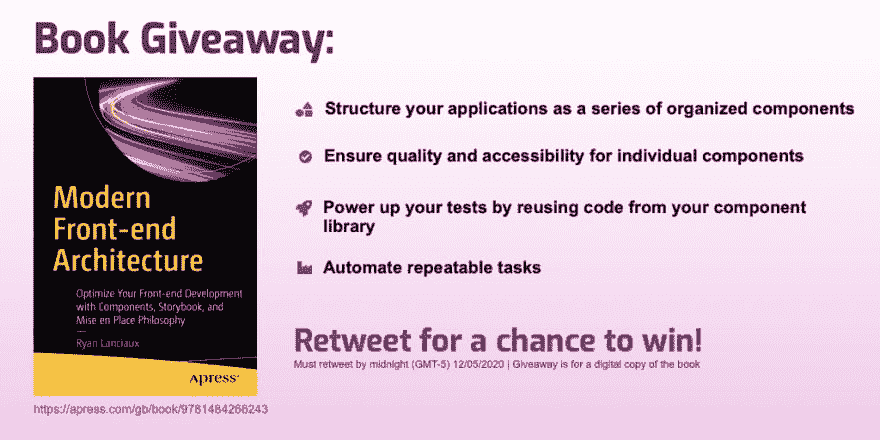
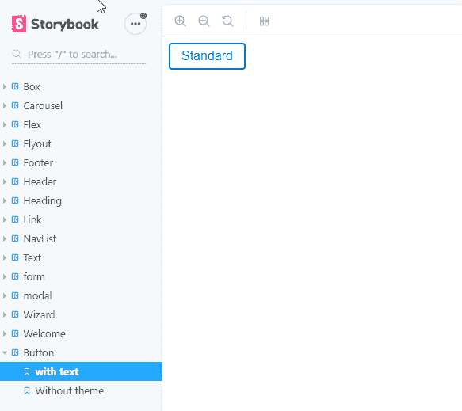
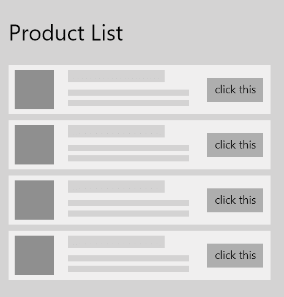
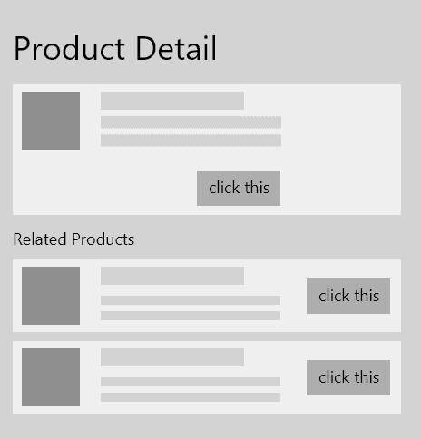

# 更好的前端开发灵感来自烹饪世界

> 原文:[https://dev . to/ryanlanciaux/the-magic-of-a-mise-en-place-mind-for-frontend-development-3ge 0](https://dev.to/ryanlanciaux/the-magic-of-a-mise-en-place-mindset-for-frontend-development-3ge0)

## [](#temporary-update)临时更新

> 瑞恩兰西亚[@瑞恩兰西亚](https://dev.to/ryanlanciaux)🚨泄漏🚨
> 
> 我写了一本书，并将赠送两本(数码)。转发进入。这本书涵盖了应用程序结构、定制组件库、测试和开发过程的自动化部分。在这里了解更多:【apress.com/gb/book/978148…】[](https://twitter.com/intent/tweet?in_reply_to=1334156619727441923)[](https://twitter.com/intent/retweet?tweet_id=1334156619727441923)[](https://twitter.com/intent/like?tweet_id=1334156619727441923)2020 年 12 月 02 日下午 15:25

Book giveaway must Retweet by Midnight on 12/05/2020 (GMT -5)

* * *

<small>*封面照片由[法布里吉奥·马戈尼](https://unsplash.com/@fabmag?utm_source=unsplash&utm_medium=referral&utm_content=creditCopyText)在 [Unsplash](https://unsplash.com/)*</small> 拍摄

软件开发作为一个行业，一直在与交付质量代码作斗争。虽然许多开发人员都有衡量质量的标准，但是确保满足这些标准是一个挑战，尤其是当代码库随着时间的推移而增长时。

> 我们像建造城市一样建造我们的计算机系统:随着时间的推移，没有计划，在废墟之上。

- Ellen Ullman

## [](#mise-en-place)设置

虽然软件开发是一个相对年轻的领域，但我们可以向更多成熟的行业学习，以帮助我们编写更好的代码。几代人以来，厨师们都把“原地不动”的心态吹捧为在厨房取得成功的关键技术。

> 让厨房运转起来的系统叫做 mise-en-place

[The Salt, NPR](https://www.npr.org/sections/thesalt/2014/08/11/338850091/for-a-more-ordered-life-organize-like-a-chef)

或者换一种说法

> Mise en place 指的是提前准备好的所有这些不同的组件，当你收到订单并把菜放在一起时，你就已经准备好了。

[Adam Savage, Every Tool's a Hammer](https://www.amazon.com/Every-Tools-Hammer-Life-What/dp/1982113472)

Mise en place 是准备一顿饭的组织和心态。这看起来像是提前做了更多的工作，但是可以帮助确保生产率、一致性和质量。

## 这与构建我们的前端应用程序有什么关系？

很多前端技术都有组件的概念。组件是我们前端应用程序的构建模块，但作为确保生产力、一致性和质量的工具却被忽视了。很多时候，我们把注意力集中在应用程序用户看到的屏幕上，而忽略了这些屏幕的构建模块。如果不注意细节，很容易在代码库中留下一系列一次性的和重复的组件。

布拉德·弗罗斯特有一本关于构建伟大设计系统的极好的书，叫做《原子设计》。在这本书中，([和相关文章](http://bradfrost.com/blog/post/atomic-web-design/))他将设计系统(或组件库)定义为一系列的层次。在这种方法论中，基础层组件是原子，原子组成分子，分子组成有机体等等(我强烈推荐 Brad 的 [post](http://bradfrost.com/blog/post/atomic-web-design/) / [book](http://atomicdesign.bradfrost.com/) 来真正看到这种思维模式在起作用)。虽然我通常不使用相同的术语，但我很欣赏用于构建可重用前端应用程序的基础级组件和复合组件的概念。

你可能会注意到，这些概念中的一些适用于我们正在讨论的“原地不动”思维模式。我们可以在应用程序中创建单个屏幕/页面之前构建组件。

## 我们怎样才能将一种错误的哲学应用到我们的代码库中？

如果你有这种想法，你会发现在应用程序的标准位置之外，孤立地处理组件是有帮助的。在最简单的层面上，我们可以为每个组件创建测试页面。这可能会带来一些挑战，确保页面不会被部署，其他开发人员知道在哪里可以找到它们以及其他类似的事情。

幸运的是，有许多工具可以独立地处理组件。故事书是我用得最多的一本。

使用 Storybook，我们可以为每个组件添加“故事”。故事是一个函数，它定义了应该呈现什么，以及与我们正在开发的组件的输入和输出交互的方式(这些通常通过[故事书插件](https://storybook.js.org/addons/))。假设我们正在构建一个组件库，其中包含按钮、文本、卡片等基本组件。以及这些组件的一系列更复杂的组合。我们将完全在 Storybook 中开发这些低级组件，然后在应用程序中将它们与实际数据联系起来。

Storybook 允许我们在标准应用程序之外运行组件，从而加快了创建组件库的过程。例如，`yarn storybook`可以被配置为启动 Storybook，而`yarn start`可以被配置为运行应用程序的开发版本。

[T2】](https://res.cloudinary.com/practicaldev/image/fetch/s--vy8qgLDr--/c_limit%2Cf_auto%2Cfl_progressive%2Cq_auto%2Cw_880/https://thepracticaldev.s3.amazonaws.com/i/64tj9atw72an8c98jvwt.png)

<small>Very basic storybook window</small>

当应用“原地不动”的思维模式时，开发组件的地方和构建应用程序的地方之间的这种分离非常有帮助。我们可以将 Storybook 视为我们正在准备的工作区，将应用程序屏幕视为由我们预先准备的各种配料组成的菜肴。

## 这实际上对我有什么帮助？

在烹饪界，厨师可以用少量经过专业准备的原料做出许多菜肴。配料组成一道菜的组成部分，这些组成部分被转化为完整的膳食。这使得厨师可以快速做出许多质量和一致性相似的菜肴。

让我们以“快速休闲”餐馆 Chipotle 为例。有一系列预先准备好的膳食成分，随时可以组合成一顿饭。想象一下，如果每次顾客下订单时，准备饭菜的人都需要烹饪和准备饭菜的每一部分，这需要多长时间。在所花费的时间之外，这将使过程变得更加复杂，从而导致质量下降。

这在软件开发中也有相似之处。如果我们构建的组件经过测试并符合我们期望的质量标准，我们就可以在更短的时间内构建出对结果更有信心的屏幕。

假设我们需要为一个应用程序构建两个屏幕。产品列表和产品细节。我们希望产品细节上的相关产品看起来完全像产品列表。

### [](#product-listing)产品清单

[T2】](https://res.cloudinary.com/practicaldev/image/fetch/s--poyMLcS6--/c_limit%2Cf_auto%2Cfl_progressive%2Cq_auto%2Cw_880/https://thepracticaldev.s3.amazonaws.com/i/pw1kibsbqabkx1c6sgjh.png)

### [](#product-detail)产品明细

[T2】](https://res.cloudinary.com/practicaldev/image/fetch/s--OojUjZBB--/c_limit%2Cf_auto%2Cfl_progressive%2Cq_auto%2Cw_880/https://thepracticaldev.s3.amazonaws.com/i/efyag7i408m1ewf5is1m.png)

我们可以构建一个列表项组件，它将是(伪代码/类似 JSX 的)如下:

```
// ListItem output - JSX like but pseudo code
<Card>
  <Flex flexDirection="row">
    <ProductImage src={imageSrc} />
    <Flex flexDirection="column">
      <Heading>{headingText}</Heading>
      <Text>{description}</Text>
    </Flex>
    <Button onClick={onClick}>Click this</Button>
  </Flex>
</Card> 
```

<svg width="20px" height="20px" viewBox="0 0 24 24" class="highlight-action crayons-icon highlight-action--fullscreen-on"><title>Enter fullscreen mode</title></svg> <svg width="20px" height="20px" viewBox="0 0 24 24" class="highlight-action crayons-icon highlight-action--fullscreen-off"><title>Exit fullscreen mode</title></svg>

一旦我们有了这个，我们就可以在 ProductList 和 ProductDetail 中重用它。

`<ListItem headingText="Some Item" description="This is the description ..." ... />`

您会注意到，虽然这个 ListItem 是一个可重用组件，但它由其他可重用组件组成。Flex / Heading / Button 等都可以是低级组件([虽然这是伪代码，但 Flex 的用法基本上是 Rebass Flex 组件](https://rebassjs.org/flex))。

## [](#wrapping-up)包装完毕

虽然关于开发应用程序的好方法有成千上万种观点，但我发现在构建前端应用程序时，应用 mise en place 理念可以提高质量、一致性，并最终提高生产率。

> 我想如果我们变得更有组织性一点，使用更多的 mise-en-place，理解我们真正需要的，并且只做我们真正需要的，我想我们会有更多的时间

*   美国烹饪学院

<small>*(这是从 ryanlanciaux.com*</small>交叉贴出来的)