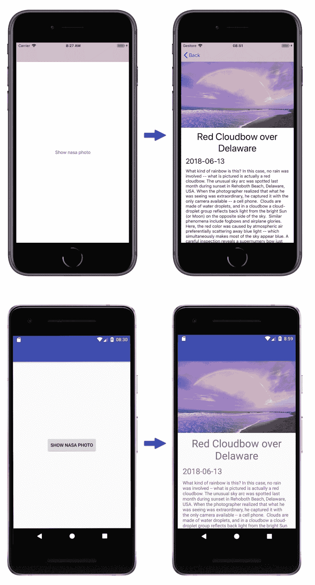
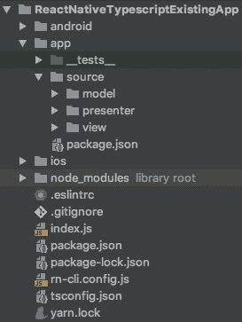

# React Native + Typescript，一见钟情。在现有应用程序中设置

> 原文:[https://dev . to/chicio/react-native-type script-love-at-first-sight-setup-in-an-existing-app-576](https://dev.to/chicio/react-native-typescript-love-at-first-sight-setup-in-an-existing-app-576)

在这篇文章中，我将向你展示如何在现有的应用程序中设置 React Native + Typescript。

在过去的几个月里，我在 lastminute.com 集团(T1)参与了(T2)的以下项目:用新的界面和新的功能重新构建主要品牌(lastminute.com、T4、沃尔沃、兰博和 T7)的原生移动应用。
我们来对比一下 lastminute.com app 的新旧主场。这些变化令人印象深刻😎。

[T2】](https://res.cloudinary.com/practicaldev/image/fetch/s--yyVTU-S4--/c_limit%2Cf_auto%2Cfl_progressive%2Cq_auto%2Cw_880/https://www.fabrizioduroni.it/asseimg/posts/compare-homes-lastminute.jpg)

对于这个“应用重新启动”项目，我们决定使用 React Native(我已经在以前的一些帖子中谈到过这个框架，你可以在[存档部分](https://dev.to/blog/archive)中找到)。我们没有从头开始重写应用程序。我们决定在现有代码库中集成 React Native，并:

*   使用[原生模块](https://facebook.github.io/react-native/docs/native-modules-ios.html)来重用我们已经为一些特性准备好的一些原生代码(例如登录)。
*   尽可能用 React Native 完整地编写新内容。

当我们开始这个项目时，我们还做了另一个重要的决定:我们选择 TypeScript 而不是 Javascript 作为主要语言来编写我们的 React 本机内容。什么是 TypeScript？它是由微软开发和维护的开源编程语言。他们在其官方网站上用以下定义来描述它:

> Typescript 是 Javascript 的类型化超集，它编译成普通 Javascript。任何浏览器。任何主机。任何操作系统。打开
> 信号源。

这是什么意思？这意味着 TypeScript 基本上是*“类固醇上的 Javascript”*:它在编译时提供可选的静态类型检查。因为它是 JavaScript 的超集，所以所有 JavaScript 代码都是有效的类型脚本代码。
如果你是来自其他强类型语言的开发人员，并且对面向对象编程有很强的了解，那么 TypeScript 是很有帮助的，因为它让你可以重用很多你已经知道的编程技术。

React Native 官方支持 Javascript。如何设置 React Native + Typescript？在这篇文章中，我们将看到如何在现有的应用程序中集成 React Native 和 Typescript，我们将在 React Native 中添加一个新的屏幕，在那里我们将显示我们将从 [Nasa 开放 API](https://api.nasa.gov/) 中读取的当天照片。下面你可以找到我们将实现的目标。第一个屏幕是标准的本地屏幕。第二个是 React 原生屏。

[T2】](https://res.cloudinary.com/practicaldev/image/fetch/s--bB7oq_O3--/c_limit%2Cf_auto%2Cfl_progressive%2Cq_auto%2Cw_880/https://www.fabrizioduroni.it/asseimg/posts/react-native-typescript-app-screens.jpg)

让我们开始为 React Native 和 TypesScript 设置项目。首先，反应原生集成。对于这项任务，我们只需遵循 [React 本地文档中关于与现有应用](https://facebook.github.io/react-native/docs/integration-with-existing-apps.html)集成的内容。
然后我们可以开始整合 TypeScript。我们将使用 [yarn](https://yarnpkg.com/lang/en/) 作为依赖项管理器，而不是 npm(您也可以使用它来安装在现有应用程序中设置 React Native 所需的依赖项)。Yarn 是脸书于 2016 年 10 月发布的一款快速、可靠、安全的依赖管理器。
我们的项目目录结构将包含在下面的截图中。现有的本地代码库包含在`ios`和`android`文件夹中。

[T2】](https://res.cloudinary.com/practicaldev/image/fetch/s--HAPdAt9J--/c_limit%2Cf_auto%2Cfl_progressive%2Cq_auto%2Cw_880/https://www.fabrizioduroni.it/asseimg/posts/react-native-typescript-directories.jpg)

所以让我们从安装 TypeScript 和 React Native 的类型开始。我们可以在项目的根目录下使用下面的命令来做到这一点:

```
yarn add --dev typescript
yarn add --dev @types/react @types/react-native 
```

<svg width="20px" height="20px" viewBox="0 0 24 24" class="highlight-action crayons-icon highlight-action--fullscreen-on"><title>Enter fullscreen mode</title></svg> <svg width="20px" height="20px" viewBox="0 0 24 24" class="highlight-action crayons-icon highlight-action--fullscreen-off"><title>Exit fullscreen mode</title></svg>

之后，我们需要在我们的项目中配置 TypeScript。我们可以通过运行下面的命令开始这样做:

```
yarn tsc --init --pretty --jsx react 
```

<svg width="20px" height="20px" viewBox="0 0 24 24" class="highlight-action crayons-icon highlight-action--fullscreen-on"><title>Enter fullscreen mode</title></svg> <svg width="20px" height="20px" viewBox="0 0 24 24" class="highlight-action crayons-icon highlight-action--fullscreen-off"><title>Exit fullscreen mode</title></svg>

现在我们在项目的根目录下有了一个新文件:`tsconfig.json`文件。这个文件是 TypeScript 编译器`tsc`的配置文件。我们可以根据自己的需求定制(React)。特别是，我们需要启用选项`allowSyntheticDefaultImports`来允许从没有默认导出的模块中进行默认导入。我们还定制了`baseUrl`和`paths`选项。通过以这种方式设置它们，并通过使用`name: "app"`在`app`文件夹中添加一个`package.json`文件，我们可以将所有的源代码放在`app`文件夹中，当我们需要导入一个类时，我们将设置从`app`基本文件夹开始的路径(因此基本上我们以一种很好的方式为我们的导入定义了源代码的根)。下面的

你可以找到为我们的需求配置的完整的`tsconfig.json`文件。

```
{  "compilerOptions":  {  "target":  "es2015",  "module":  "es2015",  "allowJs":  true,  "checkJs":  true,  "jsx":  "react-native",  "removeComments":  true,  "strict":  true,  "noUnusedLocals":  true,  "noUnusedParameters":  true,  "noImplicitReturns":  true,  "moduleResolution":  "node",  "baseUrl":  "app",  "paths":  {  "app/*":  [  "./*"  ]  },  "allowSyntheticDefaultImports":  true  },  "typeRoots":  [  "./node_modules/@types"  ],  "types":  [  "react",  "react-native",  "jasmine",  "jest"  ],  "exclude":  [  "node_modules",  "app/__tests__",  "rn-cli.config.js"  ]  } 
```

<svg width="20px" height="20px" viewBox="0 0 24 24" class="highlight-action crayons-icon highlight-action--fullscreen-on"><title>Enter fullscreen mode</title></svg> <svg width="20px" height="20px" viewBox="0 0 24 24" class="highlight-action crayons-icon highlight-action--fullscreen-off"><title>Exit fullscreen mode</title></svg>

之后，我们需要安装[React Native type script Transformer](https://github.com/ds300/react-native-typescript-transformer)。
这个转换器将允许 React Native cli 根据需要自动将我们的类型脚本代码转换成 Javascript。这是安装变压器的命令:

```
yarn add --dev react-native-typescript-transformer 
```

<svg width="20px" height="20px" viewBox="0 0 24 24" class="highlight-action crayons-icon highlight-action--fullscreen-on"><title>Enter fullscreen mode</title></svg> <svg width="20px" height="20px" viewBox="0 0 24 24" class="highlight-action crayons-icon highlight-action--fullscreen-off"><title>Exit fullscreen mode</title></svg>

之后，我们需要通过将以下配置添加到`rn-cli.config.js`文件(在项目根目录中创建它)来配置 React Native cli 以实际使用转换器。该文件是 React 本机配置文件。

```
module.exports = {
  getTransformModulePath() {
    return require.resolve('react-native-typescript-transformer');
  },
  getSourceExts() {
    return ['ts', 'tsx'];
  },
}; 
```

<svg width="20px" height="20px" viewBox="0 0 24 24" class="highlight-action crayons-icon highlight-action--fullscreen-on"><title>Enter fullscreen mode</title></svg> <svg width="20px" height="20px" viewBox="0 0 24 24" class="highlight-action crayons-icon highlight-action--fullscreen-off"><title>Exit fullscreen mode</title></svg>

这就是主要源代码设置的全部内容。现在我们可以开始建立测试基础设施了。我们将使用 [jest](https://jestjs.io/) ，一个来自脸书的测试框架，以及 [typemoq](https://github.com/florinn/typemoq) ，一个特定于 TypeScript 的模仿库。
为了在 TypeScript 中使用 jest，我们将安装 [ts-jest](https://github.com/kulshekhar/ts-jest) ，这是一个 TypeScript 预处理器，支持 Jest 的源代码映射，允许我们使用 Jest 来测试用 Typescript 编写的项目。

```
yarn add --dev ts-jest
yarn add --dev typemoq 
```

<svg width="20px" height="20px" viewBox="0 0 24 24" class="highlight-action crayons-icon highlight-action--fullscreen-on"><title>Enter fullscreen mode</title></svg> <svg width="20px" height="20px" viewBox="0 0 24 24" class="highlight-action crayons-icon highlight-action--fullscreen-off"><title>Exit fullscreen mode</title></svg>

正如您从我上面展示的目录结构中所记得的，`__tests__`文件夹不在通常的 React 本地项目位置。它被放置在应用程序文件夹中。为了能够将我们的测试放在这个文件夹中，我们需要向其中添加一个`jest.config.js`文件，并设置一些与模块分辨率相关的自定义选项。下面你可以找到整个文件的所有细节。

```
module.exports = {
    'preset': 'react-native',
    'moduleFileExtensions': [
        'ts',
        'tsx',
        'js',
    ],
    'rootDir': '../..',
    'transform': {
        '^.+\\.(js)$': '<rootDir>/node_modules/babel-jest',
        '\\.(ts|tsx)$': '<rootDir>/node_modules/ts-jest/preprocessor.js',
    },
    'testMatch': ['**/__tests__/**/*.(ts|tsx|js|jsx)?(x)', '**/?(*.)(spec|test).(ts|tsx|js|jsx)?(x)'],
    'testPathIgnorePatterns': [
        '\\.snap$',
        '<rootDir>/node_modules/',
        'jest.config.js',
    ],
    'moduleDirectories': [
        'node_modules',
        '../',
    ],
}; 
```

<svg width="20px" height="20px" viewBox="0 0 24 24" class="highlight-action crayons-icon highlight-action--fullscreen-on"><title>Enter fullscreen mode</title></svg> <svg width="20px" height="20px" viewBox="0 0 24 24" class="highlight-action crayons-icon highlight-action--fullscreen-off"><title>Exit fullscreen mode</title></svg>

我们现在准备编写我们的应用程序。基本上显示美国宇航局照片的屏幕是`NasaPhotoViewerScreen`。这个组件使用`NasaPhotoInformationComponent`和一些 React 本地标准组件来显示来自 API 的信息。使用`NasaPhotoService`获取信息。使用`NasaPhotoComponentPresenter`中的[模型-视图-展示者](///2017/08/11/model-view-presenter-architecture-ios-swift-unit-test.html)架构将`NasaPhotoViewerScreen`和`NasaPhotoService`粘合在一起。从下面的代码中可以看出，TypeScript 的语法类似于其他语言，如 Java、C#(以及许多其他语言😎).

```
export class NasaPhotoService {
  async retrieve(): Promise<any> {
    return fetch('https://api.nasa.gov/planetary/apod?api_key=1cygunHJsSwDug6zJjF3emev3QAP8yFLppohLuxb')
      .then((response) => response.json())
  }
}

...

export class NasaPhotoComponentPresenter {
  private nasaPhotoRepository: NasaPhotoRepository
  private nasaPhotoView: NasaPhotoView

  constructor(nasaPhotoView: NasaPhotoView, nasaPhotoRepository: NasaPhotoRepository) {
    this.nasaPhotoRepository = nasaPhotoRepository
    this.nasaPhotoView = nasaPhotoView
  }

  async onStart(): Promise<void> {
    try {
      const nasaPhoto = await this.nasaPhotoRepository.load();
      this.nasaPhotoView.showValid(nasaPhoto);
    } catch (_) {
      this.nasaPhotoView.showAn("Network error")
    }
  }
}

...

export class NasaPhotoViewerScreen extends React.Component<Props, State> implements NasaPhotoView {
  private readonly presenter: NasaPhotoComponentPresenter

  constructor(props: Props) {
    super(props)
    this.state = {
      photo: NasaPhoto.empty()
    }
    this.presenter = new NasaPhotoComponentPresenter(
      this,
      new NasaPhotoRepository(new NasaPhotoService(), new NasaPhotoAdapter())
    )
  }

  componentWillMount() {
    this.presenter.onStart()
  }

  showAn(error: string): void {
    alert(error)
  }

  showValid(photo: NasaPhoto): void {
    this.setState({photo})
  }

  render() {
    return (
      <ScrollView style={styles.container}>
        <Image
          style={styles.image}
          source={{uri: this.state.photo.url}}
        />
        <NasaPhotoInformationComponent
          title={this.state.photo.title}
          date={this.state.photo.date}
          description={this.state.photo.description}
        />
      </ScrollView>
    );
  }
}

interface Props {
  name: string
}

interface State {
  photo: NasaPhoto
}

const styles = StyleSheet.create({
  container: {
    width: "100%",
    height: "100%"
  },
  image: {
    width: "100%",
    height: 220,
    resizeMode: "cover",
  }
}); 
```

<svg width="20px" height="20px" viewBox="0 0 24 24" class="highlight-action crayons-icon highlight-action--fullscreen-on"><title>Enter fullscreen mode</title></svg> <svg width="20px" height="20px" viewBox="0 0 24 24" class="highlight-action crayons-icon highlight-action--fullscreen-off"><title>Exit fullscreen mode</title></svg>

你可以在 [this github repository](https://github.com/chicio/React-Native-Typescript-Existing-App) 中查看上述示例的所有代码，并查看我为上面展示的应用程序创建的所有 TypeScript 组件。就是这样！！！反应原生+打字稿:♥️对♥️.一见钟情

*原载于[https://www . fabrizioduroni . it](https://www.fabrizioduroni.it/2018/07/04/react-native-typescript-existing-app.html)2018 年 7 月 4 日。*