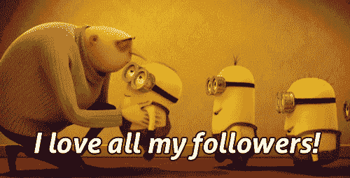

# 什么是 Kubernetes 奴才？

> 原文:[https://dev.to/adipolak/what-are-kubernetes-minions-35h3](https://dev.to/adipolak/what-are-kubernetes-minions-35h3)

好的。我们长话短说吧！

Kubernetes 集群是机器的集合，每台机器都有专门的角色。他们可以是主人，也可以是工人。master 是我们的 API 联系点，它保存着集群中正在进行的应用、pods、开发等方面的信息。工人负责在容器中运行应用程序。

充当工人的机器过去被称为`minions`。今天它们被称为节点。

*就是这样！*

 *[T2】](https://i.giphy.com/media/1yscVZ8RHQOGs/giphy.gif)

更多的 bitesize，欢迎你在这里和在[推特](https://twitter.com/AdiPolak)上关注我。*