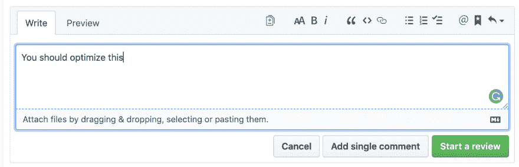
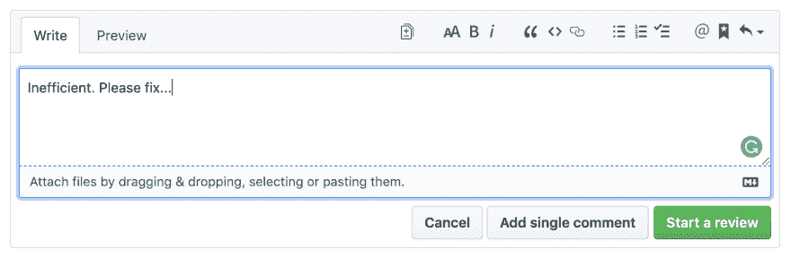
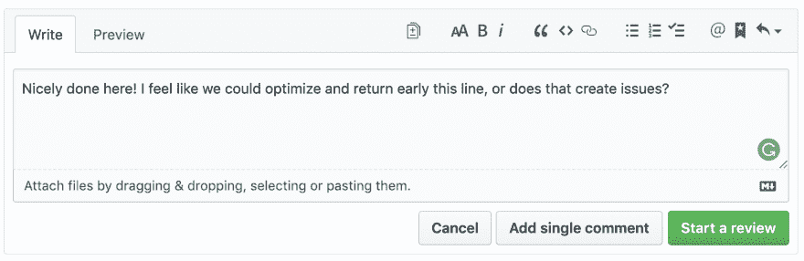

# 软件开发团队中良好沟通的技巧

> 原文：<https://dev.to/gc_psk/tips-for-good-communication-in-software-development-teams-5b8b>

*本文原载于[点点滴滴](https://blog.bitsrc.io)由[gian Carlo Buomprisco](https://medium.com/@.gc)T5】*

在作为一名专业软件开发人员工作了大约 7 年之后，我逐渐意识到沟通是一项和我们的技术知识一样重要的技能。

我们关注并花费大量的时间去理解这个新框架的细节，“你必须学习！”然而，在大多数情况下，**我们很少与团队成员进行更好的沟通**。

> # Communication is a skill as important as our technical knowledge

交流对人有影响，这就是为什么正确的交流不应该是可有可无的。这是一个每个经理都应该确保团队做对的问题。

### 善于沟通是一种技能

有些人可能不相信，也可能没有意识到，但以我的经验来看，这是有些人在职业生涯中停滞不前，无法成长的最重要原因之一。

交流是一个巨大的话题，因此，我想澄清本文中讨论的话题。我不会谈论如何更好地沟通，让自己听起来像个聪明人，如何准备你的下一个重要演讲，或者如何更好地推销你的副业。

相反，这篇文章将关注**情商**以及如何将它应用到每天都在发生的具有挑战性的情形中，在这些情形中，沟通起着至关重要的作用。

### 为什么沟通这么重要？

对于每个团队来说，沟通都是一件很难解决的事情:它确实受到编码之外的几个方面的影响。在成为程序员之前，我们是人类。因此，我们都有不同的个性、教养、价值观、文化和语言。

尽管团队成员之间可能存在差异，但我觉得我们可以找到一些方法来帮助团队更好地沟通和合作。

### 我说的“沟通”是什么意思

首先，当我谈论交流时，我并不是说你应该被强迫去社交，或者你应该和你的同事谈论你的周末计划和前一天你做了什么的详细清单来开始你的一天。

如果你的同事不介意的话，当然可以！但这不是重点。你不必为了成为一个伟大的团队成员而与你的同事成为朋友，你只需要成为一个体面的人。

在这篇文章中，我们想讨论的是如何确保我们能够以这样一种方式与同事交流:

*   让他们有机会分享自己的观点

*   给予他们尊重，不管资历(或其他什么)

*   没有威胁

*   帮助他们或你改进我们的工作

    > # To be an excellent team member, you don't need to be friends with your colleagues, you just need to be a decent person

## 轻松共享团队代码

使用像 [**Bit** (GitHub)](https://github.com/teambit/bit) 这样的工具，轻松地在您团队的项目之间共享组件，协作进行更改，并在生产过程中保持同步。

## 冲突中沟通

作为程序员，我们每天在不同的情况下进行多次对话，有时这会导致冲突。让我们来看看我们每天遇到的一些常见场景，以及我们的沟通如何能够**带来更好、更健康的工作场所**。根据我的经验，一个健康的工作场所通常也是高效的工作场所(T2)。

在我的职业生涯中，我不得不处理的最困难的情况无疑是对*拉请求*的审查，这尤其对于初级开发人员来说，可能是一种非常令人生畏的经历。

不幸的是，这是一个特殊的场景，甚至在一些大型和著名的开源社区中也非常明显，这导致许多编码人员不愿为开源做出贡献。

### 我们为什么要做 PR 评审？

我们首先使用评论的常见原因是:

*   在虫子被运送到主分支之前抓住它们

*   提出改进建议并讨论变化

*   学习尚未编写的代码，并与代码库保持同步

不过，在我的职业生涯中，我确实遇到过一些完全不理解审查其他开发人员代码的意义和目的的开发人员，尽管他们只是少数。

大多数和我一起工作的人完全知道回顾的概念，但是他们做的方式是完全错误的。你猜怎么着？**我也完全错了**。

在我的职业生涯中，我犯了大量的错误，只有多年的经验才让我意识到并理解这些错误。作为一个对最新框架了如指掌的年轻人是很有趣的，而且会让你的头脑有点混乱。

经过大量的经验、思考、研究，也许还有成熟，我发现了一些改变我对同事态度的技巧，尤其是对我工作的代码。

### 提问

评论和技术争论总是会带来一种微妙的威胁感，但是我们可以使用一些方法来尽量减少这种感觉。

我觉得每个人都应该遵循的第一条也是最重要的一条建议是:对于你在评论中留下的每一条评论，或者每次你认为你对某个特定主题可能有不同意见的时候，**总是把你的疑问以问题的形式表达出来**。

例如，假设您想要指出一项性能改进。我们可以用两种方式来表达我们的意见:

*   作为一个问题

*   作为命令

**命令**

**问题**

你认为什么会对你的拉动式请求产生更好的影响？

让我们看另一个例子:

**命令**

**问题**

这两种方法有什么不同？

*   使用**命令风格**，审查员假设他已经知道作者试图做什么或不做什么。他/她没有提供更好的做事方法，也没有根据他们所知道的提供解决方案。这让你想起谁了吗？我想是的…

*   使用**问题风格**，评审者要求澄清，不要假设他们知道关于代码的一切，并提供一个解决方案而不排除替代的论点

### 不是“好”的问题

上面的建议可能会让你认为我是在提倡撒谎或者和你的同事友好相处。不，我不是。我建议你假定你的同事是无辜的，给他一个机会表达他对自己准则的观点。

一般来说，我建议你假设:

*   你的同事有最好的意图

*   你没有上下文，只有一个小的差异

*   你甚至可能不知道一些事情，但可以从中学习

### 不是你，是我们

永远不要提“你”这个词。相反，强调代码是由团队编写和拥有的，而不是个人的。

*   使用“你”让作者更有可能把评论当成个人意见

*   用“我们”或“我们”。一切都应该是团队的责任，而不是个人的

### 审视你的态度

我在与数百名程序员一起工作时注意到的最大问题是他们的态度，就像我一样。有时工作是他们唯一关心的，有时他们对待工作的方式让他们认为工作本身定义了他们。

*   他们生同事的气，因为他们没有自己优秀

*   他们不会赞美别人，因为害怕这样做会贬低他们

*   他们确信自己永远是对的

结果，一切都变成了竞争和赛跑，这是有毒工作场所的配方。如果你能理解，回顾一下你的态度。

*   承认他人
    我不是说你应该每天都赞美别人，但是当你认为他们工作出色时，或者当你注意到他们的技能有所提高时，记得赞美他们。人们喜欢赞美，而且是免费的。

*   你写的代码是你的吗？
    大概不会。不要执着于你的代码，试着从你的头脑中去除那种它是你的****(当然，除非你也是公司的所有者)

*   **有时赢，有时输**
    不要总想看起来是对的。程序员喜欢做正确的人，他们会争论几个小时来证明自己是正确的。有时候，离开一场看似正确的讨论是最好的选择

*   你不是你写的代码
    你的代码不是你是谁，也不代表你的智力或你作为一个人的价值。有时你同事的评论会很刺耳。有时候他们是对，有时候他们是错的，但是不要让这影响到你的个人水平

    > # Don't always want to look right

### 像团队一样解决矛盾

如果你和同事发生了冲突，显而易见的策略是说出来，在你们两人之间解决。现在，我们都知道这通常不是事实，你们两个都绝对肯定你们的方式就是方式。

当然，有时候上面关于不要总是对的提示并不适用于这种情况:你确实对自己的观点很有把握。问题是，**这不仅仅是你们两个人的问题**，而是整个团队的问题。在这种情况下，整个团队都应该民主地参与决策。

*   让你的团队意识到冲突

*   说出来，做一个大家都满意的决定

*   让解决方案成为未来的标准

### 让审查你的代码变得容易

现在，让我们从作者的角度来看如何更好地处理交流。以下是一些帮助评论者，尤其是脾气暴躁的评论者的建议:

*   **越小越好**
    保持拉动要求**尽可能小**并经常推动。我不喜欢给出确切或绝对的数字，因为这很难。如果你写的是 HTML 这样的代码，diff 的大小会比 Javascript 或 CSS 代码大得多。保持合理的大小就好。

*   **早复习比晚复习好**
    让复习从头来！如果一个评论者会一口气留下 30 条评论，那么讨论修改和修正它们将会变得更加困难和令人沮丧。如果您让评审员评审较小的代码片段，您可以肯定解决这些问题会简单得多。

*   **文档**
    提供文档**并对你自己的 PRs** 进行评论，解释可能看起来古怪的部分，以便你预测评论者可能会发表的评论。添加 TODOs，将更大块的重构委派给不同的任务，这样评审者就能更好地意识到某些限制和你的整体想法。

*   **寻求帮助**
    如果您有疑问，**在提交拉取请求之前，寻求帮助**或征求意见。不管他们有多忙，大多数人都乐于助人

*   **检查你自己的代码**
    在提交之前阅读并检查你的差异，如果你的公司有一个约定文件，确保你遵循它

## 最后的话

我共事过的大多数难相处的程序员都没有恶意。他们对自己的工作充满热情，这可能是我们在做自己喜欢的事情时经常陷入冲突的首要原因。

不可否认的是，技术领域受到了毒害，许多人以不同的方式对此做出了贡献。推文、公共论坛、GitHub 评论等。我每天都看到这个。但是在大多数情况下，程序员并不是天生的坏人。我们是劳动力中相当特殊的一个阶层:我们真的很在乎。

当然，这一套建议不会阻止团队有相互冲突的观点:**冲突是工作的一部分，并将一直存在**，但通过有效的沟通，我们都有可能将它们减少到最低限度，或者更好地处理它们，并在一个高效、和平和健康的地方工作。

最终，富有同情心有助于团队表现更好，一起更好地学习，交付优秀的产品，并且通常有助于享受更好的日常工作体验。

* * *

如果您需要任何澄清，或者如果您认为有些事情不清楚或错误，请留下评论！

我希望你喜欢这篇文章！如果你有，请关注我的 [媒体](https://medium.com/@.gc)或[推特](https://twitter.com/home)以获取更多关于前端、Angular、RxJS、Typescript 等的[文章](https://frontend.consulting/)！*