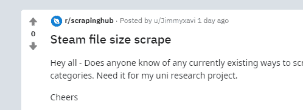
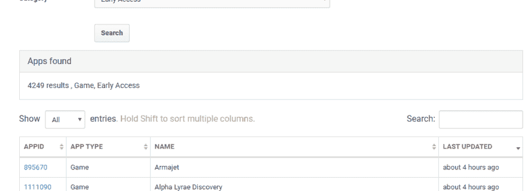
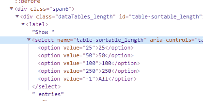
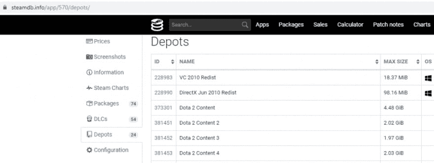

# 约旦刮刀蒸汽 db

> 原文:[https://dev.to/aarmora/jordan-scrapes-steamdb-2epb](https://dev.to/aarmora/jordan-scrapes-steamdb-2epb)

[演示代码在这里](https://github.com/aarmora/jordan-scrapes-steamdb)

## [](#a-request)一个请求

[](https://i.giphy.com/media/Y48QfZEXDWLgTcoPJ6/giphy.gif) 

<figcaption>除了我同意之外</figcaption>

这个请求是从 [u/Jimmyxavi](https://www.reddit.com/user/Jimmyxavi/) 直接向你提出的。看起来他正在为大学做一个项目，想要获得所有早期游戏的 steam 文件大小。

所以，我们在这里 goooooooooo…

[T2】](https://res.cloudinary.com/practicaldev/image/fetch/s--78dP9krz--/c_limit%2Cf_auto%2Cfl_progressive%2Cq_auto%2Cw_880/https://javascriptwebscrapingguy.com/wp-content/uploads/2019/09/image-9.png)

木偶师是我在这场战斗中选择的武器。我已经[写了几次](https://javascriptwebscrapingguy.com/category/puppeteer/)关于它，它仍然是我最喜欢的武器之一。我也许可以用 Axios 更快一点，但每当我要访问一个网站数千次时，我有点喜欢木偶师给我施加的速度减慢。它还允许我轻松地进行一些有用的交互，比如更改下拉列表。

## [](#the-gatekeeper-called-algolia)守门人叫阿果

我在 [steamdb.info](https://steamdb.info) 上挖来挖去，看看我是否能直接导航到任何页面。起初，我尝试了[即时搜索测试版](https://steamdb.info/instantsearch/)，这是一个非常酷的工具，但对于网络抓取来说有点糟糕。它使用一种叫做 [Algolia](https://www.algolia.com) 的东西，类似于弹性搜索，非常强大、快速的搜索。

两周前，我刚好和我的好朋友马特讨论过 Algolia(见他的酷酷包装公司 [Citadel Packaging](https://www.citadelpackaging.com/) )。我在寻找一些工具，以改善在[钴情报](https://cobaltintelligence.com/)(伟大的商业线索！)而阿洛利亚是他建议的事情之一。

Algolia 是为快速搜索而构建的，但将总结果限制为 1，000 个。这取决于您是否传递了一个查询，它会将这些结果限制为 1000 个。如果我没有通过一个查询，即使总金额更接近 5000，我也不可能得到超过 1000。我稍微修改了一下，但还是决定用他们的另一个搜索选项。

## [](#enter-their-old-search)输入自己的旧搜索

[T2】](https://res.cloudinary.com/practicaldev/image/fetch/s--pBoqTaar--/c_limit%2Cf_auto%2Cfl_progressive%2Cq_auto%2Cw_880/https://javascriptwebscrapingguy.com/wp-content/uploads/2019/09/image-10.png)

这里是第一个有用的链接——

[https://steamdb.info/search/?a=app&q =&type = 1&category = 666](https://steamdb.info/search/?a=app&q=&type=1&category=666)。第一类我猜是“游戏”，第 666 类是“早期接入”。如你所见，这个页面提供了 4249 个游戏。默认情况下，它只显示 25 个结果。这就是木偶师的闪光点。通过一个简单的命令，我可以将下拉列表设置为我想要的任何值。在这种情况下，-1 表示“全部”。

[T2】](https://res.cloudinary.com/practicaldev/image/fetch/s--R5YfztAh--/c_limit%2Cf_auto%2Cfl_progressive%2Cq_auto%2Cw_880/https://javascriptwebscrapingguy.com/wp-content/uploads/2019/09/image-11.png)

从这里开始，我只需遍历每一行，获取每个应用程序的 url 和名称。然后，我将它们放入一个数组中，稍后我将遍历该数组并打开存储的每个页面。

```
 const appsInfo: any[] = [];
    for (let app of apps) {

        const url = await getPropertyBySelector(app, 'a', 'href');
        const name = await getPropertyBySelector(app, 'td:nth-of-type(3)', 'innerHTML');

        appsInfo.push({
            url: url,
            name: name
        });
    } 
```

下一个有用的链接是显示大小信息的仓库的实际位置。https://steamdb.info/app/570/depots/——这是有史以来最受欢迎的游戏之一 Dota 2 的仓库。如你所见，它列出了一堆构建和每个构建的大小。

[](https://res.cloudinary.com/practicaldev/image/fetch/s--fyxu2-V0--/c_limit%2Cf_auto%2Cfl_progressive%2Cq_auto%2Cw_880/https://javascriptwebscrapingguy.com/wp-content/uploads/2019/09/image-12-1024x386.png)T3】

```
export async function handleDepots(app: any, page: Page) {
    await page.goto(`${app.url}depots/`);

    const table = await page.$('#depots table:first-of-type tbody');

    if (!table) {
        return Promise.resolve();
    }
    const depots = await table.$$('tr');

    console.log('depots length', depots.length);

    for (let i = 0; i < depots.length; i++) {

        const depotSize = await depots[i].$eval('[data-sort]', elem => elem.textContent);
        const actualDepotSize = await depots[i].$eval('[data-sort]', elem => elem.getAttribute('data-sort'));
        const depotName = await getPropertyBySelector(depots[i], 'td:nth-of-type(2)', 'innerHTML');

        const macRow = await depots[i].$('.icon-macos');

        if (!macRow) {
            app[`depot${i + 1}Size`] = depotSize;
            app[`depot${i + 1}ActualSize`] = actualDepotSize;
            app[`depot${i + 1}Name`] = depotName;
        }
    }
} 
```

该功能用于处理仓库页面。它导航到该页面，然后找到带有`const table = await page.$('#depots table:first-of-type tbody');`的 depots 表。然后循环遍历这些行，并获取特定仓库的大小和仓库名称。

我对此做了一点棘手的工作，因为实际的仓库大小存储在一个`data-sort`属性中，它实际上与显示的值略有不同。我认为数据排序属性是正确的，因为这是它对列进行排序的依据。从属性中提取也有点棘手，最后我不得不使用`const actualDepotSize = await depots[i].$eval('[data-sort]', elem => elem.getAttribute('data-sort'));`而不是普通的帮助函数。

## [](#the-end)结束

[T2】](https://i.giphy.com/media/APHFMUIaTnLIA/giphy.gif)

现在我们有了。全部完成后(用了将近 70 分钟！)它输出到一个 csv 文件。

```
 const csv = json2csv.parse(appsInfo);

    fs.writeFile('steamApps.csv', csv, async (err) => {
        if (err) {
            console.log('err while saving file', err);
        }
    }); 
```

[演示代码在这里](https://github.com/aarmora/jordan-scrapes-steamdb)

## [](#looking-for-business-leads)寻找商业线索？

使用在 javascriptwebscrapingguy.com 这里谈到的技术，我们已经能够推出一种获得令人敬畏的商业线索的方法。在[了解更多钴情报](https://cobaltintelligence.com)！

帖子[Jordan Scrapes steadb](https://javascriptwebscrapingguy.com/jordan-scrapes-steamdb/)最早出现在 [JavaScript Web Scraping Guy](https://javascriptwebscrapingguy.com) 上。