# time range-RxJS 自定义函数，在指定的超时时间内发出一组值

> 原文:[https://dev . to/oleks andr/time range-rxjs-custom-function-that-emitting-a-set-of-values-in-specified-times-1me 5](https://dev.to/oleksandr/timerange-rxjs-custom-function-that-emits-a-set-of-values-in-specified-timeouts-1me5)

### TimeRange — RxJS 自定义函数，在指定的超时时间内发出一组值

*为什么，如何，在哪里对于喜欢 RxJS 的人:-)*

<figure> 

<figcaption>定制 RxJS(照片由[鬼祟肘](https://unsplash.com/@sneakyelbow?utm_source=unsplash&utm_medium=referral&utm_content=creditCopyText) )</figcaption>

</figure>

先决条件:我假设你知道两个 RxJS，并且已经练习过了。如果你是 it 新手或者想学习一些高级的话题——观看我的视频 Udemy 上的课程“[**”Web 开发实践 RxJS**](https://www.udemy.com/course/hands-on-rxjs-for-web-development/)**”。**

### 为什么

在我的开发实践中，我经常会遇到必须在指定的超时时间内发出一些值的情况。

例如:

1.  要显示然后隐藏一些闪屏消息:

<figure>[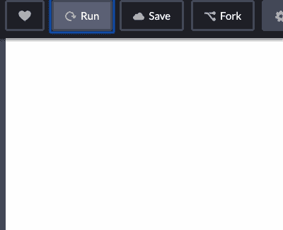](https://res.cloudinary.com/practicaldev/image/fetch/s--a-9x7pTM--/c_limit%2Cf_auto%2Cfl_progressive%2Cq_66%2Cw_880/https://cdn-images-1.medium.com/max/400/1%2A2jn_yYTMGcpyLqeDxAG3CA.gif) 

<figcaption>管理闪屏消息显示/隐藏超时</figcaption>

</figure>

1.  做一些好看的动画

<figure>[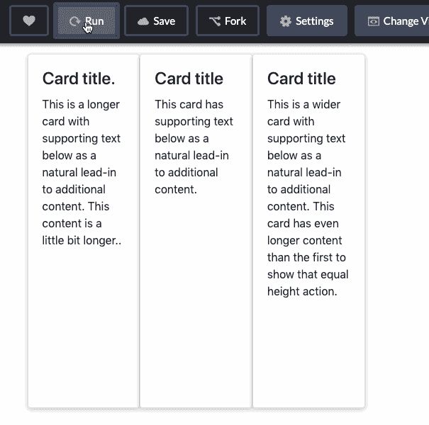](https://res.cloudinary.com/practicaldev/image/fetch/s--KsM_Wltb--/c_limit%2Cf_auto%2Cfl_progressive%2Cq_66%2Cw_880/https://cdn-images-1.medium.com/max/605/1%2A2klU0Bnmad1gZWWD3U20Wg.gif) 

<figcaption>管理外观超时</figcaption>

</figure>

1.  或者甚至只是发出单元测试的值(是的，我知道 [marbles](https://github.com/ReactiveX/rxjs/blob/master/docs_app/content/guide/testing/marble-testing.md) ，但是有时我只想检查最终值，句号:)

<figure>[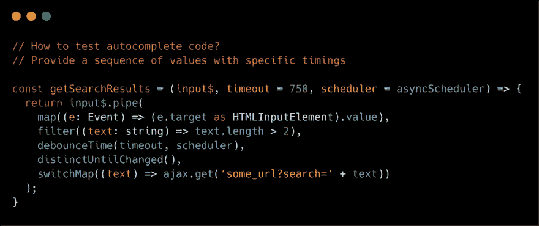](https://res.cloudinary.com/practicaldev/image/fetch/s--yzzrBofh--/c_limit%2Cf_auto%2Cfl_progressive%2Cq_auto%2Cw_880/https://cdn-images-1.medium.com/max/1024/1%2AfJ1bCfDzLkr74GNhIt1bcQ.png) 

<figcaption>带去抖功能的自动完成的简单代码——要求提供要测试的具有特定时序的值</figcaption>

</figure>

那么如何实现呢？好，让我们回顾一些场景:

### 如何实现？

#### 丑陋的方式

好的，最简单的方法——运行许多 *setTimeout 的*,就像这样:

[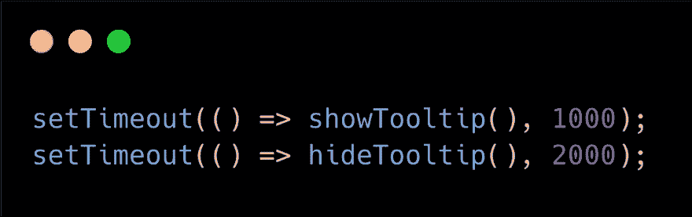T2】](https://res.cloudinary.com/practicaldev/image/fetch/s--nWoQZpyR--/c_limit%2Cf_auto%2Cfl_progressive%2Cq_auto%2Cw_880/https://cdn-images-1.medium.com/max/1024/1%2AFVkmaCdDDeU9eMhNtd_pCA.png)

好吧，还不错，但如果我想在不同的延迟中显示更多的元素呢？

[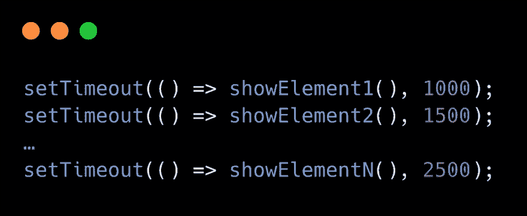T2】](https://res.cloudinary.com/practicaldev/image/fetch/s--C6fYb4eR--/c_limit%2Cf_auto%2Cfl_progressive%2Cq_auto%2Cw_880/https://cdn-images-1.medium.com/max/1024/1%2A_aM-J9WdnCjrJbP3VAQ0pg.png)

看起来又老又丑。我们能做得更好吗？

#### 丑陋的方式，第二部分

现在让我们使用 RxJS 并尝试实现它:

[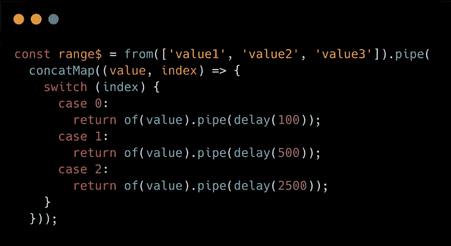T2】](https://res.cloudinary.com/practicaldev/image/fetch/s--fbN6pUKL--/c_limit%2Cf_auto%2Cfl_progressive%2Cq_auto%2Cw_880/https://cdn-images-1.medium.com/max/1024/1%2Atib9DxYqHvMl2FXCK_WPEw.png)

该代码不允许绝对延迟(当下一次发射相对于开始/订阅时刻延迟时)。

为了实现绝对延迟方法(所有延迟都是针对订阅/开始时刻指定的)，我们可以使用 [***mergeMap***](https://rxjs.dev/api/operators/mergeMap) 而不是[***concat map***](https://rxjs.dev/api/operators/concatMap):

[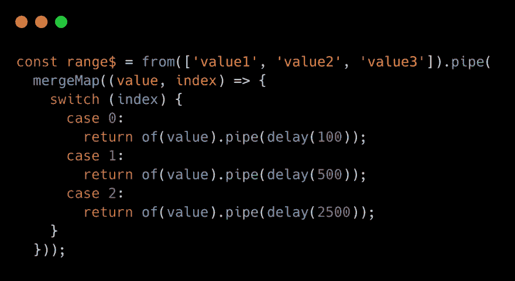T2】](https://res.cloudinary.com/practicaldev/image/fetch/s--S44jGt4R--/c_limit%2Cf_auto%2Cfl_progressive%2Cq_auto%2Cw_880/https://cdn-images-1.medium.com/max/1024/1%2ARz_4cWxC16LU7EqrEN1kGg.png)

看起来有很多代码，延迟也是硬编码的。我们可以做得更好。所以让我们更进一步！

#### 编辑选择方法

好的，我们已经知道硬编码值/延迟是不可重用的，我们也希望能够以*相对*(相对于以前的排放延迟)和*非相对/绝对*(相对于订阅时刻延迟)的方式进行调度。考虑到以上所有因素，我实现了一个定制的**时间范围**函数。

<figure>[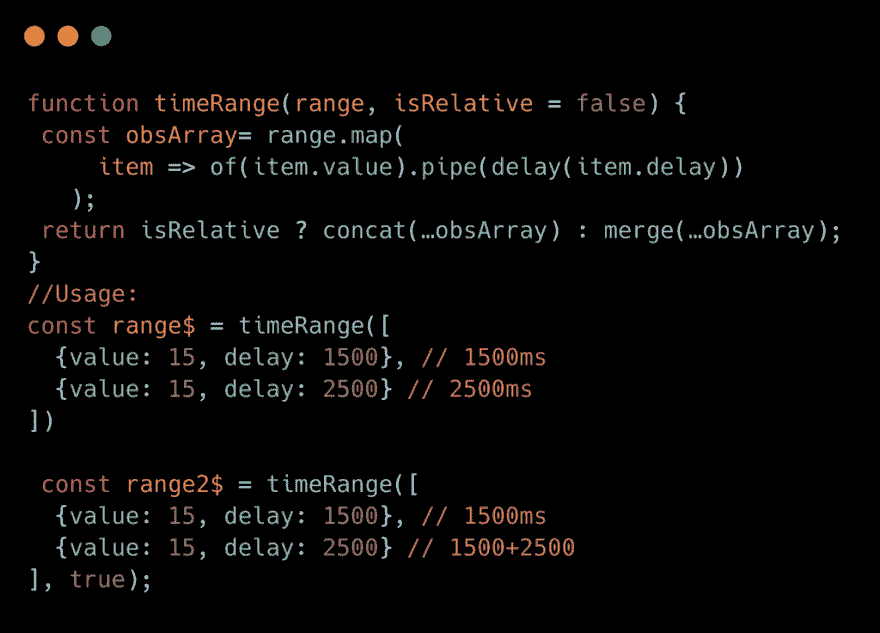](https://res.cloudinary.com/practicaldev/image/fetch/s--I3S5fksI--/c_limit%2Cf_auto%2Cfl_progressive%2Cq_auto%2Cw_880/https://cdn-images-1.medium.com/max/1024/1%2APUxyK_cCYZO50x2ZIy1wUA.png) 

<figcaption>自定义**时间范围**功能。</figcaption>

</figure>

**好处:**

1.  看起来又漂亮又紧凑。
2.  允许指定绝对和相对延迟。

好，现在让我们展示我之前提到的三个用例。

### *用在哪里*

**#1 闪屏消息控制示例**

这里是它的实现代码:

[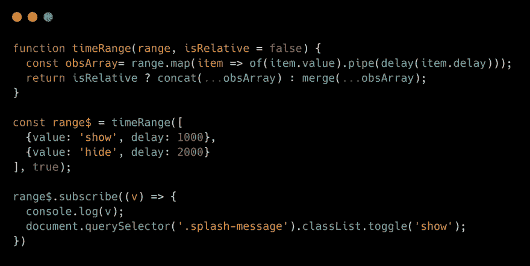T2】](https://res.cloudinary.com/practicaldev/image/fetch/s--ZSK9_22e--/c_limit%2Cf_auto%2Cfl_progressive%2Cq_auto%2Cw_880/https://cdn-images-1.medium.com/max/1024/1%2ALgFQcOH27DNM1x4UTYIxqw.png)

我们在这里做什么？

1.  发射延迟为 1000 和 2000 的两个值(值在这里不起任何作用，实际上只有计时重要)
2.  第一个值将显示带有消息的 splash 元素。
3.  第二次将隐藏它(使用*. class list . toggle(' show ')*)

它是这样工作的:

[T2】](https://res.cloudinary.com/practicaldev/image/fetch/s--a-9x7pTM--/c_limit%2Cf_auto%2Cfl_progressive%2Cq_66%2Cw_880/https://cdn-images-1.medium.com/max/400/1%2A2jn_yYTMGcpyLqeDxAG3CA.gif)

你可以在这里玩它。

**#2 动画一些元素后续出现**

代码如下:

[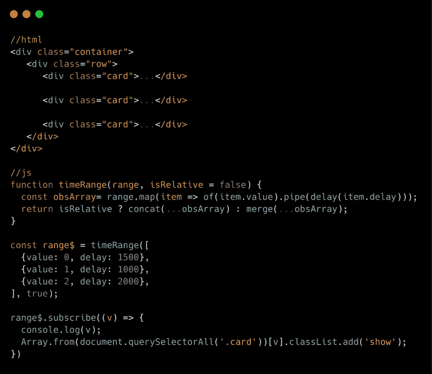T2】](https://res.cloudinary.com/practicaldev/image/fetch/s--miXM7tHw--/c_limit%2Cf_auto%2Cfl_progressive%2Cq_auto%2Cw_880/https://cdn-images-1.medium.com/max/1024/1%2AJIRhdrg4jCWsR7G_r6BQkQ.png)

我们只是抓取一组元素，然后在每个可观测的发射范围内用指定的超时时间逐一显示它们。

结果如下:

[T2】](https://res.cloudinary.com/practicaldev/image/fetch/s--KsM_Wltb--/c_limit%2Cf_auto%2Cfl_progressive%2Cq_66%2Cw_880/https://cdn-images-1.medium.com/max/605/1%2A2klU0Bnmad1gZWWD3U20Wg.gif)

你可以在这里查看代码[。](https://codepen.io/kievsash/pen/YzKdqzd?editors=0110)

**#3 模拟时间范围内单元测试代码的输入参数。**

[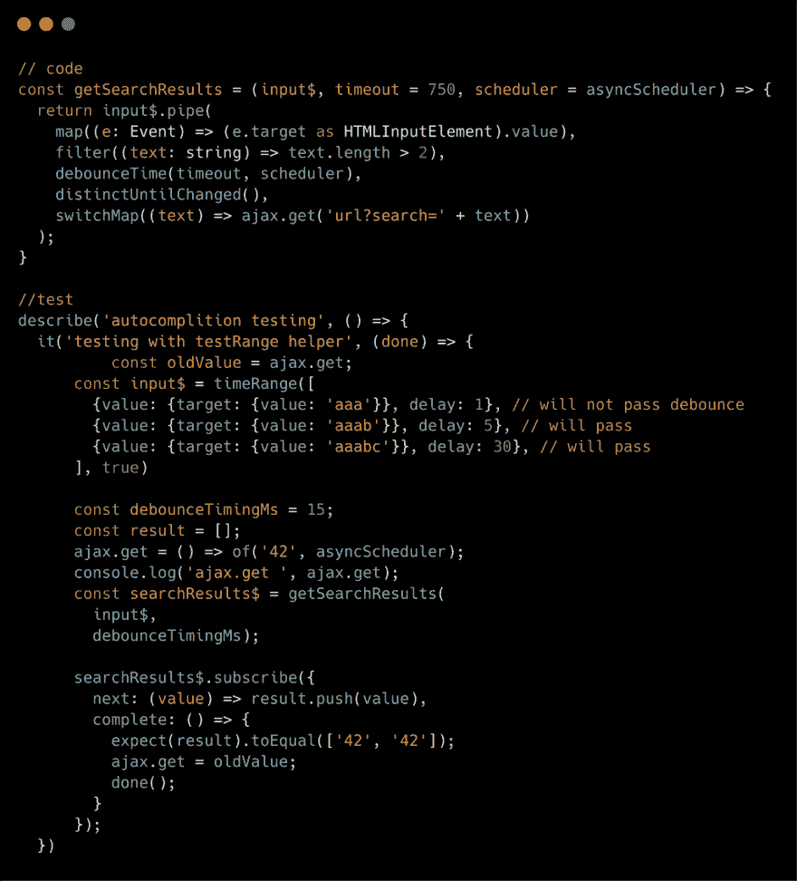T2】](https://res.cloudinary.com/practicaldev/image/fetch/s--F-1TtI3Q--/c_limit%2Cf_auto%2Cfl_progressive%2Cq_auto%2Cw_880/https://cdn-images-1.medium.com/max/1024/1%2AzE7VK8Cvu3HBxxUJmfETiQ.png)

工作原理:

1.  我们用一个异步返回值' 42 '的函数模拟 ajax.get(模拟网络请求)
2.  则 se 去抖时间= 15ms。
3.  之后，调用 *getSearchResult* 和被嘲笑的 *input$* 作为参数并订阅(以开始该过程)。
4.  *输入$* 将发出三个值，延时分别为 1 毫秒、5 毫秒、30 毫秒。由于 debounceTime 设置为 15ms，因此只有第二个和第三个值会导致调用网络请求(在我们的例子中是 Ajax . get)；

和结果:

[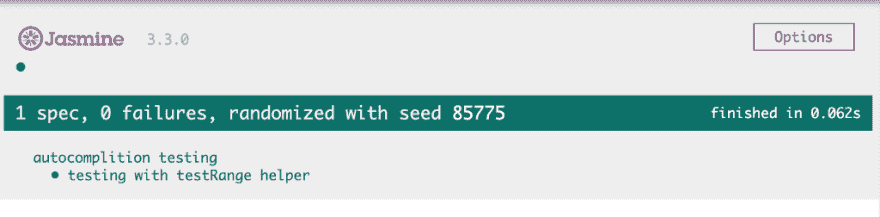T2】](https://res.cloudinary.com/practicaldev/image/fetch/s--Dkja5Mzv--/c_limit%2Cf_auto%2Cfl_progressive%2Cq_auto%2Cw_880/https://cdn-images-1.medium.com/max/1024/1%2A6cEnFwnKvIVv7tm9jiqGPw.png)

代码和测试可以在[这里](https://codepen.io/kievsash/pen/ePoRxg?editors=0010)找到。

#### 结论

我在我的[***rxjs-toolbox***](https://github.com/kievsash/rxjs-toolbox)lib 中添加了 ***timeRange*** 函数。暂时还不大。你可以在这里了解更多:[*【fork join】完成进度*](https://dev.to/oleksandr/rxjs-recipes-forkjoin-with-the-progress-of-completion-for-bulk-network-requests-in-angular-4964-temp-slug-231854)

有自己感兴趣的 RxJS 解决方案？请在评论中提及它们！

喜欢这篇文章？让我们在推特上保持联系。

想进一步了解 RxJS？试试我的视频课程“[动手 RxJS](https://www.udemy.com/course/hands-on-rxjs-for-web-development/) ”。它既包含初学者的全部内容，也包含更高级的主题。

干杯。