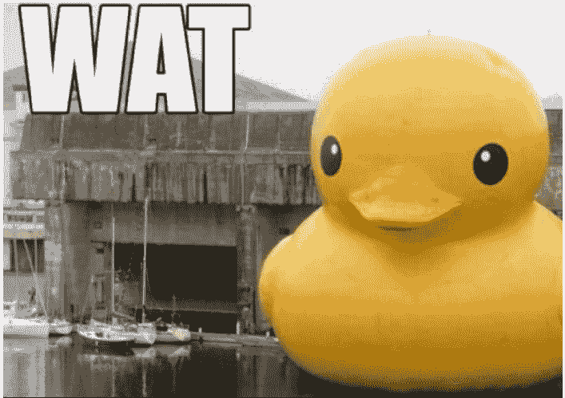
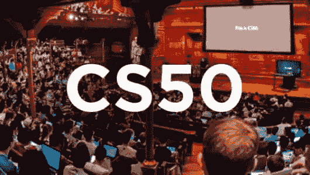

# 如何学习 JavaScript

> 原文：<https://dev.to/maciekchmura/how-to-learn-javascript-k7o>

这是我学习 JavaScript 之路系列文章的第二篇。最后一个帖子描述了我对学习 JS 时不要做什么的看法。

那要怎么学呢？

我觉得学 JavaScript 和 JavaScript 没什么关系。

...

让我解释一下。

正如我的匿名朋友建议的那样，我需要学习如何编程。
总的来说。

*   什么是变量、函数、对象、数组、字符串、整型？
*   电脑是怎么工作的？
*   当你在浏览器中输入一个地址时会发生什么？
*   什么是服务器？
*   什么是数据库？
*   为什么函数会返回一些东西？
*   什么是算法？
*   什么是浏览器 API？
*   什么是 AJAX？

当你只想在 React 中做一个 Todo 应用程序时，有很多未知因素，没有明确的起点...🤦‍♂️

幸运的是，这是一个起点。这是一个很棒的主意。

## 第一部分:基础知识

[CS50](https://www.edx.org/course/cs50s-introduction-to-computer-science)

计算机科学和编程艺术的智能企业介绍。

由 David j . Malan[@ davidjmalan](https://twitter.com/davidjmalan)及其团队授课。

我喜欢这门课。我想再做一次，再一次发现一切😅

每周你都会有一次大卫的讲座(在看的时候，你的💡⚡‘ahaaaaa’灯泡每隔几分钟就会亮一次)。
随后是包含编码示例的简短讲座。
你每周完成一个编码项目，并通过自动测试运行它。

你会接触到很多技术非常有趣的问题。

以下是我参加本课程时所涉及的主题。

*   第一周:C 语言编程入门。用 c 语言创建 2 个 CLI 程序。
*   第二周:大 O，排序算法，二分搜索法，递归。用 c 语言创建 2 个密码 CLI 程序。
*   第三周:调用栈，指针，动态内存分配。用 C 语言创建一个处理图像的程序
*   第四周:结构、自定义类型、单链表、哈希表、尝试、堆栈、队列。用 c 语言创建拼写检查器。
*   第五周:IP，TCP，HTTP，HTML，CSS
*   第六周:动态编程，Python 介绍。
*   第 7 周:服务器、Python 和 Flask。用 Python 创建 2 个 CLI 程序。
*   第八周:Flask，MVC，SQL。实现一个股票交易网站。
*   第九周:JavaScript，DOM，Ajax。实现一个新闻地图应用程序。
*   第 10 和 11 周:期末专题

完成后，你会对构建一个应用程序有一个很好的理解。

突然你不会问:“UGHHHH，为什么是那样编码的？？！!"
并且会说:“💡啊啊，之所以这么编码是因为……”

## 第二部分:建筑

现在您已经准备好钻研 JavaScript 了。最好的学习方法是通过建造。
关于构建内容的一些想法:

*   香草 JS 井字游戏
*   井字诀[反应过来](https://reactjs.org/tutorial/tutorial.html) *现在你知道反应过来解决什么问题了吧！*
*   在 [Heroku](https://www.heroku.com/free) 上有数据库的节点后端
*   用来自 [Firebase](https://firebase.google.com/) 的数据对 app 做出反应

根据你有多少时间学习，这可能需要 6 个月到一年的时间。

现在你已经对编程有了一个坚实的理解。你在 GitHub 上有一些已经完成的项目。

## 第三部分:拓展知识面

[你可以深入研究 JavaScript](https://javascript.info/) 。
你可以跟随 [@kamranahmedse](https://twitter.com/kamranahmedse) 制作的这个牛逼的[路线图](https://roadmap.sh/)。构建更复杂的应用程序。

去学习你感兴趣的东西。
就这样😀。

玩得开心！