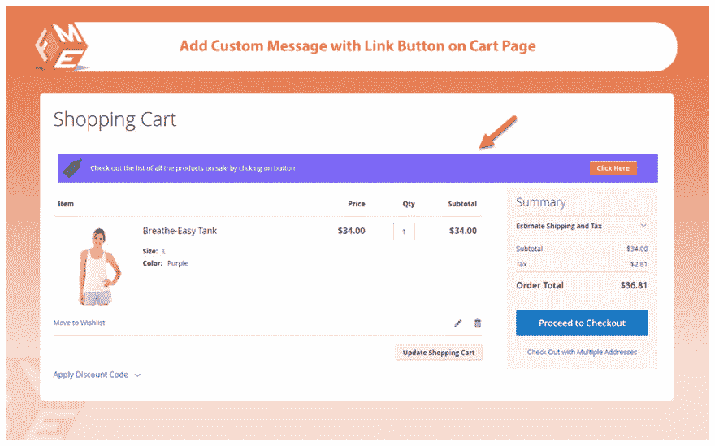
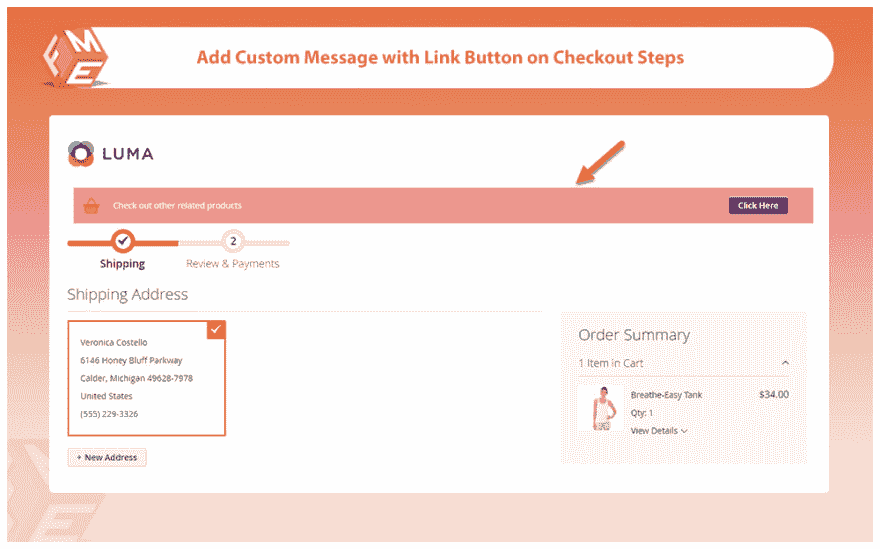
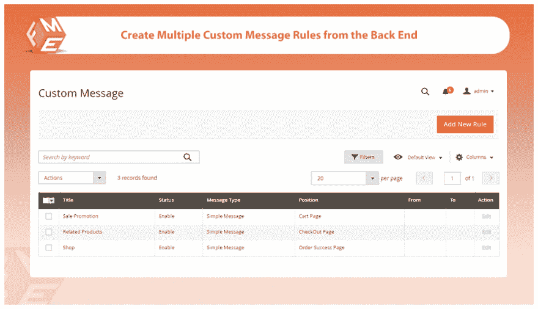

# FME 在 Magento 2 -订单管理器扩展中编辑订单

> 原文：<https://dev.to/henryroger/edit-order-in-magento-2-order-manager-extension-by-fme-3lhc>

# FME 在 Magento 2 -订单管理器扩展中编辑订单

编辑客户订单，而不影响订单状态。该扩展使您能够编辑付款、装运和不正确的帐单细节。该扩展还允许您编辑以下选项。订单详情，如日期和状态

*   用户帐户信息
*   帐单地址
*   送货地址
*   付款和运输方式
*   订购的项目

## 强大的关键功能

编辑客户订单的任何详细信息
修改客户、运输、付款数据
修改订购项目及其数量
移除后将订单项目退回库存
删除以前的发票和/或创建新发票
在订单编辑后重新计算运费

**在此阅读完整文章-[https://www.fmeextensions.com/magento-2-edit-order.html](https://www.fmeextensions.com/magento-2-edit-order.html)T3】**

