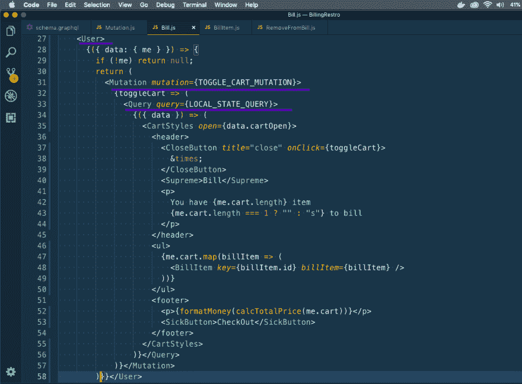
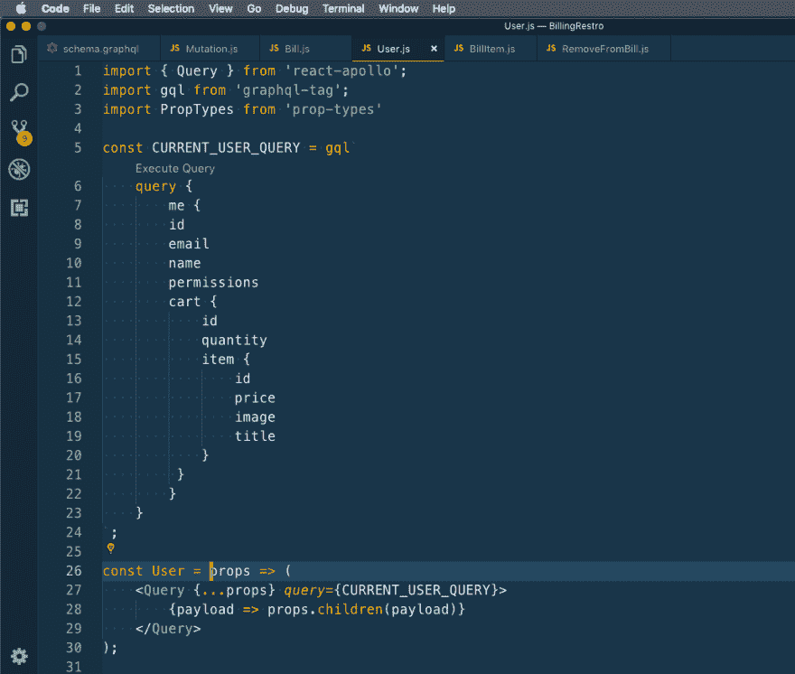
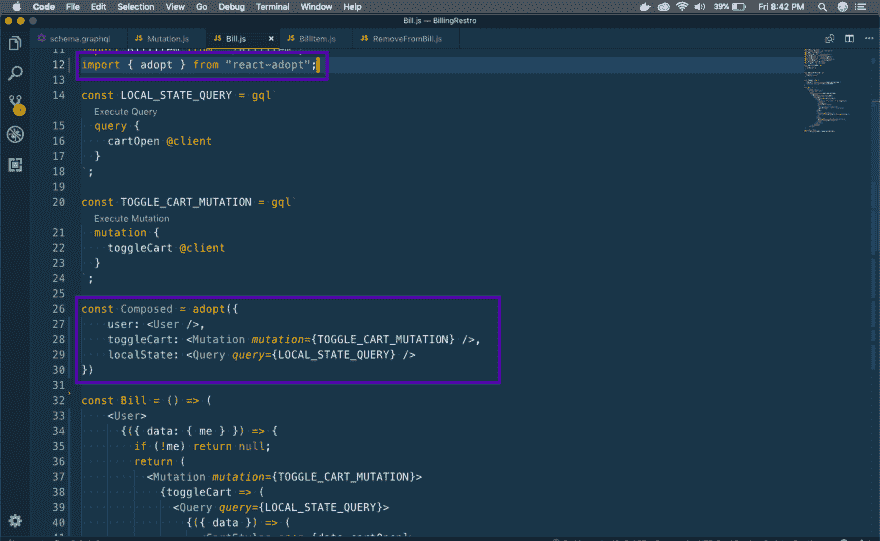
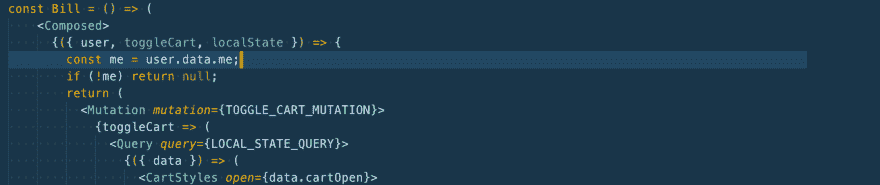
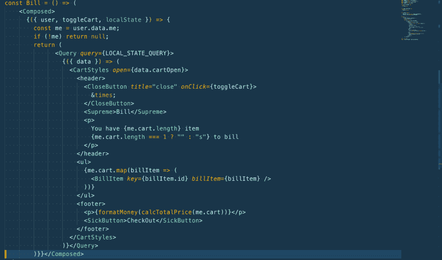
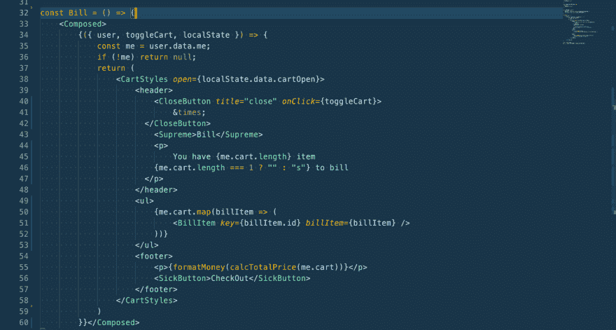
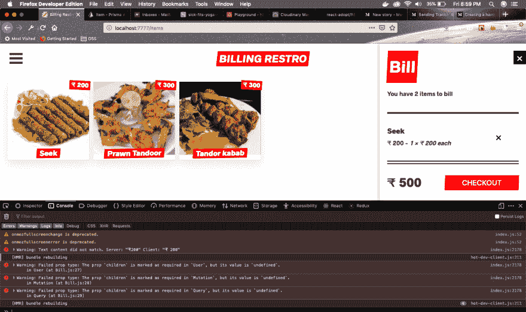
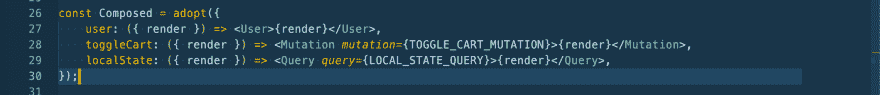

# 使用 react-adopt 解决 React NextJS GraphQL 应用中的“渲染道具回调地狱”

> 原文：<https://dev.to/nabendu82/using-react-adopt-to-solve-render-props-callback-hell-in-react-nextjs-graphql-app-3odn>

在完成韦斯·博斯的[高级反应](https://advancedreact.com/)课程后，我正在构建一个演示印度餐厅计费应用程序。

在我的第一篇文章中，我把菜单从普通菜单改成了[汉堡菜单](https://dev.to/nabendu82/creating-a-hamburger-menu-in-react-nextjs-app-1hpb)。
在第二篇文章中，我已经给出了通过 [cloudinary](https://dev.to/nabendu82/cloudinary-for-image-management-in-react-nextjs-app-5f7) 上传图片的细节。
第三，我们学会了使用 [gmail](https://dev.to/nabendu82/sending-transactional-emails-through-gmail-in-react-nextjs-graphql-app-1ap5) 发送交易邮件。

在应用程序中，我们在前端使用 Apollo 客户端，从 Prisma 数据库中获取数据。因此，我们使用变异和查询组件。在其中一个组件中，我们面临致命的“渲染道具回调地狱”，有三级回调。

这里可以找到 **Bill.js** [的启动代码。](https://github.com/nabendu82/BillingRestro/blob/c3728cbb0bfc5c0d8ab4e32e3c4eaab3df661d0b/frontend/components/Bill.js)

 *三级渲染道具*

这里的**用户**是一个通用的查询组件。

 *用户组件*

为了解决这个问题，我们使用了一个名为 [react-adopt](https://github.com/pedronauck/react-adopt/blob/master/README.md) 的第三方工具。

所以，让我们用 npm 安装**react——采用**并在我们的组件中使用它。这里，我们将创建一个组合组件并使用 adopt。

在这里，我们在对象中写入三个不同的键，其值将等于我们将要替换的突变/查询。

 *沉稳*

我们现在将看到反应-采纳的好处。首先，我们将使用**合成**组件替换**用户**组件，并更改顶层渲染道具，以使用 adopt 中的所有键。

 *替换用户组件*

现在，是时候删除切换车突变。继续删除它的开头和结尾。

 *突变删除*

接下来，是时候删除查询组件了。

 *查询组件删除*

现在，如果我们回到前端检查，我们会发现一切正常。但是如果我们打开控制台，我们会发现三个警告。

 *警告剧透*

为了解决这个问题，我们必须为每个值在**组合**组件中创建子组件。

 *天华更新沉稳*

这将解决我们的警告问题，我们得到一个最小的和可读的代码，与上层渲染道具。

你可以在这里找到 **Bill.js** [的更新代码。](https://github.com/nabendu82/BillingRestro/blob/45f7da36d592316bb7a499bbe3d8d926c905235e/frontend/components/Bill.js)