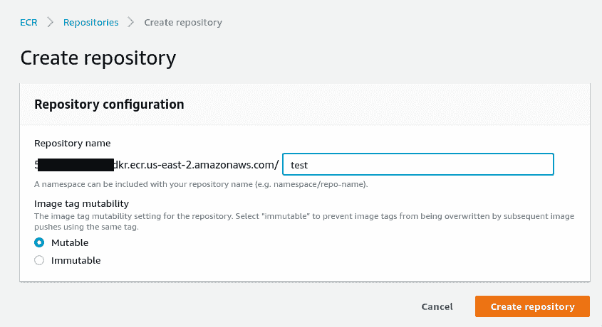
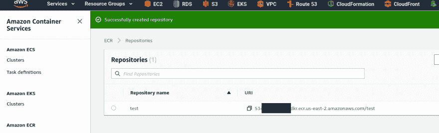
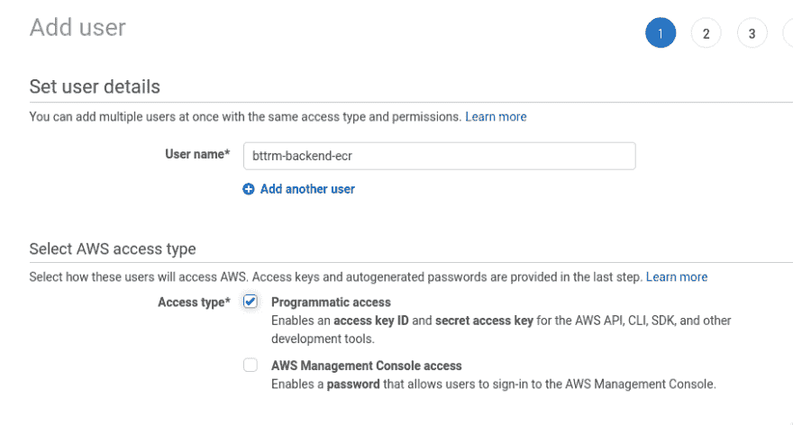
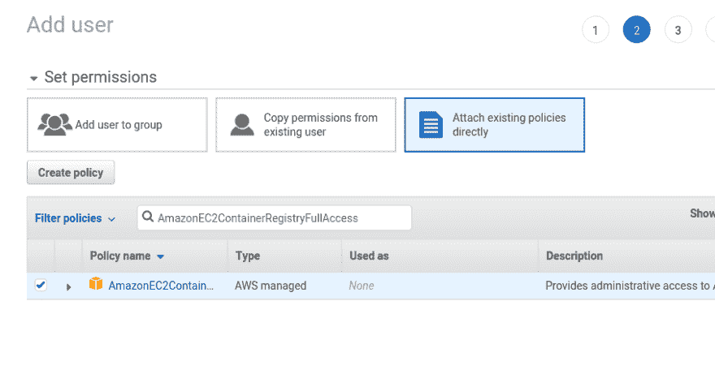
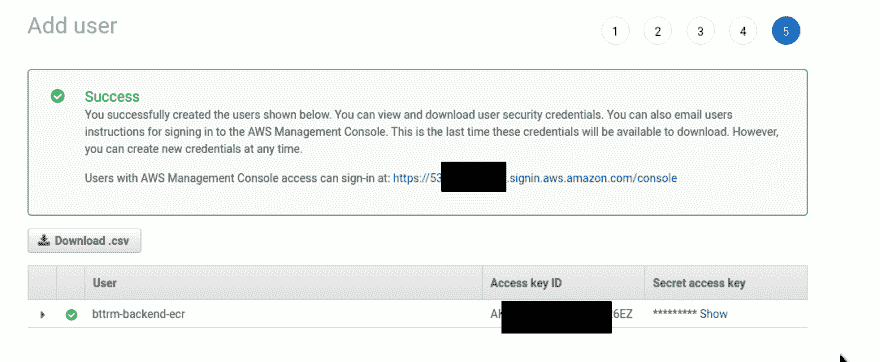
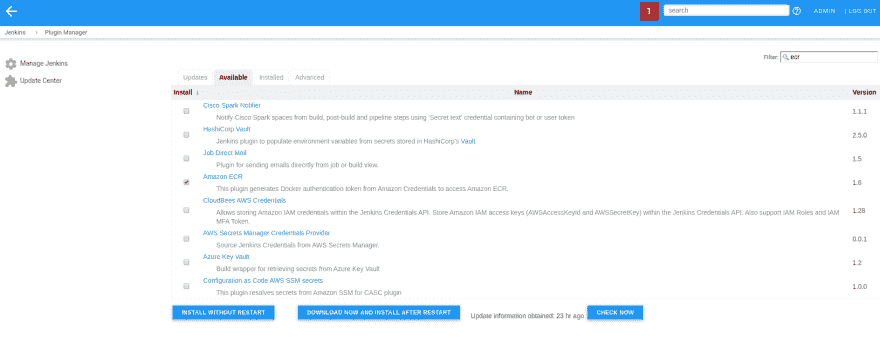
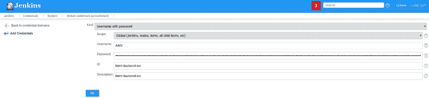
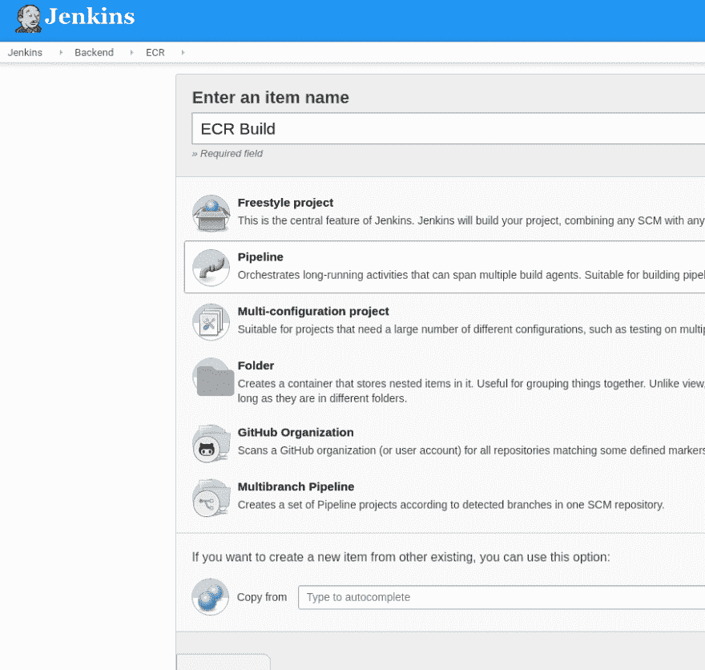
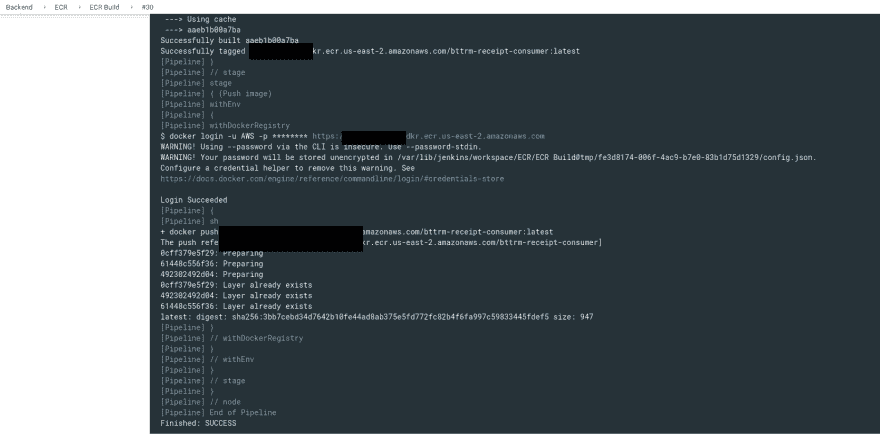

# AWS:创建一个弹性容器注册表和 Jenkins 部署作业

> 原文:[https://dev . to/setevoy/AWS-create-an-elastic-container-registry-and-Jenkins-deploy-job-2i 84](https://dev.to/setevoy/aws-create-an-elastic-container-registry-and-jenkins-deploy-job-2i84)

[](https://res.cloudinary.com/practicaldev/image/fetch/s---dkzETw5--/c_limit%2Cf_auto%2Cfl_progressive%2Cq_auto%2Cw_880/https://rtfm.co.ua/wp-content/uploads/2014/11/aws-logo-square-02-e1417012834176-1.png) 任务是创建一个 [AWS ECR](https://aws.amazon.com/ru/ecr/) 存储库，并添加一个 Jenkins 作业来构建 Docker 映像并将其部署到该存储库中。

### [](#aws-ecr)AWS ECR

转到 ECR，点击*开始*，设置新的存储库名称:

[T2】](https://rtfm.co.ua/wp-content/uploads/2019/09/Screenshot_20190920_144921.png)

Lave *Mutable* ，这样你就可以推送带有相同标签的图像，如果它已经存在于存储库中的话:

完成:

[T2】](https://rtfm.co.ua/wp-content/uploads/2019/09/Screenshot_20190920_145355-1.png)

#### [](#iam)IAM

转到 IAM，创建一个附加用户:

[T2】](https://rtfm.co.ua/wp-content/uploads/2019/09/Screenshot_20190920_145430.png)

附上`AmazonEC2ContainerRegistryFullAccess`政策:

[T2】](https://rtfm.co.ua/wp-content/uploads/2019/09/Screenshot_20190920_145504.png)

保存用户访问密钥:

[T2】](https://rtfm.co.ua/wp-content/uploads/2019/09/Screenshot_20190920_145542.png)

配置 AWS CLI 配置文件:

```
$ aws configure --profile bttrm-backend-ecr
AWS Access Key ID [None]: AKI\*\*\*6EZ
AWS Secret Access Key [None]: PpN\*\*\*GNr
Default region name [None]: us-east-2
Default output format [None]: json 
```

获取访问令牌:

```
$ aws --profile bttrm-backend-ecr ecr get-login --no-include-email --region us-east-2
docker login -u AWS -p eyJ\*\*\*M30= https://534\*\*\*385.dkr.ecr.us-east-2.amazonaws.com 
```

登录:

```
$ docker login -u AWS -p eyJ\*\*\*M30= https://534\*\*\*385.dkr.ecr.us-east-2.amazonaws.com
WARNING! Using --password via the CLI is insecure. Use --password-stdin.
WARNING! Your password will be stored unencrypted in /home/setevoy/.docker/config.json.
Configure a credential helper to remove this warning. See
https://docs.docker.com/engine/reference/commandline/login/#credentials-store
Login Succeeded 
```

在您的工作站上查找任何现有的 Docker 图像:

```
$ docker images | grep nginx

nginx                               alpine              031c45582fce        5 months ago        16.1MB

nginx                               latest              06144b287844        12 months ago       109MB 
```

用新的存储库 URL 和名称标记它:

```
$ docker tag nginx:latest 534\*\*\*385.dkr.ecr.us-east-2.amazonaws.com/test:latest 
```

推送此图片:

```
$ docker push 534\*\*\*385.dkr.ecr.us-east-2.amazonaws.com/test:latest
The push refers to repository [534\*\*\*385.dkr.ecr.us-east-2.amazonaws.com/test]
579c75bb43c0: Pushed
67d3ae5dfa34: Pushed
8b15606a9e3e: Pushed
latest: digest: sha256:c0b69559d28fb325a64c6c8f47d14c26b95aa047312b29c699da10380e90b4d7 size: 948 
```

好的——这里一切正常。

### [](#jenkins)詹金斯

下一步将是创建一个 Jenkins 作业来构建和推送映像。

#### [](#amazon-ecr-authentication)亚马逊 ECR 认证

对于 ECR 身份验证，需要执行 AWS CLI `aws ecr get-login`命令来获取 docker 登录期间使用的令牌。

为了避免每次都调用`aws ecr get-login`,这里可以使用亚马逊 ECR 插件。

安装它:

[T2】](https://rtfm.co.ua/wp-content/uploads/2019/09/Screenshot_20190926_132816-1.png)

添加新凭证–进入*凭证–添加凭证*，选择类型 *AWS 凭证*:

[T2】](https://rtfm.co.ua/wp-content/uploads/2019/09/Screenshot_20190920_155145.png)

创建新的管道作业:

[T2】](https://rtfm.co.ua/wp-content/uploads/2019/09/Screenshot_20190920_154736.png)

还有剧本:

```
node {
    def app
    stage('Clone repository') {
        git branch: "master", url: "git@github.com:example-dev/go-queue-consumer.git", credentialsId: "jenkins-example-github"
    }
    stage('Build image') {
        sh "docker build --build-arg APP_NAME=receipts -t 534***385.dkr.ecr.us-east-2.amazonaws.com/bttrm-receipt-consumer:latest -f docker/prod/Dockerfile ."
    }
    stage('Push image') {
        docker.withRegistry('https://534***385.dkr.ecr.us-east-2.amazonaws.com', 'ecr:us-east-2:bttrm-backend-ecr') {
            sh "docker push 534***385.dkr.ecr.us-east-2.amazonaws.com/bttrm-receipt-consumer:latest"
        }
    }
} 
```

运行构建:

[T2】](https://rtfm.co.ua/wp-content/uploads/2019/09/Screenshot_20190920_170224.png)

完成了。

### [](#similar-posts)类似的帖子

*   <small>09/23/2019</small>[AWS:создание弹性容器注册处иделойизJenkins](https://rtfm.co.ua/aws-sozdanie-elastic-container-registry-i-deploj-iz-jenkins/)
*   <small>2017 年 6 月 8 日</small> [停靠点:拖船托运货物托运货物托运货物托运货物托运货物托运货物托运货物托运货物托运货物托运货物托运货物托运货物托运货物托运货物托运货物托运货物托运货物托运货物托运货物托运货物托运货物托运货物托运货物托运货物托运货物托运货物托运货物托运货物托运货物托运货物](https://rtfm.co.ua/docker-retag-obraza/)
*   <small>2016 年 12 月 10 日</small> [Jenkins:儿基会 AWS EC2 +管道插件+坞站管道插件](https://rtfm.co.ua/jenkins-zapusk-na-aws-ec2-pipeline-plugin-docker-pipeline-plugin/)
*   <small>04/16/2019</small> [詹金斯:一份检查 Github 组织的公共存储库列表的工作](https://rtfm.co.ua/en/jenkins-a-job-to-check-a-github-organizations-public-repositories-list/)
*   <small>2019 年 8 月 15 日</small> [Kubernetes:第 3 部分–AWS EKS 概述和手动 EKS 集群设置](https://rtfm.co.ua/en/kubernetes-part-3-aws-eks-overview-and-manual-eks-cluster-set-up/)