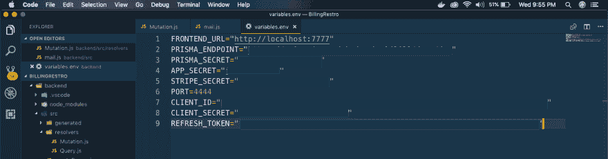
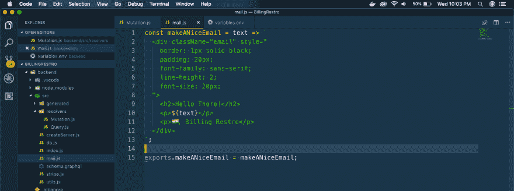
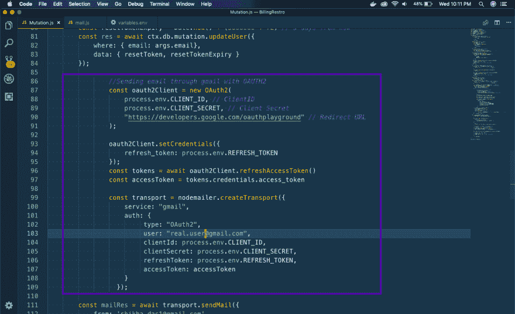
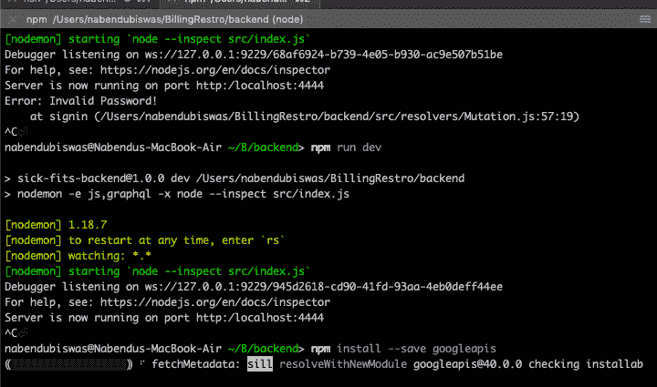
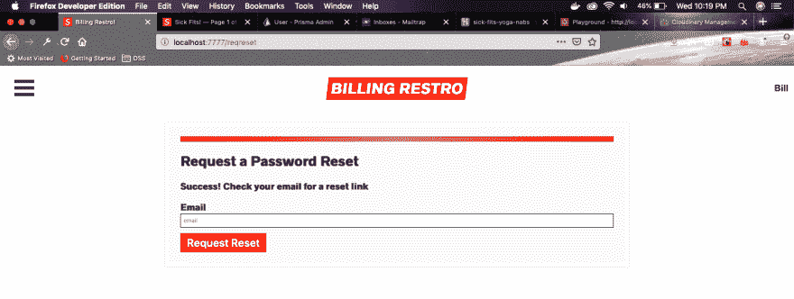

# 在 React NextJS GraphQL 应用程序中通过 gmail 发送交易电子邮件

> 原文:[https://dev . to/nabe NDU 82/sending-transactional-emails-through-Gmail-in-react-nextjs-graph QL-app-1ap 5](https://dev.to/nabendu82/sending-transactional-emails-through-gmail-in-react-nextjs-graphql-app-1ap5)

在完成韦斯·博斯的[高级反应](https://advancedreact.com/)课程后，我正在构建一个演示印度餐厅计费应用程序。

在我的第一篇文章中，我把菜单从普通菜单改成了[汉堡菜单](https://dev.to/nabendu82/creating-a-hamburger-menu-in-react-nextjs-app-1hpb)。

在第二篇文章中，我已经给出了通过 [cloudinary](https://dev.to/nabendu82/cloudinary-for-image-management-in-react-nextjs-app-5f7) 上传图片的细节。

现在，在课程中，Wes 已经教过如何通过一个假的 SMTP 服务发送“密码重置”事务性电子邮件 [Mailtrap](https://mailtrap.io/) ,并指导我们在生产中使用更强大的东西

Mailtrap 适合开发，邮件不会发送到收件人的邮箱。但即使是小制作 app，我们也需要发送真实的邮件到真实的邮箱 id。

我做了研究，想找到一个便宜又好的电子邮件服务来发送交易邮件，但最便宜的方案是每个月 10 美元左右。即使我们的应用程序很小，也不是所有人都能以此为起点。这是一个很好的[链接](https://quickemailverification.com/blog/top-transactional-email-services-compared/)如果你想和服务。

我做了更多的研究，发现我们也可以通过 gmail APIs 发送电子邮件，并找到了 Nick Roach 的一篇很棒的文章。

如果你的用户有一个 gmail 账户(我们大多数人都有),并且你能接受每天 500 封邮件的限制，那就跟着去吧。

按照尼克·罗奇的完整文章，从谷歌开发者账户获得一个**客户端 ID** 、**客户端秘密**和**刷新令牌**。

现在，打开你在高级 React 教程视频 32 之后制作的项目或者打开我的 [github](https://github.com/nabendu82/BillingRestro/tree/9b65463cc69d5c32e78cc2d06c9301c55f9613e2) 。

首先，我们在 **variables.env** 文件中为客户端 ID、客户端密码和刷新令牌创建变量。

[ ](https://res.cloudinary.com/practicaldev/image/fetch/s--0uFffrVN--/c_limit%2Cf_auto%2Cfl_progressive%2Cq_auto%2Cw_880/https://cdn-images-1.medium.com/max/2880/1%2Aw_UfovvXKwEcerLeO6swDw.png) *新变量。*

在文件 **mail.js** 下面只保留了。

[ ](https://res.cloudinary.com/practicaldev/image/fetch/s--X3KYOtML--/c_limit%2Cf_auto%2Cfl_progressive%2Cq_auto%2Cw_880/https://cdn-images-1.medium.com/max/2880/1%2A-LDdBUYJQHoVRujQDMkPJw.png) * mail.js 还原*

现在，在我们的 **Mutation.js** 中，在顶部导入三个新语句，并且只从 mail.js 中获取 makeANiceEmail

```
const { makeANiceEmail } = require('../mail');
const nodemailer = require('nodemailer');
const { google } = require("googleapis");
const OAuth2 = google.auth.OAuth2; 
```

我们在 **Mutation.js** 中的 **requestReset** 函数中做所有的修改

这里，我们通过 gmail 中的 Oauth2 发送电子邮件。

[ ](https://res.cloudinary.com/practicaldev/image/fetch/s--IvgM3VOC--/c_limit%2Cf_auto%2Cfl_progressive%2Cq_auto%2Cw_880/https://cdn-images-1.medium.com/max/2880/1%2ArDv57ctUMvjaYgkz9-KYcA.png) *通过 Oauth 发送邮件 2*

在运行代码之前，我们还必须在后端服务器上安装 **googleapis** 。

[](https://res.cloudinary.com/practicaldev/image/fetch/s--xows--G9--/c_limit%2Cf_auto%2Cfl_progressive%2Cq_auto%2Cw_880/https://cdn-images-1.medium.com/max/2000/1%2AK30sw3Qq0cORfNWEaITZmA.png)*Google API*

现在，是测试的时候了。在你的网络应用中注册一个真正的 gmail id。

然后，进入重置页面(我有一个不同的页面，然后是教程应用程序)，给出真实的 gmail id，这是您刚刚用来注册的。

[ ](https://res.cloudinary.com/practicaldev/image/fetch/s--dakSt-f5--/c_limit%2Cf_auto%2Cfl_progressive%2Cq_auto%2Cw_880/https://cdn-images-1.medium.com/max/2880/1%2AFZNpinBD1aklJ2MkqzcKpQ.png) *重置链接*

这是你真实 gmail 账户上的密码重置链接。

[ ](https://res.cloudinary.com/practicaldev/image/fetch/s---iU0cTDm--/c_limit%2Cf_auto%2Cfl_progressive%2Cq_auto%2Cw_880/https://cdn-images-1.medium.com/max/2000/1%2A9WIOdSgjGIzEVWkRrtTwrQ.png) *重设 gmail 邮箱密码*

你可以在这里找到到这个点[的代码。](https://github.com/nabendu82/BillingRestro/tree/e126a6515cf05755d855b178301b7290159bae1e)