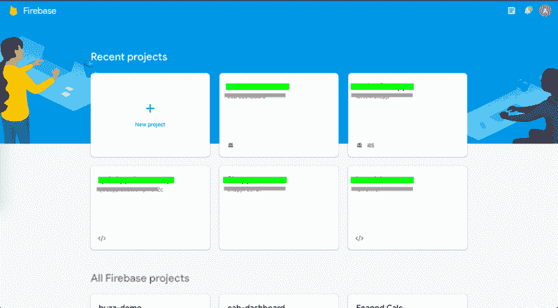
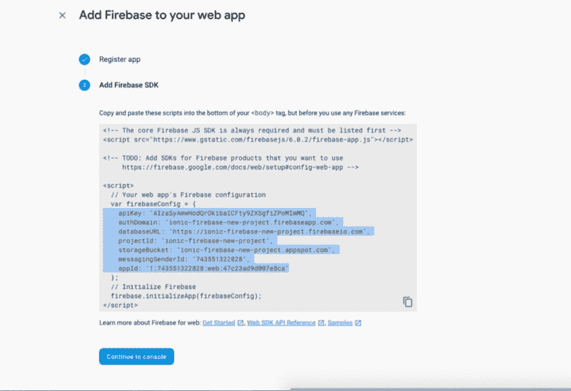
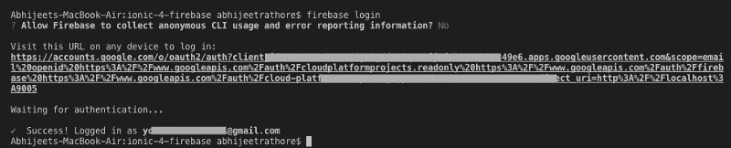
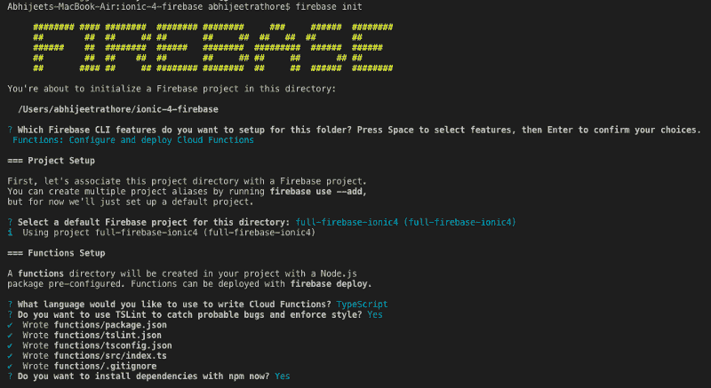
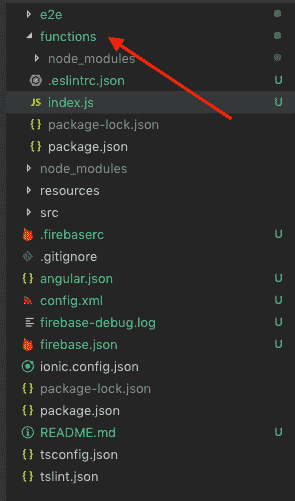
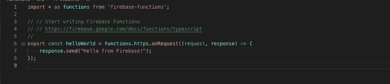
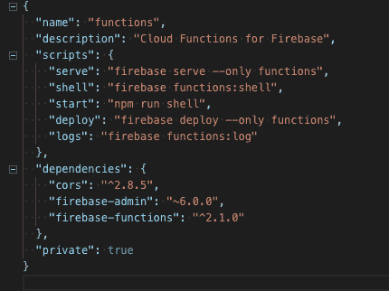

# Ionic 4 中的 Firebase 云函数-完全指南

> 原文：<https://dev.to/enappd/firebase-cloud-functions-in-ionic-4-complete-guide-4b64>

* * *

这篇文章将带你了解 Firebase 云函数的基础知识——如何创建、部署和使用云函数。此外，我们将查看 Firebase 中的云功能仪表板，以了解其功能。

### 什么是 Firebase？

如果你不太了解 Firebase …你需要了解最新的技术新闻。Firebase 是当今市场上创建快速移动应用后端的热门产品，具有大量内置和易于集成的功能。

Firebase 最常用的功能是作为后端。它不需要来自开发者端的任何后端设置或配置。除了这个后端，您还可以获得一个随时可用的数据库。其他一些受欢迎的功能有

*   推送通知
*   **云函数**
*   分析学
*   广告暴民
*   Crashlytics
*   应用内消息
*   远程配置
*   社交登录
*   ……以及更多

也就是说，我相信你对学习所有这些非常感兴趣。你可以在我们的[网站](http://enappd.com/blog)上使用 [**【脸书】**](https://enappd.com/blog/facebook-login-in-ionic-4-apps-using-firebase/25) 和 [**Twitter**](https://enappd.com/blog/twitter-login-in-ionic-4-apps-using-firebase/24) 博客查看我们的 Firebase 社交登录，以及免费的初学者(👻呜哇！)

### 什么是(Firebase)云功能？

当你在手机或网络应用中使用一个现成的集成后端(BaaS)时，你基本上不用自己设置任何后端。所以基本上所有的功能/服务都是事先为你写好的。这些功能和服务是基于用户最常用的功能创建的。例如

*   认证
*   数据库操作—读、写、更新、删除
*   在某些情况下—过滤、分页、地理查询等。

但是，如果你想为你的应用程序定制一个功能或查询呢？因为没有创建后端，所以不能写自定义函数，对吧？不见得😏。**云功能**来救你。这些基本上是您可以在 BaaS 平台上编写和部署的简单功能，这些功能将被执行，就像它们是平台的一部分一样。(当然，你需要注意语法、请求、响应等。)

比如你是一个买菜 app。有了像 Firebase 这样的 BaaS，你可以读、写、更新和删除数据。但对于某个功能，你需要向用户显示他们在应用程序上的月支出。现在，Firebase 确实提供了按日期等字段查询数据的选项。但是，对于单个甚至复杂的查询，组合不同表中的数据可能会很棘手。在这种情况下，您可以编写一个函数来查询所有相关的表，准备您想要的数据，并以尽可能小的数据格式发送回您的应用程序。

总体而言，您可以将 Firebase 云功能的优势划分如下

1.  您可以创建自定义函数来执行复杂的查询，例如合并多个表、日期和地理位置计算的查询
2.  调用云函数就像调用 REST API 一样简单
3.  后端的复杂计算比前端更快，例如在约会应用程序中寻找匹配
4.  Cron-jobs 可以按计划直接运行云功能，为数据库进行常规计算
5.  创建、更新和部署 Firebase 云功能就像在 IDE 中更改代码并将代码提交给 Git 一样简单。
6.  不再需要管理服务器——Firebase 会处理一切
7.  您也可以在本地环境中测试云功能

### 什么是离子 4？

你可能已经知道离子，但我把它放在这里只是为了初学者。 **Ionic** 是一款完整的开源 SDK，用于混合移动应用开发。Ionic 提供使用 CSS、HTML5 和 Sass 等 Web 技术开发混合移动应用的工具和服务。应用程序可以通过这些网络技术构建，然后通过本地应用程序商店分发，安装在设备上。

换句话说——如果你用 Android 创建原生应用，你就用 Java 编码。如果你在 iOS 中创建原生应用，你用 Obj-C 或 Swift 编码。这两种语言都很强大，但是很复杂。有了 Cordova(和 Ionic ),你可以为你的应用程序编写一段代码，它可以在 iOS 和 Android(以及 windows！)，HTML、CSS 和 JS 的简单性也是如此。

### 职位结构

我们将逐步了解在 Ionic 4 应用程序中集成 Firebase 云功能的基础。我们将遵循这些步骤

1.  创建一个基本的 Ionic 4 应用程序
2.  创建一个 Firebase 项目
3.  设置 Firebase 函数并编写您的第一个函数
4.  从您的应用程序部署 Firebase 功能并进行测试
5.  Firebase 云功能仪表板和功能
6.  编写一个复杂的云函数，并在应用程序中获取结果

让我们直接跳进来吧

### 1.创建一个基本的 Ionic 4 应用程序

> 我在[这篇博客](https://enappd.com/blog/how-to-create-an-ionic-4-app-for-beginners/13/)中已经详细报道了这个话题。

创建 Ionic 4 应用程序就像从命令提示符/终端运行单个命令一样简单。

简而言之，您需要采取的步骤如下

*   确保您已经在系统中安装了 node(在这篇博文发表时是 V10.0.0)
*   使用 npm 安装 ionic cli
*   使用`ionic start`创建 Ionic 应用程序

为了本教程，您可以创建一个`sidemenu`启动器。运行`ionic start`时，将安装节点模块。安装完成后，使用在浏览器上运行您的应用程序

```
$ ionic serve
```

此时，您的应用程序应该是这样的


<figure>

<figcaption class="imageCaption">Homepage for Sidemenu starter in Ionic 4</figcaption>

</figure>

### 2.创建一个 Firebase 项目并连接到您的应用程序

Firebase 是谷歌的产品(现在)，所以你需要创建一个“Firebase 项目”，将其连接到你的应用程序，并将所有相关服务保存在一个地方。你可以在 Firebase 中创建大量的免费项目。

> 我在[这篇博客](https://enappd.com/blog/how-to-integrate-firebase-in-ionic-4-apps/23/)中详细介绍了 Ionic 4 Firebase 集成

**请注意——Firebase 功能可以在应用程序中不附加 Firebase 的情况下运行(作为 REST APIs)。只有当你想在你的应用中附加 Firebase 数据库或其他功能时，你才需要复制 Firebase 配置并安装 angularfire 2 插件。**

#### 创建 Firebase 项目

去 console.firebase.google.com 创建一个新项目。当您有许多 firebase 项目时，您的仪表板将看起来像这样



<figure>

<figcaption class="imageCaption">Firebase dashboard with a number of projects</figcaption>

</figure>

#### 复制 Firebase 配置

点击打开你的项目，在仪表板中选择**“添加 Firebase 到你的 web 应用程序”。**按照步骤操作，您将获得项目的配置。复制配置，这将用于将您的应用程序与 Firebase 连接。



<figure>

<figcaption class="imageCaption">Copy Firebase project configuration</figcaption>

</figure>

#### 在你的 Ionic 应用中集成 Firebase

回到你的 Ionic 应用，安装 [Angularfire2](https://github.com/angular/angularfire2/) 插件。AngularFire 是 Firebase 和 Angular 的官方库。

要安装插件，请从您的终端运行以下命令

```
$ npm install firebase angularfire2
```

将 Firebase 配置粘贴到 Ionic app 项目的**环境**文件中。环境文件应该在项目根目录中。


<figure>

<figcaption class="imageCaption">Paste your Firebase configuration in environment file</figcaption>

</figure>

在这之后，你将需要在你的`app.module.ts`中导入 angularFire2 和 firebase，然后你可以在应用中实现 CRUD 和其他功能。

### 3.设置 Firebase 函数并编写您的第一个函数

一旦我们在系统中设置好`firebase-tools`，就可以使用 Firebase 功能。使用 npm 全局安装它

```
$ npm install firebase-tools -g
```

#### 登录 Firebase

在使用 Firebase 功能之前，您需要使用 CLI 登录您的 Firebase 帐户(耶！🤷‍♂).奔跑

```
$ firebase login
```

它会在你的浏览器中打开谷歌登录卡。登录到您的帐户，CLI 将收到认证信息(很酷，对不对？)


<figure>

<figcaption class="imageCaption">Firebase login in CLI using browser — successful !</figcaption>

</figure>

您的 CLI 将如下所示



<figure>

<figcaption class="imageCaption">Logging in Firebase using CLI</figcaption>

</figure>

#### 将 Firebase 连接到您的项目

登录后，您需要定义要将哪个 Firebase 项目连接到 Ionic 4 应用程序(因为您的 Firebase 控制台中可以有多个项目。我有 30+了😃！).奔跑

```
$ firebase init
```

这将首先要求您选择项目，然后从选项中选择`functions`选项。(不要担心其他选项，我很快会在上面发布更多博客)。按照说明设置 Firebase 函数的所有依赖项



<figure>

<figcaption class="imageCaption">Choose Functions options in `Firebase init`</figcaption>

</figure>

> 注意—有时林挺会在部署过程中产生错误。如果您遇到这个问题，请尝试重新运行`*firebase init*`，不要在询问时选择林挺选项

正如我们之前讨论的，使用 **Firebase 函数，**你可以编写后端(node.js)函数，用`firebase serve`在本地测试它们，然后可以将它们部署到你的 Firebase 项目，这样它就可以连接到你的应用程序/网站。

一旦连接了 Firebase 项目，您将会在项目根目录中看到一个`functions`文件夹，如下所示



<figure>

<figcaption class="imageCaption">Firebase functions folder in project root</figcaption>

</figure>

#### 创建一个 firebase 函数来说“Hello World”

打开`functions/src/index.ts`(或。js，这取决于您在上一步中选择的内容)。这个文件将包含 Firebase 要执行的函数。Firebase 在部署时会为每个函数创建一个 URL，因此您可以像调用 REST API 一样调用这些函数



<figure>

<figcaption class="imageCaption">Default index.ts in Firebase functions folder</figcaption>

</figure>

默认情况下，Firebase 给你一个`helloWorld`函数，取消注释，你就可以直接使用它了。让我们了解一下这里发生了什么(如果您从未使用过 node.js)

*   **export** 将函数导出为一个单独的实体。在这个文件中，您可以拥有任意多的函数
*   **请求**是你从前端发出的请求，类似于一个 REST API。它与 POST 请求相关
*   **响应**是 Firebase cloud 函数将发送回您的应用程序的响应

在这个示例中，函数只是简单地发送回一个**“hello from Firebase”**(与请求无关，即这是一个 GET 类型的请求)。随你喜欢改回复！

恭喜你，你刚刚写了你的第一个 Firebase 云函数。

#### ⭐️️⭐️️️额外:添加 CORS 到 Firebase 函数来运行 locally⭐️️⭐️️️

开发 Ionic 4 应用程序时，你将在浏览器中完成大部分开发工作。因此，在服务中获取 Firebase 函数响应也是有意义的。默认情况下，Firebase 不允许响应本地主机 URL。为了避免这种情况，我们必须在 Firebase 函数中添加 **CORS** 中间件。如果你想简单地在你的手机上测试，不需要 **CORS** 中间件。

别担心，很简单。

1.  在您的`functions/package.json`中添加 CORS 依赖项



<figure>

<figcaption class="imageCaption">Add CORS in dependency</figcaption>

</figure>

2.移入`functions`文件夹，再次运行`npm install`安装新的依赖项

3.在 Firebase 函数文件中导入 CORS，并将响应代码修改如下