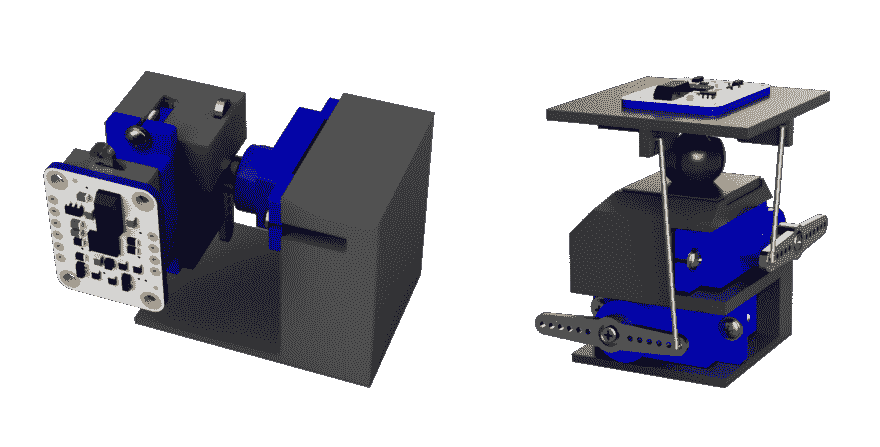

# 使用 GPS 和磁力计获得准确的航向

> 原文：<https://dev.to/welldone2094/use-gps-and-magnetometer-for-accurate-heading-4hbi>

在我的最后一年里，我一直在研究负担得起的自主无人机，最大的问题一直是准确的航向。目的是制造一种能够自己驾驶的无人机，同时保持尽可能低的价格。

# 问题

我需要一种方法来知道无人机的前进方向，在谷歌上快速搜索后，我花了不到 50 美元买了一个“BNO055 绝对位置传感器”，我称之为“APS”，它应该融合磁力计、陀螺仪和加速度计来估计传感器在空间的三维位置。这真的很有效，直到 wit 带着无人机在外面飞行，航向开始偏移，误差达到 90 度。

# 失败的尝试

## 存储校准数据

BNO055 很好使用(除了错误的标题)，使用 Adafruit 库与 AP 通信，很容易读取每个传感器的校准状态，甚至可以保存和加载校准数据。
校准从 0(表示无用读数)到 3。通常，在连接接入点并移动一点来校准它之后，它将总是到达 3，并且航向将是正确的。这让我想到，如果我在校准值为 3 时存储校准数据，并在校准值下降时重新加载它们，就可以修正航向。
这在办公室内有效，但在室外没有用，在室外，当重新加载校准数据时，校准不会上升到 3。

## 自动校准系统(ACS)

在之前的失败尝试后，我注意到将传感器在 3 轴上旋转 90 度就足以校准磁力计并获得准确的方向，因此在与一些同事开玩笑后，我最终建立了一个使用 2 个伺服电机在 2 轴上移动传感器的机制，因为无人机可以在 3 轴上旋转。
这个解决方案给了我们很大的希望，它在办公室里工作得非常好，在半秒钟内从 0 到 3 进行校准，不幸的是，即使这样在无人机移动时也失败了，最奇怪的是校准会上升到 3，但航向仍然不正确。

这是我测试的两个 ACS 设计，没有成功。

[](https://res.cloudinary.com/practicaldev/image/fetch/s--MU84owZE--/c_limit%2Cf_auto%2Cfl_progressive%2Cq_auto%2Cw_880/https://dev-to-uploads.s3.amazonaws.com/i/s7udh6ysyb885d3jsxol.png)

# 解

在放弃尝试修复传感器后，我注意到 GPS 可以在无人机移动时给你一个非常准确的方向，但如果无人机在原地旋转，它就完全没有用了，所以我们最终将 GPS 的方向与 APS 给出的方向合并，以获得可靠的读数。

## 卡尔曼滤波器

来自维基百科“卡尔曼滤波器是一种算法，它使用一系列随时间观察到的测量值，并产生未知变量的估计值，这些估计值往往比仅基于单个测量值的估计值更准确”
我不会向您解释卡尔曼滤波器背后的数学，但您可以很容易地在网上找到它，我将解释我如何使用它来合并 GPS 和 APS 航向。

卡尔曼滤波器有 2 个步骤，一个预测步骤，在该步骤中，它将一些传感器数据作为输入，这些传感器数据可用于在给定 X 的先前值的情况下预测 X，以及一个更新步骤，在该步骤中，它将带有一些噪声的 X 的值作为输入，并使用它来修正预测。过滤器将总是产生最可能的 x 值。

## 如何应用

为了能够使用卡尔曼滤波器，我们需要一个未知变量 X，它将是我们的航向，一个有噪声的 X 读数，它将是 GPS 航向，以及一些传感器，它可以用来在知道前一个航向的情况下计算下一个航向。对于最后一部分，我们将使用 APS，但我们不会直接使用航向，因为它会发生偏移，相反，我们将使用两个连续读数之间的航向差作为旋转，这可以添加到上一个航向中，以估计下一个航向。

## 实际例子

在我的项目中，我使用了在 Github
上找到的卡尔曼滤波器实现

如您所见，卡尔曼滤波器由 7 个矩阵控制:

**x** 是我们试图使用卡尔曼滤波器估计的未知变量， **x0** 是我们想要分配给它的初始值，在我们的情况下，由于航向是一个单一值，我们可以给它`[[0]]`或让它为空。

**F** 和 **B** 用于在预测阶段使用该公式`x = F*x + B*u`计算`x`的新值，其中`u`是从传感器读取的值，在我们的情况下，它将是自从上次卡尔曼滤波器预测以来罗盘值已经改变了多少。这使事情变得简单，因为`F`和`B`可以是单位矩阵(`[[1]]`)，这将使公式`x = x+u`

**H** 用于在更新阶段使用以下公式计算卡尔曼预测和真实值`z`之间的误差:`e = z - H*x`与之前一样，在我们的情况下，我们不需要修改`x`的形状，因此我们可以使用单位矩阵`[[1]]`

**Q R** 和 **P** 是协方差矩阵，用于表示我们的传感器和计算的精确度，其中`R`表示传感器读数的协方差，而`Q`和`P`表示计算过程中的误差。出于我们的目的，我们可以将`P`设置为`[[0]]`，将`Q`设置为`[[0.1]]`，以表明在给定正确数据的情况下，我们的计算非常准确，同时我们可以测试`R`的不同值，以给 GPS 读数带来或多或少的可信度。

### 代码

```
F = np.array([[1]])
B = np.array([[1]])
H = np.array([[1]])
Q = np.array([[0.1]])
R = np.array([[50]])
P = np.array([[0]])
kf = KalmanFilter(F=F, B=B, H=H, Q=Q, R=R, P=P)

old_heading = compass.getHeading()
counter = 0

while True:
    counter += 1

    new_heading = compass.getHeading()
    delta_heading = new_heading - old_heading
    old_heading = new_heading

    predicted_heading = kf.predict(delta_heading)[0][0]

    # normalize heading
    predicted_heading = predicted_heading % 360
    kf.x = predicted_heading

    # read GPS heading only once per second since
    # the sensor has 1 Hz update rate
    if counter % 10:
        gps_heading = gps.getHeading()

        # since the heading goes from 359 to 0 
        # this make the error always < 180 between
        # the predicted heading and the gps heading
        if gps_heading - predicted_heading > 180:
            gps_heading -= 360
        if gps_heading - predicted_heading < -180:
            gps_heading += 360

        kf.update(np.array[[gps_heading]])

    time.sleep(0.1) 
```

Enter fullscreen mode Exit fullscreen mode

从理论上讲，这应该可行，但是现实世界并不关心，所以我们需要更多的调整。全球定位系统的问题是，如果我们不移动，方向是随机的，也需要一些时间才能意识到我们在移动。为了解决这个问题，我将最后一个 if 修改如下

```
# read GPS heading only once per second since
# the sensor has 1 Hz update rate if is_drone_going_straght and gps.getSpeed() > 0.5 and counter % 10:
    gps_heading = gps.getHeading()

    # since the heading goes from 359 to 0 
    # this make the error always < 180 between
    # the predicted heading and the gps heading
    if gps_heading - predicted_heading > 180:
        gps_heading -= 360
    if gps_heading - predicted_heading < -180:
        gps_heading += 360

    kf.update(np.array[[gps_heading]])

time.sleep(0.1) 
```

Enter fullscreen mode Exit fullscreen mode

其中`is_drone_going_straight`是使用我们发送到引擎的值的布尔计算，因此如果值都是正的并且非常相似，这意味着我们正在直行。
利用这一点，我们得到了一个非常可靠的航向传感器，即使指南针开始偏移，它也能工作。

我们使用这种算法在实地对无人机进行了一些测试，并向指南针数据添加随机偏移来模拟错误的读数，有可能看到无人机开始向错误的方向移动，并在几秒钟后回到原始位置。