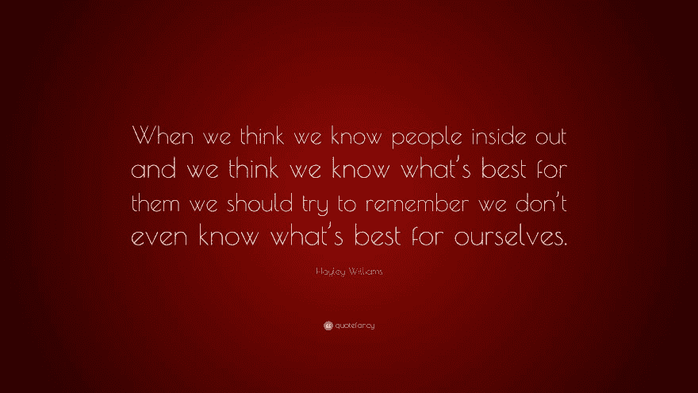

# 打造完美产品的傲慢

> 原文：<https://dev.to/eekayonline/the-arrogance-of-building-a-perfect-product-37ci>

是时候停止傲慢，并思考“我们知道我们产品的用户想要什么”。如果你想要一个符合用户期望的产品，你需要从一开始就与目标市场的人互动。制造一个产品，并认为/希望它能起作用，已经不再管用了。T3】

下面这个故事听起来有多熟悉，一个制作团队正在制作一款名为“The Product”的产品:

# 打造完美产品的故事

他们日以继夜地开发产品。他们一周又一周地检查是否添加了所有的功能，发现新的功能需要添加，不相关的功能需要删除。

范围或多或少发生了变化。在开发项目期间，一位经理因为最后期限越来越近而筋疲力尽。

另一个因为令人失望的进度报告而被替换。

“产品必须完美”，这位产品经理在上个月的投资者会议上表示。

"我们只有一次机会留下第一印象，所以这次一定要非常棒！"他的经理在每周状态会议上说。

产品团队越来越没有动力，而在开始的时候，他们拼命地工作在看起来很小的功能束和单一的目标上。

再过 3 个月，产品就要发布了，经理高兴地告诉他的团队。该产品终于可以发布了…

# 知道一切的少数人

创作者认为他们可以决定产品的最佳版本应该是什么样子，这是多么自私。以及最终用户在使用“产品”时需要注意的所有过程中最相关的过程是什么。

就好像他们，几个把产品组装在一起的人，能够理解并参与成千上万他们产品的预期用户的想法。

然而，这是我们在当今世界各地的许多(如果不是大多数)企业和业务中看到的情景。

制造完美产品的傲慢与我们认为自己知道“什么对其他人最好”有关。我们先试着找出什么对自己最好，好吗？战场已经变了

曾经有一段时间，公司可以像制造弹头导弹一样制造产品，但制造产品只有一个目的:击中目标，让它产生影响，只要把它扔到下面那些倒霉的混蛋的头上。

但是这不会再发生了，兄弟姐妹们。如今，竞争非常激烈。
当你在一个棚子里建造你的产品时，就好像它是一辆只能在完工并被漆成你想要的样子时才能出来的战争坦克，你还没开一枪，战争就已经结束了。

构建完美产品的傲慢表明是时候改变了。傲慢遇上懒惰

在没有事先与潜在用户进行互动的情况下，试图创造一个产品并将其交付给大众，除了傲慢和懒惰之外别无他法。

傲慢的原因在于，没有人，无论是大公司还是小的独立开发者，能够一口气定义一个解决问题并交付解决方案的产品。

这种想法暗示了一些人知道什么对可能使用它的大多数人来说是最好的。就像一个政府想要引导整个国家而不让其公民参与一样，从长远来看，这是行不通的。

认为你可以创建一个可以立即工作并立刻为用户解决问题的单一版本，这是懒惰的想法。这种心态是由天真的想法和对你扔向墙壁的东西会粘在墙上的希望所推动的。

如果你不检查墙壁是由什么制成的，空气有多潮湿，如果墙壁上的温度是恒定的或变化的，你就什么都不知道，你的产品掉进地上的灰尘(最终落在一堆没有粘住的其他东西上)的可能性比你的产品在墙上获得斑点的可能性更大。

# 不要躲在建筑物后面

> 不要害怕暴露你的作品，让他们看到、摸到、感觉到、闻到。获得反馈，第二天做得更好。

倾听你想帮助的人，让他们成为你过程的一部分。

获取信息，处理它，完善你的产品并再次展示给他们。
冲洗并重复。

如果你在等待完美，你将永远等待。所以不要躲在大楼后面，把你的产品放好。

在餐巾纸上展示。
制作一个 Powerpoint 演示。
Pivot 概念验证。
贝塔测试。
随便。

只要你能验证并了解目标用户市场。

没有完美的产品。这一切都是为了接近提供你可以收费的价值。

# 假捷径

拜托，不要像故事里的制作组一样。

不要因为知道问题所在而懒惰地试图构建一个产品并认为它可能会停滞不前。

了解你的市场需要努力。去了解你的用户的心态。

了解这个问题的复杂性需要时间。

磨不叫磨是因为容易。之所以这么叫，是因为需要时间、汗水和努力来发现什么是有效的。

磨砺除了更努力，没有捷径。如果一条捷径出现了，1000 次中有 999 次是错误的。

> 不要为了持久而建造，而是为了持久而建造

因为构建你的产品，构建一个更好的增量版本，直到你的产品是可行的，这将让它在人们的生活中产生变化。

> 你是在为你的应用程序想法寻求专业建议，还是想要为你的应用程序指定一个蓝图？
> 访问 [EEKAY ONLINE](https://www.eekayonline.com/#english) 了解更多关于你的应用的后续步骤

**编码更难，出货更难。**

*本文来源于[Shipharder.com](https://www.shipharder.com/the-arrogance-of-building-a-perfect-product)，帮助创客获得**价值第一心态**T5】的网站*