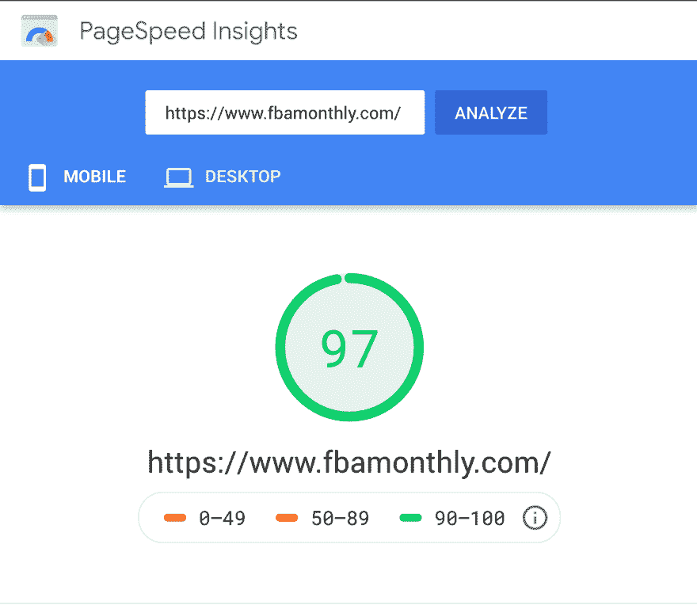

# JAMstack:使用 Netlify 的渐进式 Mailchimp 注册表单

> 原文：<https://dev.to/skatkov/jamstack-progressive-mailchimp-sign-up-form-with-netlify-13m3>

*本文描述了 JAMstack 网站的解决方案，通常需要定制后端。我将给出更多的细节和代码来构建一个具有自定义无服务器功能的可靠的“随时工作”注册表单*

# 背景

我目前正在为亚马逊卖家管理一份新闻简报。我一直在寻找一个类似的服务-发现非。所以我开始了它，主要是为了建立我感兴趣的观众群。

差不多一年了...通过一个非常基本的服务组合 [Carrd](https://carrd.co/) 和 [Mailchimp](https://www.mailchimp.com) ，我们成功地实现了每月平均 70 个订户的增长(没有太多营销和零预算)以及一些赞助内容。

可以说，我一直在考虑将这份时事通讯扩展到电子邮件之外，以扩大我们的覆盖面..我写下了这个项目第二版的一些要求，并决定建立一个 JAMstack 网站。

已经有很多*好有*，但主要要求如下:

*   防弹 Mailchimp 订阅，即使在 Javascript 被禁用的情况下也能工作，可操作性与积极的广告拦截器和万无一失(是的，我有资格成为一个)
*   联系方式一直是我们的赚钱机器，它应该工作得完美无缺
*   所有的资产和内容托管在我们的领域-获得所有的搜索引擎优化的好处
*   人们消费我们内容的 RSS 源
*   低维护和低成本

在本文中，我将特别关注**联系表**和**订阅表**。对于很多人来说，这似乎是使用静态网站的重要功能。

# Netlify

我已经在几个项目中使用了 [Netlify](https://www.netlify.com) ,体验非常棒。所以我找不到任何理由去寻找其他东西，但是你可能想要探索其他的选择——jam stack 服务正在蓬勃发展。我在这里描述的大多数想法都可以很容易地移植到其他平台上。

在 Netlify 案例中，它为静态网站提供了许多有用的构建模块。随着时间的推移，我设法找到一些粗糙的边缘和不起作用的边缘情况。但是对于许多项目来说，Netlify 提供了一个完美集成且易于使用的完整解决方案。你可以自由选择任何其他更适合你的第三方，甚至选择自己的第三方。

用[网络表单](https://www.netlify.com/docs/form-handling/)实现联系人表单真的很容易。我用了不到 5 分钟的时间就把基本垃圾邮件过滤器的联系方式设置好了。这太棒了，但不会以我想要的方式为 mailchimp 订阅表单工作。我可以[将无服务器函数连接到表单](https://www.netlify.com/docs/form-handling/#serverless-functions-integration)，但是没有合理的方法来验证输入并确保检查 mailchimp 键。

因此，这就是网络功能发挥作用的地方..

# 网络功能

做一个简短的类比来解释——你所听到的关于 AWS Lambda 的一切对于 Netlify 函数都是正确的。但是支持的语言列表更短，只有 Go 和 JavaScript。如果他们支持 Ruby，我会很高兴，但是 Javascript 也足够好了。

我四处寻找合适的现成代码，但找到的例子并不符合我最初的要求。它们是:

*   处理常规表单提交
*   处理 AJAX 请求
*   验证具有 mailchimp 密钥的环境是否已正确设置
*   对输入字段进行适当的错误处理

因此，我开始构建自己的函数，并通过我最终采用的实现来引导您。

# 实现

*如果你是为了代码而来，请查看[我的公共要点](https://gist.github.com/skatkov/b524a6e60a5313acc4d299471a2a3902)或者阅读更多评论*

## 1。实现表单提交

这是一个非常基本的 HTML 表单。但是有一些重要的部分需要注意:

1.  端点( **/)。我用于表单提交的 netlify/functions/form-handler**——是我们不久将创建的一个函数
2.  id 为“message”的 div 元素是成功消息的占位符

```
<div id="message"></div>
<form id="newsletter" class="subscribe" action="/.netlify/functions/form-handler" method="post">
  <input type="email" id="inputEmail" name='email' placeholder="Enter email to subscribe for FREE" class="email" required autofocus>
  <button class="button" type="submit">Subscribe</button>
</form> 
```

<svg width="20px" height="20px" viewBox="0 0 24 24" class="highlight-action crayons-icon highlight-action--fullscreen-on"><title>Enter fullscreen mode</title></svg> <svg width="20px" height="20px" viewBox="0 0 24 24" class="highlight-action crayons-icon highlight-action--fullscreen-off"><title>Exit fullscreen mode</title></svg>

## 2。实现 AJAX 请求

这一部分真的很恐怖——我没有使用 TypeScript 或 jQuery，它只是标准的 JavaScript，并且它在任何地方都可以工作。

同样，需要注意两个重要部分:

*   AJAX 请求在处理表单提交的同一个端点上执行
*   JavaScript 使用 **id="message"** 元素作为成功消息

```
<script>
  var form = document.getElementById('newsletter');

  form.addEventListener("submit", function(e) {
    e.preventDefault();
    email = document.getElementById('inputEmail').value;
    submitEmail(email)
  });

  function submitEmail(email) {
    fetch('/.netlify/functions/form-handler', {
        method: 'post',
        body: JSON.stringify({
          email: email
        })
      }).then(function(response) {
        return response.json();
      }).then(function(data) {
        messageDiv = document.getElementById('message');
        messageDiv.innerText = 'Confirmation email has been sent!'
      });
  };
</script> 
```

<svg width="20px" height="20px" viewBox="0 0 24 24" class="highlight-action crayons-icon highlight-action--fullscreen-on"><title>Enter fullscreen mode</title></svg> <svg width="20px" height="20px" viewBox="0 0 24 24" class="highlight-action crayons-icon highlight-action--fullscreen-off"><title>Exit fullscreen mode</title></svg>

## 3。为函数设置环境

最后，我直接使用了 3 个 JavaScript 库(以及大量的过渡依赖项)来运行这个函数:

*   因此我们可以在本地测试 lambda 函数
*   dotenv 库，这样我们可以在 env 变量中存储所有 mailchimp 键
*   **axios** 对 mailchimp API 进行待办事项调用

我已经将这些行添加到了 *packages.json* 文件中(包括一些方便的方法来让 netlify-lambda 在本地工作)

```
{  "scripts":  {  "start":  "netlify-lambda serve source/lambda",  "build":  "netlify-lambda build source/lambda"  },  "dependencies":  {  "axios":  "^0.19.0",  "dotenv":  "^8.1.0",  "netlify-lambda":  "^1.6.3"  }  } 
```

<svg width="20px" height="20px" viewBox="0 0 24 24" class="highlight-action crayons-icon highlight-action--fullscreen-on"><title>Enter fullscreen mode</title></svg> <svg width="20px" height="20px" viewBox="0 0 24 24" class="highlight-action crayons-icon highlight-action--fullscreen-off"><title>Exit fullscreen mode</title></svg>

## 4。构建网络功能

这里有一些重要的元素需要注意:

*   为了支持 AJAX 和表单提交，我们必须处理请求体的解析。 **querystring.parse** 用于表单数据， **JSON.parse** 用于 AJAX 请求。
*   如果是表单提交(通过查找“content-type”值来确定)，则重定向到/thanks.html。如果是 AJAX，则返回普通的 json。
*   在对 mailchimp 进行任何调用之前——我们验证所有需要处理的数据(输入和环境变量)。
*   我还花了相当多的时间来弄清楚如何呈现 API 可能返回的错误。

除此之外，这似乎是一个直接的方法，将一些数据传递给第三方 API。

```
import { parse } from 'querystring'
const axios = require('axios');
const mailChimpAPI = process.env.MAILCHIMP_API_KEY;
const mailChimpListID = process.env.MAILCHIMP_LIST_ID;

exports.handler = (event, context, callback) => {
  let body = {}
  console.log(event)
  try {
    body = JSON.parse(event.body)
  } catch (e) {
    body = parse(event.body)
  }

  if (!body.email) {
    console.log('missing email')
    return callback(null, {
      statusCode: 400,
      body: JSON.stringify({
        error: 'missing email'
      })
    })
  }

  if (!mailChimpAPI) {
    console.log('missing mailChimpAPI key')
    return callback(null, {
      statusCode: 400,
      body: JSON.stringify({
        error: 'missing mailChimpAPI key'
      })
    })
  }

  if (!mailChimpListID) {
    console.log('missing mailChimpListID key')
    return callback(null, {
      statusCode: 400,
      body: JSON.stringify({
        error: 'missing mailChimpListID key'
      })
    })
  }

  const data = {
    email_address: body.email,
    status: "pending",
    merge_fields: {}
  };

  const subscriber = JSON.stringify(data);
  console.log("Sending data to mailchimp", subscriber);

  // Subscribe an email

  axios(
    {
      method: 'post',
      url: `https://us19.api.mailchimp.com/3.0/lists/${mailChimpListID}/members/`, //change region (us19) based on last values of ListId.
      data: subscriber,
      auth: {
        username: 'apikey', // any value will work 
        password: mailChimpAPI
      }
    }
  ).then(function(response){
    console.log(`status:${response.status}` )
    console.log(`data:${response.data}` )
    console.log(`headers:${response.headers}` )

    if (response.headers['content-type'] === 'application/x-www-form-urlencoded') {
      // Do redirect for non JS enabled browsers
      return callback(null, {
        statusCode: 302,
        headers: {
          Location: '/thanks.html',
          'Cache-Control': 'no-cache',
        },
        body: JSON.stringify({})
      });
    }

    // Return data to AJAX request
    return callback(null, {
      statusCode: 200,
      body: JSON.stringify({ emailAdded: true })
    })
  }).catch(function(error) {
    if (error.response) {
      // The request was made and the server responded with a status code
      // that falls out of the range of 2xx
      console.log(error.response.data);
      console.log(error.response.status);
      console.log(error.response.headers);
    } else if (error.request) {
      // The request was made but no response was received
      console.log(error.request);
    } else {
      // Something happened in setting up the request that triggered an Error
      console.log('Error', error.message);
    }
    console.log(error.config);
  });
}; 
```

<svg width="20px" height="20px" viewBox="0 0 24 24" class="highlight-action crayons-icon highlight-action--fullscreen-on"><title>Enter fullscreen mode</title></svg> <svg width="20px" height="20px" viewBox="0 0 24 24" class="highlight-action crayons-icon highlight-action--fullscreen-off"><title>Exit fullscreen mode</title></svg>

# 结论

这个功能是实时的——所以这很好地表明我对这个解决方案非常满意和有信心。用一个静态的网站走到这一步，是一种惊人的体验。就是管用(真的快！)，便宜又容易规模化。

这个 PageSpeed Insight 结果完全是 JAMstack 的意外收益。

[](https://res.cloudinary.com/practicaldev/image/fetch/s--g5E7trMT--/c_limit%2Cf_auto%2Cfl_progressive%2Cq_auto%2Cw_880/https://thepracticaldev.s3.amazonaws.com/i/q1g1xio6oedmzs7g3t0h.png)

但是这段代码中有一些我没有预料到的问题。稍后我希望解决这些问题:

*   由于跨源问题，使用 axios gem 使得在本地主机上测试 mailchimp 订阅变得几乎不可能。看来我可以解决这些问题，一旦我切换到**要求**图书馆。
*   通过 console.log 处理错误让我很困扰。在我选择的错误捕捉器中有它会很好，在我的情况下[蜜獾应该工作](https://docs.honeybadger.io/lib/node.html#honeybadger-lambdahandler-handler-for-aws-lambda)。
*   无服务器功能是如此的专门化，而且仍然> 100 行代码似乎很多。一些重构可能是合适的:)

感谢阅读！

有人用 JAMstack 站点构建过附带项目吗？你的体验如何？