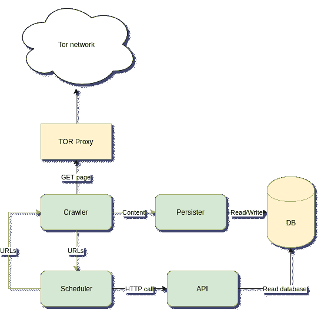
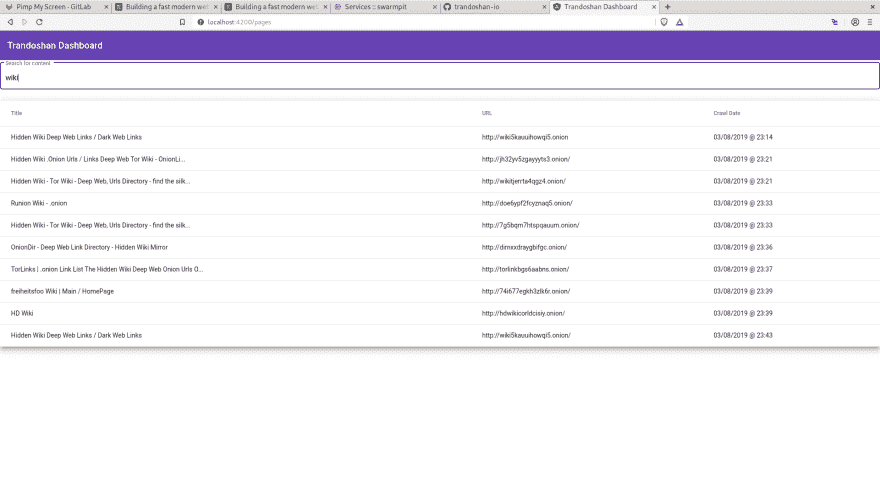

# 为黑暗网络构建一个快速的现代网络爬虫

> 原文:[https://dev . to/creekorful/building-a-fast-modern-web-crawler-for-the-dark-web-L1](https://dev.to/creekorful/building-a-fast-modern-web-crawler-for-the-dark-web-l1)

我对网络爬虫已经着迷很久了。我用很多语言写了几个，比如 C++，JavaScript (Node。JS)、Python、...我喜欢它们背后的理论。
但是首先，什么是网络爬虫？

# 什么是网络爬虫？

网络爬虫是一种计算机程序，它浏览因特网以索引现有的页面、图像、PDF，...并允许用户使用搜索引擎来搜索它们。它基本上是著名的谷歌搜索引擎背后的技术。

典型地，高效的网络爬虫被设计成分布式的:而不是运行在专用服务器上的单个程序，它是运行在几个服务器上的几个程序的多个实例(例如:在云上),这允许更好的任务再分配、提高的性能和增加的带宽。

但是分布式软件并不是没有缺点的:有些因素可能会给你的程序增加额外的延迟并降低性能，例如网络延迟、同步问题、设计不良的通信协议等...

为了提高效率，分布式网络爬虫必须设计得很好:重要的是消除尽可能多的瓶颈:正如法国海军上将奥利维尔·拉霍斯所说:

> 最薄弱的一环决定了整个链条的强弱。

# Trandoshan:黑暗网络爬虫

你可能知道有几个成功的网络爬虫在网络上运行，比如 google bot。所以我不想再做新的了。这次我想做的是为黑暗网络建立一个网络爬虫。

## 什么是暗网？

我不会太技术性地描述什么是黑暗网络，因为它可能需要我自己的文章。

网络被设计成由 3 层组成，我们可以把它想象成一座冰山:

*   表层网，或称透明网，是我们每天浏览的部分。它被流行的网络爬虫如 Google，Qwant，Duckduckgo 等索引...
*   Deep Web 是非索引 Web 的一部分，这意味着您无法使用搜索引擎找到这些网站，但是您需要通过知道相关的 URL / IP 地址来访问它们。
*   暗网是网络的一部分，你不能用普通的浏览器访问它。你需要使用一个特殊的应用程序或一个特殊的代理。最著名的暗网是建立在 tor 网络上的隐藏服务。他们可以使用特殊的 URL 来访问。洋葱

[T2】](https://res.cloudinary.com/practicaldev/image/fetch/s--QOAWam3L--/c_limit%2Cf_auto%2Cfl_progressive%2Cq_auto%2Cw_880/https://thepracticaldev.s3.amazonaws.com/i/0xzsbclhutcchddse7fx.png)

## 特兰多山是如何设计的？

[T2】](https://res.cloudinary.com/practicaldev/image/fetch/s--KpFSBokR--/c_limit%2Cf_auto%2Cfl_progressive%2Cq_auto%2Cw_880/https://thepracticaldev.s3.amazonaws.com/i/e1p8c16bypi4od2ip50a.png)

在讨论每个过程的责任之前，了解它们如何相互沟通是很重要的。

进程间通信(IPC)主要是基于生产者/消费者模式，使用一种称为 NATS(图中的黄线)的消息协议来完成的。NATS 中每条消息都有一个主题(就像电子邮件一样),允许其他进程识别它，从而只阅读他们想阅读的消息。NATS 允许扩展:例如，它们可以是 10 个从消息服务器读取 URL 的爬虫进程。这些进程中每一个都将收到一个唯一的 URL 来进行爬网。这允许进程并发(许多实例可以同时运行而不会出现任何错误)，因此提高了性能。

Trandoshan 分为 4 个主要流程:

*   **Crawler** :负责抓取页面的进程:从 NATS 读取要抓取的 URL(由主题“todoUrls”标识的消息)，抓取页面，提取页面中存在的所有 URL。这些提取的 URL 以主题“crawledUrls”发送到 NATS，页面主体(全部内容)以主题“content”发送到 NATS。
*   **调度器**:负责 URL 批准的过程:该过程读取“crawledUrls”消息，检查 URL 是否要被爬取(如果 URL 还没有被爬取)，如果是，发送 URL 到 NATS，主题为“todoUrls”
*   **Persister** :负责内容归档的进程:它读取页面内容(由主题“content”标识的消息)，并将它们存储到 NoSQL 数据库(MongoDB)中。
*   **API** :其他进程用来收集信息的进程。例如，调度程序使用它来确定某个页面是否已经被爬取。调度器使用 **API** ，而不是直接调用数据库来检查 URL 是否存在(这会给数据库技术增加额外的耦合):这允许数据库/进程之间的某种抽象。

不同的进程是用 Go 编写的:因为它提供了很高的性能(因为它是作为本机二进制编译的)并且有很多库支持。Go 是为构建高性能分布式系统而完美设计的。

Trandoshan 的源代码可以在 github 这里找到:[https://github.com/trandoshan-io](https://github.com/trandoshan-io)。

## 如何运行 Trandoshan？

如前所述，Trandoshan 被设计为在分布式系统上运行，并作为 docker 镜像提供，这使它成为云的一个很好的候选。事实上，有一个存储库保存了在 Kubernetes 集群上部署 Trandoshan 生产实例所需的所有配置文件。这些文件可以在这里找到:[https://github.com/trandoshan-io/k8s](https://github.com/trandoshan-io/k8s)和集装箱图片可以在 docker hub 上找到。

如果您已经正确配置了 kubectl，那么您可以用一个简单的命令来部署 Trandoshan:

`./bootstrap.sh`

否则，您可以使用 docker 和 docker-compose 在本地运行 Trandoshan。在 trandoshan-parent 存储库中，有一个组合文件和一个 shell 脚本，允许应用程序使用以下命令运行:

`./deploy.sh`

## 如何使用 Trandosan？

目前有一个小角度的应用程序来搜索索引内容。页面使用 API 进程在数据库上执行搜索。

[T2】](https://res.cloudinary.com/practicaldev/image/fetch/s--oiHUyb5K--/c_limit%2Cf_auto%2Cfl_progressive%2Cq_auto%2Cw_880/https://thepracticaldev.s3.amazonaws.com/i/ltrk8fdmto5ncdfmzvgp.png)

# 结论

暂时就这些。Trandoshan 已经可以生产了，但是还有很多优化工作要做，还有很多特性要合并。因为它是一个开源项目，每个人都可以通过在相应的项目上做一个拉请求来为它做贡献。

黑客快乐！